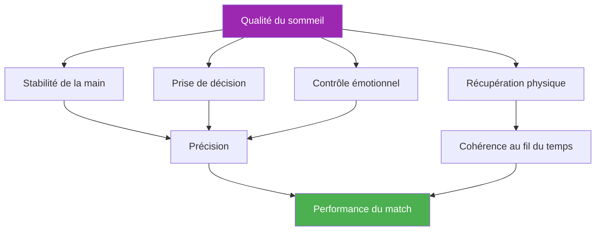

# Sommeil et récupération

::: tip Un facteur de performance critique
**Poids : 400 points** — Le sommeil est le facteur le plus sous-estimé dans les sports de précision. Vos mains, vos décisions et vos émotions dépendent toutes d’un repos de qualité.
:::

## L&#39;avantage caché en matière de performance

> « Le joueur qui a le mieux dormi gagne souvent. »

À la pétanque, contrairement aux sports d&#39;endurance où les athlètes peuvent parfois surmonter la fatigue, la précision est primordiale. Votre capacité à placer une boule à quelques centimètres du cochonnet dépend de systèmes extrêmement sensibles au manque de sommeil :

- Contrôle de la motricité fine
- Prise de décision sous pression
- Régulation émotionnelle
- Consolidation de la mémoire

Ce module révèle pourquoi le sommeil pourrait être votre plus grand avantage concurrentiel inexploité.

---

## Comment le sommeil influence votre jeu

### Stabilité de la main et contrôle moteur

Des études montrent que la motricité fine se dégrade de **10 à 15 % par heure de manque de sommeil**. Chez les joueurs de pétanque, cela se traduit par :

- **Augmentation des micro-tremblements** — Imperceptibles pour vous, mais affectant la régularité du lâcher
- **Proprioception réduite** — Moins de conscience de la pression exercée sur la main et de la position du bras
- **Correction d&#39;erreur plus lente** — Votre corps ne peut pas effectuer les micro-ajustements nécessaires à une précision optimale.

::: warning Pourquoi la désignation des cibles souffre en premier
Le tir exige une maîtrise motrice extrêmement précise. C&#39;est souvent la première compétence à se dégrader en cas de manque de sommeil, même lorsqu&#39;on se sent bien.
:::

### Prise de décision et tactiques

Votre cortex préfrontal, responsable de la planification, de l&#39;évaluation des risques et de la pensée stratégique, est très sensible au manque de sommeil :

- **L&#39;évaluation des risques est altérée** — Vous pouvez tenter des tirs à plus faible pourcentage de réussite.
- **La flexibilité tactique diminue** — Il est plus difficile de s&#39;adapter en cours de partie.
- **Le phénomène des « décisions de 2 h du matin »** — Des choix qui paraissent raisonnables sur le moment semblent discutables avec le recul

### Régulation émotionnelle

Le manque de sommeil provoque une **hyperactivité de l&#39;amygdale**, le centre émotionnel du cerveau :

- La pression semble plus intense.
- La frustration après les échecs est amplifiée.
- Se remettre d&#39;un revers prend plus de temps.
- La dynamique d&#39;équipe peut pâtir d&#39;un agacement général.

### Consolidation de la mémoire

La mémoire motrice se consolide pendant le sommeil, en particulier pendant les phases de sommeil profond :

- **S&#39;entraîner sans dormir = mémorisation limitée**
- « La nuit de réflexion » fonctionne vraiment pour les changements de technique.
- La formule : **Pratique de qualité + Sommeil de qualité = Compétence permanente**

---

## Le lien entre le sommeil et la performance

---

## La réalité de la dette de sommeil

### Qu&#39;est-ce que la dette de sommeil ?

La dette de sommeil est **cumulative**. Manquer une heure de sommeil n&#39;affecte pas seulement la journée en cours, elle s&#39;accumule :

| Jours | Heures courtes | Dette totale | Impact sur la performance |
|------|-------------|------------|-------------------|
| 1 | -1 heure | 1 heure | Minimal |
| 3 | -1 heure/jour | 3 heures | Perceptible |
| 7 | -1 heure/jour | 7 heures | Significatif |
| 14 | -1 heure/jour | 14 heures | Grave |

::: danger Le mythe du week-end
Il est impossible de rattraper complètement son retard le week-end. Dormir davantage est certes utile, mais cela n&#39;efface pas les dettes accumulées. La régularité est plus importante que de longues siestes occasionnelles.
:::

### De combien avez-vous besoin ?

L&#39;idée des « 8 heures pour tout le monde » est un mythe. Les besoins individuels varient.

- **La plupart des adultes :** 7 à 9 heures
- **Certains fonctionnent bien pendant :** 6 à 7 heures
- **Certains nécessitent :** 9 heures ou plus

**Trouver VOTRE besoin optimal en sommeil :**
1. Pendant vos vacances (sans réveil), laissez-vous dormir naturellement pendant 5 à 7 jours.
2. Après la phase initiale de « rattrapage », notez la durée de votre sommeil.
3. Cela correspond probablement à peu près à vos besoins biologiques

---

## La science en bref

### Les phases du sommeil qui comptent

| Scène | Fonction | Pertinence de la pétanque |
|-------|----------|-------------------|
| **Sommeil profond (N3)** | Récupération physique, hormone de croissance | Récupération musculaire, restauration de l&#39;énergie |
| **Sommeil paradoxal** | Traitement émotionnel, consolidation de la mémoire | Maintien des habiletés motrices, résilience émotionnelle |
| **Sommeil léger (N1-N2)** | Transition, maintenance | Soutient l&#39;architecture globale |

### Principaux résultats de la recherche

1. **Étude de basketball de Stanford** — Les joueurs qui ont prolongé leur sommeil à 10 heures ont amélioré leur précision aux lancers francs de 9 % (Mah et al., 2011).
2. **Précision du service au tennis** — La restriction du sommeil a réduit la précision du service de 53 % (Reyner &amp; Horne, 2013)
3. **Méta-analyse du temps de réaction** — Une seule nuit de mauvais sommeil ralentit le temps de réaction de 300 % (Lim &amp; Dinges, 2010).

---

## Auto-évaluation : Votre réalité du sommeil

Évaluez-vous honnêtement (1-5) :

| Question | Score |
|----------|-------|
| Je dors autant la plupart des nuits. | /5 |
| Je m&#39;endors en 15 à 20 minutes. | /5 |
| Je me réveille rarement la nuit | /5 |
| Je me réveille en pleine forme. | /5 |
| Je conserve mon énergie tout au long de la journée | /5 |

**Score :**
- **20-25 ans :** Excellentes habitudes de sommeil
- **15-19 :** Bien, mais perfectible
- **10-14 :** Le sommeil a probablement une incidence sur vos performances.
- **En dessous de 10 ans :** L&#39;amélioration du sommeil devrait être une priorité

---

## Dans ce module

### [Protocoles de sommeil en compétition](/fr/education/sleep/competition)
- La semaine précédant la compétition
- Gestion des voyages et des fuseaux horaires
- Protocoles de sieste rapide
- Stratégies d&#39;urgence « Je n&#39;arrivais pas à dormir »

### [Hygiène du sommeil pour les athlètes](/fr/education/sleep/habits)
- Les 10 principes fondamentaux du sommeil
- Modèles de routine du soir
- Le défi du sommeil sur 30 jours
- Résolution des problèmes courants

---

## Victoire rapide : ce soir

Si vous ne faites rien d&#39;autre, mettez en œuvre ces deux changements ce soir :

1. **Définissez une heure de réveil régulière** — La même heure demain qu&#39;aujourd&#39;hui, à 30 minutes près
2. **Pas d&#39;écrans 30 minutes avant le coucher** — Lisez, étirez-vous ou préparez-vous pour le lendemain.

Ces deux changements à eux seuls peuvent améliorer la qualité du sommeil en quelques jours.

---

## Facteurs associés

Le sommeil est lié à tout le reste de votre performance :

- Gestion de la tension : les techniques de relaxation et de relaxation musculaire progressive favorisent le sommeil.
- [Nutrition](/fr/education/nutrition/) — Le moment des repas et la glycémie influencent la qualité du sommeil
- [Mental Game](/fr/education/mental-game/) — Le sommeil favorise les fonctions cognitives et le contrôle émotionnel
- Conscience de soi — Reconnaître quand la fatigue affecte votre jeu

