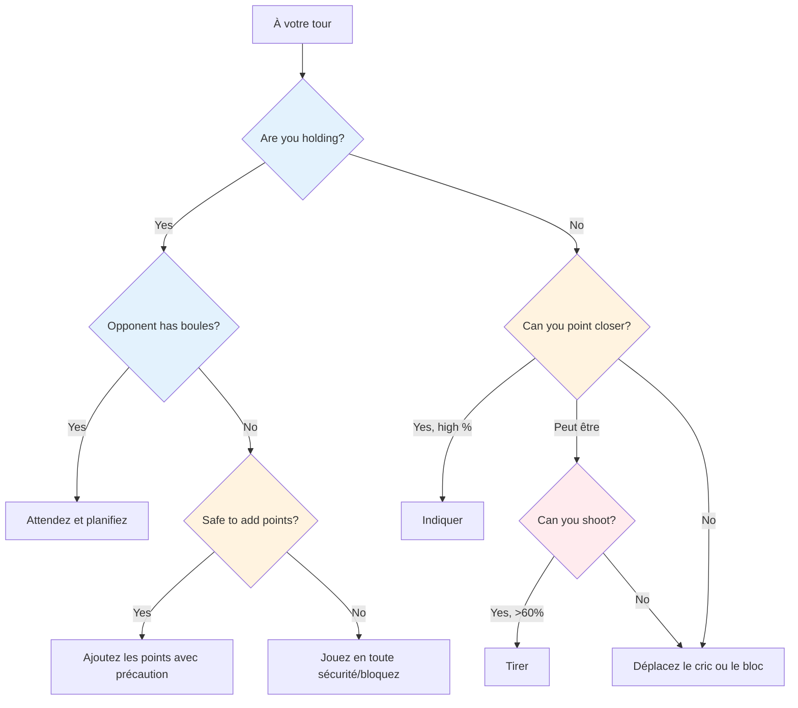

# Réflexion tactique à la pétanque
<AdBanner />


Au plus haut niveau, la maîtrise technique est acquise. Ce qui distingue les vainqueurs, c&#39;est l&#39;intelligence tactique : savoir quel coup tenter et à quel moment. Les meilleurs joueurs anticipent le jeu plusieurs coups à l&#39;avance et exploitent le moindre avantage.

::: tip Le principe fondamental
**Au plus haut niveau, la différence réside rarement dans la technique, mais dans la prise de décision.** L&#39;équipe qui commet le moins d&#39;erreurs tactiques l&#39;emporte.
:::

## Cadre de décision rapide



## L&#39;état d&#39;esprit tactique

### Penser en termes de probabilités

Chaque lancer a une probabilité de succès. Une bonne tactique consiste à choisir des lancers où :
- La probabilité de succès est suffisamment élevée
- La récompense justifie le risque
- L&#39;échec ne fait pas trop mal.

**Exemple de décision :**
- Tir difficile : 40 % de réussite, rapporte 3 points
- Point de sécurité : 80 % de réussite, gain de 1 point

Quel est le meilleur choix ? Cela dépend du score, de la situation et de votre confiance.

### Examinez toutes les options

Avant chaque lancer, réfléchissez :
1. **Point :** Placez une boule près du cochonnet
2. **Tir :** Retirez la boule d&#39;un adversaire
3. **Blocage :** Placez une boule pour bloquer
4. **Déplacer le cric :** Frapper intentionnellement le cric
5. **Sacrifice :** Accepter une mauvaise position pour mieux se préparer plus tard

Ne vous contentez pas de la solution évidente. Réfléchissez aux alternatives.

### Lire la situation

Facteurs à prendre en compte :
- Score actuel (qui est en tête, et de combien)
- Boules restantes (les vôtres et les leurs)
- Position sur le terrain
- Tendances adverses
- Les points forts de votre équipe

## Principes tactiques fondamentaux

::: tip Les 6 principes tactiques
1. **Contrôlez le cric** - La position est la puissance
2. **Stratégie de distance et de surface** - S&#39;adapter aux conditions
3. **Dictez le style de jeu** - Mettez vos points forts en avant
4. **Gérer le rapport risque/récompense** - Adapter le risque à la situation
5. **Utilisez les boules judicieusement** - Parfois, concéder 1 point permet d&#39;en éviter 3
6. **Anticipez** - Visualisez les 2 ou 3 prochains mouvements
:::

### Principe 1 : Contrôler le cric

L&#39;équipe qui contrôle la position du cochonnet possède un avantage significatif.

**Moyens de contrôle :**
- Gagnez le droit de lancer le jack
- Déplacez le cric vers un terrain favorable.
- Protéger le cric contre tout déplacement

**Stratégie de placement des crics :**
- Jack court : Favorise le tir, plus facile d&#39;atteindre les cibles à courte portée
- Long jack : Favorise le pointage, le tir devient plus difficile
- Obstacles proches : créent des difficultés pour les adversaires

**Exploiter les faiblesses de l&#39;adversaire :**
- Observez leur technique de désignation : utilisent-ils toujours le même arc ou le même style ?
- S&#39;ils ne peuvent pas s&#39;adapter (par exemple, ne font que rouler, ne font que lober), placez le cochonnet pour les forcer à lancer dans des conditions difficiles.
- Placez le cric à des distances ou dans des positions qui mettent en évidence ses limites.
- N&#39;exploitez une faiblesse que si vous ne la partagez pas ; commencez par considérer les forces de votre propre équipe.

### Principe 2 : Stratégie de distance et de surface

L&#39;équilibre optimal entre viser et tirer dépend fortement de la distance et du terrain :

::: info Stratégie de distance
**Court (6-7 m) :** Privilégiez le tir - plus facile à toucher à courte distance
**Moyen (7-9 m) :** La surface est primordiale
- Surface lisse → prendre plus de photos
- Surface rugueuse → pointer plus

**Longue distance (9-11 m) :** Privilégiez le pointage – la précision de tir diminue considérablement
:::

```mermaid
graph LR
    A[Distance] --> B[6-7 m Court]
    A --> C[7-9 m Moyen]
    A --> D[9 à 11 m de long]

    B --> E[Tirez davantage]
    C --> F{Surface?}
    D --> G[Point More]

<AdInArticle />

    F -->|Smooth| H[Tirez davantage]
    F -->|Rough| I[Point More]

    style E fill:#ffcdd2
    style H fill:#ffcdd2
    style I fill:#c8e6c9
    style G fill:#c8e6c9
```

**Votre pourcentage de réussite au tir personnel :**
- Si vous avez un taux de réussite de plus de 75 %, tirez plus souvent.
- Envisagez de tirer pour réduire le nombre de points de votre adversaire (même si vous ne prenez pas l&#39;avantage).
- Tirer pour réduire le nombre de boules de score de l&#39;adversaire (de 3 à 1) est un moyen précieux de contrôler les dégâts.

**Le tir comme stratégie à long terme :**
- Si vous tirez avec toutes vos boules, tenez compte de votre taux de réussite cumulé.
- Calcul : lorsque vous réussissez tous vos tirs, vous gagnez beaucoup plus de points.
- Même rater quelques tirs peut réduire le nombre de points de l&#39;adversaire
- Exemple : Rater 1 ou 2 tirs, mais éliminer les menaces, puis remporter une victoire éclatante en touchant tous les ennemis.
- C&#39;est un risque calculé : accepter quelques pertes pour espérer de plus gros gains lorsque cela fonctionne.

### Principe 3 : Imposer le style de jeu

Au plus haut niveau, la plupart des joueurs savent viser et tirer avec précision. L&#39;essentiel est d&#39;imposer le style de jeu qui convient le mieux à son équipe.

**Si votre équipe compte de bons tireurs :**
- Tirez autant que possible - exploitez votre avantage
- Ne gaspillez pas votre énergie à pointer du doigt quand vous pouvez dominer par le tir.
- Contrôlez le jeu en éliminant les menaces avant qu&#39;elles ne s&#39;accumulent.
- Les jacks de courte à moyenne taille conservent une efficacité de tir

**Contre des tireurs d&#39;égale force :**
- Ne leur facilitez pas la tâche en tirant le premier. Empêchez-les de devenir des cibles faciles.
- Jouez à longue distance pour réduire le pourcentage de réussite au tir de chacun.
- L&#39;équipe qui tire en premier contrôle souvent la fin du match.

**Si vos adversaires sont plus précis que vous au tir :**
- Jouez le long jack de manière constante - même les tireurs d&#39;élite voient leur pourcentage chuter à plus de 10 m
- Forcez un duel de points où vous pouvez rivaliser
- Faites-les tirer sous des angles difficiles ou à travers des obstacles

### Principe 4 : Gérer le risque par rapport à la récompense

| Situation | Tolérance au risque |
|-----------|---------------|
| En avant confortablement | Faible - protégez votre plomb |
| Match serré | Moyen - risques calculés |
| En retard de manière significative | Niveau élevé - il faut prendre des risques |
| Fin définitive | Cela dépend de l&#39;écart de score |

### Principe 5 : Utilisez vos boules judicieusement

La direction de la boule sépare les joueurs d&#39;élite :
- Lorsque votre adversaire n&#39;a plus de boules, réfléchissez bien : faut-il marquer des points ou jouer la sécurité ?
- Lorsque vous êtes mené, évaluez si vous pouvez raisonnablement reprendre le point.
- Parfois, concéder un point est préférable à gaspiller des boules et à en perdre trois.
- Gardez toujours une trace des boules restantes — les vôtres et les leurs — à tout moment

### Principe 6 : Anticiper plusieurs actions à l’avance

Pensée élitiste :
- Avant de lancer, visualisez les 2 ou 3 prochaines boules des deux équipes.
- Quelle est la meilleure réponse de votre adversaire si vous réussissez ? Et si vous échouez ?
- Comment ce lancer prépare-t-il le suivant ?
- Considérons le scénario de fin de partie à partir de la position actuelle.

## Situations tactiques courantes

### Vous détenez les boules et votre adversaire en a encore.

Vous devez attendre, c&#39;est à leur tour de lancer. Profitez-en pour :
- Analysez ce qu&#39;ils sont susceptibles de faire.
- Préparez votre réponse à leurs possibles lancers.
- Restez concentré et prêt

### Vous détenez la boule et votre adversaire n&#39;a plus de boules.

Vous pouvez maintenant jouer vos boules restantes. **Options :**
- Ajoutez plus de points si vous pouvez le faire en toute sécurité
- Bloc pour protéger contre le mouvement du cric
- Jouez la sécurité – ne risquez pas de transformer une victoire de 2 points en défaite

**Décision clé :** Le risque d&#39;ajouter des points vaut-il la peine de potentiellement ouvrir le jeu ?

### Vous ne tenez pas

Vous devez lancer. **Options :**
- Point plus près que leur meilleure boule
- Tirez leur meilleure boule
- Déplacez le cochonnet vers vos boules
- Bloquez pour limiter leur score (si vous ne pouvez pas prendre le point).

**Facteurs de décision :** Votre pourcentage de réussite au tir, le nombre de boules restantes (pour les deux équipes), le score actuel

### Dernières situations de boule

Quand vous avez la dernière boule :
- Pression maximale, mais aussi contrôle maximal
- Prenez votre temps – évaluez toutes les options
- Réfléchissez : pointer, tirer ou déplacer le cric ?
- Exécuter avec un engagement total

Lorsque l&#39;adversaire a la dernière boule :
- Tu as fait tout ce que tu pouvais – accepte le résultat.
- Si possible, créez une situation qui ne leur offre pas de solution facile.
- Plusieurs menaces valent mieux qu&#39;une seule.

## Lire ses adversaires

Au plus haut niveau, le repérage des adversaires est essentiel. Il faut connaître ses adversaires avant de jouer.

### Renseignements d&#39;avant-match
- Quel est leur style de jeu préféré (équipe de tir ou équipe de pointage) ?
- Qui est leur meilleur tireur ? Pointer ?
- Quelles distances préfèrent-ils ?
- Comment réagissent-ils sous pression lors des finales ?

### Observation en cours de match
- Suivez leurs taux de réussite tout au long du match.
- Remarquez si quelqu&#39;un passe une mauvaise journée.
- Identifiez les personnes qui gèrent bien la pression et celles qui ne la gèrent pas.
- Ajustez l&#39;emplacement de votre cric en fonction de ce que vous observez.

### Exploitez ce que vous trouvez
- Ciblez les joueurs les plus faibles lorsque c&#39;est possible.
- Forcez leur tireur faible à tirer, ou leur pointeur faible à pointer.
- Si quelqu&#39;un est en difficulté, maintenez la pression sur lui.

## Dans cette section

- **[Décisions basées sur les probabilités](/en/education/tactics/probability)** - Utiliser les mathématiques pour faire de meilleurs choix

## Résumé : Toutes les règles tactiques

::: tip Règle n° 1 : La règle des probabilités
**Choisissez les lancers où la probabilité de succès justifie le risque.**
Considérons : le taux de réussite, la récompense en cas de succès, le coût en cas d&#39;échec.
:::

::: tip Règle n° 2 : La règle de contrôle du jack
**L&#39;équipe qui contrôle la position du jack a l&#39;avantage.**
Utilisez le placement des jacks pour exploiter les faiblesses de l&#39;adversaire et favoriser vos forces.
:::

::: tip Règle n° 3 : La règle de la distance
**À courte distance, il est préférable de tirer ; à longue distance, il est préférable de viser.**
Moyenne distance : la qualité de la surface détermine l&#39;équilibre
:::

::: tip Règle n° 4 : La règle du style
**Imposer le style de jeu le plus avantageux pour votre équipe.**
Si vous êtes de bons tireurs, tirez davantage. Ne gaspillez pas votre avantage.
:::

::: tip Règle n° 5 : La règle de gestion de boule
**Parfois, concéder 1 point vaut mieux que d&#39;en risquer 3.**
Sachez quand limiter vos pertes et garder vos boules pour la prochaine manche.
:::

::: tip Règle n° 6 : La règle de la prévoyance
**Visualisez les 2 ou 3 prochains mouvements des deux équipes.**
Quelle est leur meilleure réponse ? Comment cela prépare-t-il votre prochain lancer ?
:::

::: tip Règle n° 7 : La règle du scoutisme
**Renseignez-vous sur vos adversaires avant de jouer.**
Suivre leurs préférences, leurs taux de réussite et leurs réactions à la pression.
:::

## Points clés à retenir

> Au plus haut niveau, la différence réside rarement dans la technique, mais dans la prise de décision. L&#39;équipe qui commet le moins d&#39;erreurs tactiques l&#39;emporte.

Analysez le jeu. Connaissez vos points forts. Exploitez les faiblesses de l&#39;adversaire. Agissez avec assurance.

<AdBanner />
