# Prise de décision fondée sur les probabilités
<AdBanner />

La pensée tactique de haut niveau utilise les probabilités pour prendre de meilleures décisions. Au lieu de deviner ou de se fier à son intuition, on analyse systématiquement ses options.

::: tip La grande idée
**Pensez en termes de probabilités, pas de certitudes.** La meilleure décision n&#39;est pas toujours la plus audacieuse ni la plus sûre ; c&#39;est celle qui vous offre la meilleure valeur attendue dans de nombreuses situations similaires.
:::

```mermaid
graph TD
    A[Point de décision] --> B[Option 1]
    A --> C[Option 2]
    A --> D[Option 3]

    B --> E[Probabilité de succès]
    B --> F[Récompense en cas de succès]
    B --> G[Coût en cas d&#39;échec]

    C --> H[Probabilité de succès]
    C --> I[Récompense en cas de succès]
    C --> J[Coût en cas d&#39;échec]

    D --> K[Probabilité de succès]
    D --> L[Récompense en cas de succès]
    D --> M[Coût en cas d&#39;échec]

    E --> N[Valeur attendue]
    F --> N
    G --> N

    H --> O[Valeur attendue]
    I --> O
    J --> O

    K --> P[Valeur attendue]
    L --> P
    M --> P

    N --> Q[Choisissez le meilleur véhicule électrique]
    O --> Q
    P --> Q

    style A fill:#e3f2fd
    style Q fill:#fff4e1
```

## Le cadre de base

Chaque lancer comporte trois composantes :

| Composant | Question | Exemple |
|-----------|----------|---------|
| **Probabilité de succès** | Quelle est la probabilité que je réussisse à réaliser cela ? | Taux de réussite de 70 % à cette distance |
| **Récompense en cas de succès** | Qu&#39;est-ce que j&#39;y gagne ? | Gagnez le point, gagnez la position |
| **Coût en cas d&#39;échec** | Qu&#39;est-ce que je perds ? | Offrir un point facile à l&#39;adversaire |

::: info La formule
**Valeur espérée = (Probabilité × Récompense) - ((1 - Probabilité) × Coût)**

Les bonnes décisions maximisent la valeur attendue au fil du temps.
:::

## Penser en termes de probabilités

Pour choisir entre les différentes options, tenez compte des éléments suivants :
- Quel est mon taux de réussite réaliste pour chaque option ?
- Qu&#39;est-ce que j&#39;y gagne si ça marche ?
- Quel sera le coût en cas d&#39;échec ?
- Comment la situation de jeu influence-t-elle mon choix ?

La meilleure option n&#39;est pas toujours la plus agressive ou la plus sûre ; c&#39;est celle qui donne le meilleur résultat dans de nombreuses situations similaires.

## Connaissez vos chiffres

Pour utiliser le raisonnement probabiliste, vous devez connaître vos taux de réussite réels :

| Type de jet | Distance | Votre taux de réussite |
|------------|----------|-------------------|
| Point (proche) | 6-7 m | ___% |
| Point (moyen) | 8-9 m | ___% |
| Point (long) | 10 m+ | ___% |
| Tir (rapprochement) | 6-7 m | ___% |
| Tir (moyen) | 8-9 m | ___% |
| Tourner (long) | 10 m+ | ___% |

<AdInArticle />

Suivez ces indicateurs en pratique. Soyez honnête : la plupart des joueurs surestiment leurs chances de réussite.

## Ajustement des conditions

Vos tarifs de base varient en fonction de :

| Facteur | Effet sur le taux de réussite |
|--------|----------------------|
| Terrain inconnu | -10 à -20% |
| Situation de pression | -5 à -15% |
| Fatigue | -5 à -10% |
| Confiance (élevée) | +5 à +10% |
| Succès récents | +5% |
| Échec récent | -5 à -10% |

Soyez réaliste quant à ces ajustements.

## Le principe de l&#39;avantage de la boule

Lorsque vous avez plus de boules restantes que votre adversaire :

**Priorité 1 : Sécuriser le point**
- Tout d&#39;abord, assurez-vous de détenir au moins un point
- Ne soyez pas gourmand avant d&#39;avoir assuré les bases.

**Priorité 2 : Maximiser les points avec un risque calculé**
- Une fois que vous tenez bon, évaluez si vous pouvez ajouter plus de points
- Chaque lancer supplémentaire est une décision risque/récompense
- Ne transformez pas une victoire assurée de 2 points en défaite en prenant des risques inconsidérés.

**Il vous reste moins de boules :** Chaque lancer compte. Les coups sûrs ne suffisent pas toujours ; privilégiez les options plus risquées pour revenir dans la partie.

## Le principe &quot;Une Boule Devant&quot;

Une boule placée devant le valet (entre le valet et l&#39;adversaire) est extrêmement précieuse :
- Il bloque les lignes pointant directement
- Cela oblige les adversaires à contourner ou à passer par-dessus.
- Il peut dévier les boules entrantes
- C&#39;est une « boule d&#39;argent » — qu&#39;il faut protéger

**Conséquences tactiques :** Parfois, placer une boule de blocage est préférable à essayer de s&#39;approcher au plus près.

## Tolérance au risque selon l&#39;état du jeu

### Avec une limite de temps

Lorsqu&#39;on joue avec une limite de temps, l&#39;écart de score est important :

| Situation de score | Approche par les risques |
|-----------------|---------------|
| En tête avec plus de 4 points d&#39;avance | Très conservateur – protéger le plomb, faire tourner le chronomètre |
| En tête par 1-3 | Conservateur - ne donnez pas de points |
| Lié | Équilibré - risques calculés |
| Mené de 1 à 3 | Agressif – besoin de gagner du terrain |
| En retard de plus de 4 heures | Très agressif – il faut prendre des risques, le temps presse |

### Sans limite de temps

Quand il n&#39;y a pas de pression temporelle :
- Tenez-vous-en à votre plan de jeu – ne changez pas de stratégie simplement à cause du score
- Le score fluctuera – faites confiance à votre approche.
- N&#39;envisagez de changer de stratégie que si elle ne fonctionne manifestement pas contre cet adversaire.
- Les changements de situation précipités lorsqu&#39;on est en retard ne font souvent qu&#39;empirer les choses.

### Ajustements de fin de partie

**Si gagner cette manche permet de gagner la partie :**
- Soyez plus conservateur
- Ne prenez pas le risque de concéder plusieurs points.
- Un seul point pourrait suffire.

**Si la défaite à ce niveau entraîne la défaite :**
- Prendre plus de risques
- Il faut marquer plusieurs points
- Le jeu prudent ne vous sauvera pas.

## Erreurs courantes en matière de probabilités

### 1. Excès de confiance
« Je peux réussir ce tir » – mais pouvez-vous le réussir 7 fois sur 10 ? Soyez honnête.

### 2. Ignorer les taux de base
Votre pourcentage de réussite au tir ne change pas parce que le moment est important.

### 3. Erreur des coûts irrécupérables
« J&#39;ai déjà raté deux fois, je devrais continuer à tirer » - chaque lancer est indépendant.

### 4. Biais de résultat
Un coup risqué qui réussit reste risqué. Une action prudente qui échoue reste la bonne.

### 5. Ignorer les options de l&#39;adversaire
Réfléchissez à ce qu&#39;ils feront après votre lancer, réussi ou non.

## Application pratique

### Avant chaque lancer

1. **Identifier les options** (pointer, tirer, bloquer, etc.)
2. **Estimer la probabilité de succès** pour chaque
3. **Tenez compte des résultats** (succès et échec)
4. **Tenir compte de l&#39;état du jeu** (score, boules restantes)
5. **Choisissez** l&#39;option présentant la meilleure valeur attendue
6. **Engagez-vous pleinement** - sans hésitation lors de l&#39;exécution

### Développer son intuition

Avec le temps, le raisonnement probabiliste devient intuitif :
- Suivez vos résultats honnêtement
- Révision des décisions après les matchs
- Observez les tendances dans vos taux de réussite.
- Modifiez votre modèle mental

## Points clés à retenir

> Les bonnes décisions n&#39;aboutissent pas toujours à de bons résultats. Mais, sur le long terme, les bonnes décisions permettent d&#39;obtenir de meilleurs résultats.

Réfléchissez en termes de probabilités. Maîtrisez vos chiffres. Faites le choix judicieux, pas celui qui repose sur l&#39;espoir.

<AdBanner />
