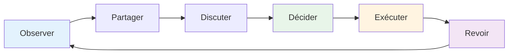

# Communication d&#39;équipe
<AdBanner />

Une communication efficace transforme un groupe d&#39;individus en une équipe. À la pétanque, où la stratégie évolue constamment et où la pression est forte, la qualité de votre communication peut déterminer l&#39;issue du jeu.

::: tip La grande idée
**La communication est ce qui transforme les individus en une équipe.** Une communication claire, précise et encourageante, même sous pression, distingue les bonnes équipes des excellentes équipes.
:::

## Le cycle de communication

Une bonne communication au sein d&#39;une équipe suit un cycle :

| Étape | Action | Exemple |
|------|--------|---------|
| **Observer** | Remarquez ce qui se passe | Terrain, positions, adversaires |
| **Partager** | Signalez ce que vous voyez à vos coéquipiers. | « Le terrain est en pente à gauche. » |
| **Discuter** | Perspectives d&#39;échange | « Dois-je bloquer ou tenter de marquer ? » |
| **Décider** | Se mettre d&#39;accord sur l&#39;approche | &quot;Essayons le lob haut&quot; |
| **Exécuter** | Faites-le avec engagement | Concentrez-vous pleinement sur le lancer |
| **Revoir** | Tirer les leçons des résultats | « Ça a bien fonctionné » ou « La prochaine fois… » |

## Quand communiquer

### Avant chaque extrémité
- Évaluer le terrain ensemble
- Discuter de l&#39;approche générale
- Précisez qui lance et quand.
- Donner le ton (calme, concentré)

### Pendant la fin
- Partager les observations (« Le terrain est en pente à gauche »)
- Stratégie de coordination (« Dois-je essayer de bloquer ou de marquer ? »)
- Offrez votre soutien (« Prends ton temps, tu peux le faire »)
- Adaptez vos plans en fonction de l&#39;évolution de la situation.

### Entre les extrémités
- Débriefing rapide (ce qui a fonctionné, ce qui n&#39;a pas fonctionné)
- Se réinitialiser mentalement
- Préparez-vous pour la prochaine fin
- Restez connectés en équipe

### Après le match
- Débriefing complet (le cas échéant)
- Reconnaître les contributions
- Identifier les enseignements
- Maintenir les relations

## Comment communiquer

### Soyez clair et précis

**Vague :** « Essayez de vous rapprocher »
**Précisions :** « Visez le côté gauche du cric, à environ 20 cm de distance. »

**Vague :** « Bien essayé »
**Clair :** « Bon poids, juste un peu à gauche de la ligne »

### Soyez constructif

Concentrez-vous sur les solutions, pas sur les problèmes :

**Axé sur le problème :** « Tu rates toujours tes tirs à droite. »
**Axé sur la solution :** « Peut-être essayer de viser un peu plus à gauche pour compenser ? »

### Soyez solidaire

Votre ton compte autant que vos mots :
- Gardez votre calme, même en cas de frustration.
- Utilisez un langage corporel encourageant
- Reconnaissez les efforts, pas seulement les résultats.
- Construisez, ne détruisez pas

### Écoutez activement

La communication est bidirectionnelle :
- Soyez pleinement attentif lorsque vos coéquipiers parlent.
- Posez des questions de clarification
- Accusez réception de ce que vous avez entendu
- N&#39;interrompez pas et ne rejetez pas

<AdInArticle />

## Défis de communication

### Désaccord sur la stratégie

**Mauvaise approche :**
- Insistez pour suivre votre chemin
- Adoptez une position défensive
- Céder avec ressentiment
- Discutez pendant le jeu

**Meilleure approche :**
1. Exprimez clairement votre point de vue
2. Écoutez-les en entier
3. Discutez brièvement des avantages et des inconvénients.
4. Décidez ensemble (ou reportez-vous au responsable désigné).
5. Engagez-vous pleinement dans cette décision.
6. Analyse après le match

### Suite à une erreur d&#39;un coéquipier

**Ce dont ils ont besoin :**
- Accusé de réception rapide
- Autorisation de passer à autre chose
- La confiance que vous leur faites encore confiance
- Concentrez-vous sur le prochain lancer

**Que dire :**
- « Pas de problème, le suivant »
- «Dur à toi, la suite t&#39;attend.»
- «Nous sommes toujours dans le coup»
- *Parfois, un simple signe de tête ou une tape suffit.*

**Ce qu&#39;il ne faut PAS dire :**
- Rien (le silence sonne comme un jugement)
- &quot;Ça va&quot; (peut paraître dédaigneux)
- Tout ce qui a mal tourné (pas maintenant)
- Frustration visible (le langage corporel compte)

### Quand vous faites une erreur

**Ce qu&#39;il faut faire:**
- Bref aveu (« Toutes mes excuses »)
- Ne vous excusez pas excessivement.
- Ne cherchez pas d&#39;excuses.
- Réinitialisez-vous et concentrez-vous sur le prochain lancer.
- Ayez confiance en vos coéquipiers pour vous soutenir.

### Tensions au sein de l&#39;équipe

Si la tension monte pendant un match :
1. Prenez conscience que cela se produit.
2. Respirez profondément avant de répondre.
3. Concentrez-vous sur le jeu, pas sur le conflit.
4. Abordez le sujet correctement après le match.
5. Ne laissez pas cela affecter votre jeu

## Communication non verbale

Une grande partie de la communication au sein d&#39;une équipe est non verbale :

### Signaux positifs
- contact visuel
- Hochement de tête
- J&#39;approuve
- Posture détendue
- Se rapprocher des coéquipiers
- Sourire (le cas échéant)

### Signaux négatifs (à éviter)
- Levant les yeux au ciel
- Se détournant
- Bras croisés
- Soupirs
- Secouant la tête
- langage corporel tendu

**N&#39;oubliez pas :** Vos coéquipiers voient tout. Votre langage corporel influence leur confiance et leurs performances.

## Développer des habitudes de communication

### Pratiquer la communication

N’attendez pas que la concurrence communique :
- Pratiquer les discussions stratégiques en formation
- Donnez-vous régulièrement des retours constructifs.
- Développez le langage de votre équipe
- Instaurer un climat de confiance grâce à des conversations honnêtes

### Développer les signaux d&#39;équipe

Certaines équipes développent un langage abrégé :
- Signaux manuels pour la stratégie
- Des mots de code pour désigner des situations
- Phrases courtes à signification partagée

### Contrôles réguliers

En dehors des jeux :
- Comment travaillons-nous ensemble ?
- Qu&#39;est-ce qui se passe bien ?
- Que demander de plus ?
- Des problèmes à signaler ?

## Le rôle du capitaine

Si votre équipe a un chef désigné :

**Responsabilités du capitaine :**
- Décision finale en cas de désaccord au sein de l&#39;équipe
- Donner le ton et l&#39;énergie
- Gérer la dynamique d&#39;équipe
- Rester concentré sous pression

**Tous les autres:**
- Partagez votre point de vue
- Soutenir la décision une fois prise
- Contribuer à maintenir l&#39;énergie de l&#39;équipe
- Assumez votre rôle

## Points clés à retenir

> Les grandes équipes communiquent entre elles, elles ne parlent pas les unes des autres. Elles communiquent avec honnêteté, respect et un engagement commun envers la réussite.

Entraînez-vous à communiquer comme vous vous entraînez à lancer des balles. C&#39;est une compétence qui s&#39;améliore avec l&#39;attention.

<AdBanner />
