# Être un excellent joueur d&#39;équipe

La pétanque se joue souvent en équipes : en doublettes ou en triplettes. Si les compétences individuelles comptent, la dynamique d&#39;équipe est déterminante pour le résultat. Les meilleures équipes ne sont pas toujours les plus talentueuses ; ce sont celles qui jouent le mieux ensemble.

::: tip La grande idée
**Les meilleures équipes ne sont pas toujours les plus talentueuses, ce sont celles qui travaillent le mieux ensemble.** L&#39;humilité, l&#39;ambition et l&#39;intelligence émotionnelle font de vous un excellent coéquipier.
:::

```mermaid
graph TD
    A[Excellent coéquipier] --> B[Humble]
    A --> C[Affamé]
    A --> D[Intelligent]

    B --> E[Succès de l&#39;équipe]
    C --> E
    D --> E

    E --> F[Performance en championnat]

    style A fill:#e8f5e9
    style B fill:#e3f2fd
    style C fill:#fff4e1
    style D fill:#f3e5f5
    style F fill:#fff4e1
```

## Qu&#39;est-ce qui fait un bon coéquipier ?

La recherche et l&#39;expérience mettent en évidence trois qualités essentielles :

### 1. Humble
- Privilégie la réussite de l&#39;équipe à la gloire personnelle
- Reconnaît les contributions des autres
- Admet ses erreurs sans chercher d&#39;excuses
- Ouvert aux commentaires et à l&#39;apprentissage
- Pas besoin d&#39;être la star

### 2. Affamé
- Motivé et déterminé
- Il accomplit le travail sans qu&#39;on le lui demande.
- Toujours chercher à s&#39;améliorer
- Apporte de l&#39;énergie à l&#39;équipe
- Ne se repose pas sur ses lauriers.

### 3. Intelligent (émotionnellement)
- Il sait bien analyser les situations et les personnes.
- Il sait quand parler et quand écouter.
- Gère ses propres émotions
- Apporte un soutien approprié à ses coéquipiers
- Gère les conflits de manière constructive

## Les fondements de la réussite d&#39;une équipe

### Objectifs et vision partagés

Les équipes performantes possèdent :
- Des objectifs clairs et convenus
- Objectifs individuels alignés sur les objectifs de l&#39;équipe
- Une compréhension partagée de ce à quoi ressemble le succès
- Engagement envers la mission collective

**Questions à discuter avec votre équipe :**
- Qu’essayons-nous d’accomplir ensemble ?
- À quoi ressemble le succès pour nous ?
- Comment nos objectifs individuels contribuent-ils au succès de l&#39;équipe ?

### Communication efficace

La communication est essentielle à la performance d&#39;une équipe.

**Bonne communication au sein de l&#39;équipe :**
- Ouvert et honnête
- Respectueux, même en cas de désaccord
- Clair et précis
- Communication bidirectionnelle (parler ET écouter)
- En temps opportun (la bonne information au bon moment)

**Pendant les matchs :**
- Discutez de la stratégie avant chaque fin
- Partagez vos observations sur le terrain et les adversaires.
- Coordonner qui lance et quand
- S&#39;entraider après les lancers (bons ou mauvais)

### Confiance et respect

Sans confiance, les équipes s&#39;effondrent sous la pression.

**Instaurer la confiance :**
- Soyez fiable (faites ce que vous dites).
- Soyez compétent (faites bien votre travail)
- Soyez honnête (même quand c&#39;est difficile).
- Faire preuve de vulnérabilité (admettre ses difficultés)
- Soutenir les autres de manière constante

**Faire preuve de respect :**
- Valorisez la contribution de chaque personne
- Écoutez différents points de vue
- Reconnaissez les efforts, pas seulement les résultats.
- Considérez le rôle de chacun comme important.

### Rôles clairs

Tout le monde devrait comprendre :
- Leurs principales responsabilités
- Comment ils contribuent à l&#39;équipe
- Ce que les autres attendent d&#39;eux
- Quand faut-il prendre les devants et quand faut-il se retirer ?

**En trios :**
| Rôle | Objectif principal | Qualités clés |
|------|--------------|---------------|
| Aiguille | Placez les boules près du cochon | Précision, constance |
| Milieu | S&#39;adapter à la situation | Polyvalence, jeu de lecture |
| Tireur | Retirer les boules adverses | Précision sous pression |

Les rôles peuvent être flexibles, mais la clarté est utile.

## Dynamique d&#39;équipe pendant la compétition

### Avant le match
- Arrivez ensemble, échauffez-vous ensemble
- Discuter de la stratégie générale
- Donner le ton (positif, ciblé)
- Prenez des nouvelles de chacun et de son état d&#39;esprit.

### Pendant le match
- Communiquer entre les extrémités
- Restez positif quel que soit le score
- Soutenez-vous mutuellement après les erreurs
- Célébrez ensemble vos succès (brièvement).
- Concentrez-vous sur le processus, pas sur le résultat.

### Après les erreurs
Ce qu&#39;il ne faut PAS faire :
- Montrer sa frustration de manière visible
- Critiquer ou blâmer
- Se retirer ou se taire
- Réfléchissez à ce qui s&#39;est passé.

Ce qu&#39;il faut faire:
- Accusé de réception rapide (« pas de problème »)
- Concentrez-vous sur le prochain lancer.
- Adoptez un langage corporel positif
- Faites confiance à votre coéquipier pour se rétablir

### Après le match
- Débriefing collectif (ce qui a fonctionné, ce qui n&#39;a pas fonctionné)
- Reconnaître les contributions individuelles
- Discutez des améliorations à apporter la prochaine fois.
- Maintenez les relations quel que soit le résultat

## Modèles de communication

### Commentaires constructifs
**Mauvais :** « Tu rates toujours tes tirs. »
**Mieux :** « J’ai remarqué que vos tirs partent à gauche ; voulez-vous essayer de modifier votre position ? »

### Réponse constructive aux erreurs
**Mauvais :** *Silence ou frustration visible*
**Meilleur :** « Difficile à dire. À toi la prochaine. »

### Discussion stratégique
**Médiocre :** « Tirez-lui dessus, tout simplement. »
**Mieux :** « Qu&#39;en penses-tu ? Pointer pour bloquer ou essayer de tirer ? Je vois des avantages et des inconvénients dans les deux cas. »

## Créer une culture d&#39;équipe

Les grandes équipes développent des compétences partagées :
- **Valeurs :** Ce que nous défendons
- **Normes :** Notre comportement
- **Langage :** Notre façon de communiquer
- **Rituels :** Ce que nous faisons ensemble

**Exemples :**
- Serrez toujours la main avant et après
- Phrases d&#39;encouragement spécifiques
- Routine d&#39;avant-match ensemble
- Repas ou boisson après le match

## Dans cette section

- **[Communication d&#39;équipe](/en/education/team-player/communication)** - Guide détaillé pour communiquer efficacement

## Points clés à retenir

> La force de votre équipe dépend de sa relation la plus faible, et non de son joueur le plus faible.

Investissez dans vos coéquipiers. Instaurez la confiance. Communiquez efficacement. Gagnez ensemble.

