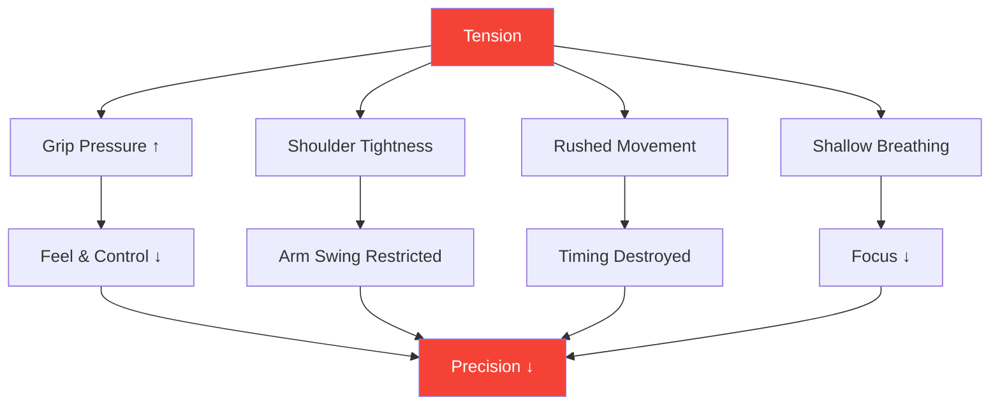

# Understanding Tension in Precision Sports

::: tip Tension Is Precision's Enemy
**Weight: 300 points** — You cannot be both tense and precise. Learning to manage tension is essential for consistent performance.
:::

## The Precision Paradox

> "The harder you try, the worse you do."

This isn't weakness—it's physics and physiology. Pétanque requires relaxed, fluid movements. Tension destroys the very qualities that produce accurate throws.

### How Tension Destroys Precision



---

## Physical vs. Mental Tension

Tension exists in two connected forms:

### Physical Tension

Muscle tightness that directly affects your throw:

| Area | Effect on Throw |
|------|-----------------|
| **Grip** | Loss of feel, inconsistent release |
| **Forearm** | Restricted wrist movement |
| **Shoulder** | Shortened, choppy arm swing |
| **Neck** | Restricted head position, vision |
| **Jaw** | Connected to overall body tension |
| **Core** | Balance and weight transfer issues |

### Mental Tension

Psychological stress that creates physical symptoms:

- Racing thoughts
- Worry about outcomes
- Fear of failure
- Pressure awareness
- Past mistakes replaying

::: warning The Tension Loop
Mental tension → Physical tension → Poor performance → More mental tension

Breaking this loop is essential for consistent play.
:::

---

## The Yerkes-Dodson Law

The relationship between arousal (activation level) and performance follows an inverted-U curve:

```
Performance
    ↑
    │         ★ Optimal Zone
    │        /\
    │       /  \
    │      /    \
    │     /      \
    │    /        \
    │   /          \
    └──┴────────────┴──→ Arousal
     Low           High

   "Flat"   "Alert"   "Tense"
   Unfocused Relaxed  Anxious
```

### Too Low (Under-aroused)
- Flat, unfocused
- Careless mistakes
- Lack of intensity
- Going through the motions

### Too High (Over-aroused)
- Tense, rushed
- Overthinking
- Tight grip, restricted movement
- Can't recover from mistakes

### Optimal Zone
- Alert but relaxed
- Focused yet fluid
- Appropriate intensity
- Quick recovery

---

## Finding YOUR Optimal Zone

Every player has a different optimal arousal level:

### The Self-Assessment Process

1. **Recall your best performances**
   - How did you feel physically?
   - What was your energy level?
   - How would you rate your arousal (1-10)?

2. **Recall your worst performances**
   - Were you too flat or too tense?
   - What physical symptoms did you notice?
   - What triggered the sub-optimal state?

3. **Identify your pattern**
   - Do you tend toward over-arousal or under-arousal?
   - What situations trigger your pattern?
   - What helps you return to optimal?

### Common Player Profiles

| Profile | Tendency | Risk Situations | Strategy |
|---------|----------|-----------------|----------|
| **The Worrier** | Over-arousal | High stakes, close games | Relaxation techniques |
| **The Flat-liner** | Under-arousal | Low-stakes, early rounds | Activation techniques |
| **The Reactor** | Variable | After misses, momentum shifts | Emotional regulation |
| **The Chaser** | Over-arousal when behind | Comebacks, time pressure | Acceptance techniques |

---

## Recognizing Tension Signals

### Physical Warning Signs

Learn to notice these before they affect your throw:

| Signal | Location | Action |
|--------|----------|--------|
| **Tight grip** | Hand | Soften before each throw |
| **Raised shoulders** | Upper back | Drop and roll |
| **Clenched jaw** | Face | Open mouth slightly |
| **Shallow breath** | Chest | Deep belly breath |
| **Rushed movement** | Whole body | Slow down deliberately |
| **Restless fidgeting** | General | Ground yourself |

### Mental Warning Signs

- Racing thoughts
- Negative self-talk increasing
- Focus on outcome, not process
- Awareness of stakes/score
- Thinking about past mistakes

---

## The Tension-Performance Self-Check

Use this quick assessment between throws or at breaks:

**Physical Scan (5 seconds):**
1. Grip → Soft?
2. Shoulders → Down?
3. Jaw → Unclenched?
4. Breathing → Slow and deep?

**Mental Scan (5 seconds):**
1. Thoughts → Present focused?
2. Energy → Optimal range?
3. Next action → Clear?

::: tip Make It a Habit
The best players do this automatically. You can train yourself to do the same through repetition.
:::

---

## In This Module

### [Tension Release Techniques](/fr/education/tension/techniques)
- Progressive Muscle Relaxation (PMR)
- Quick release techniques for competition
- Breathing protocols
- Pre-throw tension reset

### [Managing Tension in Competition](/fr/education/tension/competition)
- Pre-match preparation
- During-match protocols
- Emergency "too tense" recovery
- Post-mistake recovery

---

## Quick Win: The 10-Second Reset

Before your next throw, use this quick protocol:

1. **Shoulders** — Drop them consciously
2. **Grip** — Lighten it 20%
3. **Jaw** — Unclench, tongue off roof of mouth
4. **Breath** — One slow, full exhale

This takes 10 seconds and can immediately improve your next throw.

---

## Related Factors

- [Mental Strength](/fr/education/mental-game/mental-strength/) — Handling pressure
- [Sleep & Recovery](/fr/education/sleep/) — Rest reduces baseline tension
- [Mindfulness](/fr/education/mental-game/mindfulness/) — Present-moment awareness
- [The Zone](/fr/education/mental-game/the-zone/) — Optimal performance state

