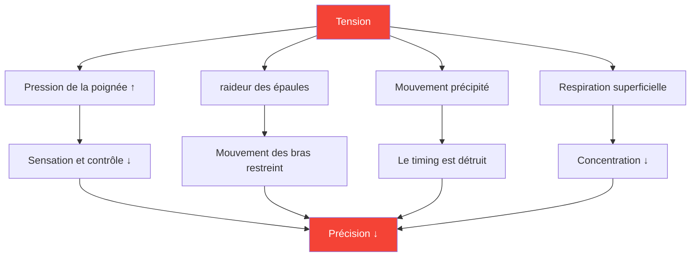

# Comprendre la tension dans les sports de précision

::: tip La tension est l&#39;ennemie de la précision.
**Poids : 300 points** — On ne peut être à la fois tendu et précis. Apprendre à gérer sa tension est essentiel pour une performance constante.
:::

## Le paradoxe de la précision

> « Plus vous essayez, moins vous réussissez. »

Ce n&#39;est pas de la faiblesse, c&#39;est une question de physique et de physiologie. La pétanque exige des mouvements fluides et détendus. La tension détruit précisément les qualités nécessaires à des lancers précis.

### Comment la tension détruit la précision



---

## Tension physique vs. tension mentale

La tension existe sous deux formes liées :

### Tension physique

Tensions musculaires affectant directement votre lancer :

| Zone | Effet sur le lancer |
|------|-----------------|
| **Poignée** | Perte de sensation, relâchement irrégulier |
| **Avant bras** | Mouvement restreint du poignet |
| **Épaule** | Balancement de bras raccourci et saccadé |
| **Cou** | Position de la tête restreinte, vision |
| **Mâchoire** | Lié à la tension corporelle globale |
| **Cœur** | Problèmes d&#39;équilibre et de transfert de poids |

### Tension mentale

Le stress psychologique qui engendre des symptômes physiques :

- Pensées qui s&#39;emballent
- Préoccupez-vous des résultats
- La peur de l&#39;échec
- Conscience de la pression
- les erreurs du passé se répètent

::: warning La boucle de tension
Tension mentale → Tension physique → Baisse de performance → Augmentation de la tension mentale

Rompre ce cycle est essentiel pour un jeu régulier.
:::

---

## La loi Yerkes-Dodson

La relation entre l&#39;éveil (niveau d&#39;activation) et la performance suit une courbe en U inversé :

```
Performance
    ↑
    │         ★ Optimal Zone
    │        /\
    │       /  \
    │      /    \
    │     /      \
    │    /        \
    │   /          \
    └──┴────────────┴──→ Arousal
     Low           High

   "Flat"   "Alert"   "Tense"
   Unfocused Relaxed  Anxious
```

### Trop faible (sous-stimulation)
- Plat, sans netteté
- Erreurs d&#39;inattention
- Manque d&#39;intensité
- Faire semblant

### Trop élevé (excitation excessive)
- Tendu, précipité
- Trop réfléchir
- Prise serrée, mouvement restreint
- On ne peut pas se remettre de ses erreurs.

### Zone optimale
- Alerte mais détendu
- Concentré mais fluide
- Intensité appropriée
- Rétablissement rapide

---

## Trouver VOTRE zone optimale

Chaque joueur a un niveau d&#39;excitation optimal différent :

### Le processus d&#39;auto-évaluation

1. **Repensez à vos meilleures performances**
   - Comment vous sentiez-vous physiquement ?
   - Quel était votre niveau d&#39;énergie ?
   - Comment évalueriez-vous votre niveau d&#39;excitation (1-10) ?

2. **Souvenez-vous de vos pires performances**
   - Étiez-vous trop plat ou trop tendu ?
   - Quels symptômes physiques avez-vous remarqués ?
   - Qu&#39;est-ce qui a déclenché cet état sous-optimal ?

3. **Identifiez votre motif**
   - Avez-vous tendance à l&#39;hyperexcitation ou à l&#39;hypoexcitation ?
   - Quelles situations déclenchent ce schéma ?
   - Qu&#39;est-ce qui vous aide à retrouver votre niveau optimal ?

### Profils de joueurs courants

| Profil | Tendance | Situations à risque | Stratégie |
|---------|----------|-----------------|----------|
| **Le/La Inquiet(e)** | Hyperexcitation | Enjeux élevés, matchs serrés | Techniques de relaxation |
| **Le Flatliner** | Sous-excitation | Premiers tours à faibles enjeux | Techniques d&#39;activation |
| **Le Réacteur** | Variable | Après les échecs, la dynamique change. | Régulation émotionnelle |
| **Le Chasseur** | Excitation excessive en position postérieure | Retournements de situation, pression du temps | Techniques d&#39;acceptation |

---

## Reconnaître les signaux de tension

### Panneaux d&#39;avertissement physiques

Apprenez à les repérer avant qu&#39;ils n&#39;affectent votre lancer :

| Signal | Emplacement | Action |
|--------|----------|--------|
| **Prise de main ferme** | Main | Adoucir avant chaque lancer |
| **Épaules relevées** | Haut du dos | Lâcher et rouler |
| **Mâchoire serrée** | Affronter | Ouvrir légèrement la bouche |
| **Respiration superficielle** | Poitrine | Respiration abdominale profonde |
| **Mouvement précipité** | Corps entier | Ralentissez délibérément |
| **Agitation et nervosité** | Général | Ancre-toi |

### Signes avant-coureurs mentaux

- Pensées qui s&#39;emballent
- Les pensées négatives envers soi-même augmentent
- Concentrez-vous sur le résultat, pas sur le processus.
- Conscience des enjeux/du score
- Réfléchir aux erreurs passées

---

## Auto-évaluation de la tension et de la performance

Utilisez cette évaluation rapide entre les lancers ou pendant les pauses :

**Scan physique (5 secondes) :**
1. Adhérence → Souple ?
2. Épaules → Baissées ?
3. Mâchoire → Détendue ?
4. Respiration → Lente et profonde ?

**Scan mental (5 secondes) :**
1. Réflexions → Axé sur le présent ?
2. Énergie → Portée optimale ?
3. Action suivante → Effacer ?

::: tip Faites-en une habitude
Les meilleurs joueurs le font automatiquement. Vous pouvez vous entraîner à faire de même par la répétition.
:::

---

## Dans ce module

### [Techniques de relâchement des tensions](/fr/education/tension/techniques)
- Relaxation musculaire progressive (RMP)
- Techniques de dégagement rapide pour la compétition
- Protocoles respiratoires
- Réinitialisation de la tension avant le lancer

### [Gérer la tension en compétition](/fr/education/tension/competition)
- Préparation d&#39;avant-match
- Protocoles pendant le match
- Récupération d&#39;urgence « trop tendue »
- Récupération après erreur

---

## Victoire rapide : La réinitialisation en 10 secondes

Avant votre prochain lancer, suivez ce protocole rapide :

1. **Épaules** — Relâchez-les consciemment
2. **Prise en main** — Allégez-la de 20 %
3. **Mâchoire** — Relâchez la mâchoire, décollez la langue du palais.
4. **Respiration** — Une expiration lente et complète

Cela prend 10 secondes et peut immédiatement améliorer votre prochain lancer.

---

## Facteurs associés

- Force mentale — Gérer la pression
- [Sommeil et récupération](/fr/education/sleep/) — Le repos réduit la tension de base
- [Pleine conscience](/fr/education/mental-game/mindfulness/) — Conscience du moment présent
- [La Zone](/fr/education/mental-game/the-zone/) — État de performance optimale

