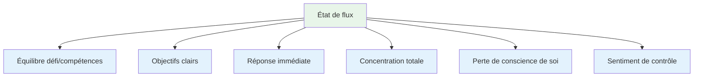
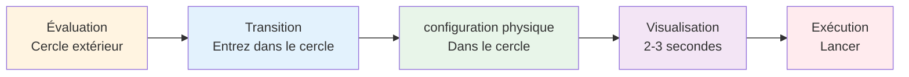
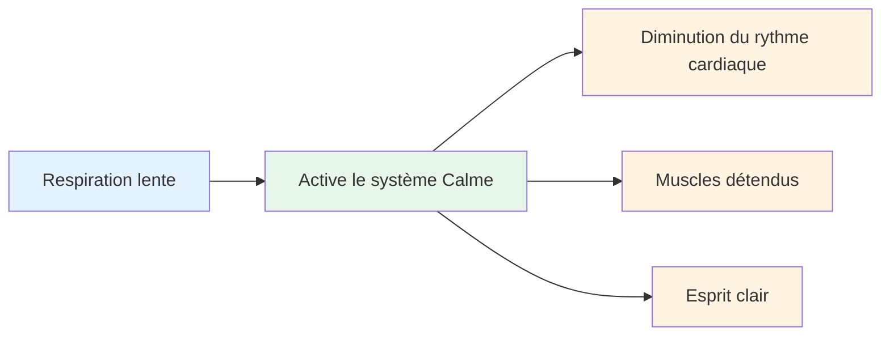

# Entrer dans la zone : techniques pratiques
<AdBanner />

L&#39;état de concentration optimale ne survient pas par hasard. Avec de l&#39;entraînement, vous pouvez apprendre à y accéder plus régulièrement. Voici des techniques éprouvées utilisées par les athlètes de haut niveau.

::: tip La grande idée
**Vous pouvez vous entraîner à entrer plus facilement en état de flow.** L&#39;état de flow n&#39;a rien de magique ; c&#39;est une compétence qui se développe grâce à des techniques spécifiques et une pratique régulière.
:::

## Les six conditions de l&#39;écoulement

Les recherches montrent que les états de flux nécessitent certaines conditions :

| Condition | Ce que cela signifie | En pétanque |
|-----------|---------------|-------------|
| **Équilibre défi/compétences** | La tâche est exigeante mais réalisable. | La compétition à votre niveau, ni trop facile ni impossible |
| **Objectifs clairs** | Vous savez exactement ce que vous essayez de faire | Cible précise, intention claire pour chaque lancer |
| **Réponse immédiate** | Vous voyez les résultats de vos actions | La balle atterrit, vous savez si ça a marché |
| **Concentration totale** | Concentrez-vous pleinement sur la tâche. | Aucune distraction, uniquement le moment présent. |
| **Perte de conscience de soi** | Je ne me soucie pas de ton apparence. | Je me fiche de qui regarde |
| **Sentiment de contrôle** | Se sentir capable de le gérer | Faites confiance à votre formation et à vos capacités |

::: info Aperçu clé
Lorsque ces six conditions sont réunies, l&#39;écoulement devient possible. Votre rôle est de créer délibérément ces conditions.
:::

## Technique 1 : La routine avant le tir

Votre routine d&#39;avant-tir est votre porte d&#39;entrée vers la concentration optimale. C&#39;est une séquence régulière qui signale à votre cerveau : « Il est temps de passer à l&#39;action. »

### Élaborer sa routine

Une bonne routine comporte les éléments suivants :

::: details 1. Évaluation visuelle (hors du cercle)
- Analysez le terrain.
- Choisissez votre cible et votre point d&#39;atterrissage
- Choisissez le type de lancer

**C&#39;est ici que se produit la réflexion.** Prenez votre temps.
:::

::: details 2. Transition (Entrée dans le cercle)
- Respirez
- Laissez tomber l&#39;analyse
- Passer en mode d&#39;exécution

**C&#39;est le point de bascule.** L&#39;analyse s&#39;arrête ici.
:::

::: details 3. Déclencheur physique (dans le cercle)
- Une configuration de posture cohérente
- Une vérification spécifique de la prise en main
- Un petit mouvement qui vous semble naturel.

**Assurez-vous que ce soit cohérent.** Identique à chaque fois.
:::

::: details 4. Visualisation (Brève, 2-3 secondes)
- Observez la trajectoire de la balle.
- Ressentez le lancer réussi
- Entrez en contact avec votre cible

**Faites court.** Trop long = trop de réflexion.
:::

::: details 5. Exécution
- Concentrez-vous uniquement sur la cible
- Faites confiance à votre corps
- Libérer sans hésitation

**Concentration externe uniquement.** La cible, pas la technique.
:::

### Pourquoi les routines fonctionnent

Votre routine devient une sorte de « sonnette de pleine conscience », un signal qui modifie votre état cérébral. À force de répétition, le simple fait de commencer votre routine déclenche ce changement d&#39;état mental et vous plonge dans un état de fluidité.

::: tip Conseil pratique
Utilisez votre routine à CHAQUE lancer à l&#39;entraînement, pas seulement en compétition. La routine doit devenir automatique.
:::

<AdInArticle />

## Technique 2 : Concentration externe

L&#39;endroit où vous portez votre attention a une importance capitale.

| Type de focus | Ce que vous pensez | Exemples de pensées |
|------------|---------------------|------------------|
| **Interne** ❌ | La mécanique de votre corps | « Garder mon coude droit »  &quot;Assurer le suivi correctement&quot;  « Ne serrez pas trop fort » |
| **Externe** ✅ | Objectif et résultat | &quot;Atterrissez juste là&quot;  &quot;Voyez le chemin&quot;  &quot;Toucher la cible&quot; |

::: tip Résultats de la recherche
Des études montrent régulièrement que **la concentration sur des éléments extérieurs donne de meilleurs résultats** chez les joueurs confirmés. Votre corps sait ce qu&#39;il a à faire : laissez-le agir.
:::

### Pratique axée sur l&#39;extérieur
- Choisissez un endroit précis sur le sol (pas seulement « près du cric »)
- Visualisez la trajectoire complète de la balle.
- Gardez les yeux sur la cible, pas sur votre main.

::: warning Erreur courante
Sous pression, les joueurs ont souvent tendance à se focaliser sur leurs propres pensées (« Ne gâchez pas ma technique »). C&#39;est précisément à ce moment-là qu&#39;ils ont le plus besoin de se concentrer sur l&#39;extérieur.
:::

## Technique 3 : La pression de la main gauche

Cette technique inhabituelle repose sur des bases scientifiques.

::: info La science
Serrer la main gauche (si vous êtes droitier) pendant 10 à 15 secondes avant de lancer :
- ✅ Active l&#39;hémisphère droit de votre cerveau (spatial, intuitif)
- ✅ Calme l&#39;hémisphère gauche (verbal, analytique)
- ✅ Réduit la rumination mentale
:::

**Comment l&#39;utiliser :**
1. Fermez le poing avec votre main non dominante.
2. Presser fermement pendant 10 à 15 secondes
3. Relâchez et commencez votre routine
4. Lancer

::: tip Quand l&#39;utiliser
Cela fonctionne particulièrement bien lorsque vous vous surprenez à trop réfléchir ou à ressentir de la pression. C&#39;est comme un bouton de réinitialisation pour votre cerveau.
:::

## Technique 4 : Contrôle de la respiration

Votre respiration influe directement sur votre état mental.

**Avant d&#39;entrer dans le cercle :**
- Prenez une respiration lente et profonde.
- Expirez complètement
- Sentez vos épaules s&#39;affaisser.

**Dans le cercle :**
- Respirez naturellement
- Ne retenez pas votre respiration pendant le lancer.
- Laissez l&#39;expiration accompagner votre libération

::: details La technique 4-7-8 (pour la haute pression)
1. Inspirez pendant 4 secondes.
2. Tenir pendant 7 secondes
3. Expirez pendant 8 secondes.
4. Répétez une ou deux fois

**Pourquoi ça marche :** Cela active votre système nerveux parasympathique (le système « calmant »).
:::

## Technique 5 : Mots déclencheurs

Un mot ou une phrase déclencheur peut instantanément modifier votre état mental.

::: tip Mots déclencheurs populaires
- &quot;Lisse&quot;
- &quot;Confiance&quot;
- « Vois-le, sois-le »
- &quot;Lâcher&quot;
- &quot;Couler&quot;
- &quot;Facile&quot;
:::

**Comment développer le vôtre :**
1. Pensez à une fois où vous avez parfaitement réussi.
2. Quel mot décrit le mieux ce sentiment ?
3. Utilisez ce mot dans votre routine
4. Répétez-le mentalement en vous préparant à lancer

::: info Pourquoi ça marche
À force de répétition, le mot devient associé à un état de performance optimale. C&#39;est un raccourci mental vers l&#39;état de flow.
:::

## Technique 6 : Réinitialiser après les erreurs

Des erreurs se produiront. L&#39;essentiel est de ne pas laisser une mauvaise passe en entraîner deux.

```mermaid
graph LR
    A[Erreur] --> B[ARRÊT <br/> Pause]
    B --> C[OBSERVER <br/> Avis]
    C --> D[ACCEPTER <br/> C&#39;est arrivé]
    D --> E[GLISSER <br/> Lâcher]
    E --> F[Retour au présent]

    style A fill:#ffebee
    style B fill:#fff4e1
    style C fill:#e3f2fd
    style D fill:#e8f5e9
    style E fill:#f3e5f5
    style F fill:#e8f5e9
```

**La méthode SOAS :**

| Étape | Action | Ce que cela signifie |
|------|--------|---------------|
| **Arrêt | Faites une pause, ne réagissez pas immédiatement. | Ne levez pas les mains, ne jurez pas |
| **Observer | Remarquez ce qui s&#39;est passé sans porter de jugement. | « La balle est partie à gauche », et non « Je suis nul ». |
| **Accepter | C&#39;est arrivé, c&#39;est terminé | On ne peut pas changer le passé |
| **Glisser | Lâchez prise, libérez-vous. | Revenez au moment présent |

::: warning Compétence essentielle
Cela demande de l&#39;entraînement, mais cela évite la spirale de frustration qui interrompt la concentration. Intégrez la méthode SOAS au quotidien pour qu&#39;elle devienne automatique en compétition.
:::

## Construire votre boîte à outils de flux

Chaque technique ne convient pas à tout le monde. Expérimentez et trouvez ce qui vous aide :

| Situation | Essayez ceci |
|-----------|----------|
| Trop réfléchir | Pression de la main gauche, mise au point externe |
| Nerveux/tendu | Contrôle de la respiration, mot déclencheur |
| Après une erreur | Méthode SOAS |
| Lancer important | Routine complète avant le tir |
| Perte de concentration | Retour aux fondamentaux de la routine |

## La pratique rend permanent

Ces techniques ne fonctionnent que si vous les pratiquez :

1. **Utilisez votre routine à chaque lancer d&#39;entraînement** - pas seulement en compétition
2. **Simuler la pression** - créer des conséquences dans la pratique
3. **Remarquez quand vous êtes en état de flow** - qu&#39;est-ce qui l&#39;a déclenché ?
4. **Bilan après les séances** - Qu&#39;est-ce qui a aidé, qu&#39;est-ce qui n&#39;a pas fonctionné ?

## Points clés à retenir

::: tip Souviens-toi
**L&#39;état de grâce n&#39;est pas une question de chance. C&#39;est une compétence que vous pouvez développer.**

Commencez par votre routine d&#39;avant-tir. Soyez régulier. Ayez confiance. La concentration viendra ensuite.
:::

<AdBanner />
