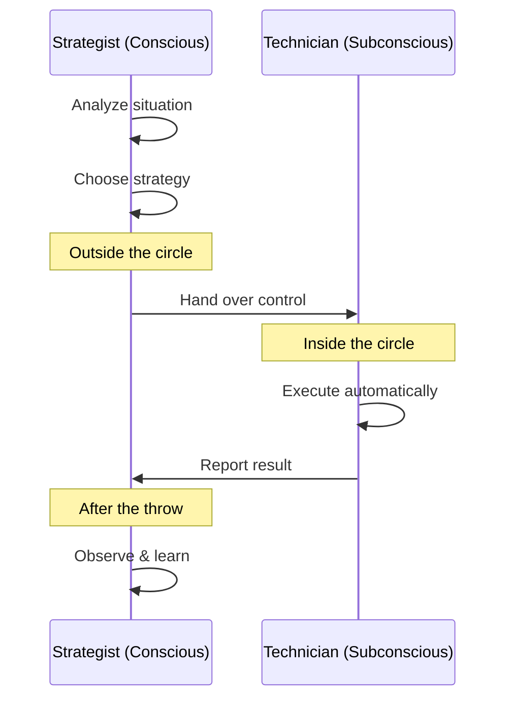

# La Zone : Comprendre l&#39;état de flux
<AdBanner />

Avez-vous déjà vécu une partie où tout s&#39;enchaînait parfaitement ? Où vous ne pensiez même plus à votre technique, et où chaque boule atterrissait exactement où vous le vouliez ? C&#39;est ce qu&#39;on appelle « l&#39;état de grâce » ; et savoir y accéder régulièrement, c&#39;est ce qui distingue les joueurs d&#39;élite des autres.

::: tip La grande idée
**L&#39;état de flow survient lorsque votre cerveau analytique se met en veilleuse et que vos instincts entraînés prennent le relais.** On ne peut pas atteindre cet état par la pensée ; il faut lâcher prise.
:::

## Qu&#39;est-ce que la Zone ?

La zone, aussi appelée « état de flow », est un état mental où l&#39;on est totalement absorbé par ce que l&#39;on fait. Le temps semble ralentir. Les mouvements paraissent naturels. On ne pense plus à la technique : on agit, tout simplement.

Les scientifiques appellent cet état **hypofrontalité transitoire**. En termes simples, la partie analytique du cerveau (le cortex préfrontal) se met en veilleuse, laissant place aux instincts conditionnés.

### Les deux modes cérébraux

```mermaid
graph LR
    A[Mode technique] -->|Step into circle| B[Mode d&#39;écoulement]
    B -->|After throw| C[Observation]
    C -->|Prochain lancer| A

    style A fill:#ffebee
    style B fill:#e8f5e9
    style C fill:#e3f2fd
```

**Mode technique (planification) :**
- Analysez la situation
- Choisissez votre stratégie
- Décidez quel lancer effectuer

**Mode de flux (exécution) :**
- Faites confiance à votre formation
- Concentrez-vous uniquement sur la cible
- Laissez votre corps agir automatiquement.

**Observation (Apprentissage) :**
- Observez le résultat sans porter de jugement.
- Tirez les leçons de ce qui s&#39;est passé
- Réinitialisation pour le prochain lancer

## Le paradoxe de la pétanque

Voici le défi : la pétanque vous laisse beaucoup de temps pour réfléchir entre les lancers. Contrairement aux sports rapides où l’on réagit instantanément, vous avez le temps de vous rendre au cercle, d’évaluer la situation et de préparer votre lancer.

Ce « temps de réflexion » est à la fois une bénédiction et une malédiction :
- **Cadeau :** Vous pouvez élaborer une stratégie et prendre des décisions intelligentes.
- **Malédiction :** Vous pouvez trop réfléchir et interférer avec vos capacités naturelles

Le joueur d&#39;élite apprend à utiliser ce temps à bon escient : il réfléchit pendant la planification, puis se « déconnecte » pendant l&#39;exécution.

## Deux modes de jeu

Votre cerveau fonctionne selon deux modes différents :

| Fonctionnalité | Mode technique | Mode d&#39;écoulement |
|---------|---------------|-----------|
| **Quand l&#39;utiliser** | Formation, apprentissage de nouvelles compétences | Compétition, exécution |
| **Activité cérébrale** | pensée analytique de haut niveau | Silencieux, automatique |
| **Se concentrer** | Mécanique interne (mécanique corporelle) | Externe (cible) |
| **Sentiment** | Effort, conscience | Sans effort, naturel |

<AdInArticle />

La compétence essentielle consiste à apprendre à **basculer** entre ces modes au bon moment.

## Le moment du « basculement »

::: warning La règle du changement
**Avant le cercle :** Analysez, élaborez une stratégie, décidez quel lancer effectuer
**Dans le cercle :** Laissez tomber l&#39;analyse, faites confiance à votre entraînement, concentrez-vous uniquement sur l&#39;objectif.
**Après le lancer :** Observez le résultat sans porter de jugement.
:::

La transition s&#39;opère lorsqu&#39;on entre dans le cercle. C&#39;est la compétence la plus importante en pétanque de haut niveau.

Voyez les choses ainsi : votre esprit conscient est le **stratège** qui élabore le plan, et votre subconscient est le **technicien** qui l’exécute. Le stratège doit se mettre en retrait et laisser le technicien travailler.

## Pourquoi la suranalyse nuit à la performance

Lorsque vous surveillez consciemment vos mouvements pendant l&#39;exécution, vous perturbez les processus automatiques que vous avez appris à maîtriser. C&#39;est ce qu&#39;on appelle le « blocage » – et cela arrive à tout le monde.

::: danger Signes que vous réfléchissez trop
- ❌ Réfléchir à la position du bras en plein lancer
- ❌ S&#39;inquiéter du résultat avant de publier
- ❌ Sensation de tension ou de raideur mécanique
- ❌ Se remettre en question dans le cercle
:::

::: tip La solution
La solution n&#39;est pas de réfléchir *moins*, mais de réfléchir aux **bonnes choses** au **bon moment**.

✅ **Pensée juste :** « Je vois clairement la cible »
❌ **Raisonnement erroné :** « Garder mon coude droit »
:::

## Dans cette section

Apprenez à maîtriser la zone :

- **[Entraînement technique vs entraînement fluide](/en/education/the-zone/technical-vs-flow)** - Comprendre quand se concentrer sur la technique et quand lâcher prise
- **[Entrer dans la zone](/en/education/the-zone/entering-the-zone)** - Techniques pratiques pour accéder à l&#39;état de flow

## Résumé : Les règles de la zone

::: tip Règle n° 1 : La règle du changement
**Analyser avant le cercle, exécuter dans le cercle, observer après.**
Votre esprit conscient planifie, votre subconscient exécute.
:::

::: tip Règle n° 2 : La règle d&#39;inversion
**À mesure que les compétences progressent, l&#39;entraînement mental devient plus important que l&#39;entraînement technique.**
Débutants : 90 % technique / 10 % mental
Experts : 20 % technique / 80 % mental
:::

::: tip Règle n° 3 : La règle de la confiance
**On ne peut pas parvenir à une exécution parfaite uniquement par la réflexion.**
Ayez confiance en votre entraînement. Concentrez-vous sur la cible, pas sur votre technique.
:::

## Points clés à retenir

> Il n&#39;existe aucune technique permettant de produire systématiquement une boule parfaite. Mais il existe un état d&#39;esprit où la réalisation de boules parfaites devient naturelle.

Votre technique est la base. La zone, c&#39;est là où cette base se transforme en art.

<AdBanner />
