# Exercices d&#39;entraînement

Voici des exercices éprouvés, utilisés par les joueurs de haut niveau. Chaque exercice a un objectif précis ; choisissez celui qui correspond à vos besoins.

::: tip La grande idée
Chaque exercice a un objectif précis. Ne lancez pas les boules au hasard : choisissez des exercices qui ciblent vos points faibles et vous aident à atteindre vos objectifs. Suivez vos progrès pour constater vos améliorations.
:::

```mermaid
graph TD
    A[Exercices d&#39;entraînement] --> B[Forets de pointage]
    A --> C[Exercices de tir]
    A --> D[Exercices mentaux]
    A --> E[Simulation de jeu]

    B --> F[Précision]
    B --> G[Contrôle de distance]

    C --> H[Taux de réussite]
    C --> I[Tir sous pression]

    D --> J[Pratique de routine]
    D --> K[Visualisation]

    E --> L[Préparation à la compétition]

    style A fill:#e8f5e9
    style B fill:#e3f2fd
    style C fill:#fff4e1
    style D fill:#f3e5f5
    style E fill:#fff4e1
```

## Forets de pointage

### La ruelle
**Objectif :** Isoler l’angle de déclenchement et la régularité de la ligne

**Installation:**
- Placez deux marqueurs à 30-40 cm de distance, à environ 1 mètre du cercle.
- La cible se trouve à une distance de 7 à 9 mètres.

**Percer:**
- Lancer à travers la « ruelle » (entre les marqueurs)
- Tout lancer qui touche un marqueur est « mort ».
- Concentrez-vous sur un point de relâchement constant

**Progression:**
- Réduisez la largeur de l&#39;allée au fur et à mesure de votre amélioration.
- Faites varier la distance cible
- Ajouter une zone d&#39;atterrissage spécifique

### Zones de précision
**Objectif :** Développer la précision dans des domaines spécifiques

**Installation:**
- Marquer des zones autour d&#39;une cible (par exemple, des cercles à 20 cm, 40 cm, 60 cm).
- Ou utilisez des repères naturels sur le terrain.

**Score :**
- À l&#39;intérieur de 20 cm : 3 points
- À l&#39;intérieur de 40 cm : 2 points
- À l&#39;intérieur de 60 cm : 1 point
- Extérieur : 0 point

**Percer:**
- Lancez 10 boules, notez votre score
- Objectif : Amélioration constante au fil des séances

### Variation de distance
**Objectif :** Développer le contrôle de la profondeur

**Installation:**
- Placer les cibles à 6 m, 7 m, 8 m, 9 m et 10 m.

**Percer:**
- Lancer à chaque distance dans un ordre aléatoire
- Le partenaire annonce la distance
- Concentrez-vous sur l&#39;ajustement du poids, pas sur la technique.

**Variation:**
- Ajoutez des appels « courts » et « longs » après la publication.
- Doit ajuster en cours de vol (développe le ressenti)

## Exercices de tir

### L&#39;échelle de tir
**Objectif :** Améliorer la précision sous une pression progressive

**Installation:**
- Placez une boule cible à 6 mètres.
- Marquer les distances à 7m, 8m, 9m, 10m

**Percer:**
- Commencez à 6 mètres.
- Toucher = reculer d&#39;un mètre
- Échec = avancer d&#39;un mètre (ou recommencer)
- Objectif : atteindre 10 mètres

**Variantes :**
- Version stricte : Tout échec ramène à 6 m
- Version chronométrée : Quelle distance pouvez-vous parcourir en 10 minutes ?
- Version en équipe : Alterner avec un partenaire

### La Barrière (Bloox)
**Objectif :** Forcer le tir en cloche

**Installation:**
- Placez une barrière (bâton, ficelle ou obstacle) entre vous et la cible.
- La barrière doit être suffisamment haute pour nécessiter un lob.

**Percer:**
- Il faut franchir l&#39;obstacle pour atteindre la cible.
- Tout lancer qui touche la barrière est « mort ».
- Développe un point de libération élevé

**Pourquoi c&#39;est important :**
- La compétition exige souvent de tirer par-dessus des obstacles.
- Développe la polyvalence de votre tir

### Parcours du combattant
**Objectif :** Développer les compétences en matière de prise de vue sous différents angles

**Installation:**
- Placez la boule cible au centre
- Ajoutez des obstacles (autres boules, marqueurs) autour.

**Percer:**
- Tirez depuis différentes positions autour du cercle
- Il faut trouver l&#39;angle qui fonctionne
- Développe la lecture des lignes de tir

## Exercices d&#39;entraînement mental

### Répétition de routine
**Objectif :** Automatiser votre routine avant la prise de vue

**Percer:**
- Répétez votre routine complète sans lancer
- Suivez chaque étape attentivement.
- Faites 10 à 20 répétitions.
- Ajoutez ensuite le lancer.

**Se concentrer:**
- Un timing régulier
- Transition claire de la réflexion à l&#39;exécution
- Même routine à chaque fois

### Points de pression
**Objectif :** S’entraîner à jouer sous pression

**Installation:**
- Créez un scénario « incontournable ».
- Définir des conséquences en cas de non-respect des règles

**Exemples :**
- &quot;Réalisez-en 3 d&#39;affilée ou recommencez&quot;
- &quot;Rompez et faites 10 pompes&quot;
- « Annoncez votre cible avant de lancer »

**Clé:**
- La pression devrait être ressentie comme réelle.
- Entraînez-vous à réagir mentalement à la pression.
- Utilisez votre routine exactement comme en compétition.

### Pratique de rétablissement
**Objectif :** Développer l’habitude d’une réinitialisation mentale rapide

**Percer:**
- Lancer intentionnellement une mauvaise boule
- Pratiquez immédiatement la méthode SOAS (Stop, Observe, Accept, Slip).
- Lancez la prochaine boule avec un engagement total.

**Se concentrer:**
- Ne vous attardez pas sur l&#39;échec
- Réinitialisez complètement avant le prochain lancer
- Adoptez un langage corporel positif

## Exercices de simulation de jeu

### Le Délice de Millieu
**Objectif :** Briser le rythme, développer la polyvalence

**Percer:**
- Alternez entre pointer et tirer à chaque lancer
- Deux lancers consécutifs du même type ne sont pas autorisés.
- Développe la capacité à changer de mode

### Jeu de scénario
**Objectif :** S’exercer à la prise de décision tactique

**Installation:**
- Mettez en place des situations de jeu réalistes
- Attribuer les scores et le nombre de boules

**Exemples :**
- « Vous êtes mené 10-8, votre adversaire a 2 points, vous avez 2 boules. »
- « Égalité 6-6, vous avez la dernière boule, ils ont 1 point »

**Percer:**
- Décidez de ce que vous allez faire
- Exécuter avec un engagement total
- Réexaminer la décision ultérieurement

### Match Play avec règles
**Objectif :** Simulation de compétition

**Variantes :**
- Jouer jusqu&#39;à 13 (partie complète)
- Jouer en 7 parties (plus court, plus de parties)
- Points de pression - certaines extrémités valent le double
- « Mort subite » : le premier à perdre une manche perd la partie.

## Suivi de vos exercices

Tenez un registre pour chaque exercice :

| Date | Percer | Score/Résultat | Notes |
|------|-------|--------------|-------|
| | | | |

**Suivi au fil du temps :**
- Vous progressez ?
- Quels exercices sont les plus efficaces ?
- Où rencontrez-vous des difficultés ?

## Création d&#39;une séance d&#39;entraînement

### Échauffement (10 min)
- Des lancers faciles pour se détendre
- Pas de pression, juste ressentir

### Focus technique (20-30 min)
- Un ou deux exercices ciblant des compétences spécifiques
- Pratique bloquée pour les nouvelles compétences
- Pratique aléatoire pour les compétences acquises

### Simulation de pression/jeu (20-30 min)
- Ajouter des conséquences
- Créer des scénarios réalistes
- Pratiquer les compétences mentales

### Retour au calme (10 min)
- lancers faciles
- Réfléchissez à la session
- Notez ce sur quoi travailler ensuite.

## Points clés à retenir

> Les perceuses sont des outils. Choisissez l&#39;outil adapté à vos besoins.

Ne vous contentez pas de lancer des boules. Entraînez-vous avec un objectif précis.

