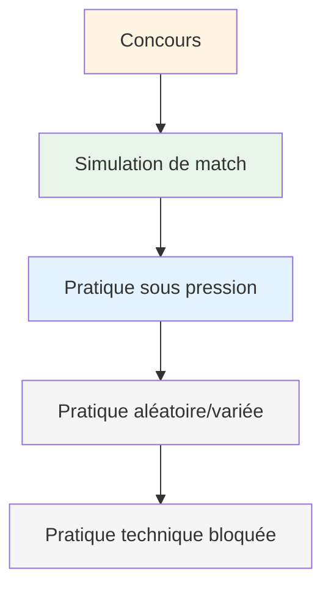

# Méthodes de formation
<AdBanner />

Quand votre technique est solide, que travaillez-vous ? C&#39;est là que beaucoup de joueurs stagnent : ils continuent à perfectionner leur technique alors que la véritable progression se situe ailleurs.

::: tip La grande idée
**La plupart des joueurs stagnent parce qu&#39;ils s&#39;attardent sans cesse sur leur technique alors que leur véritable progression se situe ailleurs.** Les joueurs d&#39;élite développent leur adaptabilité, leur prise de décision et leur force mentale, et pas seulement leur mécanique de jeu.
:::

```mermaid
graph TD
    A[Évolution de l&#39;entraînement] --> B[Débutant : Exercices techniques]
    B --> C[Niveau intermédiaire : Pratique aléatoire]
    C --> D[Avancé : Simulation de pression]
    D --> E[Élite : Entraînement mental]

    style A fill:#e3f2fd
    style B fill:#f5f5f5
    style C fill:#fff4e1
    style D fill:#e8f5e9
    style E fill:#fff4e1
```

## Au-delà de la répétition technique

La plupart des joueurs s&#39;entraînent en répétant des lancers. C&#39;est important pour les débutants, mais les joueurs confirmés ont besoin de plus :

| Type de formation | Ce qu&#39;il développe | Quand l&#39;utiliser |
|--------------|------------------|-------------|
| exercices techniques | Mécanique, forme | Acquisition de nouvelles compétences, résolution de problèmes |
| Pratique aléatoire | Adaptabilité, prise de décision | Préparation à la compétition |
| Simulation de pression | force mentale | Avant les événements importants |
| entraînement mental | Concentration, récupération, confiance | En cours, souvent négligé |

## La pyramide de formation

::: warning Erreur courante
**La plupart des joueurs passent trop de temps en bas de l&#39;échelle.** Les joueurs d&#39;élite travaillent à tous les niveaux de la pyramide, en mettant l&#39;accent sur les niveaux supérieurs à mesure qu&#39;ils progressent.
:::

## Entraînement bloqué vs. entraînement aléatoire

### Pratique bloquée
Répétez le même lancer plusieurs fois :
- 20 points à 7 mètres
- 20 tirs sur la même cible
- Même distance, même lancer

**Idéal pour :** l&#39;apprentissage initial, le développement de la confiance en soi, l&#39;échauffement
**Limitation :** Ne se transpose pas bien à la compétition

### Pratique aléatoire
Variez tout :
- Distances différentes à chaque lancer
- Alterner pointage et tir
- Changer constamment les objectifs

**Idéal pour :** la préparation aux compétitions, développer l&#39;adaptabilité
**Sensations :** Plus difficile, plus d&#39;erreurs, moins « productif »
**Réalité :** Meilleure rétention et transfert à long terme

### La recherche

Les études montrent de façon constante :
- La pratique bloquée est plus agréable (amélioration rapide visible)
- La pratique aléatoire permet d&#39;obtenir de meilleures performances en compétition.
- C’est dans la « lutte » de la pratique aléatoire que se produit l’apprentissage.

<AdInArticle />

## Simulation de pression

On ne peut pas gérer la pression de la compétition si on ne l&#39;a jamais expérimentée à l&#39;entraînement.

### Créer une pression à l&#39;entraînement

**Conséquences:**
- Pompes pour les échecs
- Le perdant achète du café
- Les points comptent pour quelque chose

**Scénarios :**
- situations « à faire »
- Menés 12-10, il faut marquer.
- Dernière boule du jeu

**Public:**
- Pratiquez en observant les gens
- Enregistrez-vous en vidéo
- Annoncez ce que vous essayez de faire.

**Fatigue:**
- Pratiquez quand vous êtes fatigué
- Fin d&#39;une longue session
- Après l&#39;exercice physique

### L&#39;échelle de tir

Un exercice de pression classique :
1. Commencez à 6 mètres
2. Toucher la cible = reculer d&#39;un mètre
3. Échec = avancer d&#39;un mètre (ou recommencer)
4. Objectif : atteindre 10 mètres

Cela crée une pression naturelle au fur et à mesure de votre progression.

## Séances d&#39;entraînement mental

Consacrez du temps spécifiquement aux compétences mentales :

### Séance de visualisation (15-20 min)
1. Trouvez un endroit calme
2. Fermez les yeux
3. Visualisez-vous en compétition
4. Voir les lancers réussis en détail
5. Ressentez la confiance et le flux
6. Entraînez-vous à gérer les moments de pression.

### Routine d&#39;entraînement avant le tir
- Répétez votre routine sans lancer
- Concentrez-vous sur les transitions mentales
- Prenez l&#39;habitude d&#39;une préparation constante

### Pratique de rétablissement
- Faire intentionnellement des erreurs dans la pratique
- Entraînez-vous à répondre à SOAS
- Prenez l&#39;habitude de vous ressourcer mentalement rapidement.

## Structurer votre semaine d&#39;entraînement

### Exemple : Amateur sérieux (6 heures/semaine)

| Jour | Durée | Se concentrer |
|-----|----------|-------|
| Lundi | 1,5 heure | Technique : Forets de pointage |
| Mercredi | 1,5 heure | Technique : Exercices de tir |
| Vendredi | 1 heure | Mental : Visualisation, pratique régulière |
| Samedi | 2 heures | Match play avec éléments de pression |

### Exemple : Joueur compétitif (10 heures/semaine)

| Jour | Durée | Se concentrer |
|-----|----------|-------|
| Lundi | 2 heures | Technique : Pointage (bloqué → aléatoire) |
| Mardi | 1 heure | Entraînement mental + visualisation |
| Mercredi | 2 heures | Technique : Tir (bloqué → aléatoire) |
| Jeudi | 1 heure | Analyse vidéo + travail mental |
| Vendredi | 2 heures | Simulation de pression, scénarios de jeu |
| Samedi | 2 heures | Compétition ou match play |

## Principes de formation

### 1. La qualité prime sur la quantité
- 30 minutes de concentration valent mieux que 2 heures de répétition machinale.
- Arrêtez-vous lorsque la concentration diminue.
- Mieux vaut arrêter tôt que de prendre de mauvaises habitudes.

### 2. Pratique délibérée
- Définissez un objectif précis pour chaque séance.
- Travaillez à la limite de vos capacités
- Obtenez des retours (vidéo, partenaire, résultats)
- Adaptez-vous en fonction de ce que vous apprenez

### 3. L&#39;importance du rétablissement
- Les jours de repos font partie de l&#39;entraînement
- Le sommeil a un impact significatif sur les performances.
- La fatigue mentale est bien réelle – respectez-la.

### 4. Tout suivre
- Tenir un journal d&#39;entraînement
- Notez ce qui fonctionne et ce qui ne fonctionne pas.
- Examiner régulièrement
- Adaptez votre plan en fonction des données

## Dans cette section

- **[Exercices d&#39;entraînement](/en/education/training/drills)** - Exercices spécifiques pour différentes compétences

## Points clés à retenir

> Votre entraînement détermine vos performances. Entraînez-vous comme si vous vouliez jouer.

Variez votre entraînement. Intégrez du travail mental. Créez-vous de la pression. Suivez vos progrès.

<AdBanner />
