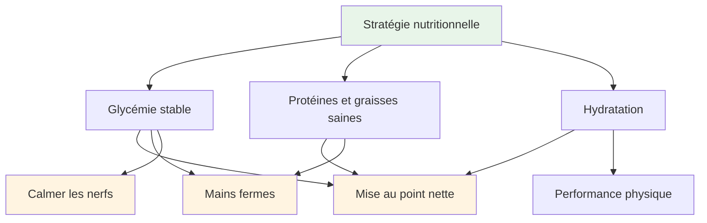
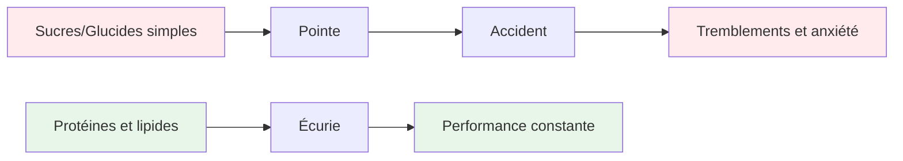

# Alimentation et nutrition

## Énergie pour des performances de précision

La pétanque est un sport de précision. Votre cerveau est votre outil le plus précieux : nourrissez-le d’énergie stable, pas d’énergie en dents de scie.

::: tip Le principe fondamental
**Glycémie stable = Concentration optimale + Mains fermes**

Évitez les pics de glycémie. Privilégiez les protéines et les bonnes graisses. Hydratez-vous bien.
:::

## Principes clés

### La stabilité de la glycémie est primordiale.

::: warning Impact des chutes de glycémie
Le sucre et les glucides simples provoquent des pics et des chutes de glycémie, ce qui a un impact direct sur :
- ❌ Concentration et clarté mentale
- ❌ Mains stables (tremblements dus aux chutes de glycémie)
- ❌ Qualité de la prise de décision
- ❌ Stabilité émotionnelle et sang-froid
:::

### Privilégiez les protéines et les graisses saines.

::: tip Les meilleurs aliments pour la précision
Les lipides et les protéines fournissent une énergie durable sans coup de fatigue :
- ✅ Noix, avocat, huile d&#39;olive, œufs, fromage
- ✅ Digestion lente = énergie constante toute la journée
- ✅ Pas de coup de barre en après-midi lors des longs tournois
:::

### Évitez le piège du sucre

::: danger Aliments à éviter
Soyez particulièrement prudent avec :
- ❌ Barres et boissons « énergétiques » (souvent riches en sucre)
- ❌ Jus de fruits et smoothies (sucre concentré)
- ❌ Pain blanc, viennoiseries, en-cas de distributeurs automatiques
:::

## Guide rapide du jour de compétition

| Timing | Que manger | Pourquoi |
|--------|-------------|-----|
| **2 à 3 heures avant** | Repas équilibré : protéines, lipides, légumes | Énergie stable sans somnolence |
| **Pendant la compétition** | Eau + petites collations protéinées (noix, fromage, viande séchée) | Gardez la concentration et les mains fermes. |
| **À éviter toute la journée** | Collations et boissons sucrées | Prévenir les accidents et les secousses |

::: tip Collations rapides pour la compétition
**Apportez ceci :**
- Noix mélangées (non salées)
- Œufs durs
- cubes de fromage
- Bœuf ou dinde séchée
- Légumes avec du houmous

**Laissez ces articles à la maison :**
- Bonbons et chocolat
- boissons énergisantes
- Pâtisseries
- Jus de fruit
:::

## La science

```mermaid
graph TD
    A[Consommez du sucre] --> B[pics de glycémie]
    B --> C[Libération d&#39;insuline]
    C --> D[Chutes de glycémie]
    D --> E[Réponse à l&#39;adrénaline]
    E --> F[Tremblements]
    E --> G[Anxiété]
    E --> H[Mauvaise mise au point]

    style A fill:#ffebee
    style F fill:#ffebee
    style G fill:#ffebee
    style H fill:#ffebee
```

::: info Pourquoi c&#39;est important pour la pétanque
Contrairement aux sports d&#39;endurance, la pétanque nécessite :
- **Précision** - Mains stables, sans tremblements
- **Clarté mentale** - Capacité de décision rapide et efficace tout au long de la journée
- **Nervosité tranquille** - Faible anxiété sous pression

Les énergies à base de sucre vont à l&#39;encontre de tous ces effets.
:::

## Apprendre encore plus

Pour des stratégies nutritionnelles détaillées, des protocoles pour le jour de la compétition et la science derrière l&#39;énergie stable :

::: tip Guide nutritionnel complet
→ **[Nutrition pour une performance de précision](/en/education/nutrition/)** - Guide complet dans notre section Éducation

Comprend :
- Planification détaillée des repas
- Protocoles du jour de compétition
- L&#39;option faible en glucides pour les athlètes de précision
- Stratégies d&#39;hydratation
- Aliments bénéfiques vs aliments néfastes
:::

