# Guides et outils

Ressources pratiques pour les joueurs, les entraîneurs et les clubs afin de mettre en œuvre des programmes d&#39;entraînement mental structurés.

## Choisissez votre format

```mermaid
graph LR
    A[Votre niveau] --> B{Experience?}
    B -->|New to Mental Training| C[Voyage mental]
    B -->|Some Experience| D[Atelier]
    B -->|Ready for Intensive| E[Camp d&#39;entraînement]
    B -->|Regular Training| F[Séance de formation]
    
    style C fill:#4CAF50,color:#fff
    style D fill:#2196F3,color:#fff
    style E fill:#9C27B0,color:#fff
    style F fill:#FF9800,color:#fff
```

## Formats de guide

### 🌱 [Voyage mental](/fr/guides/mental-journey/)
**Pour débutants** — Introduction de 2 à 3 heures

Idéal pour les joueurs qui débutent en préparation mentale. Une introduction en douceur aux concepts fondamentaux, agrémentée d&#39;exercices pratiques.

- Durée : 2 à 3 heures
- Taille du groupe : 4 à 12 joueurs
- Matériaux : Fournis
- [Voir le guide →](/fr/guides/mental-journey/)

---

### 🎯 [Atelier](/fr/guides/workshop/)
**Niveau intermédiaire** — Exploration approfondie de 3 à 4 heures

Atelier structuré pour les clubs et les équipes souhaitant approfondir leur entraînement mental.

- Durée : 3 à 4 heures
- Taille du groupe : 6 à 8 joueurs
- Comprend : Guide du coordinateur + documents téléchargeables
- [Voir le guide →](/fr/guides/workshop/)

---

### 🏕️ [Camp d&#39;entraînement](/fr/guides/training-camp/)
**Pour les équipes motivées** — Stage intensif de fin de semaine

Programme complet de week-end alliant théorie, pratique et compétition. Idéal pour les équipes se préparant à des tournois importants.

- Durée : 2 à 3 jours
- Taille du groupe : 10 à 20 joueurs
- Comprend : Programme complet + matériel d&#39;organisation
- [Voir le guide →](/fr/guides/training-camp/)

---

### 🔄 [Séance de formation](/fr/guides/training-session/)
**Pour une pratique régulière** — séances structurées de 2 à 4 heures

Cadre pour des séances d&#39;entraînement régulières intégrant les compétences mentales à la pratique technique.

- Durée : 2 à 4 heures
- Taille du groupe : 4 joueurs (une équipe)
- Objectif : Simulation de compétition avec réflexion
- [Voir le guide →](/fr/guides/training-session/)

---

## Modèles et outils

Modèles téléchargeables pour faciliter votre développement :

### 📋 [Modèle d&#39;objectif](/fr/guides/templates/goal-template)
Fiche de travail structurée pour définir et suivre vos objectifs de pétanque à l&#39;aide de la méthode SMART.

### 📓 [Modèle de journal](/fr/guides/templates/diary-template)
Modèle de journal d&#39;entraînement et de compétition pour suivre les progrès, les enseignements tirés et les axes d&#39;amélioration.

---

## Quel format vous convient le mieux ?

| Format | Idéal pour | Engagement en termes de temps | Profondeur |
|--------|----------|-----------------|-------|
| **Voyage mental** | Première introduction | 2 à 3 heures | ⭐ |
| **Atelier** | journées d&#39;entraînement du club | 3 à 4 heures | ⭐⭐ |
| **Camp d&#39;entraînement** | Préparation de l&#39;équipe | Fin de semaine | ⭐⭐⭐ |
| **Séance de formation** | Développement en cours | Régulier 2-4h | ⭐⭐ |

::: tip Pour les entraîneurs et les responsables de club
Chaque guide contient des ressources pour les participants ET les animateurs/organisateurs. Consultez la section « Pour les coordinateurs » qui propose des fichiers PDF et des diapositives de présentation téléchargeables.
:::

## Ressources connexes

- [🎯 Évaluation](/fr/assessment/) — Évaluez vos 8 facteurs et identifiez vos priorités
- [📚 Centre d&#39;éducation](/fr/education/) — Analyse approfondie des 8 facteurs de performance
- [📝 Articles](/fr/articles/) — Recherches et analyses

