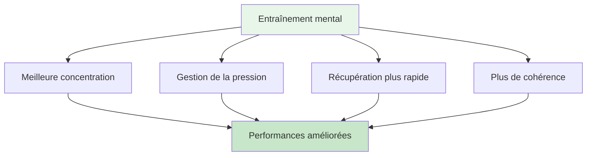

# Voyage mental pour débutants

## Bienvenue dans votre parcours mental.

Que vous soyez un joueur cherchant à améliorer votre jeu mental ou un entraîneur souhaitant introduire l&#39;entraînement mental à votre équipe, ce guide vous aidera à faire vos premiers pas dans le monde de la psychologie du sport appliquée à la pétanque.

::: tip À qui cela s&#39;adresse-t-il ?
- **Joueurs** qui souhaitent comprendre le jeu mental
- **Des entraîneurs** qui introduisent l&#39;entraînement mental à leurs équipes
- **Clubs** organisant des ateliers sur les stratégies mentales
- **Toute personne** curieuse de connaître la psychologie de la pétanque
:::

## Accès rapide

| Ressource | But | Accéder |
|----------|---------|--------|
| **Commencer** | Introduction aux concepts du jeu mental | [Lire ci-dessous](#pourquoi-l-entraînement-mental-est-important) |
| **Guide de la session** | Guide complet d&#39;atelier de 2 à 3 heures pour les animateurs | [Voir le guide](/fr/guides/mental-journey/session-guide) |
| **Matériels** | Guides du participant, diapositives et feuilles de travail | [Voir les documents](/fr/guides/mental-journey/materials) |
| **Guides associés** | Formats avancés | [Atelier](/fr/guides/workshop/) • [Camp d&#39;entraînement](/fr/guides/training-camp/) |

## Pourquoi l&#39;entraînement mental est important

À tous les niveaux de la pétanque, le mental influence la performance. Or, la plupart des joueurs se concentrent à 90 % sur la technique et seulement à 10 % sur le mental. Ce guide vous aidera à trouver le bon équilibre.

## Ce que vous apprendrez

### Pour les joueurs

**Concepts fondamentaux :**
1. **La Zone** - Comprendre les états de flow et comment y accéder
2. **La voix intérieure critique** - Reconnaître et gérer le discours intérieur négatif
3. **Réponse à la pression** - Pourquoi votre jeu est différent en compétition
4. **Le changement** - Passer de la réflexion à l&#39;action

**Compétences pratiques :**
- Routine simple avant le tir
- technique de réinitialisation en 3 respirations
- Protocole de récupération des erreurs
- Points d&#39;ancrage pour la compétition

### Pour les entraîneurs/guides

**Comment faciliter :**
1. Créer un environnement psychologique sûr
2. Animer des discussions de groupe
3. Relier la théorie à la pratique
4. Gérer les différentes personnalités

**Structure de la session :**
- format d&#39;atelier de 2 à 3 heures
- Sujets de discussion et exercices
- Documents téléchargeables
- Activités de suivi

## Commencer

### Option 1 : Autoformation (pour les joueurs)

**Semaine 1 : Comprendre les bases**
1. Lisez le module [The Zone](/fr/education/mental-game/the-zone/).
2. Essayez la technique de réinitialisation en 3 respirations
3. Remarquez quand vous êtes en « mode technique » par rapport au « mode flux ».

**Semaine 2 : Sensibilisation**
1. Lire le module [Force mentale](/fr/education/mental-game/mental-strength/)
2. Identifiez vos schémas de critique intérieure
3. Pratiquer l&#39;observation neutre après les erreurs

**Semaine 3 : Créer une structure**
1. Lire le module [Pleine conscience](/fr/education/mental-game/mindfulness/)
2. Commencez une pratique quotidienne de 5 minutes
3. Mettez en place une routine simple avant le tir

**Semaine 4 : Intégration**
1. Utilisez votre routine à l&#39;entraînement
2. Suivez vos performances mentales dans [Modèle de journal](/fr/guides/templates/diary-template)
3. Définissez des objectifs mentaux de jeu en utilisant le [Modèle d&#39;objectif](/fr/guides/templates/goal-template)

### Option 2 : Atelier de groupe (pour les entraîneurs)

**Animer une séance de 2 à 3 heures :**

Utilisez notre [Guide de séance](/fr/guides/mental-journey/session-guide) complet qui comprend :
- Structure complète de la session
- Sujets de discussion
- exercices de groupe
- Documents téléchargeables

**Ce dont vous aurez besoin :**
- 6 à 12 participants
- Salle calme avec sièges disposés en cercle
- tableau blanc ou paperboard
- Écran ou projecteur pour le partage de documents
- 2 à 3 heures de temps ininterrompu

## Les trois piliers de l&#39;entraînement mental

### 1. Sensibilisation
**De quoi s&#39;agit-il ?** Prendre conscience de ses pensées, de ses sentiments et de ses schémas de pensée

**Pourquoi c&#39;est important :** On ne peut pas changer ce qu&#39;on ne remarque pas.

**Comment développer :**
- Pratique quotidienne de la pleine conscience (5 à 10 minutes)
- Réflexions d&#39;après-match
- Tenir un journal d&#39;entraînement

### 2. Acceptation
**Qu&#39;est-ce que c&#39;est ?** Accueillir ses pensées et ses sentiments sans jugement

**Pourquoi c&#39;est important :** Lutter contre ses sensations intérieures crée des tensions

**Comment développer :**
- pratique d&#39;observation neutre
- Travail sur le coach intérieur contre le critique intérieur
- Lâcher prise sur le perfectionnisme

### 3. Action
**De quoi s&#39;agit-il ?** Choisir des réponses utiles malgré des pensées difficiles

**Pourquoi c&#39;est important :** L&#39;entraînement mental consiste à bien performer malgré le trac.

**Comment développer :**
- Routines avant le tir
- Réinitialiser les protocoles
- Simulation de pression en formation

## Questions fréquentes

### «Je ne suis pas assez bon pour me soucier de l&#39;entraînement mental.»
L&#39;entraînement mental est bénéfique à tous les niveaux. En fait, commencer tôt permet d&#39;acquérir de meilleures habitudes. Nul besoin d&#39;être un athlète de haut niveau pour tirer profit de la compréhension de son propre esprit.

### « N&#39;est-ce pas simplement &quot;penser positif&quot; ? »
Non. L&#39;entraînement mental vise à bien performer malgré les pensées négatives, et non à les éliminer. Il s&#39;agit de compétences pratiques, et non de pensée positive.

### « Combien de temps faut-il pour voir des résultats ? »
Certaines techniques (comme la réinitialisation en 3 respirations) agissent immédiatement. Des changements plus profonds (comme des états de flux constants) nécessitent 2 à 3 mois de pratique.

### « Ai-je besoin d&#39;un psychologue du sport ? »
Pas nécessairement. Ce guide propose des outils pratiques que vous pouvez utiliser immédiatement. L&#39;aide de professionnels est précieuse pour les problèmes plus complexes, mais la plupart des joueurs peuvent commencer seuls.

### « Cela va-t-il améliorer ma technique ? »
L&#39;entraînement mental ne remplace pas la pratique technique. Mais il vous aide à accéder à votre technique de manière constante, surtout sous pression.

## Ressources disponibles

### Pour les joueurs
- [Modules pédagogiques](/fr/education/) - 8 guides complets
- [Modèle d&#39;objectif](/fr/guides/templates/goal-template) - Structurez votre développement
- [Modèle de journal](/fr/guides/templates/diary-template) - Suivez vos progrès
- [Études de cas](/fr/articles/case-studies) - Exemples réels

### Pour les entraîneurs/guides
- [Guide de la séance](/fr/guides/mental-journey/session-guide) - Atelier complet de 2 à 3 heures
- [Matériel pour l&#39;animateur](/fr/guides/mental-journey/materials) - Guides et diapositives numériques
- [Guide d&#39;atelier](/fr/guides/workshop/) - Format avancé 3-4h
- [Guide du camp d&#39;entraînement](/fr/guides/training-camp/) - Programme du week-end

## Prochaines étapes

### Pour les joueurs individuels
1. **Commencez par la prise de conscience** - Lisez [The Zone](/fr/education/mental-game/the-zone/)
2. **Essayez une technique** - Utilisez la technique de réinitialisation en 3 respirations cette semaine
3. **Suivez votre expérience** - Observez les changements
4. **Développez progressivement** - Ajoutez une nouvelle compétence par semaine

### Pour les entraîneurs/groupes
1. **Consultez le guide de la séance** - Comprenez la structure
2. **Télécharger les documents** - Obtenez les documents et les diapositives
3. **Réservez une séance** - Bloc de 2 à 3 heures
4. **Préparez-vous** - Lisez les notes de l&#39;animateur
5. **Animer l&#39;atelier** - Suivre le guide

## Soutien

**Des questions pour bien démarrer ?**
- Courriel : [patrik.wiik@gmail.com](mailto:patrik.wiik@gmail.com)
- Consultez les [Études de cas](/fr/articles/case-studies) pour des exemples
- Participez aux discussions de votre club

---

::: tip Prêt à commencer ?
**Joueurs :** Commencez par le module [The Zone](/fr/education/mental-game/the-zone/)

**Coachs :** Consultez le [Guide de la session](/fr/guides/mental-journey/session-guide)

**Télécharger les documents :** Consultez [Documents pour animateurs](/fr/guides/mental-journey/materials)
:::

