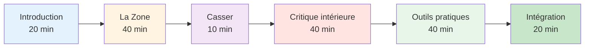

# Guide de la séance : Introduction au jeu mental (2-3 heures)


## Aperçu

Ce guide vous aide à animer une séance d&#39;initiation de 2 à 3 heures à la préparation mentale au jeu de pétanque. Idéal pour les entraîneurs, les responsables de club ou les joueurs expérimentés souhaitant initier leur équipe à l&#39;entraînement mental.

::: tip Ce guide comporte deux sections.
- **[Pour les participants](#for-participants)** - Ce que les joueurs apprendront
- **[Pour les animateurs](#for-facilitators)** - Comment mener la session
:::

## Accès rapide

| Section | But | Accéder |
|---------|---------|--------|
| **Pour les participants** | À quoi s&#39;attendre de la session | [Voir la section](#pour-participants) |
| **À l&#39;attention des animateurs** | Plan de séance complet et horaire | [Voir la section](#pour-animateurs) |
| **Matériel de la session** | Guides, diapositives et feuilles de travail | [Voir les documents](/fr/guides/mental-journey/materials) |
| **Liste de vérification des préparatifs** | Que faut-il préparer avant la séance ? | [Voir la liste de vérification](#préparation-1-semaine-avant) |

---

## Pour les participants

### À quoi s&#39;attendre

Cette séance présente l&#39;aspect mental de la pétanque à travers des discussions, des exercices et des techniques pratiques que vous pouvez utiliser immédiatement.

**Vous apprendrez :**
- Pourquoi l&#39;entraînement mental est important pour la performance
- La différence entre le « mode technique » et le « mode flux »
- Comment reconnaître et gérer sa critique intérieure
- Techniques simples de gestion de la pression
- Une routine de base avant le tir

**Ce dont vous aurez besoin :**
- Esprit ouvert et volonté de partager
- Cahier et stylo
- Vos propres expériences à partager
- 2 à 3 heures de temps concentré

### Structure de la session



### Concepts clés que vous explorerez

#### 1. La zone (état d&#39;écoulement)
- Ce que l&#39;on ressent quand tout s&#39;emboîte parfaitement
- Pourquoi le fait de réfléchir à la technique perturbe la performance
- Le passage de la planification à l&#39;exécution

#### 2. Le critique intérieur
- Comment le discours intérieur négatif affecte la performance
- La différence entre le critique intérieur et le coach intérieur
- observation neutre contre jugement sévère

#### 3. Réponse à la pression
- Pourquoi votre jeu est différent en compétition
- Signes physiques de pression
- Techniques de réinitialisation rapide

#### 4. Outils pratiques
- Réinitialisation en 3 respirations
- Routine simple avant le tir
- Protocole de récupération des erreurs

### Que faut-il apporter ?

**Requis:**
- Vous-même et vos expériences
- Volonté de participer

**Facultatif:**
- Exemples de difficultés mentales auxquelles vous êtes confrontés
- Questions sur des situations spécifiques
- Carnet pour notes personnelles

### Après la séance

Vous recevrez :
- Résumé des concepts clés
- Exercices pratiques pour la semaine
- Liens vers des modules de formation détaillés
- Modèle d&#39;objectif pour le développement mental dans le jeu


---

## Pour les animateurs

### Liste de vérification de préparation

**Une semaine avant :**
- [ ] Réservez une chambre pour 2 à 3 heures.
- [ ] Inviter 6 à 12 participants
- [ ] Ajoutez les pages de documents à vos favoris (voir [Materials](/fr/guides/mental-journey/materials))
- [ ] Examinez attentivement ce guide.
- [ ] Préparez un tableau de conférence ou un tableau blanc.

**La veille :**
- [ ] Confirmer la présence
- [ ] Aménager la salle (disposition en cercle)
- [ ] Tester toute technologie (diapositives, etc.)
- [ ] Préparer les matériaux

**1 heure avant :**
- [ ] Arrivez tôt
- [ ] Disposez les sièges en cercle.
- [ ] Matériel de préparation
- [ ] Recentrez-vous

### Votre rôle de facilitateur

::: warning Important
Vous n&#39;êtes **pas** un thérapeute ou un coach technique. Vous êtes un **facilitateur** qui :
- Discussion sur les guides
- Crée un espace sûr
- Relie les concepts à l&#39;expérience
- Gère la dynamique de groupe
:::

**Compétences clés :**
- écoute active
- présence neutre
- Gérer les différentes personnalités
- Savoir quand passer à autre chose

### Plan de séance détaillé

---

#### Partie 1 : Introduction (20 minutes)

**Objectifs :**
- Créer un climat de confiance psychologique
- Définissez les attentes
- Créer des liens au sein du groupe

**Scénario:**

« Bienvenue à tous. Cette séance porte sur l&#39;aspect mental de la pétanque : les pensées, les sentiments et les schémas qui influencent votre performance. »

**Règles de base :**
1. Ce qui est partagé ici reste ici.
2. Aucun jugement sur les expériences des autres
3. La participation est volontaire.
4. Il n&#39;y a pas de mauvaises réponses

**Questions rapides :** Nom, depuis combien de temps vous jouez, un défi mental auquel vous êtes confronté.

**Notes à l&#39;intention du facilitateur :**
- Commencez par modéliser la vulnérabilité.
- Les présentations doivent être brèves (1 min chacune).
- Remarquez les thèmes communs
- Valider toutes les réponses

---

#### Partie 2 : L&#39;état de zone / d&#39;écoulement (40 minutes)

**Objectifs :**
- Comprendre les états de flux
- Distinguer le mode technique du mode fluide
- Apprenez le concept de « commutateur ».

**Question d&#39;ouverture :**
« Repensez à une fois où vous avez joué votre meilleure partie de pétanque. Qu’avez-vous ressenti ? Qu’est-ce qui était différent ? »

**Sujets de discussion :**
1. « Combien d&#39;entre vous ont déjà vécu des parties où tout s&#39;est parfaitement enchaîné ? »
2. « À quoi pensiez-vous pendant ces moments-là ? »
3. « En quoi est-ce différent des moments où vous rencontrez des difficultés ? »

**Points clés de l&#39;enseignement :**

Utilisez un tableau blanc pour dessiner :
```
PLANNING MODE          →    EXECUTION MODE
(Outside circle)            (Inside circle)
- Analyze situation         - Eyes on target
- Choose strategy           - Trust training
- Decide throw type         - Automatic movement
```

**Exercice : Le Switch (10 minutes)**

« Entraînons-nous au moment décisif : »
1. Se lever
2. Imaginez que vous êtes à l&#39;extérieur du cercle - pensez à un tir
3. Respirez
4. Avancez (dans un cercle imaginaire)
5. Au fur et à mesure que vous avancez, lâchez prise sur l&#39;analyse.
6. Concentrez-vous uniquement sur une cible imaginaire.

**Débriefing :**
- « Qu&#39;avez-vous remarqué ? »
- « Était-ce facile ou difficile de lâcher prise ? »
- « Comment cela pourrait-il s&#39;appliquer dans de vrais jeux ? »

---

#### Partie 3 : Pause (10 minutes)

**Actions du facilitateur :**
- Encourager les discussions informelles
- Remarquez l&#39;énergie du groupe
- Préparez-vous pour la section suivante

---

#### Partie 4 : Le critique intérieur (40 minutes)

**Objectifs :**
- Reconnaître les schémas de discours intérieur négatifs
- Distinguer le critique intérieur du coach intérieur
- Pratiquer l&#39;observation neutre

**Ouverture:**
« Nous avons tous une voix intérieure qui commente nos performances. Parfois, elle est constructive, parfois elle est dure. Explorons cela. »

**Exercice : Inventaire de la critique intérieure (15 minutes)**

« Sur votre feuille, écrivez :
1. Ce que votre voix intérieure vous dit après un mauvais lancer
2. Ce que cela révèle sous pression
3. Ce que cela révèle de vos capacités

*Prévoyez 5 minutes pour écrire*

«Alors, qui est prêt à donner un exemple ?»

**Notes à l&#39;intention du facilitateur :**
- Normaliser les pensées auto-soucieuses et sévères
- N&#39;essayez pas de « réparer » qui que ce soit
- Recherchez les schémas communs

**Enseignement : Critique intérieure vs Coach intérieur (15 minutes)**

Tracez deux colonnes sur le tableau blanc :

| Critique intérieure | Coach intérieur |
|--------------|-------------|
| « Comment as-tu pu rater ça ?! » | « Ça a mal tourné. » |
| «Tu t&#39;étouffes toujours.» | « Essayons encore. » |
| « Tu es terrible » | «Que puis-je apprendre ?» |

**Discussion:**
- «Vous remarquez la différence ?»
- « Quelle voix améliore les performances ? »
- « Pouvez-vous changer la voix ? »

**Exercice pratique : Recadrage (10 minutes)**

«Prenez l&#39;une des phrases que vous prononcez avec votre critique intérieure. Comment un coach intérieur la formulerait-il ?»

Partagez des exemples.

---

#### Partie 5 : Outils pratiques (40 minutes)

**Objectifs :**
- Apprenez la réinitialisation en 3 respirations
- Créer une routine simple avant le tir
- Comprendre la récupération des erreurs

**Outil 1 : Réinitialisation en 3 respirations (10 minutes)**

« Ceci est votre bouton de réinitialisation d&#39;urgence. Utilisez-le lorsque vous sentez la pression monter. »

**Démontrer:**
1. Inspirez pendant 4 secondes.
2. Tenir pendant 2 secondes
3. Expirez pendant 6 secondes.
4. Répéter 3 fois

&quot;Entraînons-nous ensemble maintenant.&quot;

*Animer le groupe à travers 3 cycles*

**Débriefing :**
- « Qu’avez-vous remarqué dans votre corps ? »
- « Dans quel cas pourriez-vous utiliser ceci ? »

**Outil 2 : Routine simple avant la prise de vue (15 minutes)**

« Une routine vous aide à passer de la planification à l&#39;exécution de manière constante. »

**Structure de base :**
```
Outside Circle (Planning):
- Look at situation
- Decide on throw
- See the result in your mind

Walking to Circle (Transition):
- One deep breath
- Let go of analysis

Inside Circle (Execution):
- Eyes on target only
- Trust your training
- Execute
```

**Exercice:**
« Créez votre propre routine en 3 étapes. Notez-la. »

Partagez des exemples.

**Outil 3 : Protocole de récupération des erreurs (15 minutes)**

« Les joueurs d&#39;élite ne font pas moins d&#39;erreurs. Ils se rétablissent plus vite. »

**Protocole en 3 étapes :**
1. **Observer** - Énoncer le fait de manière neutre (« Ça est parti à gauche »)
2. **Apprendre** - Extraire des informations (« Le vent était plus fort que je ne le pensais »)
3. **Réinitialisation** - Avancer (réinitialisation en 3 respirations, regard droit devant)

**Pratique:**
« Pensez à une erreur récente. Suivez les 3 étapes. »

---

#### Partie 6 : Intégration et clôture (20 minutes)

**Objectifs :**
- Consolider les apprentissages
- Élaborer des plans d&#39;action
- Fournir des ressources

**Questions de réflexion :**
1. « Quel est le principal enseignement que vous retenez ? »
2. « Qu&#39;est-ce que tu vas essayer cette semaine ? »
3. « Quelles questions restent en suspens ? »

**Planification des actions (10 minutes)**

« Sur votre document, écrivez :
1. Une technique que vous pratiquerez cette semaine
2. Quand et où vous le pratiquerez
3. Comment vous suivrez vos progrès

**Ressources:**
- Distribuer la fiche récapitulative
- Partager le site web : carreau.app
- Module de départ recommandé : [The Zone](/fr/education/mental-game/the-zone/)

**Cercle de clôture :**
« Un mot pour décrire ce que vous ressentez en ce moment. »

**Messages finaux :**
« L’entraînement mental est une compétence comme une autre : il faut s’entraîner. Commencez petit à petit, soyez patient avec vous-même et observez les changements. Merci pour votre ouverture d’esprit aujourd’hui. »

---

### Conseils pour l&#39;animateur

#### Gérer les situations difficiles

**Si quelqu&#39;un domine :**
- « Merci [nom]. Écoutons les autres. »
- Utilisez une prise de parole structurée

**Si une personne est réticente :**
- Ne discutez pas
- « C&#39;est un point de vue valable. Qu&#39;en pensent les autres ? »
- S&#39;aligner sur leurs préoccupations

**Si quelqu&#39;un s&#39;émeut :**
- Normalisez-le
- « Cela touche à quelque chose de très réel. Merci de l&#39;avoir partagé. »
- N&#39;essayez pas de réparer

**Si la discussion s&#39;enlise :**
- Utilisez des invites spécifiques
- Partagez votre propre exemple
- Passez à un exercice

#### Gestion de l&#39;énergie

**Énergie élevée :** Pratiquez des exercices et bougez.
**Faible énergie :** Posez des questions provocatrices
**Dispersé :** Remettre en ordre la structure
**Tension :** Utilisez l&#39;humour ou faites une pause

### Après la séance

**Suivi:**
- Envoyer un courriel récapitulatif dans les 24 heures
- Inclure des liens vers les ressources
- Proposez de répondre aux questions
- Planifier une séance de suivi facultative

**Auto-réflexion :**
- Qu&#39;est-ce qui a bien fonctionné ?
- Que changeriez-vous ?
- Qu&#39;est-ce qui vous a surpris ?
- Qu&#39;avez-vous appris ?


---

## Matériels

- [Guide du participant](/fr/guides/mental-journey/materials#participant-guide)
- [Diapositives pour l&#39;animateur](/fr/guides/mental-journey/materials#facilitator-slides)
- [Fiche récapitulative](/fr/guides/mental-journey/materials#summary-sheet)
- [Fiches d&#39;exercices](/fr/guides/mental-journey/materials#exercise-worksheets)

---

::: tip Prêt à faciliter ?
1. Examinez attentivement ce guide.
2. Télécharger les documents
3. Pratiquez les exercices vous-même
4. Planifiez votre séance
5. Ayez confiance dans le processus
:::

