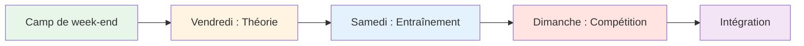

# Stage d&#39;entraînement : Week-end intensif de préparation mentale

## Aperçu

Un stage intensif de fin de semaine (du vendredi au dimanche) pour 10 à 20 joueurs, alliant préparation mentale, entraînement sur piste et mise en situation de compétition. Ce format intensif favorise un apprentissage transformateur grâce à l&#39;intégration de ces trois éléments.

::: tip Ce guide comporte deux sections.
- **[Pour les participants](#for-participants)** - Ce que les joueurs vivront pendant le week-end
- **[Pour les organisateurs](#for-organizers)** - Comment planifier et organiser le camp d&#39;entraînement
:::

::: tip La philosophie du camp d&#39;entraînement
La théorie sans pratique n&#39;est que de l&#39;information. La pratique sans théorie n&#39;est que répétition. La compétition sans réflexion n&#39;est que jeu. Ce week-end intègre ces trois éléments pour un apprentissage transformateur.
:::

## Accès rapide

| Section | But | Accéder |
|---------|---------|--------|
| **Pour les participants** | Programme du week-end et ce qu&#39;il faut apporter | [Voir la section](#pour-participants) |
| **À l&#39;attention des organisateurs** | Guide complet de planification et d&#39;animation | [Voir la section](#pour-organisateurs) |
| **Horaires quotidiens** | Horaire et activités détaillés | [Vendredi](#friday-evening-mental-game-foundation-3-4-hours) • [Samedi](#saturday-practice-application-full-day) • [Dimanche](#sunday-competition-integration-full-day) |
| **Guides associés** | Autres formats de formation | [Voyage mental](/fr/guides/mental-journey/) • [Atelier](/fr/guides/workshop/) |

---

## Pour les participants

### À quoi s&#39;attendre

Ce week-end intensif vous mettra à l&#39;épreuve mentalement, physiquement et émotionnellement. Vous apprendrez des concepts clés du jeu mental, les pratiquerez sur piste et les appliquerez en compétition, tout en tissant des liens forts avec les autres joueurs.

**Structure du week-end :**

### Analyse quotidienne

#### Vendredi soir : Bases du jeu mental (3-4 heures)
**Quoi :** Séance théorique sur les concepts mentaux du jeu
**Lieu :** Salle de réunion intérieure
**Format :** Discussion en cercle et exercices

**Vous apprendrez :**
- Les états de zone et d&#39;écoulement
- Critique intérieure vs coach intérieur
- Modèles de réponse à la pression
- Principes fondamentaux de la routine avant le tir

**Activités:**
- Enregistrement et règles de base
- L&#39;iceberg de la pétanque
- Création du manuel d&#39;utilisation
- Exercice de la peur dans un chapeau

#### Samedi : Pratique et application (Journée complète)
**Matin (3 heures) :** Pratique structurée avec concentration mentale
**Après-midi (3 heures) :** Exercices de simulation de pression
**Soirée (2 heures) :** Réflexion et intégration

**Vous pratiquerez :**
- Routines de préparation au tir lors de lancers réels
- Réinitialiser les techniques après les erreurs
- Les ancres de concentration sous pression
- Protocoles de communication d&#39;équipe

**Format:**
- Exercices en petits groupes (3-4 joueurs)
- Analyse vidéo des schémas mentaux
- Scénarios de pression
- séance de débriefing du soir

#### Dimanche : Compétition et intégration (Journée complète)
**Matinée (3 heures) :** Tournoi
**Après-midi (2 heures) :** Tours finaux
**Soirée (1 heure) :** Réflexion finale

**Vous postulerez :**
- Tous les outils mentaux en compétition
- Protocoles d&#39;équipe sous pression
- Récupération des erreurs en temps réel
- Processus de réflexion après le match

### Que faut-il apporter ?

**Requis:**
- Vos boules et votre équipement
- Des vêtements confortables pour toutes les conditions météorologiques
- Cahier et stylo
- Esprit ouvert et volonté de partager
- bouteille d&#39;eau

**Facultatif:**
- Journal d&#39;entraînement
- Questions sur des difficultés mentales spécifiques
- Exemples de situations de pression auxquelles vous êtes confrontés

**Inutile :**
- Demandes de coaching technique (axées sur l&#39;aspect mental du jeu)
- L&#39;ego ou le besoin de faire ses preuves
- Le jugement des autres

### Règles de base pour le week-end

::: tip Le conteneur
Tous les participants acceptent :
1. **Confidentialité** - Ce qui est partagé reste ici
2. **Respect** - Honorez la vulnérabilité des autres
3. **Participation** - Participez pleinement à toutes les activités
4. **Mentalité de croissance** - Acceptez l&#39;inconfort comme une source d&#39;apprentissage
5. **Soutien** - Aider les coéquipiers à appliquer les concepts
:::

### Ce que vous repartirez avec

**Connaissance:**
- Compréhension approfondie de vos schémas mentaux
- Outils pratiques pour la gestion de la pression
- Protocoles d&#39;équipe pour la compétition
- Routine pré-injection personnalisée

**Compétences:**
- Capacité d&#39;accéder aux états de flux
- techniques de récupération des erreurs
- Recadrage du coach intérieur
- Points d&#39;ancrage

**Connexion:**
- Des liens plus étroits avec les coéquipiers
- Langage partagé pour le jeu mental
- Réseau de soutien pour une croissance continue

**Matériels:**
- Feuilles de travail et exercices complétés
- Analyse vidéo de vos schémas mentaux
- Plan d&#39;action pour les 30 prochains jours
- Accès à tous les modules de formation

### Horaire typique

**Vendredi:**
- 18h00 - Arrivée et enregistrement
- 19h00 - Dîner
- 20h00 - Séance d&#39;ouverture (théorie)
- 23h00 - Temps libre / repos

**Samedi:**
- 08:00 - Petit-déjeuner
- 09:00 - Séance d&#39;entraînement du matin
- 12h00 - Déjeuner
- 13h30 - Séance d&#39;entraînement de l&#39;après-midi
- 17h00 - Pause
- 18h00 - Dîner
- 19h30 - Séance de réflexion du soir
- 21h00 - Temps libre / repos

**Dimanche:**
- 08:00 - Petit-déjeuner
- 09h00 - Début du tournoi
- 12h00 - Déjeuner
- 13h00 - Tours finaux
- 15h00 - Remise des prix et reconnaissance
- 16h00 - Cercle de clôture
- 17h00 - Départ

---

## Pour les organisateurs

### Aperçu de la planification

Cette section vous fournit tout ce dont vous avez besoin pour organiser et mener à bien un stage d&#39;entraînement de week-end pour 10 à 20 joueurs.

### Planification avant le camp (6 à 8 semaines avant)

### Taille et structure du groupe

**Nombre optimal :** 10 à 20 joueurs
- **Petit camp (10-12) :** Partage plus intime et plus profond
- **Grand camp (16-20) :** Perspectives plus diversifiées, nécessite des sous-groupes

**Structure de l&#39;équipe :**
- Divisez-vous en équipes de 3 ou 4 pour l&#39;entraînement et la compétition.
- Mélangez les niveaux de compétence et les styles de jeu
- Rotation des équipes tout au long du week-end

### Besoins en personnel

| Rôle | Responsabilités | Quantité |
|------|------------------|----------|
| **Coordonnateur de la performance mentale** | Animer des séances théoriques et des ateliers sur la dynamique de groupe | 1 |
| **Coach technique** | Superviser l&#39;entraînement, fournir des commentaires | 1-2 |
| **Directeur de la compétition** | Organiser le tournoi, gérer la logistique | 1 |
| **Personnel de soutien** | Repas, installation, administration | 1-2 |

### Exigences relatives à l&#39;emplacement

::: info Besoins en installations
**Piste:**
- Terrains multiples (minimum 3-4 pistes)
- Différentes surfaces si possible (gravier, sable, dur)
- Éclairage pour les jeux du soir

**Espace intérieur :**
- Salle pour 20 personnes en cercle (séances théoriques)
- Séparé des pistes
- tableau blanc/projecteur
- Sièges confortables

**Hébergement:**
- Sur place ou à proximité (à distance de marche)
- Les chambres partagées favorisent les liens.
- Un espace calme pour la réflexion

**Restauration:**
- Repas axés sur la nutrition (voir [Guide alimentaire](./food))
- Évitez les hypoglycémies.
- Points d&#39;hydratation
:::

### Liste de vérification des matériaux

::: details Liste complète des matériaux
**Séances théoriques :**
- [ ] Chaises pour le cercle (pas de tables)
- [ ] Boules et cochonnet pour centre
- [ ] Tableaux de conférence et marqueurs
- [ ] Post-it
- [ ] Fiches de travail (Manuel d&#39;utilisation, Critique intérieure, etc.)
- [ ] Papier et stylos
- [ ] Projecteur (pour le contenu du site web)

**Séances d&#39;entraînement :**
- [ ] Mètre à ruban
- [ ] Cônes/marqueurs pour les exercices
- [ ] Caméra vidéo/trépied
- [ ] Bloc-notes et papier (suivi)
- [ ] Siffler

**Concours:**
- [ ] Feuilles de score
- [ ] Tableau du tournoi
- [ ] Prix/reconnaissance
- [ ] Trousse de secours

**Logistique:**
- [ ] Étiquettes nominatives
- [ ] Liste des participants avec leurs coordonnées
- [ ] Informations de contact d&#39;urgence
- [ ] bouteilles d&#39;eau
- [ ] crème solaire
- [ ] Mouchoirs en papier (pour les moments d&#39;émotion !)
:::

## Programme du week-end

### Vendredi soir (3 heures)

**18h00-18h30 - Arrivée et accueil**
- Enregistrement
- Attribution des chambres
- Aperçu du week-end

**18h30-19h30 - Dîner**
- Repas axé sur la nutrition
- Présentations informelles

**19h30-22h30 - Séance théorique : Fondements**

Utilisez le [guide d&#39;atelier](./workshop) pour une facilitation détaillée :

1. **Règles de base (15 min)** - Établir un climat de confiance
2. **Matrice de pointage (20 min)** - Évaluation de l&#39;énergie du groupe
3. **L&#39;Iceberg (30 min)** - Explorez vos pensées intérieures
4. **Manuel d&#39;utilisation (45 min)** - Développer la compréhension de l&#39;équipe
5. **La peur dans un chapeau (45 min)** - Rompre l&#39;isolement
6. **Fin de session (15 min)** - Boucler la boucle

**22h30 - Temps libre**
- Socialisation informelle
- Repos et réflexion

```mermaid
graph TD
    A[Théorie du vendredi] --> B[Sécurité psychologique]
    B --> C[Conscience de soi]
    C --> D[Compréhension d&#39;équipe]
    D --> E[Prêt pour l&#39;entraînement]

    style A fill:#fff4e1
    style E fill:#e8f5e9
```

### Samedi (Journée complète - Théorie + Pratique)

**08:00-09:00 - Petit-déjeuner et pleine conscience**
- Petit-déjeuner tranquille
- Méditation guidée facultative de 15 minutes
- Définissez vos intentions pour la journée

**09:00-10:30 - Séance théorique : Relier le contenu à l&#39;expérience**

Choisissez 3 ou 4 sujets sur le site web de l&#39;Académie et explorez le jeu intérieur :

**Exemples de sujets :**

1. **[Nutrition](./education/nutrition/)** (20 min)
   - « Comment vos choix alimentaires changent-ils sous la pression ? »
   - « Mangez-vous ce dont votre corps a besoin ou ce que votre anxiété réclame ? »
   - Entraînement : Planifiez votre nutrition pour le jour de la compétition

2. **[Force mentale](./education/mental-game/mental-strength/)** (25 min)
   - « Quel est votre rapport à l&#39;échec ? »
   - « Comment se parle-t-on à soi-même après un échec ? »
   - Activité : Transformer son critique intérieur en coach intérieur

3. **[Pleine conscience](./education/mental-game/mindfulness/)** (25 min)
   - « À quoi penses-tu pendant la pause avant de lancer ? »
   - « Qu’est-ce qui vous fait sortir du moment présent ? »
   - Exercice : scan corporel de 5 minutes

4. **[Tactiques](./education/technique/tactics/)** (20 min)
   - «Votre choix de tir est-il basé sur une stratégie ou sur la peur ?»
   - «Quand faut-il privilégier la sécurité plutôt que la prise de risques ?»
   - Discussion : Profils de risque au sein du groupe

**10h30-10h45 - Pause**

**10:45-12:30 - Intégration sur piste : Exercices de concentration mentale**

**Exercice 1 : Annoncez votre tir (30 min)**

Extrait du [guide d&#39;atelier](./workshop) - pratiquez la prise en charge de vos intentions et de vos doutes :

1. Annoncez la cible : « Je tire sur le fer »
2. Niveau de confiance : « Je suis à 7 sur 10 »
3. Nommez la pensée intérieure : « Ma voix intérieure s&#39;inquiète de l&#39;effet rétroactif. »
4. Exécutez le tir
5. Réfléchissez : « Que s&#39;est-il passé ? Qu&#39;avez-vous appris ? »

**Exercice 2 : Interférence cognitive (30 min)**

Vérifier si la technique est devenue automatique :
- Le coordinateur pose des questions complexes pendant que le joueur tire.
- « Nommez 5 capitales » ou « Comptez à rebours à partir de 100 en soustrayant 7 à chaque fois ».
- Le succès repose sur une technique implicite, non consciemment mise en œuvre.

**Exercice 3 : Mise en pratique du manuel d&#39;utilisation (30 min)**

Appliquer les manuels d&#39;utilisation à partir de vendredi :
- Jouez par équipes de 3
- Après chaque tir, les coéquipiers réagissent conformément au manuel d&#39;utilisation.
- « Marc a besoin de silence après un échec » - l&#39;équipe respecte cela
- Débriefing : « Qu’avez-vous ressenti en étant compris ? »

**12h30-14h00 - Déjeuner et repos**
- Repas axé sur la nutrition
- Un moment de calme pour la réflexion
- Facultatif : entretiens individuels avec le coordinateur

**14h00-17h00 - Séance d&#39;entraînement : Adaptation au terrain**

**Objectif :** Développer l&#39;adaptabilité et la flexibilité mentale

**Installation:**
- Effectuez une rotation sur 3 à 4 terrains/pistes différents
- 45 minutes par terrain
- Concentrez-vous sur l&#39;adaptation mentale, pas seulement technique.

**Structure de rotation :**

| Terrain | Concentration mentale | Pratique |
|---------|--------------|----------|
| **Terrain 1 : Sol meuble/sableux** | Accepter l&#39;incertitude | &quot;La donnée - accepter ce qui est&quot; |
| **Terrain 2 : Dur/Gravier** | Précision sous pression | «Faites confiance à votre technique» |
| **Terrain 3 : Irrégulier** | Régulation émotionnelle | « Gardez votre calme face à l&#39;injustice » |
| **Terrain 4 : Compétition** | accès à l&#39;état du flux | &quot;Trouve la zone&quot; |

**Facilitation :**
- L&#39;entraîneur technique donne son avis sur la technique
- MPC demande : « À quoi pensez-vous en ce moment ? »
- Les joueurs tiennent un journal entre les rotations.

**17h00-18h00 - Pause et réflexion**
- journal individuel
- « Qu’as-tu appris sur toi-même aujourd’hui ? »
- « Qu’est-ce que tu feras différemment demain ? »

**18h00-19h00 - Dîner**

**19h00-21h00 - Théorie du soir : Vulnérabilité profonde**

**Activité 1 : Recadrer le critique intérieur (45 min)**

Consultez le [guide de l&#39;atelier](./workshop) pour le protocole complet :
1. Identifiez la phrase critique exacte
2. Repenser comme coach intérieur
3. Cabinet partenaire

**Activité 2 : Préparation à la compétition (45 min)**

Demain, c&#39;est le jour de la compétition. Préparez-vous mentalement :

1. **Visualisation (15 min)**
   - Fermez les yeux
   - Imaginez le cliché parfait
   - Ressentez la confiance
   - Remarquez le calme

2. **Protocoles d&#39;équipe (20 min)**
   - Créer des signaux de soutien
   - &quot;J&#39;ai besoin d&#39;une réinitialisation&quot; = toucher des boules
   - « J&#39;ai besoin d&#39;encouragements » = check du poing
   - « J&#39;ai besoin d&#39;espace » = reculer

3. **Définir ses intentions (10 min)**
   - « Demain, je me concentrerai sur… »
   - « Mon objectif n&#39;est pas de gagner, mais de… »
   - «Je vais m&#39;entraîner...&quot;

**Départ (30 min)**
- Partagez une de vos craintes concernant demain
- Partager une intention
- Soutien de groupe

**21h00 - Temps libre**
- Au lit tôt (compétition demain !)
- Réflexion tranquille

### Dimanche (jour de compétition)

**08h00-09h00 - Petit-déjeuner et préparation mentale**
- Petit-déjeuner léger (voir [Guide nutritionnel](./education/nutrition/))
- 15 minutes de pratique de la pleine conscience
- réunions d&#39;équipe

**09:00-09:30 - Briefing sur la concurrence**

**Format :** Tournoi toutes rondes
- Équipes de 3
- Jouez jusqu&#39;à 13 points
- Chacun joue avec chacun
- Concentrez-vous sur le PROCESSUS, pas sur le résultat

**Le point fort : l&#39;évaluation des performances mentales**

::: tip Système de double notation
**Traditionnel :** Points gagnés
**Performances mentales :** Évaluation par MPC

Points de performance mentale (0 à 5 par match) :
- Outils du manuel d&#39;utilisation utilisé
- J&#39;ai efficacement soutenu mes coéquipiers.
- Critique intérieure maîtrisée
- Rester présent (sans s&#39;attarder sur les images passées)
- Sécurité psychologique démontrée

**Gagnant :** Meilleur score combiné (traditionnel + mental)
:::

**09:30-13:00 - Compétition du matin**
- Jeux toutes rondes
- MPC observe et évalue
- L&#39;entraîneur technique donne un bref retour d&#39;information entre les matchs
- Pause hydratation et collation

**13h00-14h00 - Déjeuner**
- axé sur la nutrition
- Réflexion informelle
- Repos

**14h00-17h00 - Compétition de l&#39;après-midi**
- Poursuivre le tournoi toutes rondes
- Demi-finales et finales
- Pression croissante
- Mettre en pratique les enseignements du matin

**17h00-17h30 - Remise des prix et reconnaissance**

**Catégories :**
- vainqueur traditionnel
- vainqueur de la performance mentale
- La plupart des améliorations
- Meilleur coéquipier
- Prix du courage (personnes les plus vulnérables)

**17h30-19h00 - Séance de réflexion finale**

**Essentiel :** C&#39;est ici que l&#39;apprentissage se concrétise.

**Structure:**

**1. Réflexion individuelle (15 min)**
Écrire dans un journal :
- Qu&#39;avez-vous appris sur vous-même ce week-end ?
- Qu&#39;est-ce qui vous a surpris ?
- Que ferez-vous différemment ?
- Qu&#39;est-ce que vous emportez chez vous ?

**2. Partage en petits groupes (30 min)**
Groupes de 4 à 5 :
- Partager les principaux enseignements
- Qu&#39;est-ce qui a le plus résonné en vous ?
- Qu&#39;est-ce qui a été le plus difficile ?
- Qu&#39;est-ce qui était le plus précieux ?

**3. Intégration complète du groupe (30 min)**
Encerclez-vous :
- Chaque personne partage UN point clé à retenir
- MPC valide et connecte les thèmes
- Discussion : « Comment allez-vous appliquer cela ? »

**4. Engagements (15 min)**
- Chaque personne prend un engagement
- « Lors de ma prochaine compétition, je vais... »
- Témoignages et soutiens du groupe

**5. Clôture (15 min)**
- Remercier les participants pour leur courage
- Rappel de la confidentialité
- Échanger des contacts
- Plan de suivi (séance en ligne facultative)

**19h00 - Dîner et départ**

## Conseils d&#39;animation

### Concilier théorie et pratique

::: warning Ne surchargez pas la théorie
**L&#39;erreur :** Trop de paroles, pas assez d&#39;actions

**Le solde :**
- La théorie crée une prise de conscience
- La pratique permet de développer ses compétences
- intégration des tests de concurrence
- La réflexion consolide l&#39;apprentissage

**Règle générale :** 30 % de théorie, 40 % de pratique, 20 % de compétition, 10 % de réflexion
:::

### Gestion de la dynamique de groupe

**L&#39;alpha concurrentiel :**
- Il veut gagner à tout prix
- Résiste à la vulnérabilité
- **Stratégie :** Canaliser la compétitivité dans l’évaluation des performances mentales

**L&#39;observateur silencieux :**
- Il absorbe tout, sans partager.
- **Stratégie :** Créer des points d&#39;entrée à faible enjeu, valider l&#39;observation comme une participation

**Le sceptique :**
- « Ces méthodes tactiles ne fonctionnent pas. »
- **Stratégie :** Aïkido verbal - s&#39;aligner et pivoter (voir [Guide d&#39;atelier](./workshop))

**La personne qui partage trop :**
- Domine la discussion
- **Stratégie :** « Merci, écoutons les autres »

### Gérer les moments émotionnels

**Quelqu&#39;un pleure pendant Fear in a Hat :**
- ✅ Normaliser : « Les larmes sont un signe de courage, pas de faiblesse »
- ✅ Proposez un mouchoir, ne vous précipitez pas
- ✅ Demandez : « De quoi avez-vous besoin maintenant ? »
- ❌ Ne dites pas : « Ça va, ne pleure pas »

**Conflit entre joueurs :**
- ✅ Pause et adresse
- ✅ « Que se passe-t-il en ce moment ? »
- ✅ Profitez-en pour apprendre.
- ❌ À ne pas faire : ignorer ou minimiser

**Quelqu&#39;un coupe le son :**
- ✅ Enregistrez-vous en privé pendant la pause
- ✅ « J&#39;ai remarqué que tu étais silencieux. Qu&#39;est-ce qui se passe ? »
- ✅ Proposez des options : participez différemment, faites une pause
- ❌ Ne pas : Dénoncer publiquement

## Suivi post-camp

### Immédiat (24 à 48 heures)

**À envoyer à tous les participants :**
- Message de remerciement
- Résumé des points clés
- Photos du week-end
- Liste de contacts (avec autorisation)
- Lien vers les ressources du site web

**Enregistrements individuels :**
- Envoyez un SMS à tous ceux qui ont beaucoup partagé.
- «Comment te sens-tu à l&#39;approche du week-end ?»
- Corrigez toute vulnérabilité persistante

### Court terme (2 semaines)

**Séance en ligne facultative (60 à 90 min) :**
- Comment avez-vous mis en pratique vos connaissances ?
- Qu&#39;est-ce qui fonctionne ? Quels sont les défis ?
- Soutien par les pairs et résolution de problèmes
- Renforcer les engagements

### À long terme (1 à 3 mois)

**Participants à l&#39;enquête :**
- Qu&#39;est-ce qui est différent dans votre jeu ?
- Quels outils utilisez-vous encore ?
- Comment améliorer le prochain camp ?
- Le recommanderiez-vous à d&#39;autres ?

**Impact sur la piste :**
- Résultats de la compétition
- confiance auto-déclarée
- Dynamique d&#39;équipe
- Engagement continu

## Adaptation aux groupes de tailles différentes

### Petit camp (10-12 joueurs)

**Avantages :**
- Partage plus approfondi
- Une attention plus individualisée
- Des liens plus forts

**Ajustements :**
- Un seul groupe pour toute la théorie
- Plus de temps par personne consacré aux activités
- Format de compétition intimiste

### Grand camp (16-20 joueurs)

**Avantages :**
- Diverses perspectives
- Plus de diversité dans la concurrence
- Économies d&#39;échelle

**Ajustements :**
- Répartis en 2 groupes pour quelques séances théoriques
- Besoin de 2 MPC/facilitateurs
- Tableau du tournoi plus large
- Des rotations plus structurées

## Considérations budgétaires

### Revenu

| Article | Prix par personne | 20 personnes | 10 personnes |
|------|------------------|-----------|-----------|
| **Inscription** | 150-250 € | 3 000 à 5 000 € | 1 500 € - 2 500 € |

### Dépenses

| Catégorie | Coût | Notes |
|----------|------|-------|
| **Location de salles** | 500 à 1 000 € | Tarif week-end |
| **Hébergement** | 40-60 €/personne/nuit | Chambres partagées |
| **Repas** | 30-40 €/personne/jour | 6 repas |
| **Personnel** | 500 à 1 000 € | MPC + entraîneurs |
| **Matériels** | 100-200 € | Feuilles de travail, fournitures |
| **Prix** | 100-200 € | Éléments de reconnaissance |

**Total par personne :** 120-180 €
**Marge :** 30 à 70 €/personne (ou seuil de rentabilité pour le développement communautaire)

## Indicateurs de réussite

### Indicateurs immédiats

- [ ] Score de sécurité psychologique (1-10 moyenne &gt;7)
- [ ] Taux de participation (&gt;80% partage actif)
- [ ] Taux de remplissage (&gt;90% séjourne tout le week-end)
- [ ] Score de satisfaction (1-10 moyenne &gt;8)

### Indicateurs à long terme

- [ ] Changement de comportement (utilisation d&#39;outils en compétition)
- [ ] Amélioration des performances (auto-déclarée)
- [ ] Renforcement des liens communautaires (rester en contact)
- [ ] Recommandations (recommander à d&#39;autres)

## Erreurs courantes à éviter

::: danger Pièges
**1. Trop de contenu**
- J&#39;essaie de tout couvrir
- **Correction :** Privilégiez la profondeur à l&#39;étendue.

**2. Omettre la réflexion**
- Se précipiter vers l&#39;activité suivante
- **Correction :** Temps de traitement intégré

**3. Négliger la résistance**
- Dépasser le scepticisme
- **Solution :** Abordez le problème directement avec l’aïkido verbal.

**4. Encadrement technique pendant la théorie**
- Mélanger les rôles
- **Correction :** Définir clairement les limites entre le MPC et l&#39;entraîneur technique

**5. Aucun suivi**
- Le week-end se termine, l&#39;apprentissage s&#39;arrête
- **Correction :** Planifier les points de contact après le camp
:::

## Ressources

### Depuis ce site

- [Guide d&#39;atelier](./workshop) - Protocoles d&#39;animation détaillés
- [Guide de la séance d&#39;entraînement](./training-session) - Pour la pratique continue
- [Nutrition](./education/nutrition/) - Protocoles pour le jour de la compétition
- [Force mentale](./education/mental-game/mental-strength/) - Concepts de jeu intérieur
- [Pleine conscience](./education/mental-game/mindfulness/) - Techniques de présence
- [Tactiques](./education/technique/tactics/) - Pensée stratégique

### Lectures recommandées

- *Le Jeu intérieur du tennis* par Timothy Gallwey
- *Mindset* de Carol Dweck
- *L&#39;Organisation intrépide* par Amy Edmondson

