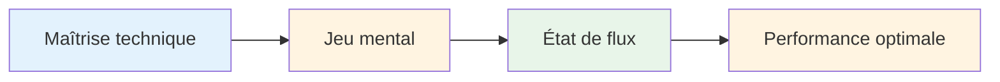

# Nouvelles

## Bienvenue à l&#39;Académie de Pétanque

::: tip Lancement exceptionnel ! 🎉
**C&#39;est la première startup !**

Nous sommes ravis de lancer la Pétanque Academy, une nouvelle initiative dédiée à aider les joueurs de pétanque d&#39;élite à atteindre leur plein potentiel.
:::

```mermaid
graph TD
    A[Lancement de l&#39;Académie de Pétanque] --> B[Plateforme éducative]
    A --> C[Programme d&#39;atelier]
    A --> D[Développement communautaire]

    B --> E[Contenu du jeu mental]
    B --> F[Guides nutritionnels]
    B --> G[Méthodes de formation]

    C --> H[Forums des joueurs d&#39;élite]
    C --> I[Apprentissage par les pairs]

    D --> J[Croissance partagée]

    style A fill:#fff4e1
    style B fill:#e3f2fd
    style C fill:#e8f5e9
    style D fill:#f3e5f5
```

## Ce qui arrive

::: info Restez à l&#39;écoute pour
- 📅 **Ateliers à venir** - Séances en petits groupes pour joueurs d&#39;élite
- 📚 **Nouveau contenu pédagogique** - Préparation mentale, nutrition, méthodes d&#39;entraînement
- 🎯 **Événements communautaires** - Rencontrez des joueurs partageant les mêmes centres d&#39;intérêt
- 💡 **Témoignages et avis de joueurs** - Apprenez des expériences des autres
:::

## Notre mission

::: tip Le niveau suivant
Les joueurs d&#39;élite maîtrisent déjà la technique. La prochaine étape cruciale réside dans le mental : apprendre à atteindre des états de flow, à gérer la pression et à performer de manière constante à son meilleur niveau.
:::

## Commencer

En attendant les annonces concernant les ateliers, explorez notre section complète sur l&#39;éducation :

| Section | Ce que vous apprendrez | Commencez ici |
|---------|-------------------|------------|
| **La Zone** | Comment entrer de manière constante dans des états de flow ? | [Comprendre le flux](/en/education/the-zone/) |
| **Force mentale** | Gérer la pression et instaurer des routines | [Jeu mental](/en/education/mental-strength/) |
| **Pleine conscience** | Conscience du moment présent pour la performance | [Pratique de la pleine conscience](/en/education/mindfulness/) |
| **Nutrition** | Nourrissez votre cerveau pour une concentration stable. | [Nutrition de précision](/en/education/nutrition/) |
| **Objectifs** | Définir et atteindre des objectifs significatifs | [Fixation d&#39;objectifs](/en/education/goals/) |

::: info Rejoignez le voyage
Ce n&#39;est que le début. Nous créons quelque chose d&#39;exceptionnel pour les joueurs d&#39;élite qui souhaitent franchir un cap. Bienvenue à la Pétanque Academy.
:::

