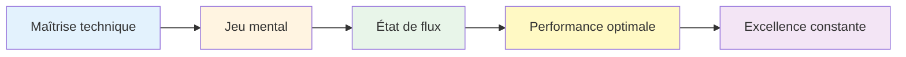

# Actualités et mises à jour

<AdBanner />

## Bienvenue à l&#39;Académie de Pétanque

::: tip Plateforme désormais en ligne ! 🎉
**L&#39;Académie de Pétanque est désormais pleinement opérationnelle !**

Nous avons lancé une plateforme complète dédiée à aider les joueurs de pétanque d&#39;élite à atteindre leur plein potentiel grâce à la maîtrise mentale du jeu, un entraînement structuré et des outils pratiques.
:::

<AdInArticle />

```mermaid
graph TD
    A[Pétanque Academy] --> B[Plateforme éducative]
    A --> C[Outils de formation]
    A --> D[Programmes d&#39;ateliers]

    B --> E[8 modules complets]
    B --> F[Maîtrise mentale du jeu]
    B --> G[Fondements techniques]

    C --> H[Modèles d&#39;objectifs]
    C --> I[Modèles de journal intime]
    C --> J[Plans de formation]

    D --> K[Forums des joueurs d&#39;élite]
    D --> L[camps d&#39;entraînement]

    style A fill:#fff4e1
    style B fill:#e3f2fd
    style C fill:#e8f5e9
    style D fill:#f3e5f5
```

## Ce qui est disponible maintenant

### 📚 Plateforme éducative complète

Nous avons lancé **8 modules de formation complets** couvrant tous les sujets, des états de flow à la nutrition :

| Module | Contenu | Caractéristiques principales |
|--------|---------------|--------------|
| **[La Zone](/en/education/the-zone/)** | maîtrise de l&#39;état de flow | 4 guides détaillés sur l&#39;entrée et le maintien du flux |
| **[Force mentale](/en/education/mental-strength/)** | Gestion de la pression | Routines avant le tournage, gestion de la critique intérieure |
| **[Pleine conscience](/en/education/mindfulness/)** | conscience du moment présent | Entraînements quotidiens, techniques de compétition |
| **[Objectifs](/fr/education/goals/)** | planification stratégique | Objectifs SMART, hiérarchie, systèmes de suivi |
| **[Tactiques](/en/education/tactics/)** | Stratégie de jeu | Prise de décision, probabilité, positionnement |
| **[Esprit d&#39;équipe](/en/education/team-player/)** | compétences en collaboration | Communication, confiance, dynamique d&#39;équipe |
| **[Formation](/en/education/training/)** | Méthodes pratiques | Exercices, pratique délibérée, progression |
| **[Nutrition](/en/education/nutrition/)** | Carburant de performance | Gestion de la glycémie, nutrition de compétition |

### 🛠️ Outils pratiques

**Modèles et programmes prêts à l&#39;emploi :**

- **Atelier** (/en/workshop) - Séances structurées de 3 heures pour le développement mental du jeu
- **[Stage d&#39;entraînement](/en/training-camp)** - Programmes intensifs de fin de semaine pour joueurs d&#39;élite
- **[Séance de formation](/en/training-session)** - Cadres de pratique de 2 à 3 heures
- **[Modèle d&#39;objectif](/en/goal-template)** - Système complet de définition et de suivi des objectifs
- **[Modèle de journal](/en/diary-template)** - Journal de pratique et de réflexion quotidienne

### 🎯 Assistance technique

La section **[Conseils techniques](/en/technical/)** comprend :
- Guide complet de tous les lancers de pétanque
- Stratégies de sélection de trajectoire
- Techniques de contrôle de la rotation
- cadres de sélection de plans

### 🍽️ Nutrition pour la performance

**[Food](/en/food)** - Guide complet de :
- Gestion de la glycémie pour une concentration stable
- Stratégies nutritionnelles pré-compétition
- Optimisation énergétique pour les tournois

### 📝 Articles et analyses

**NOUVEAU : 14 articles approfondis** couvrant divers sujets liés au mental dans le jeu :

| Catégorie | Articles |
|----------|----------|
| **Comprendre la voix critique intérieure** | [Le critique intérieur](/en/blog/inner-critic) - Maîtrisez votre dialogue intérieur |
| **Élaboration de routines d&#39;avant-prise de vue** | [Routines de pré-prise de vue](/en/blog/pre-shot-routines) - Créer de la cohérence |
| **Gestion de la pression** | Gestion de la pression - Performance sous pression |
| **Psychologie de la performance** | [États de flow](/en/blog/flow-state-science) • [Pleine conscience](/en/blog/mindfulness-competition) • [Fixation d&#39;objectifs](/en/blog/elite-goal-setting) • [Résilience mentale](/en/blog/mental-resilience) |
| **Dynamique d&#39;équipe** | Communication d&#39;équipe • Cohésion d&#39;équipe • Leadership |
| **Formation et perfectionnement** | [Erreurs d&#39;entraînement mental](/en/blog/mental-training-mistakes) • [Structure de l&#39;entraînement](/en/blog/practice-structure) • [Préparation à la compétition](/en/blog/competition-prep) |

➡️ **[Parcourir tous les articles](/en/blog/)**

### 📖 Ressources

**Études de cas et témoignages :**

- **Études de cas** - Exemples concrets de joueurs de haut niveau utilisant l&#39;entraînement mental
- **[Témoignages](/en/testimonials)** - Retours de joueurs ayant mis en œuvre ces méthodes

## Notre mission

::: tip Le niveau suivant
Les joueurs d&#39;élite maîtrisent déjà la technique. La prochaine étape cruciale réside dans le **mental** : apprendre à atteindre des états de flow, à gérer la pression et à performer de manière constante à son meilleur niveau.

**L&#39;Académie de Pétanque fournit la feuille de route complète.**
:::

## Statistiques de la plateforme

::: info Ce que nous avons construit
- ✅ **8 modules de formation** avec plus de 30 guides détaillés
- ✅ **5 outils pratiques** prêts à l&#39;emploi
- ✅ **10 langues** - accessible dans le monde entier
- ✅ **Plus de 100 pages** de contenu de haut niveau
- ✅ **Schémas de sirènes** pour un apprentissage visuel
- ✅ **Modèles à copier-coller** pour une utilisation immédiate
:::

## Comment débuter

### Pour les nouveaux visiteurs

**Commencez par les fondamentaux :**

1. **[Ambition](/en/ambition)** - Comprendre la philosophie qui sous-tend le développement des élites
2. **[La Zone](/en/education/the-zone/)** - Découvrez les états de flow
3. **[Modèle d&#39;objectif](/en/goal-template)** - Définissez vos premiers objectifs structurés

### Pour les joueurs expérimentés

**Approfondissez les sujets avancés :**

1. **[Force mentale](/en/education/mental-strength/)** - Maîtriser les situations de pression
2. **[Tactiques](/en/education/tactics/)** - Améliorer la prise de décision stratégique
3. **Atelier** - Mettre en œuvre des séances structurées de préparation mentale

### Pour les équipes

**Développer l&#39;excellence collective :**

1. **[Esprit d&#39;équipe](/en/education/team-player/)** - Améliorer la dynamique d&#39;équipe
2. **[Training Camp](/en/training-camp)** - Organiser des stages intensifs de week-end
3. **[Séance de formation](/en/training-session)** - Pratiques de structuration d&#39;équipe

## Qu&#39;est-ce qui rend cela différent ?

::: warning Pourquoi l&#39;Académie de Pétanque se distingue
**La plupart des entraînements se concentrent sur la technique. Nous, nous nous concentrons sur ce dont les joueurs d&#39;élite ont réellement besoin :**

1. **Maîtrise mentale du jeu** - Le véritable facteur de différenciation à haut niveau
2. **Outils pratiques** - Pas seulement de la théorie, mais des modèles prêts à l&#39;emploi
3. **Programmes structurés** - Cadres clairs pour les ateliers et les camps
4. **Fondé sur des preuves** - S&#39;appuyant sur la psychologie du sport et la recherche sur l&#39;état de flow
5. **Conçu pour les joueurs d&#39;élite** - Destiné à ceux qui maîtrisent déjà les bases
:::

## Impliquez-vous

**Vous souhaitez contribuer ou donner votre avis ?**

Visitez notre page **[À propos](/en/about)** pour :
- Apprenez-en davantage sur la plateforme
- Partagez vos commentaires
- Demander un contenu spécifique
- Contactez-nous

---

::: tip Commencez votre voyage dès aujourd&#39;hui
Tout ce dont vous avez besoin pour faire passer votre jeu au niveau supérieur est déjà là. Choisissez un module, prenez un modèle et commencez à l&#39;implémenter.

**Bienvenue à l&#39;Académie de Pétanque - où les joueurs d&#39;élite deviennent exceptionnels.**
:::

<AdBanner />
