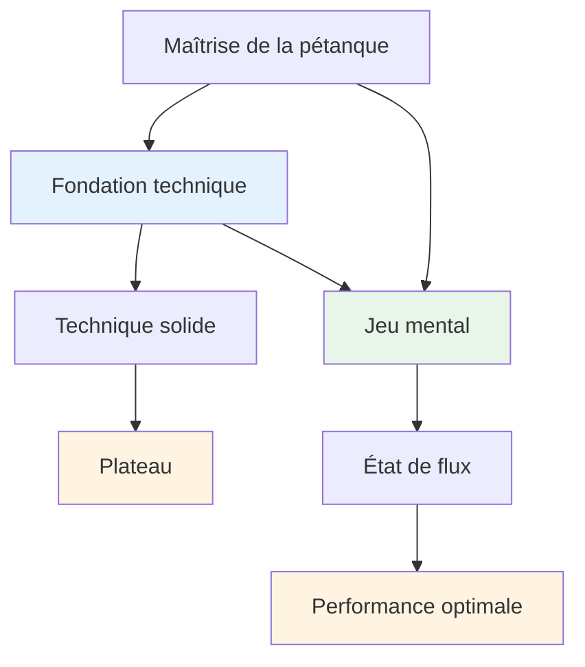

# Conseils techniques

## Note sur la technique

Bien que notre priorité soit l&#39;aspect mental et l&#39;état de flow, nous reconnaissons que la technique est le fondement sur lequel tout le reste repose.

::: info Notre philosophie
**La technique est la base, mais la fluidité est le plafond.** Il faut une technique solide pour atteindre le niveau d&#39;élite, mais c&#39;est la maîtrise mentale qui permet de le dépasser.
:::

## Notre perspective

::: tip Vous n&#39;avez pas besoin de tout maîtriser.
**Vous n’avez pas besoin de maîtriser toutes les techniques**, mais comprendre l’ensemble des possibilités vous aide à :

- ✅ Sachez ce qui est possible
- ✅ Faites des choix éclairés concernant les éléments à développer.
- ✅ Appréciez le jeu à un niveau plus profond
- ✅ Comprendre ce que les joueurs d&#39;élite peuvent faire
:::

```mermaid
graph LR
    A[Connaissances techniques] --> B[Des choix éclairés]
    B --> C[Développement ciblé]
    C --> D[Maîtrise des compétences clés]
    D --> E[Accès à l&#39;état du flux]

    style A fill:#e3f2fd
    style D fill:#e8f5e9
    style E fill:#fff4e1
```

::: info L&#39;objectif
Si vous avez une approche technique et souhaitez élargir votre répertoire, cette section décrit l&#39;objectif final : la palette complète des lancers disponibles pour un joueur de pétanque.

**N&#39;oubliez pas :** L&#39;objectif n&#39;est pas de tout maîtriser. Il s&#39;agit d&#39;acquérir suffisamment de bases techniques pour pouvoir entrer dans un état de concentration optimale et laisser votre corps choisir naturellement le bon lancer.
:::

## Sujets

### [Palette de lancers](/en/technical/throws)
Quelles sont toutes les techniques de lancer possibles ? Un aperçu complet des possibilités techniques en pétanque.

::: tip Après la technique, quelle est la prochaine étape ?
Une fois que vous maîtrisez la technique, la véritable progression provient de :
- **[La Zone](/en/education/the-zone/)** - Accéder aux états de flux
- **[Force mentale](/en/education/mental-strength/)** - Gérer la pression
- **[Méthodes de formation](/en/education/training/)** - Comment pratiquer efficacement
:::

