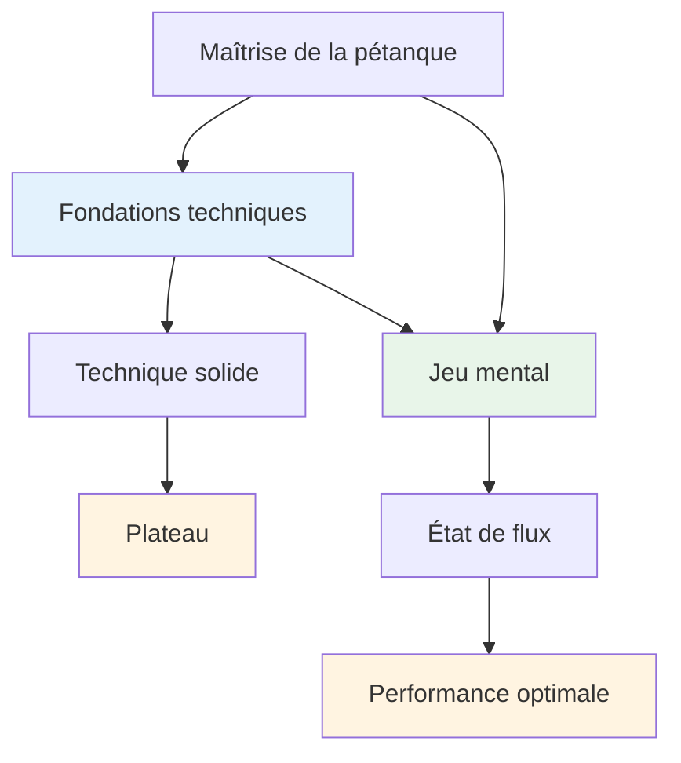

# Conseils techniques

## Note sur la technique

Bien que notre priorité soit l&#39;aspect mental et l&#39;état de flow, nous reconnaissons que la technique est le fondement sur lequel tout le reste repose.

::: info Notre philosophie
**La technique est la base, mais la fluidité est le plafond.** Il faut une technique solide pour atteindre le niveau d&#39;élite, mais c&#39;est la maîtrise mentale qui permet de le dépasser.
:::

## L&#39;erreur la plus fréquente en formation technique

::: info Cette section est réservée aux joueurs expérimentés.
Si vous débutez à la pétanque, vous devrez naturellement développer votre technique de base à partir de zéro — et c&#39;est un tout autre parcours.

**Ce conseil s&#39;adresse aux joueurs expérimentés qui pratiquent depuis des années et qui possèdent déjà une technique bien rodée, naturelle, fluide et fiable. Vous avez trouvé votre style de lancer. La question est maintenant : comment progresser ?
:::

::: warning Le piège commun
Quand des joueurs expérimentés veulent progresser, ils reviennent souvent aux fondamentaux : ajustement de la prise, du mouvement du bras, du point de relâchement, de la position du corps. Des heures d’entraînement. Des ajustements sans fin.

**Mais ils ont passé sous silence la question la plus importante :** Que voulez-vous exactement que la boule fasse ?
:::

Avant de modifier votre technique, vous devez définir clairement le **résultat** que vous souhaitez obtenir. Il ne s&#39;agit pas de dire « Je veux frapper plus souvent » ou « Je veux être plus régulier » : ce ne sont pas des résultats, ce sont des souhaits.

Voici un résultat concret :
- « Je veux un lob en cloche qui s&#39;arrête à moins de 20 cm de son point d&#39;impact. »
- « Je veux un plan en mouvement qui décrit une courbe vers la gauche sur ce type de terrain. »
- « Je veux un tir doux devant qui effleure à peine la boule cible. »

**Commencez par explorer la [Palette de projections](/fr/technical/throws)** pour comprendre les possibilités. Ensuite, choisissez la projection spécifique que vous souhaitez ajouter à votre répertoire. Ce n&#39;est qu&#39;après cela que vous pourrez commencer à travailler sur les mouvements de votre bras, de votre poignet et de votre corps nécessaires pour obtenir ce résultat.

## La bonne méthode pour travailler la technique

Nous ne disons pas qu&#39;il ne faut jamais travailler son bras, son poignet, son lâcher ou sa position corporelle. **Le travail technique sur l&#39;exécution est tout à fait valable**, mais il doit avoir le bon objectif.

::: info La finalité appropriée des travaux techniques
**Objectif correct :** "Je veux ajouter un nouveau lancer à ma palette"

**Objectif erroné :** "Je veux réussir plus de tirs" ou "Je veux être plus régulier"
:::

Voici le processus :

1. **Explorez la [Palette de projections](/fr/technical/throws)** — Identifiez la projection ou la technique que vous souhaitez ajouter à votre répertoire
2. **Visualisez le résultat** — Que doit faire la boule ? Quelle trajectoire, quel atterrissage, quelle rotation et quel comportement sont nécessaires ?
3. **Ensuite, travaillez l&#39;exécution** — Vous pouvez maintenant vous concentrer sur le bras, le poignet, la position du corps et le relâchement pour atteindre ce résultat précis.

Cette approche donne à votre formation technique une direction claire et des progrès mesurables. Vous ne vous contentez pas de « pratiquer », vous développez délibérément vos compétences.

::: tip Exemple : Ajouter une plombée
**Objectif :** Ajouter un amorti (plombée) à votre répertoire de coups de pointe

**Visualisation du résultat :** La boule doit décrire une haute trajectoire, atterrir en douceur avec un effet rétro et s’arrêter presque immédiatement.

**Points techniques :** Point de relâchement plus haut, mouvement du poignet plus ample pour le backspin, grip plus souple

**Critère de réussite :** Êtes-vous capable d’exécuter ce lancer quand vous le souhaitez ? C’est l’objectif.
:::

## Meilleurs tirs ou plus de tirs : comprendre la différence

Il existe une distinction cruciale que beaucoup de joueurs ignorent :

::: tip L&#39;idée clé
**Si vous voulez améliorer vos tirs** → Travaillez votre technique

**Si vous voulez réussir PLUS de tirs** → Travaillez votre force mentale
:::

### Qu&#39;est-ce que cela signifie?

**Pour réussir de meilleurs coups**, il faut élargir son répertoire technique :
- Ajout de nouveaux types de lancers (plombée, portée, demi-portée)
- Améliorer la précision sur des types de tirs spécifiques
- Développer de nouvelles compétences que vous ne possédez pas actuellement.
- **Cela nécessite une pratique technique et un entraînement physique.**

**Réussir plus de tirs** signifie exécuter ce que vous savez déjà faire :
- Réussir les coups que vous maîtrisez déjà à l&#39;entraînement
- Performance constante sous pression
- Faire confiance à sa technique quand c&#39;est important
- **Cela nécessite un entraînement mental et l&#39;accès à un état de flow.**

### Le bilan de la réalité

Posez-vous honnêtement la question suivante :
- Arrives-tu à réussir ce tir à l&#39;entraînement en étant détendu ? ✅ **Alors tu maîtrises la technique.**
- Vous avez du mal à vous démarquer en compétition ? ⚠️ **Alors vous avez besoin d’un travail mental, pas d’exercices techniques supplémentaires.**

::: warning Erreur courante
De nombreux joueurs expérimentés passent des années à perfectionner une technique qu&#39;ils possèdent déjà, alors que ce dont ils ont vraiment besoin, c&#39;est de développer la force mentale nécessaire pour l&#39;exécuter sous pression.

**Vous n&#39;avez pas besoin d&#39;un meilleur mouvement de bras. Vous avez besoin d&#39;un esprit plus calme.**
:::

### La voie à suivre

**Pour de meilleures prises de vue (nouvelles fonctionnalités) :**
- Explorez la [Palette de lancers](/fr/technical/throws)
- Choisissez un nouveau lancer spécifique à développer
- Pratiquer l&#39;exécution technique

**Pour plus de tirs (régularité sous pression) :**
- Travaillez sur votre [force mentale](/fr/education/mental-strength/)
- Apprenez à accéder à [La Zone](/fr/education/the-zone/)
- Développer des [routines de préparation au tir](/fr/education/mental-strength/pre-shot-routine)

## Notre perspective

::: tip Vous n&#39;avez pas besoin de tout maîtriser.
**Vous n’avez pas besoin de maîtriser toutes les techniques**, mais comprendre l’ensemble des possibilités vous aide à :

- ✅ Sachez ce qui est possible
- ✅ Faites des choix éclairés concernant les éléments à développer.
- ✅ Appréciez le jeu à un niveau plus profond
- ✅ Comprendre ce que les joueurs d&#39;élite peuvent faire
:::

```mermaid
graph LR
    A[Connaissances techniques] --> B[Des choix éclairés]
    B --> C[Développement ciblé]
    C --> D[Maîtrise des compétences clés]
    D --> E[Accès à l&#39;état du flux]

    style A fill:#e3f2fd
    style D fill:#e8f5e9
    style E fill:#fff4e1
```

::: info L&#39;objectif
Si vous avez une approche technique et souhaitez élargir votre répertoire, cette section décrit l&#39;objectif final : la palette complète des lancers disponibles pour un joueur de pétanque.

**N&#39;oubliez pas :** L&#39;objectif n&#39;est pas de tout maîtriser. Il s&#39;agit d&#39;acquérir suffisamment de bases techniques pour pouvoir entrer dans un état de concentration optimale et laisser votre corps choisir naturellement le bon lancer.
:::

## Sujets

### [Palette de lancers](/fr/technical/throws)
Quelles sont toutes les techniques de lancer possibles ? Un aperçu complet des possibilités techniques en pétanque.

::: tip Après la technique, quelle est la prochaine étape ?
Une fois que vous maîtrisez la technique, la véritable progression provient de :
- **[La Zone](/fr/education/the-zone/)** - Accéder aux états de flux
- **[Force mentale](/fr/education/mental-strength/)** - Gérer la pression
- **[Méthodes de formation](/fr/education/training/)** - Comment pratiquer efficacement
:::

