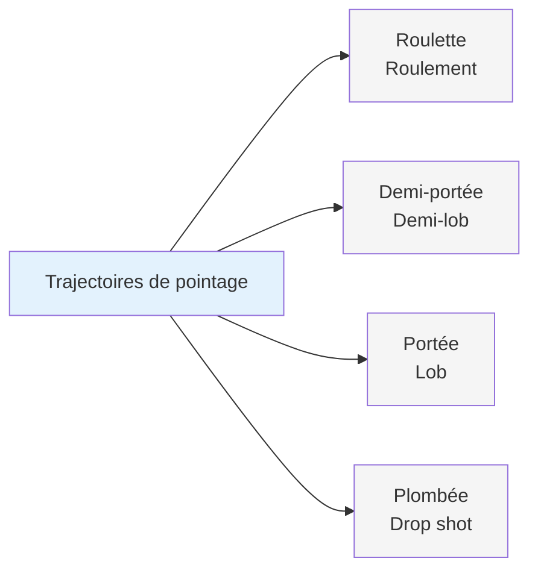
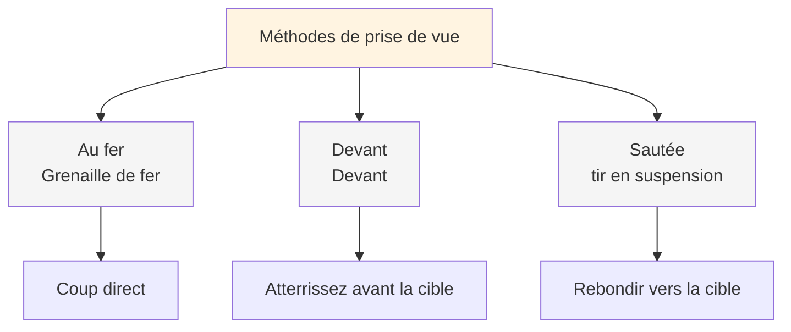
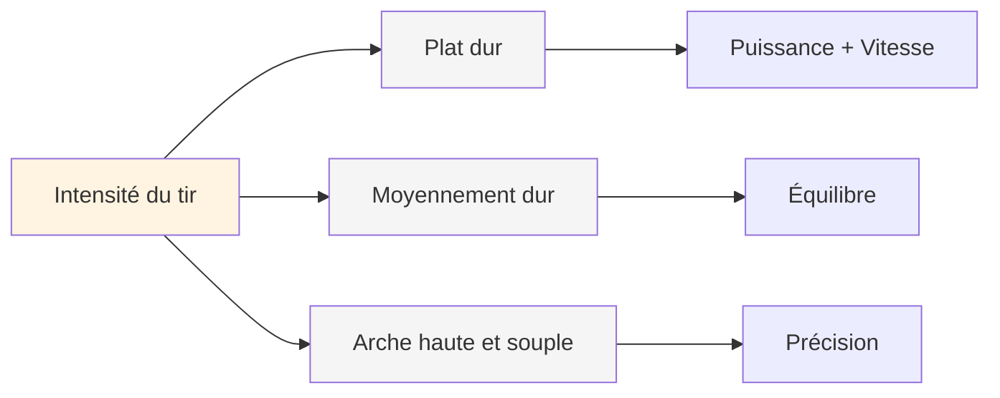
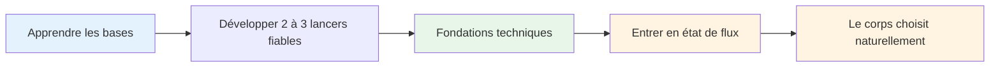

# Palette de jetés

## Le répertoire technique complet

Voici un aperçu des lancers possibles à la pétanque. Il n&#39;est pas nécessaire de tous les maîtriser, mais connaître leur existence permet de mieux appréhender le jeu dans son ensemble.

::: tip Le tableau d&#39;ensemble
**Comprendre l&#39;ensemble des possibilités vous aide à faire des choix éclairés sur les éléments à développer.** Vous n&#39;avez pas besoin de tout maîtriser : concentrez-vous sur ce qui fonctionne pour votre jeu.
:::

```mermaid
graph TD
    A[Lancers de pétanque] --> B[Pointer]
    A --> C[Tournage]

    B --> D[Par trajectoire]
    B --> E[Par Spin]

    C --> F[Par point d&#39;impact]
    C --> G[Par intensité]

    style A fill:#e8f5e9
    style B fill:#e3f2fd
    style C fill:#fff4e1
```

## Techniques de pointage

### Par trajectoire

| Lancer | Terme français | Trajectoire | Quand l&#39;utiliser |
|-------|-------------|------------|-------------|
| **Roulement** | Roulette | Bas, roule presque jusqu&#39;au bout | Terrain plat, courte distance |
| **Demi-lob** | Demi-portée | Moyen, atterrit à mi-chemin | Le plus courant, polyvalent |
| **Lob** | Portée | Haut, atterrit près de la cible | Obstacles, terrain accidenté |
| **Photo prise en chute libre** | Plombée | Très haut, chute verticale | Espaces restreints, placement précis |

### Par Spin

```mermaid
graph LR
    A[Contrôle de rotation] --> B[Retournement complet]
    A --> C[Demi-tour]
    A --> D[Sans rotation]

    B --> E[S&#39;arrête/Recule]
    C --> F[Roulis contrôlé]
    D --> G[Rouleau naturel]

    style A fill:#e8f5e9
    style B fill:#f5f5f5
    style C fill:#f5f5f5
    style D fill:#f5f5f5
```

| Type de rotation | Effet sur l&#39;atterrissage | Quand l&#39;utiliser |
|-----------|-------------------|-------------|
| **Effet rétro** | S&#39;arrête ou recule à l&#39;atterrissage | Il faut s&#39;arrêter rapidement, éviter de dépasser |
| **Demi-tour** | Effet rétro modéré, roulement contrôlé | Le plus polyvalent, le plus prévisible |
| **Sans rotation** | Roulement neutre et naturel à l&#39;atterrissage | Laissez le terrain dicter le rythme. |

## Techniques de tir

### Par point d&#39;impact

| Technique | Terme français | Point d&#39;impact | Caractéristiques |
|-----------|-------------|--------------|-----------------|
| **Coup de fer** | Au fer | Coup direct sur la boule | Contact le plus courant et propre |
| **Devant** | Devant | Atterrissage juste avant la cible | Plus sûr, moins de précision requise |
| **Saut** | Sautée | Rebondir vers la cible | Avancé, pour les obstacles |

### Par intensité

| Intensité | Trajectoire | Quand l&#39;utiliser |
|-----------|------------|-------------|
| **Coup dur à plat** | Direct, puissant, plat | Ligne claire, il faut de la distance à l&#39;impact |
| **Difficulté moyenne** | Puissance et contrôle équilibrés | Le plus polyvalent |
| **Souple avec une voûte plantaire prononcée** | Coup lobé, chute d&#39;en haut | Obstacles, espaces restreints |

## La palette complète

::: details Guide de référence rapide : Tous les lancers
**Pointage :**
- Roulette (roulant)
- Demi-portée (half-lob)
- Portée (lob)
- Plombée (drop shot)
- Rotation complète / Demi-rotation / Sans rotation

**Tournage:**
- Au fer (boule de fer)
- Devant (devant)
- Sautée (coup de pied sauté)
- Cambrure dure et plate / Moyenne / Souple et haute
:::

## Parcours de maîtrise

::: tip Souviens-toi
**L&#39;objectif n&#39;est pas de tout maîtriser.** Il s&#39;agit d&#39;avoir une base technique suffisante pour entrer dans la zone et laisser son corps choisir naturellement le bon lancer.

Se concentrer sur:
1. **2 à 3 techniques de pointage** sur lesquelles vous pouvez compter
2. **1 à 2 méthodes de prise de vue** qui vous conviennent
3. **Exécution constante** sous pression
4. **Jeu mental** pour accéder à l&#39;état de flow
:::

::: info Prochaines étapes
Une fois que vous maîtrisez la technique, la véritable progression provient de :
- **[La Zone](/en/education/the-zone/)** - Accéder aux états de flow de manière constante
- **[Méthodes de formation](/en/education/training/)** - Comment pratiquer efficacement
- **[Force mentale](/en/education/mental-strength/)** - Performance sous pression
:::

