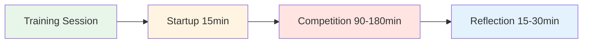

# Séance d&#39;entraînement : Guide pratique de la compétition


## Comment 4 joueurs peuvent s&#39;entraîner ensemble régulièrement

Ce guide explique comment créer un groupe d&#39;entraînement régulier de 4 joueurs qui s&#39;affrontent sur différentes surfaces et dans divers environnements pendant 2 à 4 heures. L&#39;objectif est de simuler une véritable compétition tout en développant la confiance en soi et les compétences mentales nécessaires à la performance.

::: tip La philosophie de la séance de formation
**La compétition sans réflexion, c&#39;est juste du jeu. L&#39;entraînement sans compétition, c&#39;est juste de la pratique.** Ce format combine les deux : s&#39;affronter intensément, puis réfléchir en profondeur.
:::



## Pourquoi 4 joueurs ?

**Le chiffre parfait :**
- **Format 2v2** - Reflet de la compétition réelle
- **Options de rotation** - Changer de partenaire, jouer en simple
- **Apprentissage entre pairs** - Styles de jeu diversifiés
- **Responsabilité** - Difficile d&#39;annuler pour 3 personnes
- **Intimité** - Assez petit pour un partage profond

::: info La dynamique de groupe
À quatre, on trouve l&#39;équilibre idéal entre l&#39;intensité de la compétition et la sécurité psychologique. On se mesure à l&#39;acharnement, mais on se soutient aussi mutuellement dans sa progression.
:::

## Trouver votre groupe

### Composition idéale du groupe

**Niveau de compétence :**
- Niveau similaire (à 1 ou 2 niveaux près)
- Tous engagés dans l&#39;amélioration
- Un mélange de pointeurs et de tireurs
- Différents styles de jeu

**État d&#39;esprit:**
- Exposée aux vulnérabilités
- Prêt à réfléchir
- Compétitif mais solidaire
- Axé sur la croissance

**Logistique:**
Ils habitent à moins de 30 minutes l&#39;un de l&#39;autre.
- Peut s&#39;engager à respecter un horaire régulier
- Disponibilité similaire

### Recruter votre groupe

**Où trouver des joueurs :**
- Les joueurs d&#39;élite de votre club
- Les habitués des tournois régionaux
- Communautés de pétanque en ligne
- Demandez des recommandations à votre entraîneur

**L&#39;invitation :**
« Je suis en train de constituer un petit groupe d&#39;entraînement de 4 joueurs qui souhaitent jouer régulièrement et travailler leur mental. On se retrouverait chaque semaine pendant 2 à 3 heures, on jouerait à fond, puis on réfléchirait à ce qu&#39;on a appris. Ça vous intéresse ? »

## Structure de la session

### Séance de 2 heures

| Heure | Activité | Durée |
|------|----------|----------|
| **Démarrage** | Enregistrement et configuration | 15 min |
| **Compétition** | Matchs 2v2 | 90 min |
| **Réflexion** | Débriefing et apprentissage | 15 min |

### Séance de 3 heures

| Heure | Activité | Durée |
|------|----------|----------|
| **Démarrage** | Enregistrement et configuration | 15 min |
| **Premier tour de compétition** | Matchs 2v2 | 60 min |
| **Pause** | Repos et discussion informelle | 15 min |
| **Deuxième manche de compétition** | Rotation des partenaires | 60 min |
| **Réflexion** | Débriefing approfondi | 30 min |

### Séance de 4 heures

| Heure | Activité | Durée |
|------|----------|----------|
| **Démarrage** | Enregistrement et configuration | 20 min |
| **Premier tour de compétition** | Matchs 2v2 | 75 min |
| **Pause** | Repos et collation | 15 min |
| **Deuxième manche de compétition** | Rotation des partenaires | 75 min |
| **Pause** | Repos | 10 min |
| **Troisième manche de compétition** | Simple ou défi | 45 min |
| **Réflexion** | Débriefing approfondi et planification | 30 min |


## Protocole de démarrage (15-20 minutes)

### 1. Installation physique (5 min)

**Choisissez le terrain :**
- Alterner les surfaces chaque semaine
- Varier la difficulté et les conditions
- Parfois, choisir intentionnellement un terrain inconfortable

**Aménagez l&#39;espace :**
- Délimitez clairement les frontières.
- Préparer les outils de mesure
- Station d&#39;eau
- Ombre si nécessaire

### 2. Bilan mental (10 min)

**Le cercle d&#39;enregistrement :**

Formez un cercle (pas de boules pour l&#39;instant) et tournez :

**Chaque personne partage :**
1. **Niveau d&#39;énergie** (1-10) : « Je suis à 7 aujourd&#39;hui »
2. **État mental** : « Je me sens concentré » ou « Je suis distrait par le stress au travail ».
3. **Intention** : « Aujourd&#39;hui, je veux travailler sur le fait de rester calme après des échecs. »

**Pourquoi c&#39;est important :**
- Sensibilise à l&#39;état mental
- Crée de l&#39;empathie au sein du groupe
- Définit l&#39;objectif individuel de la séance
- Cela normalise le fait d&#39;être « à la dérive » certains jours.

**Conseil pour l&#39;animateur :** Faites tourner l&#39;ordre de passage chaque semaine

### 3. Rappel des règles de base (5 min)

**À chaque séance, rappelez brièvement :**

::: tip Règles de base de la session
1. **Faites de votre mieux** - Jouez pour gagner, sans retenue
2. **Soutenir la croissance** - S&#39;entraider pour apprendre
3. **Respectez les manuels d&#39;utilisation** - Respectez les souhaits de chaque personne en matière de traitement.
4. **Restez attentif** - Pas de téléphone pendant le jeu
5. **Réfléchissez honnêtement** - Partagez ce qui se passe réellement en vous.
6. **Confidentialité** - Ce qui est partagé ici reste ici
:::

**L&#39;équilibre :**
« On est compétitifs comme dans un tournoi, mais on se soutient comme des coéquipiers. On est exigeants avec le jeu, mais indulgents envers les personnes. »

## Règles de conduite des compétitions

### Format de match

**Standard 2v2 :**
- Jouer jusqu&#39;à 13 points
- Règles standard de la pétanque
- Tenez un score honnête
- Mesurez lorsque c&#39;est nécessaire (ne devinez pas).

**Options de rotation :**

**Semaine 1 :** A+B contre C+D
**Semaine 2 :** A+C contre B+D
**Semaine 3 :** A+D contre B+C
**Semaine 4 :** Tournoi toutes rondes en simple

### Créer un environnement de compétition

::: warning critique : Rendez-le réel
**Il ne s&#39;agit pas d&#39;un entraînement anodin.** Considérez cela comme un tournoi :

✅ **À faire :**
- Conserver le score officiel
- Mesurer avec précision
- Signaler les fautes de pied
- Prenez-le au sérieux
- Célébrez les bons tirs
- Manifestez votre déception en cas d&#39;échec.

❌ **Ne faites pas :**
- Offrir des « secondes chances »
- Adoptez une attitude trop décontractée
Laissez passer les mauvaises décisions
- Blague pendant tout le match
- Trouvez des excuses
:::

### Le tournant de la performance mentale

**Suivre deux scores :**

1. **Score traditionnel** - Points gagnés
2. **Score de performance mentale** - Votre capacité à gérer votre jeu mental

**Critères de performance mentale (auto-évaluation de 1 à 5 après chaque match) :**

| Critère | 1 (Mauvais) | 3 (Bon) | 5 (Excellent) |
|-----------|----------|----------|---------------|
| **Rester présent** | S&#39;attarder sur les images passées | Principalement présent | Pleinement dans l&#39;instant présent |
| **Gérer sa critique intérieure** | Discours intérieur dur | Identifié et reformulé | Utiliser son coach intérieur |
| **Régulation émotionnelle** | Frustration visible | Calme général | Calme constant |
| **Partenaire pris en charge** | Ignoré ou blâmé | Assistance de base | Manuel d&#39;utilisation utilisé |
| **Concentration** | Distrait, manque de concentration | Plutôt concentré | Concentration maximale |

**Total :** /25 par match

**Pourquoi c&#39;est important :**
- Déplace l&#39;attention du résultat vers le processus
- Développe la conscience du jeu mental
- Crée une responsabilité pour le travail intérieur
- Célèbre la performance mentale, pas seulement la victoire

### Varier l&#39;environnement

**Alterner les défis :**

**Semaine 1 : Terrain d&#39;entraînement**
- Votre piste habituelle
- Conditions confortables
- Objectif : Renforcer la confiance

**Semaine 2 : Terrain difficile**
- Surface irrégulière et difficile
- Axe prioritaire : Régulation émotionnelle, acceptation

**Semaine 3 : Lieu différent**
- La piste d&#39;un autre club
- Axe prioritaire : Adaptabilité

**Semaine 4 : Conditions de pression**
- Spectateurs (inviter d&#39;autres personnes à regarder)
- Objectif : Gérer la pression externe

**Semaine 5 : Défi météo**
- Vent, chaleur ou froid
- Priorité : Force mentale

**Semaine 6 : Pression du temps**
- Chronomètre de tir (30 secondes par lancer)
- Objectif : Prise de décision sous pression

```mermaid
graph TD
    A[Vary Environment] --> B[Different Surfaces]
    A --> C[Different Locations]
    A --> D[Different Conditions]
    A --> E[Different Pressures]

    B --> F[Build Adaptability]
    C --> F
    D --> F
    E --> F

    style A fill:#e8f5e9
    style F fill:#fff4e1


## Reflection Protocol (15-30 minutes)

**Critical:** This is where the learning happens. Don't skip it!

### Short Reflection (15 min)

**After each game, quick debrief:**

**Go around the circle, each person shares:**

1. **Mental Performance Score** (1-5): "I give myself a 4 today"
2. **One thing that went well mentally**: "I stayed calm after my miss in the 3rd end"
3. **One thing to work on**: "I need to catch my inner critic faster"

**Group discussion:**
- "What did you notice about your inner game today?"
- "When did you feel most in the zone?"
- "When did you lose focus?"

### Deep Reflection (30 min)

**After final game, deeper debrief:**

**Structure:**

**1. Individual Journaling (5 min)**

Write privately:
- What happened in my mind during pressure moments?
- When did I use my Inner Coach vs. Inner Critic?
- How did I support my partner?
- What pattern am I noticing about myself?

**2. Pair Sharing (10 min)**

Partner up, share:
- One insight from journaling
- One question you're sitting with
- One commitment for next session

**3. Group Integration (15 min)**

Full circle:
- Each person shares ONE key learning
- Group identifies themes
- Discuss: "What are we learning as a group?"
- Set focus for next session

**Closing:**
- Thank each other for showing up
- Confirm next session date/time
- One-word check-out: "How are you leaving?"


## User Manual Integration

### Creating Your User Manuals

**In your first session together, each person completes:**

| Section | Prompt | Example |
|---------|--------|---------|
| **My Stress Signature** | "When I'm anxious, I..." | "...go completely quiet" |
| **How to Support Me** | "After a miss, I need..." | "...silence, not encouragement" |
| **My Trigger** | "I get defensive when..." | "...someone questions my shot choice" |
| **My Reset Signal** | "When I need a mental reset, I..." | "...touch my boules and take 3 breaths" |

**Share with the group and keep copies.**

### Using User Manuals During Play

**During competition:**
- Partner knows how to support you
- Teammates respect your needs
- No guessing about what helps

**Example:**
- Marc's User Manual says: "After a miss, I need 30 seconds of silence"
- His partner knows: Don't immediately encourage, give space
- Result: Marc feels understood, recovers faster

**This is psychological safety in action.**

## Advanced Variations

### The Mental Challenge Week

**Once a month, add a mental challenge:**

**Week 1: Silent Game**
- No talking during play
- Only non-verbal communication
- Focus: Internal awareness

**Week 2: Positive Self-Talk Only**
- Catch and reframe every negative thought
- Say Inner Coach phrase out loud
- Focus: Cognitive restructuring

**Week 3: Pressure Simulation**
- Play with spectators
- Announce score loudly
- Focus: External pressure management

**Week 4: Gratitude Game**
- After each end, state one thing you're grateful for
- Focus: Positive mindset

### The Vulnerability Round

**Every 4-6 weeks, dedicate a session to deeper sharing:**

**Format:**
- 30 min: Play one game
- 60 min: Deep reflection using [Workshop](./workshop) activities
- 30 min: Play final game applying insights

**Activities to use:**
- Fear in a Hat
- Reframing Inner Critic
- The Iceberg
- User Manual updates

**Why this matters:**
- Prevents the group from becoming just "playing buddies"
- Maintains psychological safety
- Deepens learning
- Builds authentic connection

## Tracking Progress

### Individual Tracking

**Keep a training journal:**

After each session, record:
- Date, location, conditions
- Partners and opponents
- Traditional score
- Mental performance score (1-5)
- Key insights
- Patterns noticed
- Commitments for next time

**Monthly review:**
- What's improving?
- What patterns keep showing up?
- What's my mental performance trend?
- What do I need to focus on?

### Group Tracking

**Shared document (Google Sheet):**

| Date | Location | Teams | Score | Mental Perf | Key Learning |
|------|----------|-------|-------|-------------|--------------|
| Jan 7 | Club A | A+B vs C+D | 13-11 | 4.2 avg | Staying calm in wind |
| Jan 14 | Club B | A+C vs B+D | 13-8 | 3.8 avg | Managing inner critic |

**Benefits:**
- See progress over time
- Notice group patterns
- Celebrate improvements
- Identify focus areas

## Sustaining the Group

### Commitment Agreement

**At the start, agree on:**

**Frequency:**
- Weekly? Bi-weekly? Monthly?
- Same day/time each week?
- How many sessions committed to? (suggest minimum 8-12)

**Cancellation Policy:**
- 24-hour notice required
- Maximum 2 cancellations per person per quarter
- If someone cancels repeatedly, have a conversation

**Rotation:**
- Who chooses location each week?
- Who facilitates reflection?
- How do we keep it fresh?

### Handling Conflicts

**When tension arises:**

::: warning Address It, Don't Avoid It
**The mistake:** Letting resentment build

**The solution:** Use it as a learning moment

**Script:**
> "I notice some tension. Can we pause and talk about what's happening? This is exactly the kind of moment we can learn from."
:::

**Common conflicts:**
- Disagreement on calls
- Perceived unfairness
- Personality clashes
- Competitive intensity

**Resolution process:**
1. Pause the game
2. Each person shares their perspective
3. Group validates both sides
4. Agree on how to move forward
5. Return to play

**This builds psychological safety.**

### Keeping It Fresh

**Avoid stagnation:**

**Every 8-12 weeks, change something:**
- Invite a 5th player for variety
- Play at a tournament together
- Do a mini training camp (full day)
- Bring in a guest coach
- Try a new format (singles, different scoring)
- Do a deep vulnerability session

**The goal:** Keep learning, keep growing, keep it interesting

## Integration with Tournaments

### Pre-Tournament Prep

**2 weeks before a major tournament:**

**Session focus:**
- Play on similar terrain
- Simulate tournament pressure
- Practice competition-day nutrition
- Rehearse pre-shot routines
- Visualize success

**Mental preparation:**
- What's your intention for the tournament?
- What's your Inner Coach phrase?
- What's your reset signal?
- How will you handle pressure?

### Post-Tournament Debrief

**After a tournament:**

**Dedicate a session to reflection:**

**Structure:**
- 30 min: Share tournament experience
- 30 min: What worked? What didn't?
- 30 min: What did you learn about yourself?
- 30 min: Play a game applying learnings

**Questions:**
- When did you feel most in the zone?
- When did you lose it?
- How did you handle pressure?
- What would you do differently?
- What are you proud of?

**This cements learning and builds resilience.**

## Resources & Tools

### From This Site

- [Workshop Guide](./workshop) - Deep facilitation protocols
- [Training Camp Guide](./training-camp) - Weekend intensive format
- [Nutrition](./education/nutrition/) - Competition-day protocols
- [Mental Strength](./education/mental-strength/) - Inner game concepts
- [Mindfulness](./education/mindfulness/) - Presence techniques
- [Tactics](./education/tactics/) - Strategic thinking

### Recommended Tools

**Journaling:**
- Physical notebook or digital app
- Prompt: "What happened in my mind today?"

**Video Analysis:**
- Phone camera on tripod
- Review technique and body language
- Notice patterns

**Meditation Apps:**
- Headspace, Calm, Insight Timer
- 5-10 minutes before sessions

**Tracking:**
- Google Sheets for group data
- Personal spreadsheet for trends

## Success Stories

### Example: The Stockholm Four

**Group:** 4 elite players, ages 28-45
**Frequency:** Weekly, 3 hours
**Duration:** 18 months

**Results:**
- All 4 improved tournament rankings
- 2 made national team
- Mental performance scores increased from 3.2 to 4.5 average
- Group still meets 3 years later

**Key factors:**
- Consistent commitment
- Deep vulnerability work
- Honest reflection
- Mutual support

### Example: The Barcelona Crew

**Group:** 4 club players wanting to compete regionally
**Frequency:** Bi-weekly, 2 hours
**Duration:** 6 months

**Results:**
- Confidence increased dramatically
- All 4 entered first regional tournament
- 1 placed in top 8
- Group expanded to 8 players

**Key factors:**
- Started small and built trust
- Focused on mental game
- Celebrated small wins
- Kept it fun

## Common Challenges

### "We just end up playing, not reflecting"

**Solution:**
- Set a timer
- Designate a "reflection keeper"
- Make reflection non-negotiable
- Start with just 10 minutes

### "One person dominates"

**Solution:**
- Use structured sharing (everyone gets 2 minutes)
- Rotate who speaks first
- Gently redirect: "Let's hear from others"

### "It's getting stale"

**Solution:**
- Change locations
- Try new formats
- Do a vulnerability session
- Invite a guest
- Take a break and come back fresh

### "Someone's not committed"

**Solution:**
- Have an honest conversation
- Revisit commitment agreement
- Consider finding a replacement
- It's okay if someone leaves

## Getting Started Checklist

::: details Your First Session Checklist

**Before Session 1:**
- [ ] Find your 4 players
- [ ] Agree on frequency and duration
- [ ] Choose first location
- [ ] Share this guide with everyone
- [ ] Create group chat

**Session 1 Agenda:**
- [ ] Introductions and intentions
- [ ] Agree on ground rules
- [ ] Complete User Manuals
- [ ] Play first game
- [ ] Short reflection
- [ ] Schedule next 4 sessions

**Ongoing:**
- [ ] Rotate locations
- [ ] Track progress
- [ ] Deep reflection every 4-6 weeks
- [ ] Adjust format as needed
- [ ] Celebrate improvements
:::

## Final Thoughts

::: tip The Power of Regular Practice
**Consistency beats intensity.** Four players meeting regularly, competing hard, and reflecting deeply will improve faster than sporadic tournament play alone.

**Why?**
- Regular feedback loop
- Psychological safety to experiment
- Accountability and support
- Deliberate practice on mental game
- Community and connection

**The result:** You don't just get better at pétanque. You become a more complete competitor.
:::


