# Atelier

## Forums pour joueurs d&#39;élite

Nos ateliers sont des forums intimes où les joueurs d&#39;élite partagent leurs expériences et ouvrent leurs réflexions intimes sur le jeu, la performance et les défis mentaux.

::: tip Ce qui rend nos ateliers différents
**Des petits groupes triés sur le volet de joueurs d&#39;élite, dans un espace sûr pour des discussions franches.** Il ne s&#39;agit pas d&#39;un cours magistral, mais d&#39;une expérience d&#39;apprentissage entre pairs où vous partagez, apprenez et progressez ensemble.
:::

```mermaid
graph LR
    A[Parcours d&#39;atelier] --> B[Rencontre IRL]
    B --> C[Instaurer la confiance]
    C --> D[Séances en ligne]
    D --> E[Soutien continu]
    E --> F[Croissance continue]

    style A fill:#e3f2fd
    style B fill:#fff4e1
    style C fill:#e8f5e9
    style D fill:#e3f2fd
    style E fill:#f3e5f5
    style F fill:#e8f5e9
```

## Format

### Petits groupes
::: info Taille du groupe
- **6 à 8 joueurs** par atelier
- Des groupes soigneusement constitués pour une dynamique optimale
- Un espace sûr pour des discussions honnêtes
- Chacun contribue, chacun apprend
:::

### Approche hybride

```mermaid
graph TD
    A[Format d&#39;atelier] --> B[Phase 1 : En présentiel]
    A --> C[Phase 2 : En ligne]

    B --> D[Instaurer la confiance]
    B --> E[Établir la dynamique]
    B --> F[Se fixer des objectifs]

    C --> G[Contrôles réguliers]
    C --> H[Partage continu]
    C --> I[Horaires flexibles]

    style A fill:#e8f5e9
    style B fill:#fff4e1
    style C fill:#e3f2fd
```

| Phase | Format | But | Avantages |
|-------|--------|---------|----------|
| **Première rencontre** | En personne (IRL) | Construire les fondations | Confiance, connexion, dynamique de groupe |
| **Séances en cours** | En ligne | Maintenir l&#39;élan | Soutien régulier, flexibilité, responsabilité |

::: details Phase 1 : Réunion en personne
**Pourquoi privilégier le présentiel dans un premier temps ?**
- Établissez la confiance et le lien en face à face
- Établir une dynamique de groupe et un climat de sécurité
- Définissez ensemble vos intentions et vos objectifs.
- Créer les bases d&#39;un partage honnête

**Ce qui se produit:**
- Présentations et définition des objectifs
- Exercices et discussions initiaux
- Établir des normes de groupe
- Établir des relations
:::

::: details Phase 2 : Séances en ligne
**Pourquoi un abonnement en ligne ?**
- Enregistrements réguliers sans déplacement
- Partage et soutien continus
- Horaires flexibles pour les joueurs occupés
- Maintenir la dynamique entre les réunions en présentiel

**Ce qui se produit:**
- Mises à jour et défis
- Soutien par les pairs et résolution de problèmes
- Contrôles de responsabilisation
- Apprentissage et développement continus
:::

## À quoi s&#39;attendre

### Sujets que nous explorons

| Zone | Se concentrer | Résultats |
|------|-------|----------|
| **Jeu mental** | État d&#39;écoulement, pression, mise au point | Performances optimales et constantes |
| **Défis personnels** | Peurs, blocages, frustrations | Percées et solutions |
| **Apprentissage par les pairs** | Expériences partagées | Nouvelles perspectives et idées |
| **Outils pratiques** | Techniques et exercices | Candidature immédiate |
| **Communauté** | Soutien continu | croissance à long terme |

::: tip Expérience d&#39;atelier
- 🧠 Discussions approfondies sur les aspects mentaux du jeu
- 💬 Partage d&#39;expériences et de défis personnels
- 🤝 Soutien et responsabilisation entre pairs
- 🛠️ Exercices et techniques pratiques
- 👥 Une communauté de joueurs engagés dans la croissance
:::

## Qui devrait participer ?

::: info Participants idéaux
- **Joueurs d&#39;élite** souhaitant franchir une nouvelle étape
- Les joueurs qui maîtrisent la technique mais qui veulent aller plus loin
- Ceux qui s&#39;intéressent au **jeu mental**
- Joueurs ouverts à une **réflexion personnelle honnête**
- Engagé dans le développement personnel
:::

::: warning Ne convient pas si
- Vous recherchez uniquement un coaching technique.
- Vous n&#39;êtes pas à l&#39;aise pour partager dans un groupe
- Tu n&#39;es pas prêt à être vulnérable
- Vous voulez des solutions rapides sans effort.
:::

## La valeur de l&#39;apprentissage entre pairs

```mermaid
graph TD
    A[Apprentissage par les pairs] --> B[Expériences partagées]
    A --> C[Perspectives multiples]
    A --> D[Soutien mutuel]

    B --> E[Vous n&#39;êtes pas seul]
    C --> F[Nouvelles perspectives]
    D --> G[Responsabilité]

    E --> H[Percée]
    F --> H
    G --> H

    style A fill:#e8f5e9
    style H fill:#fff4e1
```

::: tip Pourquoi les groupes de pairs fonctionnent
Les joueurs d&#39;élite font face à des défis uniques que les autres ne comprennent pas. Lors d&#39;un atelier, vous êtes entouré de personnes qui comprennent parfaitement la pression, les attentes et les luttes mentales. Cela crée un espace sécurisant propice à une véritable progression.
:::

## Prêt à nous rejoindre ?

::: info Prochaines étapes
Les ateliers sont annoncés dans notre section [Actualités](/en/news/). Consultez régulièrement cette page pour connaître les dates à venir et les modalités d&#39;inscription.
:::

