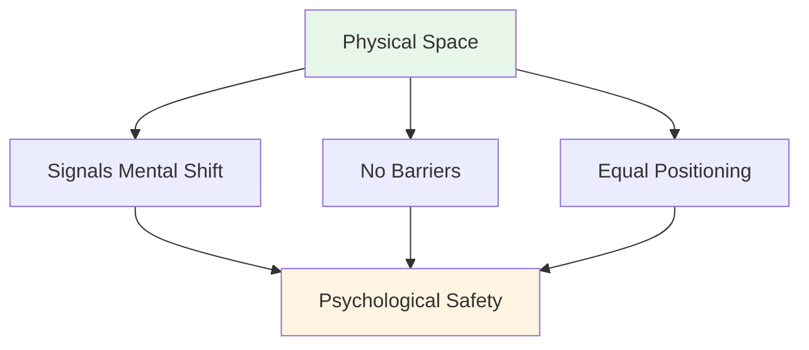
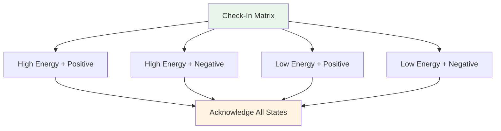
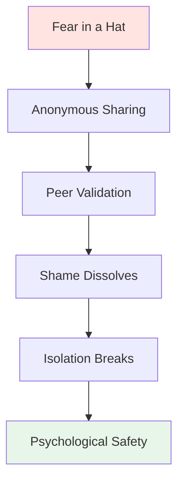

# Atelier : Guide de la séance théorique

<AdBanner />

## Guide complet pour les coordinateurs

Ce guide vous aide à animer un atelier théorique de 3 à 4 heures avec 6 à 8 joueurs de haut niveau. En tant que **coordinateur de la performance mentale (CPM)**, vous faciliterez des discussions approfondies sur l&#39;aspect mental du jeu, instaurant un climat de confiance propice à une meilleure performance sur les pistes.

::: warning Concept critique
**Vous n&#39;êtes ni un coach technique ni un thérapeute.** Votre rôle est de faciliter un apprentissage basé sur la vulnérabilité qui aide les joueurs à comprendre le lien entre leurs pensées intérieures et leurs performances.
:::

## Préparation avant l&#39;atelier

### Le rôle du coordinateur

::: info Vos responsabilités
- **Facilitez, ne faites pas de cours magistral** - Vous guidez la discussion, vous n&#39;enseignez pas de technique
- **Créer un espace sûr** - Instaurer et maintenir un climat de confiance psychologique
- **Faire le lien entre la théorie et la pratique** - Relier le contenu du site web à l&#39;expérience intérieure
- **Surveillez la dynamique du groupe** - Observez qui est impliqué, qui est réticent
- **Maintenir ses limites** - Savoir quand faire appel à un professionnel
:::

### Compétences essentielles

| Compétence | Définition | Développement |
|------------|---------------|----------------|
| **Intelligence émotionnelle** | Détecter les micro-expressions de malaise | Pratiquer l&#39;observation active |
| **Autorité neutre** | Inspirer le respect sans pouvoir technique | Établir sa crédibilité par sa présence |
| **Contexte sportif** | Comprendre les mécanismes de pression | Apprendre la terminologie et la culture de la pétanque |
| **Aïkido verbal** | Alignez-vous avec la résistance, ne la combattez pas | Pratiquez une communication non défensive |

::: details Termes clés de pétanque à connaître
- **Carré** - Coup parfait qui déplace la boule adverse
- **Bibber** - Le « yips » - tremblement involontaire lors de la libération
- **Donnée** - Le « donné » - accepter le terrain tel qu&#39;il est
- **Portée** - Lancer sans rebond
- **Roulette** - Tir roulant
- **Cochonnet** - La boule cible (cochon)
:::

## Configuration physique : Le cercle magique

### Exigences relatives à l&#39;emplacement

::: warning Configuration critique
**Choisissez un espace neutre, loin des pistes.** Cela marque un passage de l&#39;effort physique à l&#39;effort mental.

Exigences:
- ✅ Insonorisé ou privé
- ✅ Température confortable
- ✅ Aucune distraction (téléphones éteints)
- ✅ Lumière naturelle si possible
- ✅ Séparé de la zone d&#39;entraînement
:::

### La configuration du cercle

**Sièges:**
- Un cercle parfait de chaises
- **PAS DE TABLES** - Les tables créent des barrières et masquent le langage corporel
- Toutes les chaises sont à la même hauteur (pas de positions électriques)
- Le coordinateur est assis au sein du cercle (et non devant).

**Artefacts du centre :**
- Placer les boules et le cochonnet au centre
- Ancre le travail dans le sport
- Un rappel visuel de notre objectif commun

## Structure de la session (3-4 heures)

### Phase 1 : Fondations (60 minutes)

#### 1. Accueil et règles de base (15 min)

**Le contrat social :**

::: Conseils sur le conteneur - Règles de base essentielles
Avant tout partage, le groupe DOIT s&#39;entendre sur les points suivants :

1. **Confidentialité** - Ce qui est dit ici reste ici.
2. **La règle de Vegas** - Les leçons quittent la pièce, les histoires restent
3. **Interdiction de réparer** - Observez et comprenez, n&#39;essayez pas de résoudre
4. **Droit de passage** - La vulnérabilité ne peut être imposée
5. **Respectez le processus** - Faites confiance à l&#39;inconfort.
:::

**Votre script :**
« Bienvenue. Cet espace est différent de la piste. Ici, nous explorons ce qui se passe *à l&#39;intérieur* lorsque vous vous apprêtez à prendre cette photo. Tout ce qui est partagé ici est confidentiel. Les leçons que vous apprenez peuvent partir, mais les histoires personnelles restent. Vous n&#39;êtes pas là pour vous corriger les uns les autres, mais simplement pour comprendre. Et vous pouvez toujours passer votre tour. Êtes-vous tous d&#39;accord ? »

#### 2. Activité : La matrice de pointage (20 min)

**Objectif :** Normaliser le fait d&#39;admettre sa fatigue ou son stress

**Matériel :** Tableau blanc ou paperboard, post-it

**Procédure:**
1. Dessinez une matrice 2x2 : Énergie élevée/faible (verticale), Positive/Négative (horizontale)
2. Chaque joueur écrit son nom sur un post-it.
3. Placer la note dans leur quadrant actuel
4. Discussion : « Nous avons trois personnes en état de « faible énergie/négatif ». Quel impact cela a-t-il sur notre séance d&#39;aujourd&#39;hui ? »

**Conseils pour l&#39;animation :**
- Ne considérez aucun quadrant comme « mauvais ».
- Demandez-vous : « De quoi votre corps a-t-il besoin en ce moment ? »
- Observez les schémas : « Vous êtes trois au même endroit, qu&#39;est-ce que cela signifie ? »

#### 3. Activité : L&#39;iceberg de la pétanque (25 min)

**Objectif :** Visualiser les pensées intérieures cachées

**Matériel :** Grande feuille de papier, marqueurs

**Procédure:**
1. Dessinez un iceberg sur une feuille de papier.
2. **Hors de l&#39;eau :** Écrivez « Technique, Le lancer, Le résultat »
3. **Sous l&#39;eau :** Demandez : « Que se passe-t-il dans votre esprit que personne ne voit ? »

**Invites :**
- « De quoi as-tu peur quand tu t&#39;avances pour tirer ? »
- « Quel jugement vous inquiète ? »
- « Que dit votre voix intérieure lorsque vous ratez votre coup ? »

**La question essentielle :**
« Que se passe-t-il pour votre bras lanceur lorsque les éléments &quot;sous-marins&quot; deviennent trop lourds ? »

Cela relie la charge mentale à la tension physique (le bibber/yips).

::: details Réponses courantes « Sous l&#39;eau »
- La peur de décevoir l&#39;équipe
- Inquiétez-vous d&#39;avoir l&#39;air stupide
- Doute sur les capacités
- Comparaison avec d&#39;autres
- La pression de faire ses preuves
- La peur du jugement de l&#39;entraîneur/des coéquipiers
- Syndrome de l&#39;imposteur
:::

<AdInArticle />

### Phase 2 : Travail en profondeur (90 minutes)

#### 4. Activité : Le manuel d&#39;utilisation (30 min)

**Objectif :** Mettre en œuvre l&#39;empathie – aider les membres de l&#39;équipe à se comprendre.

**Matériel :** Feuilles de travail (une par joueur)

**Modèle de manuel d&#39;utilisation :**

| Section | Invite | Exemple |
|---------|--------|---------|
| **Ma signature de stress** | « Quand je suis anxieux, je... » | « ...deviens complètement silencieux » |
| **Comment me gérer** | « Quand je rate un tir crucial, j&#39;ai besoin de… » | « …de silence, pas d&#39;encouragements » |
| **Ma pensée intérieure** | « Le mensonge que je me raconte, c&#39;est… » | « …que je ne suis pas assez bien » |
| **Mon déclencheur** | « Je me mets sur la défensive quand… » | « …quelqu’un remet en question mon choix de tir » |

**Procédure:**
1. Donnez aux joueurs 10 minutes pour terminer en silence.
2. Faites le tour du cercle - chaque personne partage UNE section
3. Les autres peuvent poser des questions de clarification (et non des conseils !)
4. Le coordinateur valide chaque action

**Script d&#39;animation :**
« Voici votre mode d&#39;emploi. Si votre coéquipier sait que vous vous taisez lorsque vous êtes anxieux, il ne le prendra pas mal. S&#39;il sait que vous avez besoin de silence après un échec, il n&#39;essaiera pas de vous « réparer ». C&#39;est ainsi que nous développons l&#39;intelligence collective. »

#### 5. Relier le contenu du site Web à la pensée intérieure (30 min)

**Objectif :** Faire le lien entre le contenu technique et l’expérience psychologique

Choisissez 2 à 3 sections sur le site web de l&#39;Académie et explorez le jeu intérieur :

**Exemple 1 : Technique – La prise et le relâchement**

**La question de la confiance :**
« Quand vous êtes à 12-12 dans un tournoi, votre main *ressent-elle* la technique décrite ? Est-ce la contraction musculaire ou la pensée « Ne la laisse pas tomber » qui modifie votre prise ? »

**Le micro-tremblement :**
« Qui ici ressent ce &quot;micro-frémissement&quot; d&#39;anxiété ? Quelle pensée intérieure le déclenche ? »

**Exemple 2 : Tactiques – Pointer vs. Tirer**

**Profil de risque :**
« Quand le guide dit « Tirez pour gagner », votre réaction est-elle l’excitation ou la crainte ? Qu’est-ce que cela vous révèle sur votre rapport au risque ? »

**L&#39;imposteur :**
« Vous arrive-t-il de viser alors que vous *savez* que vous devriez tirer, juste pour éviter la honte de rater votre cible ? Quel est le prix de cette sécurité ? »

**Exemple 3 : Nutrition – Jour de compétition**

**Le piège des aliments réconfortants :**
« Mangez-vous ce dont votre corps a besoin ou ce que votre anxiété réclame ? Comment faites-vous la différence ? »

::: tip Technique de facilitation
Ne faites pas la leçon sur le contenu. Posez des questions qui relient les informations techniques à leur expérience vécue. La compréhension vient d&#39;EUX, pas de vous.
:::

#### 6. Activité : La peur dans un chapeau (30 min)

**Objectif :** Rompre le cercle vicieux de l&#39;isolement – montrer que les pairs partagent de profondes insécurités

**Matériel :** Papier, stylo, chapeau/sac

**Procédure:**
1. Chacun écrit anonymement une peur profonde concernant sa carrière ou son équipe.
2. Pliez les papiers et mélangez-les dans le chapeau
3. Chaque joueur tire une note (qui n&#39;est pas la sienne).
4. Lisez-le à voix haute
5. Validez-le : « Je peux comprendre pourquoi quelqu’un ressentirait cela parce que… »

**Exemples de peurs :**
- « J&#39;ai bien peur d&#39;avoir atteint mon apogée et de ne jamais m&#39;améliorer. »
- « J&#39;ai peur que mes coéquipiers pensent que je suis surcoté. »
- « J&#39;ai peur de craquer au moment crucial »
- « J&#39;ai peur d&#39;être remplacé par des joueurs plus jeunes »

**Le pouvoir :**
Lorsque les joueurs entendent leur peur secrète lue à voix haute et validée par leurs pairs, la honte disparaît. Ils réalisent : « Je ne suis pas seul. C&#39;est normal. »

**Rôle du coordonnateur :**
- Reconnaître que CHAQUE peur est légitime
Ne minimisez pas : dire « Ce n&#39;est pas vrai ! » invalide le sentiment.
- Demandez : « Combien d&#39;entre vous ont déjà ressenti quelque chose de similaire ? »

### Phase 3 : Intégration (45 minutes)

#### 7. Activité : Recadrer le critique intérieur (25 min)

**Objectif :** Restructuration cognitive – modifier le dialogue interne

**Matériel :** Feuille de travail

**Procédure:**

**Étape 1 : Identifier le critique (10 min)**
« Notez la phrase EXACTE que votre critique intérieure prononce après un échec. Pas la version polie, mais la version brutale. »

Exemples :
- &quot;Tu t&#39;étouffes toujours&quot;
- « Tout le monde te regarde échouer »
- « Tu te ridiculises »
- « Tu n&#39;as rien à faire ici »

**Étape 2 : Se repositionner comme un coach intérieur (10 min)**
« Maintenant, réécrivez cela comme si votre coach intérieur était ferme mais encourageant. »

Exemples :
- Critique : « Tu craques toujours » → Coach : « Reprends-toi et respire. Prochain tir. »
- Critique : « Tout le monde te regarde échouer » → Coach : « Concentre-toi sur l&#39;objectif, pas sur la foule »
- Critique : « Tu te ridiculises » → Coach : « Un tir à la fois. Tu as déjà fait ça. »

**Étape 3 : Exercices en binôme (5 min)**
« Partagez votre phrase de coach avec un partenaire. Il vous la rappellera lorsqu&#39;il verra le critique apparaître. »

#### 8. Transition vers la piste (20 min)

**Objectif :** Créer des protocoles opérationnels pour la compétition

**Questions à débattre :**
1. « Quelle est LA chose que vous avez apprise aujourd&#39;hui et que vous utiliserez lors de votre prochaine compétition ? »
2. « Comment vos coéquipiers sauront-ils que vous avez besoin de soutien ? »
3. « Quel est votre signal pour dire « J’ai besoin d’une réinitialisation mentale » ? »

**Créer des protocoles d&#39;équipe :**

| Situation | Protocole | Exemple |
|-----------|----------|---------|
| **Après un échec** | Consultez le manuel d&#39;utilisation | « Marc a besoin de silence, Lisa a besoin d&#39;un check » |
| **Vous vous sentez sous pression ?** | Utilisez la phrase du coach : « Reprenez-vous et respirez. »
| **Tensions au sein de l&#39;équipe** | Demande de temps mort | &quot;Prenons 2 minutes&quot; |
| **La voix intérieure critique est forte** | Réinitialisation physique | Toucher des boules, respirer profondément |

### Phase 4 : Clôture (15 minutes)

#### 9. Le départ (10 min)

**Procédure:**
On fait le tour du cercle, chacun partage :
1. **Ce que vous emportez :** « Quel outil ou quelle idée repartez-vous avec ? »
2. **Ce que vous laissez derrière vous :** « À quoi renoncez-vous ? »

**Rôle du coordonnateur :**
- Remercier chaque personne pour sa contribution
- Valider le travail effectué
- Rappel de la confidentialité

#### 10. Protocole de suivi (5 min)

::: warning critique : Prévenir les conséquences néfastes des vulnérabilités
Le travail en profondeur engendre une « gueule de bois de vulnérabilité » – des regrets ou de la honte à l&#39;idée de partager.

**Votre protocole sur 24 heures :**
- Envoyer un SMS à toute personne ayant beaucoup partagé au cours des dernières 24 heures
- Message : « Merci pour votre courage hier. Ce que vous avez partagé a été utile à tous. »
- Bilan : « Comment vous sentez-vous par rapport à la séance ? »
:::

**Conclusion :**
« Ce qui s&#39;est passé ici aujourd&#39;hui a demandé du courage. Vous étiez présents, vous vous êtes ouverts, vous avez fait confiance au processus. C&#39;est ce même courage que vous apporterez sur les pistes. N&#39;oubliez pas : les leçons quittent cette salle, mais les histoires restent. Merci. »

<AdInArticle />

## Résistance à la manutention

### L&#39;athlète « trop cool »

**Scénario :** Un joueur lève les yeux au ciel lors d&#39;un exercice de vulnérabilité

**Stratégie :** Aïkido verbal (Alignement et pivotement)

**Scénario:**
« Je vois bien ta réaction, [Nom]. Franchement, je comprends. Parler de ses sentiments, ça fait un peu facile. Mais la piste est inconfortable. Si on n&#39;arrive pas à supporter l&#39;inconfort de cette pièce, on ne s&#39;entraîne pas à supporter l&#39;inconfort du jeu. Tu peux me faire confiance pendant 20 minutes ? »

### Le participant silencieux

**Scénario :** Une personne n&#39;a pas parlé depuis 45 minutes.

**Stratégie :** Créer un point d&#39;entrée à faible risque

**Scénario:**
« [Nom], je remarque que tu assimiles tout cela. Qu&#39;est-ce qui te marque le plus jusqu&#39;à présent ? Même un seul mot. »

### Le/La trop-partageur(euse)

**Scénario :** Une personne domine la conversation avec de longs récits.

**Stratégie :** Redirection en douceur

**Scénario:**
« Merci, [Nom]. Je veux m&#39;assurer que chacun ait la parole. Donnons la parole à quelqu&#39;un qui ne s&#39;est pas encore exprimé. »

### Le Fixeur

**Scénario :** Une personne essaie de résoudre les problèmes des autres.

**Stratégie :** Renforcer les règles de base

**Scénario:**
« J’apprécie votre volonté d’aider, mais n’oubliez pas notre règle : observer et comprendre, ne pas réparer. [Intervenant initial], de quoi avez-vous besoin maintenant ? »

## Liste de vérification du matériel

::: details Matériel d&#39;atelier
**Configuration physique :**
- [ ] Chaises (6-8, pas de tables)
- [ ] Boules et cochonnet pour centre
- [ ] Tableau de conférence ou tableau blanc
- [ ] Marqueurs

**Activités:**
- [ ] Notes autocollantes (Matrice de pointage)
- [ ] Grand format (Activité Iceberg)
- [ ] Feuilles de travail du manuel d&#39;utilisation
- [ ] Papier et stylos (La peur dans un chapeau)
- [ ] Fiches de travail sur le critique intérieur/le coach

**Logistique:**
- [ ] Eau pour les participants
- [ ] Mouchoirs (travail émotionnel !)
- [ ] Minuteur (respect du planning)
- [ ] Liste de contacts des participants (pour le suivi)
:::

## Soins personnels du coordonnateur

::: warning : Vous avez aussi besoin d&#39;aide
Accueillir la vulnérabilité est exigeant émotionnellement.

**Après l&#39;atelier :**
- Faites le point avec un collègue ou un superviseur.
- Notez dans votre journal ce qui vous est venu à l&#39;esprit.
- Faites une promenade ou une pause physique
Ne ramenez pas leurs histoires à la maison.
:::

## Mesurer l&#39;impact

### Retour d&#39;information immédiat

À la fin, demandez :
1. « Sur une échelle de 1 à 10, à quel point vous êtes-vous senti(e) en sécurité en partageant aujourd&#39;hui ? »
2. « Qu&#39;est-ce qui pourrait améliorer la prochaine séance ? »

### Suivi à long terme

Suivi après 2 à 4 semaines :
- « Avez-vous utilisé des outils de l&#39;atelier ? »
- « Comment votre relation avec votre critique intérieure a-t-elle évolué ? »
- « Qu&#39;est-ce qui est différent dans votre état d&#39;esprit de compétition ? »

## Prochaines étapes

Conseil ::: Construire sur cette base
Cet atelier constitue la phase 1. À prendre en compte :
- **Séances de suivi** (en ligne ou en présentiel)
- **Intégration sur piste** (voir le guide des séances de formation)
- **Protocoles d&#39;équipe** (mise en œuvre des manuels d&#39;utilisation en compétition)
- **Suivis individuels** (pour les joueurs qui ont besoin de plus de soutien)
:::

<AdBanner />

