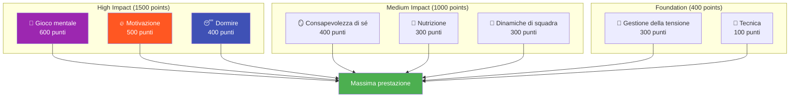

# Ambizione

La nostra missione è aiutare i giocatori d&#39;élite a compiere il passo successivo nel loro sviluppo.

::: tip La nostra visione
**Trasforma i giocatori d&#39;élite da tecnicamente competenti a mentalmente inarrestabili.** Utilizziamo un approccio basato sui dati per identificare le aree di miglioramento di maggiore impatto.
:::

## Il modello di prestazione a 8 fattori

La ricerca e l&#39;esperienza dimostrano che le prestazioni di un giocatore di bocce d&#39;élite dipendono da **8 fattori interconnessi**. La maggior parte dei giocatori investe eccessivamente nella tecnica, trascurando i fattori che effettivamente distinguono un giocatore bravo da uno eccellente.

### Perché la tecnica ha il peso più basso

::: warning La scomoda verità
**La tecnica conta solo 100 dei 2.900 punti totali** nel nostro modello.

Questo non perché la tecnica non sia importante, ma perché i giocatori d&#39;élite hanno già sviluppato una tecnica adeguata. Il miglioramento marginale derivante dal perfezionamento del rilascio è minimo rispetto all&#39;ottimizzazione del sonno, alla gestione della tensione o al rafforzamento della propria prestazione mentale.
:::

## Il principio del ROI

Non tutti i miglioramenti sono uguali. Utilizziamo calcoli del **Ritorno sull&#39;Investimento (ROI)** per identificare dove il tempo dedicato alla formazione avrà il maggiore impatto.

| Il tuo livello | Fattore Peso | Potenziale ROI |
|------------|---------------|---------------|
| Bassa abilità nell&#39;area ad alto peso | Alto (ad esempio, 600) | **Massimo** |
| Elevata abilità in aree ad alto peso | Alto (ad esempio, 600) | Basso (rendimenti decrescenti) |
| Scarsa abilità nell&#39;area del peso ridotto | Basso (ad esempio, 100) | Moderare |
| Elevata competenza nell&#39;area del peso ridotto | Basso (ad esempio, 100) | **Minimo** |

**Esempio:** Migliorare il sonno dal 30% al 60% (fattore di peso elevato, abilità attuale bassa) avrà probabilmente un impatto maggiore rispetto a migliorare la tecnica dal 75% all&#39;85% (fattore di peso basso, abilità già elevata).

## Gli 8 fattori spiegati

| Fattore | Peso | Cosa copre |
|--------|--------|----------------|
| 🧠 **Gioco mentale** | 600 | Modelli di pensiero, concentrazione, fiducia, accesso allo stato di flusso |
| 🔥 **Motivazione** | 500 | Spinta, scopo, orientamento agli obiettivi, persistenza |
| 😴 **Sonno e recupero** | 400 | Riposo di qualità, protocolli pre-gara, gestione dell&#39;energia |
| 🪞 **Consapevolezza di sé** | 400 | Percezione di sé accurata, riconoscimento dei punti ciechi, utilizzo del feedback |
| 🥗 **Nutrizione** | 300 | Stabilità della glicemia, idratazione, alimentazione per la competizione |
| 🤝 **Dinamiche di squadra** | 300 | Comunicazione, fiducia, chiarezza del ruolo, contributo del team |
| 💆 **Gestione della tensione** | 300 | Rilassamento fisico, controllo del respiro, eccitazione ottimale |
| 🎯 **Tecnica** | 100 | Meccanica fisica, repertorio di lanci, coerenza |

## Scopri il tuo percorso

Abbiamo creato uno **strumento di valutazione gratuito** che analizza i tuoi livelli attuali in tutti gli 8 fattori e calcola le tue priorità di miglioramento personalizzate.

::: info Fai la valutazione
**[→ Inizia la valutazione dello sviluppo del tuo giocatore](/it/valutazione/)**

In 5 minuti riceverai:
- Il tuo grafico radar su tutti gli 8 fattori
- Raccomandazioni classificate in base al ROI su cosa lavorare
- Link a contenuti didattici specifici per le tue massime priorità
- Opzione per ottenere feedback dai colleghi
:::

## Cosa offriamo

| Offerta | Descrizione | Collegamento |
|----------|-------------|------|
| **Strumento di valutazione** | Identifica le aree di miglioramento con il ROI più elevato | [Fai la valutazione](/it/valutazione/) |
| **Moduli didattici** | Contenuti approfonditi su tutti gli 8 fattori | [Sfoglia Istruzione](/it/istruzione/) |
| **Workshop** | Sessioni di 3-4 ore per gruppi di 6-8 giocatori | [Guida al workshop](/it/guides/workshop/) |
| **Campi di addestramento** | Corsi intensivi del fine settimana che uniscono teoria e pratica | [Guida al campo](/it/guide/campo-di-addestramento/) |

## Il nostro approccio

### 1. Valutare prima
Inizia con un&#39;autovalutazione onesta. Chiedi il feedback dei tuoi colleghi per individuare i tuoi punti deboli.

### 2. Dare priorità in base al ROI
Concentrati sui fattori che hanno un peso elevato e in cui hai spazio per crescere, non su ciò che ti fa sentire a tuo agio.

### 3. Impara la scienza
Capire *perché* qualcosa funziona, non solo *cosa* fare.

### 4. Pratica deliberatamente
Applica le tecniche in allenamento prima della gara. Costruisci abitudini, non solo conoscenze.

### 5. Rivalutare regolarmente
Tieni traccia dei tuoi progressi. Le tue priorità cambieranno man mano che migliorerai.

::: tip Pronti per il passo successivo?
**[→ Inizia con la valutazione](/it/valutazione/)** — È gratuita e richiede 5 minuti.

Oppure esplora la nostra sezione [Istruzione](/it/education/) per approfondire uno qualsiasi degli 8 fattori.
:::

