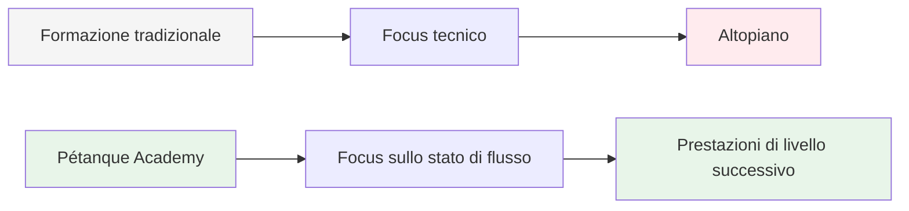

# Ambizione

<AdBanner />

La nostra missione è aiutare i giocatori d&#39;élite a compiere il passo successivo nel loro sviluppo.

::: tip La nostra visione
**Trasforma i giocatori d&#39;élite da tecnicamente competenti a mentalmente inarrestabili.** Ti aiutiamo ad accedere allo stato di fluidità in cui le bocce perfette diventano un&#39;espressione naturale della tua maestria.
:::

## Andare oltre la tecnica

L&#39;allenamento tradizionale si concentra molto sugli aspetti tecnici: la presa, la posizione, il rilascio. Sebbene questi fondamentali siano importanti, i giocatori d&#39;élite li hanno già padroneggiati.

::: info La svolta
**Il livello successivo non riguarda il perfezionamento della tecnica, ma l&#39;ingresso nello stato di flusso.**

Aiutiamo i giocatori a passare da una prospettiva di allenamento tecnico a una prospettiva di **flusso (nella zona)**, in cui le bocce perfette diventano un&#39;espressione naturale della loro padronanza piuttosto che uno sforzo consapevole.
:::

## Il viaggio

```mermaid
graph TD
    A[Giocatore d&#39;élite] --> B[Padronanza tecnica]
    B --> C{What's Next?}

    C --> D[Gioco mentale]
    C --> E[Stato di flusso]
    C --> F[Nutrizione]
    C --> G[Consapevolezza]

    D --> H[Massima prestazione]
    E --> H
    F --> H
    G --> H

    style A fill:#e3f2fd
    style B fill:#e8f5e9
    style H fill:#fff4e1
```

## Cosa offriamo

| Offerta | Descrizione | Impatto |
|----------|-------------|--------|
| **Workshop** | Piccoli gruppi di giocatori d&#39;élite (6-8) | Apprendimento e supporto tra pari approfonditi |
| **Istruzione** | Aspetti mentali delle prestazioni di punta | Tecniche pratiche che puoi utilizzare immediatamente |
| **Comunità** | Giocatori con idee simili che spingono oltre i limiti | Responsabilità e crescita condivisa |
| **Approccio olistico** | Nutrizione, mentalità e allenamento mentale | Ottimizzazione completa delle prestazioni |

::: tip Perché funziona
I giocatori d&#39;élite hanno già le basi tecniche. Ciò che distingue un bravo giocatore da un grande giocatore è la capacità di ottenere le massime prestazioni sotto pressione. È su questo che ci concentriamo.
:::

## Il nostro approccio

### 1. Allenamento dello stato di flusso
Impara a entrare &quot;nella zona&quot; in modo coerente, non per caso.

### 2. Forza mentale
Sviluppare routine, consapevolezza e gestione della pressione.

### 3. Nutrizione intelligente
Alimenta il tuo cervello per una concentrazione stabile e mani ferme.

### 4. Apprendimento tra pari
Condividi le tue esperienze con altri giocatori d&#39;élite in un ambiente sicuro e stimolante.

::: info Pronti per il passo successivo?
Esplora la nostra sezione [Formazione](/it/education/) o scopri di più sui nostri [Workshop](/it/workshop).
:::

<AdBanner />

