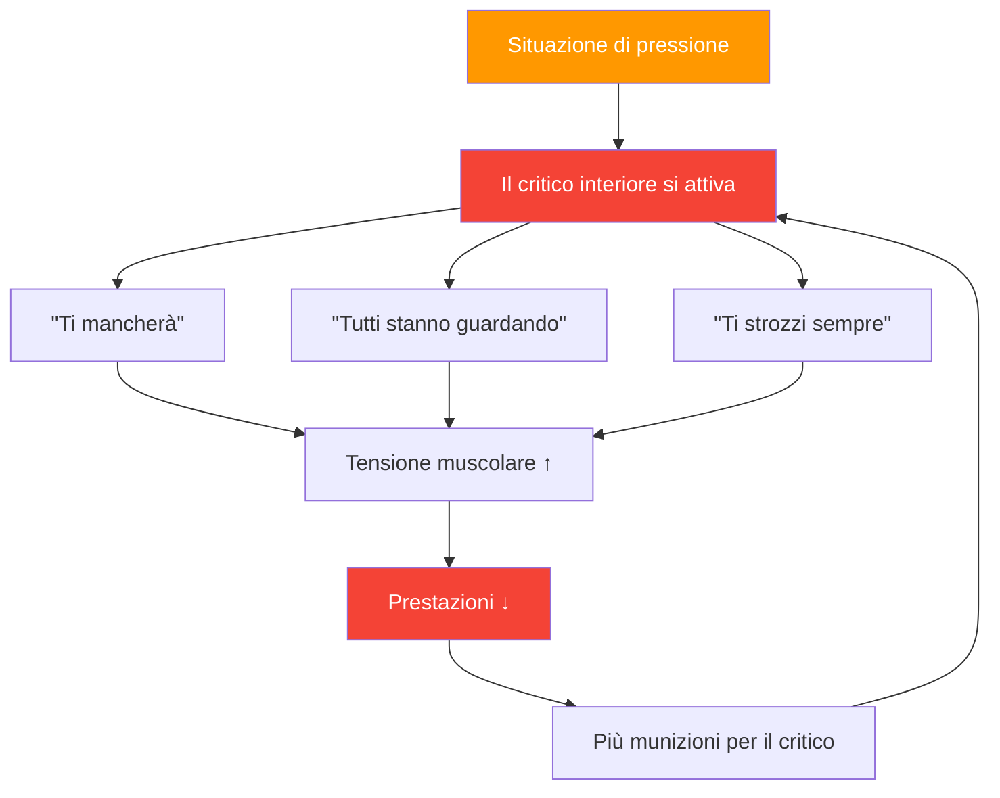

# Comprendere il critico interiore

> &quot;Ogni giocatore di pétanque conosce quella voce, quella che sussurra &#39;sbaglierai&#39; proprio mentre stai per lanciare.&quot;

Questo è il tuo critico interiore e imparare a gestirlo è essenziale per ottenere prestazioni d&#39;élite.

::: warning Il paradosso
**Il tuo critico interiore non sta cercando di farti del male**: è un tentativo maldestro di proteggerti. Ma questa &quot;protezione&quot; si trasforma in auto-sabotaggio.
:::

---

## Cos&#39;è il critico interiore?

Il critico interiore è quella voce interiore che giudica, critica e mina la tua sicurezza:

### Quando appare

| Momento | Il critico interiore dice |
|--------|-------------------|
| **Prima del tiro decisivo** | &quot;Tutti stanno guardando. Non rovinare tutto.&quot; |
| **Dopo un errore** | &quot;Sotto pressione soffochi sempre.&quot; |
| **Durante la serie di sconfitte** | &quot;Non sei abbastanza bravo per questo livello.&quot; |

## Riconoscere i propri schemi

Il primo passo è la consapevolezza. Inizia a notare quando si manifesta il tuo critico interiore:

### Fattori scatenanti comuni
- Situazioni di alta pressione (match point, tornei importanti)
- Dopo aver commesso un errore
- Quando gli avversari si comportano bene
- Quando i compagni di squadra sembrano frustrati
- Stanchezza o disagio fisico

### Messaggi comuni
- &quot;Non riesci a gestire la pressione&quot;
- &quot;Non sei bravo come loro&quot;
- &quot;Tutti ti giudicano&quot;
- &quot;Si fallisce sempre quando è importante&quot;

## L&#39;impatto sulle prestazioni

Quando il critico interiore prende il sopravvento, il tuo corpo risponde:

1. **La tensione muscolare aumenta** — Il tuo lancio diventa rigido
2. **La respirazione diventa superficiale** — Meno ossigeno, meno concentrazione
3. **La visione si restringe** — Perdi la consapevolezza del terreno
4. **Il processo decisionale ne risente** — Ti metti in discussione

Ciò crea un circolo vizioso: il critico interiore provoca scarse prestazioni, che a loro volta forniscono al critico più munizioni.

## Strategie per gestire il critico interiore

### 1. Dagli un nome per domarlo

Dai un nome al tuo critico interiore, qualcosa di leggermente ridicolo. &quot;Oh, ecco di nuovo Nils Negativo&quot;. Questo crea distanza tra te e la voce, rendendola più facile da ignorare.

### 2. Contestare le prove

Quando il critico dice &quot;sotto pressione si sbaglia sempre&quot;, chiediti: è proprio vero? Riesci a ricordare momenti in cui hai ottenuto buoni risultati sotto pressione? Il critico si basa su valori assoluti che raramente riflettono la realtà.

### 3. Riformulare il messaggio

Trasforma la critica in coaching:
- &quot;Ti mancherà&quot; → &quot;Concentrati sulla tua routine&quot;
- &quot;Tutti ti guardano&quot; → &quot;Questo è il tuo momento per brillare&quot;
- &quot;Ti strozzi sempre&quot; → &quot;Hai già gestito la pressione prima&quot;

### 4. Usa la tua routine pre-tiro

Una solida [routine pre-tiro](/it/educazione/gioco-mentale/forza-mentale/routine-pre-tiro) fornisce alla tua mente qualcosa di costruttivo su cui concentrarsi, lasciando meno spazio alle critiche.

### 5. Pratica l&#39;autocompassione

Trattati come faresti con un compagno di squadra. Diresti a un compagno in difficoltà &quot;sei terribile&quot;? Certo che no. Tratta te stesso con la stessa gentilezza.

## Costruire una voce interiore di supporto

L&#39;obiettivo non è mettere a tacere completamente il critico interiore – è quasi impossibile. Piuttosto, sviluppa una voce più forte e di supporto:

### La voce di supporto dice:
- &quot;Un lancio alla volta&quot;
- &quot;Abbi fiducia nel tuo allenamento&quot;
- &quot;L&#39;hai già fatto prima&quot;
- &quot;Resta nel presente&quot;
- &quot;Respira e resetta&quot;

### Pratica quotidiana

Dedica 5 minuti ogni giorno:
1. Ricorda un momento in cui hai avuto una buona prestazione
2. Ricorda come ti sentivi nel tuo corpo
3. Ascolta cosa diceva la tua voce di supporto
4. Ancora questa sensazione con un gesto fisico (toccare la boccia, correggere la posizione)

## In competizione

Quando il critico interiore si manifesta durante una partita:

1. **Riconoscilo**: &quot;Mi accorgo che sto facendo autocritica&quot;
2. **Fai un respiro**: Respira lentamente e profondamente per resettare
3. **Usa la tua ancora**: il gesto fisico della tua pratica
4. **Ritorno alla routine**: concentrati sul processo pre-scatto

## Il viaggio a lungo termine

Gestire il critico interiore non è una soluzione una tantum. È una pratica continua che diventa più facile con il tempo. I giocatori d&#39;élite non eliminano l&#39;insicurezza: imparano a dare il massimo nonostante essa.

Il critico interiore sarà sempre parte di te. Ma con la pratica, la sua voce si farà più sommessa e la tua voce di supporto diventerà più forte. Questo è il limite mentale che separa i buoni giocatori da quelli grandi.

---

| *Correlato: [Gestire la pressione](/it/educazione/gioco-mentale/forza-mentale/gestire-la-pressione) | [Routine pre-tiro](/it/educazione/gioco-mentale/forza-mentale/routine-pre-tiro) | [Tecniche di consapevolezza](/it/educazione/gioco-mentale/mindfulness/tecniche)* |

