# Resilienza mentale nella bocce

> &quot;La resilienza non consiste nel non cadere mai, ma nella rapidità con cui ci si rialza.&quot;

Nella pétanque, dove lo slancio cambia rapidamente e un singolo tiro può cambiare tutto, spesso è la resilienza mentale a determinare chi vince.

::: tip La verità sulla resilienza
**Ogni giocatore d&#39;élite ha momenti negativi.** Ciò che li distingue è la velocità di recupero: minuti, non partite.
:::

---

## Cos&#39;è la resilienza mentale?

```mermaid
flowchart TD
    A[Si verifica una battuta d&#39;arresto] --> B{Resilient?}

    B -->|Yes| C[Accetta → Impara → Reimposta]
    B -->|No| D[Frustrazione → Tensione → Altri errori]

    C --> E[Recupero rapido]
    D --> F[Spirale verso il basso]

    E --> G[Prestazioni mantenute]
    F --> H[Crollo delle prestazioni]

    style A fill:#FF9800,color:#fff
    style E fill:#4CAF50,color:#fff
    style G fill:#4CAF50,color:#fff
    style F fill:#f44336,color:#fff
    style H fill:#f44336,color:#fff
```

La resilienza mentale è la capacità di:
- Recuperare rapidamente dalle battute d&#39;arresto
- Mantenere lo sforzo nonostante le difficoltà
- Adattarsi alle circostanze mutevoli
- Mantieni la fiducia nelle avversità
- Impara dagli errori senza lasciarti definire da essi

---

## Perché la resilienza è importante nel gioco delle bocce

La bocce mette costantemente alla prova la resilienza:

| Sfida | Risposta resiliente | Risposta non resiliente |
|-----------|-------------------|------------------------|
| Il punto perfetto viene sparato | &quot;Prossimo lancio&quot; | &quot;Sleale!&quot; |
| Mancare un tiro &quot;facile&quot; | &quot;Reset, vai avanti&quot; | &quot;Mi strozzo sempre&quot; |
| Gli avversari tornano | &quot;Resta concentrato&quot; | &quot;Perderemo&quot; |
| Lotte dei compagni di squadra | &quot;Sostienili&quot; | &quot;Lo stanno rovinando&quot; |

---

## La mentalità della resilienza

### Mentalità fissa vs. mentalità di crescita

| Mentalità fissa | Mentalità di crescita |
|---------------|----------------|
| &quot;Ho sbagliato perché non sono abbastanza bravo&quot; | &quot;Mi è sfuggito qualcosa, cosa posso imparare?&quot; |
| &quot;Non sopporto la pressione&quot; | &quot;Sto imparando a gestire la pressione&quot; |
| &quot;Il fallimento significa che sono un fallimento&quot; | &quot;Il fallimento significa che sto crescendo&quot; |

::: info Intuizione chiave
**I giocatori resilienti vedono le battute d&#39;arresto come informazioni, non come identità.**
:::

### Focus controllabile

I giocatori resilienti si concentrano su ciò che possono controllare:
- La loro preparazione
- Il loro sforzo
- Il loro atteggiamento
- La loro risposta agli eventi

Liberano ciò che non possono controllare:
- Prestazione degli avversari
- Condizioni meteorologiche
- Rimbalzi fortunati o sfortunati
- Le opinioni degli altri

### Prospettiva a lungo termine

Un lancio, una partita, un torneo: niente definisce la tua carriera. I giocatori resilienti mantengono la prospettiva:
- &quot;Questo è un momento di un lungo viaggio&quot;
- &quot;Ho già superato delle battute d&#39;arresto&quot;
- &quot;Questo mi renderà più forte&quot;

## Costruire la resilienza

### 1. Sviluppare una base solida

La resilienza è più facile quando hai:
- **Tecnica solida**: Fiducia nelle tue capacità
- **Forma fisica**: Energia per sostenere lo sforzo
- **Abilità mentali**: Strumenti per gestire le avversità
- **Rete di supporto**: persone che credono in te

### 2. Pratica l&#39;avversità

Non è possibile sviluppare la resilienza senza affrontare le sfide:
- Allenarsi in condizioni difficili
- Esercitati quando sei stanco
- Competi contro giocatori migliori
- Mettersi in situazioni di pressione

### 3. Sviluppare routine di recupero

Crea dei rituali per riprenderti:

**Reset fisico:**
- Respiro profondo
- Scrollarsi di dosso la tensione
- Cambia postura

**Reset mentale:**
- Riconoscere la battuta d&#39;arresto
- Estrai qualsiasi lezione
- Riconcentrarsi sul presente

### 4. Costruire una banca di resilienza

Tieni un registro mentale delle volte in cui hai superato le avversità:
- Riprese che hai fatto
- Sfide che hai affrontato
- Crescita che hai raggiunto

Attingi a questi ricordi quando le sfide attuali ti sembrano insormontabili.

## Resilienza in azione

### Dopo un tiro mancato

1. **Accetta**: &quot;È successo&quot;
2. **Respira**: Un respiro profondo
3. **Impara**: Valutazione rapida (se utile)
4. **Rilascio**: Lascialo andare
5. **Rifocalizzazione**: Prossima opportunità

### Durante una serie di sconfitte

1. **Prospettiva**: &quot;Fine delle serie&quot;
2. **Processo**: concentrarsi sull&#39;esecuzione, non sui risultati
3. **Pazienza**: Abbi fiducia che le prestazioni torneranno
4. **Persistenza**: Continua a presentarti

### Quando gli avversari dominano

1. **Rispetto**: Riconosci il loro buon gioco
2. **Focus**: controlla ciò che puoi
3. **Competi**: Fai in modo che guadagnino ogni punto
4. **Impara**: Cosa puoi imparare da questo?

### Dopo una dura sconfitta

1. **Senti**: Lasciati andare alla delusione (brevemente)
2. **Analizza**: Cosa è andato bene? Cosa no?
3. **Estratto**: Lezioni per la prossima volta
4. **Vai avanti**: Non portarlo avanti

## Gli assassini della resilienza

### Perfezionismo
Aspettarsi la perfezione è garanzia di delusione. L&#39;obiettivo è l&#39;eccellenza, non la perfezione.

### Catastrofizzare
&quot;Ho sbagliato quel tiro, la partita è finita, sono pessimo.&quot; Un evento non determina tutto.

### Confronto
Confrontandoti con gli altri, metti la tua fiducia nelle loro mani.

### Ruminazione
Rivivere gli errori non li cambia, ma ne prolunga l&#39;impatto.

## Resilienza di squadra

La resilienza è contagiosa, in entrambi i sensi:

**Sviluppare la resilienza del team:**
- Sostieni i compagni di squadra in difficoltà
- Celebrare l&#39;impegno, non solo i risultati
- Risposte resilienti del modello
- Mantenere un linguaggio del corpo positivo

**Protezione dalla negatività:**
- Non partecipare alle sessioni di reclamo
- Reindirizzare le conversazioni negative
- Concentrati sulle soluzioni, non sui problemi

## Sviluppo della resilienza a lungo termine

### Pratiche quotidiane
- Diario della gratitudine (costruisce una prospettiva positiva)
- Meditazione consapevole (sviluppa la regolazione emotiva)
- Esercizio fisico (aumenta la tolleranza allo stress)

### Riflessione settimanale
- Quali sfide ho dovuto affrontare?
- Come ho risposto?
- Cosa farei diversamente?
- Di cosa sono orgoglioso?

### Rassegna stagionale
- Grandi battute d&#39;arresto e come le ho gestite
- Crescita della capacità di resilienza
- Aree di sviluppo continuo

## Il concorrente resiliente

I concorrenti più resilienti condividono alcune caratteristiche:
- Si aspettano sfide e si preparano per affrontarle
- Vedono le battute d&#39;arresto come temporanee e specifiche
- Mantengono lo sforzo anche quando i risultati sono in ritardo
- Imparano da ogni esperienza
- Mantengono la prospettiva su ciò che conta

La resilienza non è una caratteristica che si ha o non si ha: è un&#39;abilità che si sviluppa attraverso la pratica e l&#39;intenzione.

---

| *Correlato: [Forza mentale](/it/educazione/gioco-mentale/forza-mentale/) | [Gestire la pressione](/it/educazione/gioco-mentale/forza-mentale/gestire-la-pressione) | [La Zona](/it/educazione/gioco-mentale/la-zona/)* |

