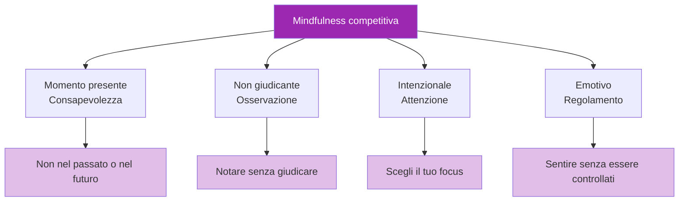

# Mindfulness nella competizione

> &quot;La consapevolezza non è solo un vantaggio per i cuscini da meditazione: è un vantaggio competitivo.&quot;

La capacità di rimanere presenti, consapevoli e non reagire durante le partite distingue gli atleti d&#39;élite da coloro che crollano sotto pressione.

::: tip Il vantaggio del momento presente
**Puoi lanciare solo una boccia alla volta.** La consapevolezza ti mantiene nell&#39;unico momento che conta: questo.
:::

---

## Cosa significa consapevolezza nella competizione

---

## Il problema della mente errante

::: danger Il problema del 47%
**Le ricerche dimostrano che la mente media vaga per il 47% del tempo.** Nella competizione, questo vagabondaggio è costoso.
:::

| Dove va la mente | Ciò che ti manca |
|-----------------|---------------|
| Ultimo tiro mancato | Lettura attuale del terreno |
| Preoccuparsi del punteggio | Selezione ottimale del lancio |
| Cosa pensano gli altri | Sensazione della boccia |
| Pianificazione delle celebrazioni | Esecuzione nel momento presente |

Ogni momento trascorso in un viaggio mentale nel tempo è un momento non trascorso nel lancio che hai davanti.

## Abilità di consapevolezza per la competizione

### 1. Ancoraggio al presente

Utilizza gli ancoraggi sensoriali per tornare al presente:

**Ancore fisiche:**
- Senti il peso della boccia
- Nota i tuoi piedi a terra
- Senti la consistenza dell&#39;impugnatura

**Ancore ambientali:**
- Osserva i dettagli specifici del terreno
- Ascolta i suoni ambientali
- Senti la temperatura e il vento

### 2. Osservare senza reagire

Quando sorgono emozioni (frustrazione, ansia, eccitazione), pratica:

1. **Avviso**: &quot;Mi sento frustrato&quot;
2. **Nome**: &quot;Questa è frustrazione&quot;
3. **Consenti**: Lascia che sia lì senza combattere
4. **Ritorno**: riporta l&#39;attenzione sul compito attuale

L&#39;emozione non scompare, ma perde il potere di controllarti.

### 3. Messa a fuoco a punto singolo

Allena la tua attenzione a concentrarti su una cosa:

**Prima del lancio:**
- Concentrati solo sulla lettura del terreno
- Quindi solo visualizzando il risultato
- Quindi solo sulla posizione del tuo corpo

**Durante il lancio:**
- Concentrati solo sul bersaglio
- Lascia che il corpo esegua senza interferenze

### 4. Mente del principiante

Affronta ogni lancio come se fosse il primo:
- Nessuna ipotesi basata sulle performance passate
- Uno sguardo nuovo sul territorio
- Curiosità piuttosto che aspettativa

## Applicazioni pratiche

### Tra i lanci

Il tempo tra un lancio e l&#39;altro è il momento in cui la mente vaga di più. Usa questo tempo con consapevolezza:

- **Guarda attivamente**: osserva i compagni di squadra e gli avversari con la massima attenzione
- **Rimani incarnato**: nota il tuo respiro, la tua postura, il tuo stato fisico
- **Preparati mentalmente**: visualizza potenziali scenari
- **Riposa l&#39;attenzione**: fai delle brevi pause alla tua attenzione

### Durante i momenti di pressione

Quando la posta in gioco è più alta:

1. **Rallenta**: Fai un respiro extra
2. **Rincalzati**: Senti i tuoi piedi, la boccia
3. **Focus ristretto**: Questo lancio è solo
4. **Fiducia**: Lascia andare l&#39;attaccamento al risultato

### Dopo gli errori

Gli errori innescano la ruminazione. Interrompi il ciclo:

1. **Riconoscimento**: &quot;Non è andato come previsto&quot;
2. **Estratto**: &quot;Cosa posso imparare?&quot;
3. **Comunicato stampa**: &quot;È fatta, andiamo avanti&quot;
4. **Riconcentrarsi**: &quot;Cosa succederà adesso?&quot;

## La routine pre-tiro consapevole

Integra la consapevolezza nella tua routine:

1. **Arrivo**: Entra nel cerchio con piena presenza
2. **Respira**: Un respiro consapevole per centrarsi
3. **Vedi**: Osserva attentamente il terreno
4. **Visualizza**: Guarda il risultato con chiarezza
5. **Senti**: Nota la boccia, il tuo corpo
6. **Rilascio**: Lascia andare e abbi fiducia

## Sfide comuni

### &quot;Non riesco a smettere di pensare&quot;

Non è necessario fermare i pensieri, basta non seguirli. Nota il pensiero, lascialo passare, torna alla tua ancora.

### &quot;La consapevolezza mi rende troppo rilassato&quot;

La consapevolezza competitiva non riguarda la calma, ma la presenza. Puoi essere vigile, energico e consapevole allo stesso tempo.

### &quot;Mi dimentico di essere consapevole&quot;

Utilizzare i trigger:
- Raccogliere la boccia = segnale di consapevolezza
- Entrare nel cerchio = promemoria della presenza
- Prendere posizione = ancoraggio dell&#39;attenzione

## Sviluppare l&#39;abilità

### Pratica quotidiana

5-10 minuti di pratica formale di consapevolezza sviluppano i percorsi neurali:
- Meditazione sulla consapevolezza del respiro
- Pratica di scansione corporea
- Esercizi di osservazione consapevole

### Integrazione della formazione

Pratica la consapevolezza durante ogni sessione di allenamento:
- Presenza totale per ogni lancio
- Nota quando l&#39;attenzione si distrae
- Esercitati a tornare a concentrarti

### Preparazione alla competizione

Prima delle partite:
- Breve pratica di consapevolezza
- Stabilisci l&#39;intenzione di focalizzarti sul presente
- Ricordati delle tue ancore

## Il vantaggio competitivo

I concorrenti attenti hanno i seguenti vantaggi:
- **Recupero più rapido** dagli errori
- **Migliore processo decisionale** sotto pressione
- **Prestazioni più costanti**
- **Maggiore divertimento** della competizione
- **Riduzione del burnout** e dell&#39;ansia

Il giocatore che è pienamente presente a ogni lancio, mentre gli altri sono persi nei loro pensieri, ha un vantaggio significativo.

---

| *Correlato: [Introduzione alla consapevolezza](/it/educazione/gioco-mentale/consapevolezza/) | [Tecniche di consapevolezza](/it/educazione/gioco-mentale/mindfulness/tecniche) | [Pratica quotidiana](/it/educazione/gioco-mentale/mindfulness/pratica-quotidiana)* |

