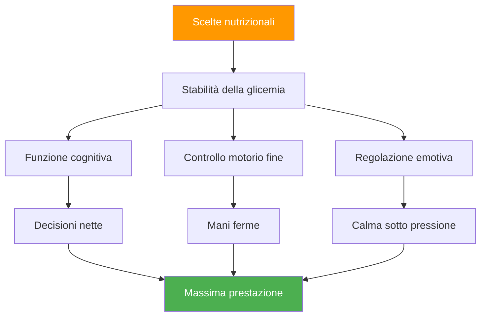

# Nutrizione per la competizione: alimentare le prestazioni di precisione

> &quot;Il tuo cervello è lo strumento più importante nella pétanque. Forniscigli carburante stabile, non energia da montagne russe.&quot;

Le gare di bocce possono durare dalle 6 alle 10 ore. Ciò che si consuma influisce direttamente sulle funzioni cognitive, sul controllo motorio e sulla capacità di mantenere la concentrazione durante più partite.

::: tip La regola d&#39;oro
**Glicemia stabile = mani ferme.** Ogni scelta nutrizionale dovrebbe favorire un&#39;energia costante, non picchi e crolli.
:::

---

## Perché l&#39;alimentazione è importante per la pétanque

A differenza degli sport ad alta intensità, la pétanque richiede:

Le scelte nutrizionali sbagliate creano problemi di prestazione che i giocatori attribuiscono a &quot;debolezza mentale&quot; o &quot;sfortuna&quot;.

---

## La connessione con lo zucchero nel sangue

Il tuo cervello funziona grazie al glucosio. Le fluttuazioni della glicemia influenzano direttamente:

| Stato della glicemia | Effetto mentale | Effetto fisico |
|-------------------|---------------|-----------------|
| **Stabile** | Pensiero chiaro, buone decisioni | Mani ferme, coerenti |
| **Picco (troppo alto)** | Energia iniziale, poi crash | Nervoso, iperattivo |
| **Crash (troppo basso)** | Scarsa concentrazione, irritabilità | Presa tremante e debole |
| **Montagne russe** | Umore/concentrazione imprevedibili | Prestazioni incoerenti |

**Obiettivo:** Mantenere stabile il livello di zucchero nel sangue durante la competizione.

## Nutrizione per il giorno della gara

### Pre-gara (3-4 ore prima)

**Fai un pasto sostanzioso:**
- Carboidrati complessi (farina d&#39;avena, pane integrale, riso)
- Proteine (uova, yogurt, carne magra)
- Grassi sani (avocado, noci, olio d&#39;oliva)
- Evitare: zuccheri semplici, cibi pesanti/grassi

**Esempi di pasti:**
- Fiocchi d&#39;avena con noci e banana
- Uova su pane integrale tostato con avocado
- Riso con pollo e verdure

### Pre-partita (1-2 ore prima)

**Spuntino leggero e familiare:**
- Banana
- Una piccola manciata di noci
- Mezzo panino
- Evita: qualsiasi cosa nuova o sperimentale

### Durante la competizione

**Tra le partite:**
- Piccoli spuntini frequenti ogni 60-90 minuti
- Noci, semi, frutta secca
- Cracker integrali
- Frutta fresca (banana, mela)

**Durante le partite:**
- Sorseggi d&#39;acqua tra le estremità
- Carboidrati veloci se necessario (frutta secca)
- Evitare di mangiare durante il gioco attivo

### Recupero (dopo la competizione)

**Entro 30-60 minuti:**
- Proteine per il recupero muscolare
- Carboidrati per reintegrare
- Liquidi per reidratarsi

## Protocollo di idratazione

### Le basi
- Inizia idratato (controlla il colore dell&#39;urina del mattino)
- Bevi costantemente, non aspettare di avere sete
- Obiettivo 150-250 ml all&#39;ora di gara
- Regolare il calore e l&#39;umidità

### Segnali di allarme di disidratazione
- Sete (sei già disidratato)
- urina scura
- Mal di testa
- Diminuzione della concentrazione
- Fatica

### La trappola dell&#39;iperidratazione
Troppa acqua, soprattutto senza elettroliti:
- Frequenti pause per andare in bagno (interrompono il ritmo)
- Elettroliti diluiti (possono causare tremori)
- Disagio e distrazione

**Equilibrio:** Assunzione costante, includere elettroliti in condizioni di caldo.

## Cibi da evitare

### Il giorno della gara
- **Pasti pesanti** — Deviano il sangue alla digestione
- **Alto contenuto di zucchero** — Causa crolli energetici
- **Alcol (la sera prima)** — Disturba il sonno, disidrata
- **Caffeina in eccesso** — Può causare nervosismo
- **Nuovi alimenti** — Rischio di problemi digestivi
- **Cibi grassi/fritti** — Digestione lenta, letargia

### Alimenti che causano problemi
- **Bevande gassate** — Gonfiore, disagio
- **Alimenti ricchi di fibre** — Possono causare disagio
- **Latticini (per alcuni)** — Sensibilità digestiva
- **Dolcificanti artificiali** — Possono causare problemi di stomaco

## Strategia della caffeina

La caffeina può migliorare la concentrazione e i tempi di reazione, ma richiede un&#39;attenta gestione:

### Uso efficace
- Conosci la tua tolleranza
- Tempi costanti (non cambiare per la competizione)
- Dose moderata (100-200 mg)
- Abbastanza presto per evitare interferenze con le partite serali
- Abbinalo al cibo per ridurre il nervosismo

### Uso inefficace
- Più del solito (provoca ansia, tremore)
- A tarda notte (disturba il sonno)
- A stomaco vuoto (nervosismo, crollo)
- Fare affidamento sulla caffeina per compensare la mancanza di sonno

## Costruire il tuo piano nutrizionale per la competizione

### Fase 1: Test pratico
Prova il tuo piano nutrizionale per la competizione durante l&#39;allenamento:
- Stessi tempi
- Stessi cibi
- Stessa idratazione
- Nota come ti senti e come ti comporti

### Fase 2: preparare la logistica
- Scopri quali cibi sono disponibili nel locale
- Porta i tuoi snack collaudati
- Avere opzioni di backup
- Porta con te più di quanto pensi di aver bisogno

### Passaggio 3: creare una pianificazione
Scrivi i tempi della tua alimentazione:
- Pasto pre-gara (orario, cibo)
- Spuntino pre-partita (orario, cibo)
- Durante la competizione (programma, alimenti)
- Intervalli di promemoria per l&#39;idratazione

### Fase 4: Traccia e regola
Dopo le gare, nota:
- Cosa hai mangiato e quando
- Come ti sentivi fisicamente
- Qualità delle prestazioni
- Eventuali problemi (fame, crollo, mal di stomaco)

## Considerazioni su calore e umidità

Il caldo cambia i requisiti:

- **Aumentare i liquidi** — Potrebbe essere necessario il 50-100% in più
- **Aggiungi elettroliti** — Sudando si perdono minerali
- **Pasti più leggeri** — Il cibo pesante è più difficile da elaborare
- **Pause d&#39;ombra** — Non sottovalutare lo stress da calore
- **Pre-raffreddamento** — Arriva al luogo dell&#39;evento fresco e idratato

## Errori comuni

::: warning Evita questi
- **Saltare la colazione** — Esaurisce il glicogeno mattutino
- **Bevande energetiche** — Troppa caffeina e zucchero
- **Aspettare di avere fame** — Influenza già le prestazioni
- **Alcol la sera prima** — Disidratazione e sonno scarso
- **Provare nuovi cibi** — Rischio di problemi digestivi
:::

## Passaggi d&#39;azione

1. **Pianifica in anticipo la tua alimentazione per la competizione**
2. **Metti alla prova il tuo piano** in condizioni pratiche
3. **Prepara i tuoi spuntini** la sera prima
4. **Segui il tuo programma** indipendentemente dalla pressione della partita
5. **Revisionare e perfezionare** dopo ogni competizione

---

## Contenuti correlati

- [Modulo Nutrizione](/it/educazione/nutrizione/) — Educazione nutrizionale completa
- [Nutrizione per la competizione](/it/educazione/nutrizione/competizione) — Protocolli dettagliati
- [Dormire per migliorare le prestazioni](/it/articoli/sonno-perfezionamento) — Ottimizzazione del recupero

