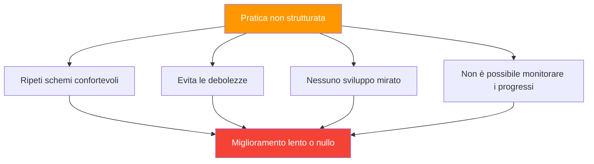

# Strutturare la tua pratica

> &quot;Due giocatori possono trascorrere le stesse ore sul terreno e notare miglioramenti molto diversi.&quot;

Spesso la differenza sta nel modo in cui è strutturata la pratica.

::: tip Il mito delle 10.000 ore
**Non è una questione di ore, ma di come le usi.** La pratica consapevole è sempre meglio della ripetizione insensata.
:::

---

## Il problema della pratica non strutturata

La maggior parte delle pratiche ricreative si presenta così:
- Presentati, lancia qualche boccia
- Gioca a qualche partita informale
- Chatta con gli amici
- Vai a casa

Questo è divertente ma non è efficace per i miglioramenti.

---

## Principi di pratica efficace

| Principio | Domanda da porre |
|-----------|----------------|
| **Scopo** | A cosa sto lavorando oggi? |
| **Deliberare** | Mi sta mettendo alla prova? |
| **Ricco di feedback** | Come faccio a sapere se sto migliorando? |
| **Concentrato** | Sono pienamente presente? |

### 1. Pratica mirata

Ogni sessione dovrebbe avere uno scopo chiaro:
- A cosa sto lavorando oggi?
- Che aspetto ha il successo?
- Come faccio a sapere se sono migliorato?

### 2. Difficoltà deliberata

::: info Il limite dell&#39;abilità
**La pratica dovrebbe metterti alla prova.** Se ti senti a tuo agio, non stai crescendo.
:::

- Lavora al limite delle tue capacità
- Includi elementi che sono difficili
- Evita la ripetizione della pura zona di comfort

### 3. Feedback immediato

Devi sapere come stai andando:
- Traccia i risultati delle esercitazioni
- Utilizzare il video quando possibile
- Ottieni input dai partner di allenamento

### 4. Attenzione focalizzata

La qualità è meglio della quantità:
- Massima concentrazione durante la pratica
- Le sessioni più brevi e concentrate sono meglio di quelle lunghe e distratte
- L&#39;impegno mentale è essenziale

## Struttura della sessione

### Riscaldamento (10-15 minuti)

**Fisico:**
- Movimento leggero
- Preparazione del braccio e della spalla
- Aumento graduale dell&#39;intensità

**Mentale:**
- Transizione dalla vita quotidiana
- Stabilisci l&#39;intenzione per la sessione
- Inizia a focalizzare l&#39;attenzione

### Lavoro tecnico (20-30 minuti)

Concentrarsi su competenze specifiche:
- Pratica della tecnica isolata
- Esercizi mirati ai punti deboli
- Ripetizione con attenzione

**Esempi di aree di interesse:**
- Precisione di puntamento a distanze specifiche
- Riprese da diverse angolazioni
- Tipi di lancio specifici (plombée, portée, ecc.)

### Pratica applicata (20-30 minuti)

Utilizzare le competenze in contesti realistici:
- Situazioni di gioco simulate
- Trapani a pressione
- Pratica decisionale

### Defaticamento (10 minuti)

**Fisico:**
- Lancio di luce
- Allungamento

**Mentale:**
- Ripassa ciò che hai imparato
- Annotare le aree per lavori futuri
- Uscita dalla modalità pratica

## Tipi di sessioni di pratica

### Sessione di sviluppo delle competenze

Focus: Sviluppo o perfezionamento di tecniche specifiche

- 70% esercitazioni tecniche
- 20% pratica applicata
- 10% riscaldamento/defaticamento

### Simulazione di competizione

Focus: Preparazione alle condizioni della partita

- 20% di riscaldamento mirato
- 60% di gioco simile a una partita con pressione
- 20% di debriefing e aggiustamento

### Sessione di manutenzione

Focus: mantenere le competenze affilate

- Lavoro equilibrato in tutte le aree
- Nessuna concentrazione intensa su una cosa in particolare
- Piacevole ma mirato

### Sessione di recupero

Focus: Allenamento leggero dopo la gara

- Bassa intensità
- Lancio piacevole
- Reset mentale

## Progettazione di trapani

Gli esercizi efficaci hanno:

### Obiettivi chiari
Cosa stai praticando nello specifico?

### Risultati misurabili
Come si monitora il successo?

### Sfida appropriata
Abbastanza difficile da allungare, non così difficile da non riuscire

### Rilevanza
Collegato a situazioni di gioco reali

### Progressione
Modi per aumentare la difficoltà man mano che migliori

## Esempi di esercitazioni

### Precisione di puntamento

**Impostazione:** Obiettivo a 8 metri
**Obiettivo:** Atterrare entro 30 cm dal bersaglio
**Traccia:** Percentuale di successo su 20 lanci
**Progresso:** Riduci le dimensioni del bersaglio, aumenta la distanza

### Coerenza di tiro

**Impostazione:** Boccia bersaglio fissa
**Obiettivo:** Colpire il bersaglio
**Traccia:** Colpi ogni 10 tentativi
**Progresso:** Varia gli angoli, aggiungi movimento

### Simulazione della pressione

**Preparazione:** Bisogna farne 3 di fila per &quot;vincere&quot;
**Obiettivo:** Completare la sequenza
**Traccia:** Tentativi necessari
**Avanzamento:** Aumenta la sequenza richiesta

## Pianificazione settimanale

### Esempio di settimana equilibrata

**Lunedì:** Sviluppo delle competenze (focalizzazione)
**Mercoledì:** Simulazione di gara
**Venerdì:** Sviluppo delle abilità (attenzione al tiro)
**Fine settimana:** Partita

### Periodizzazione

Variare l&#39;intensità durante la stagione:

**Fuori stagione:** Sviluppo di abilità intenso
**Pre-stagione:** Integrazione e simulazione
**Stagione delle competizioni:** Manutenzione e affilatura
**Post-season:** Recupero e riflessione

## Errori comuni

### Troppo gioco

Giocare è divertente, ma non è un modo efficace per colpire i punti deboli.

### Nessun tracciamento

Senza misurazioni non puoi sapere se stai migliorando.

### Evitare le debolezze

Naturalmente mettiamo in pratica ciò in cui siamo bravi. Sforzati di lavorare sui tuoi punti deboli.

### Programma incoerente

La pratica sporadica produce risultati sporadici.

### Nessuna pratica mentale

La ripetizione fisica senza impegno mentale limita il miglioramento.

## Rendere la pratica duratura

### Prima della pratica
- Stabilisci intenzioni chiare
- Preparati mentalmente
- Rivedi gli appunti della sessione precedente

### Durante la pratica
- Rimani concentrato
- Risultati della traccia
- Regolare secondo necessità

### Dopo l&#39;allenamento
- Prendi nota di ciò che hai imparato
- Identificare i passaggi successivi
- Celebrare il progresso

## Il mito delle 10.000 ore

Non è solo una questione di ore: è una questione di qualità. 1.000 ore di pratica consapevole sono meglio di 10.000 ore di ripetizione insensata.

Struttura la tua pratica con uno scopo preciso e ogni ora conterà di più.

---

| *Correlato: [Metodi di allenamento](/it/educazione/tecnica/allenamento/) | [Esercizi di allenamento](/it/istruzione/tecnica/allenamento/esercizi) | [Fissazione degli obiettivi](/it/educazione/motivazione/)* |

