# Sviluppare la consapevolezza di sé: la base del miglioramento

> &quot;Non puoi migliorare ciò che non percepisci accuratamente.&quot;

La consapevolezza di sé, ovvero la conoscenza dei propri punti di forza e di debolezza, è il fondamento di uno sviluppo efficace.

::: danger La scomoda verità
**La maggior parte dei giocatori lavora sulle cose sbagliate** perché non vede se stessa chiaramente.
:::

---

## Il paradosso dell&#39;autoconsapevolezza

```mermaid
flowchart TD
    A[Il paradosso dell&#39;autoconsapevolezza] --> B[Effetto Dunning-Kruger]
    A --> C[Punti ciechi degli esperti]
    A --> D[Interferenza emotiva]

    B --> E[Bassa abilità = sopravvalutazione delle capacità]
    C --> F[Anche i giocatori più abili sbagliano]
    D --> G[Vogliamo credere di essere migliori]

    E --> H[Lavorare sulle cose sbagliate]
    F --> H
    G --> H

    style A fill:#f44336,color:#fff
    style H fill:#f44336,color:#fff
```

---

## Perché i giocatori di bocce hanno difficoltà

La boccia rende l&#39;autovalutazione particolarmente difficile:

| Sfida | Perché è difficile |
|-----------|--------------|
| **Varianza dei risultati** | Le buone decisioni possono produrre risultati negativi (e viceversa) |
| **Bias di confronto** | Ricordiamo le migliori performance, spieghiamo quelle peggiori |
| **Protezione dell&#39;identità** | Ammettere la debolezza è una minaccia |

::: warning La memoria non è un dato
**Costruiamo narrazioni che proteggono la nostra immagine di noi stessi.** Il monitoraggio oggettivo è essenziale.
:::

---

## Le componenti dell&#39;autoconsapevolezza

La vera consapevolezza di sé richiede la comprensione di più ambiti:

| Dominio | Domande chiave |
|--------|---------------|
| **Tecnico** | Quali lanci sono effettivamente affidabili? Quali sono incoerenti? |
| **Mentale** | Come reagisco alla pressione? Cosa attiva il mio critico interiore? |
| **Fisico** | Quando ho più energia? Come mi influenza la stanchezza? |
| **Tattico** | Attacco troppo forte? Attacco troppo debole? Come interpreto le situazioni? |
| **Emotivo** | Cosa mi frustra? Quando gioco stretto? |
| **Interpersonale** | Come percepiscono i miei compagni di squadra la mia comunicazione? |

## Feedback esterno: lo specchio di cui hai bisogno

Non puoi vedere i tuoi punti ciechi. Hai bisogno di prospettive esterne.

### Metodi di feedback strutturati

**Analisi video**
- Registra partite e allenamenti
- Guarda con aree di attenzione specifiche
- Nota i modelli che ti sfuggono nel momento

**Valutazione tra pari**
- Chiedi un feedback onesto ai tuoi compagni di squadra di fiducia
- Utilizzare lo [Strumento di valutazione](/en/assessment/) per la convalida tra pari
- Confronta la tua autovalutazione con la loro valutazione

**Osservazione dell&#39;allenatore**
- Gli occhi nuovi vedono ciò che gli occhi familiari non vedono
- Richiedi un feedback specifico, non impressioni generali
- Monitorare i temi del feedback nel tempo

### Il divario di feedback

Quando la tua autovalutazione differisce significativamente dal feedback esterno, fai attenzione:

| Tipo di gap | Senso | Azione |
|----------|---------|--------|
| Il tuo punteggio è più alto | Possibile punto cieco | Indagare con video/dati |
| Hai un punteggio più basso | Possibile problema di fiducia | Concentrarsi sulle prove di competenza |
| gap coerente | Errore di percezione sistematica | Ricalibra il tuo modello mentale |

## Costruire abitudini di autoconsapevolezza

### Riflessione quotidiana (5 minuti)

Dopo ogni sessione, chiediti:

1. **Cosa è andato bene?** (Sii specifico)
2. **Cosa non è andato bene?** (Sii onesto)
3. **Cosa farei diversamente?** (Sii costruttivo)
4. **Cosa mi ha sorpreso?** (Sii curioso)

### Revisione settimanale (15 minuti)

Cercare schemi:

- Quali situazioni mi mettono costantemente alla prova?
- Dove sto migliorando?
- Che feedback ho ricevuto?
- Cosa sto evitando di guardare?

### Valutazione mensile

Utilizza lo strumento [Valutazione del giocatore](/en/assessment/):

- Valuta te stesso su tutti gli 8 fattori
- Richiedi la convalida peer
- Confronta con il mese precedente
- Identificare le lacune più grandi

## Il vantaggio dei dati

La percezione soggettiva non è affidabile. I dati forniscono oggettività:

### Cosa monitorare

**Dati sulle prestazioni**
- Percentuali di successo per tipo di lancio
- Prestazioni sotto pressione vs. senza pressione
- Prima serie vs. serie successive
- Con partner diversi

**Dati di processo**
- Qualità del sonno prima delle partite
- Conformità alla routine pre-partita
- Stato mentale nei momenti chiave
- Tempo di recupero dopo gli errori

### Come utilizzare i dati

1. **Identificare gli schemi** — Cosa è correlato a una buona/scadente prestazione?
2. **Metti in discussione le ipotesi** — I dati corrispondono alle tue convinzioni?
3. **Formazione della guida** — Concentrarsi sulle debolezze reali, non su quelle percepite
4. **Monitorare i progressi** — Il miglioramento è spesso invisibile senza misurazione

## Blocchi comuni di autoconsapevolezza

::: warning Fai attenzione a questi
- **Atteggiamento difensivo** quando si riceve un feedback
- **Spiegare** le scarse prestazioni
- **Cercare conferma** piuttosto che la verità
- **Evitare la misurazione** delle aree deboli
- **Incolpare costantemente fattori esterni**
:::

## La connessione della mentalità di crescita

La consapevolezza di sé richiede di accettare che:

- La capacità attuale non è fissa
- La debolezza è l&#39;informazione, non l&#39;identità
- Il feedback è un dono, non un attacco
- Il miglioramento richiede una valutazione onesta

## Passaggi d&#39;azione

1. **Oggi:** Completa l&#39;[Autovalutazione](/it/valutazione/)
2. **Questa settimana:** Richiedi un feedback tra pari a 2 fidati compagni di squadra
3. **In corso:** Stabilire l&#39;abitudine alla riflessione quotidiana
4. **Mensile:** Monitora i progressi con valutazioni ripetute

---

## Contenuti correlati

- [Modulo di autoconsapevolezza](/it/educazione/autoconsapevolezza/) — Formazione completa
- [Valutazione del giocatore](/it/valutazione/) — Valuta i tuoi 8 fattori
- [Il critico interiore](/it/articoli/critico-interiore) — Gestire l&#39;autogiudizio

