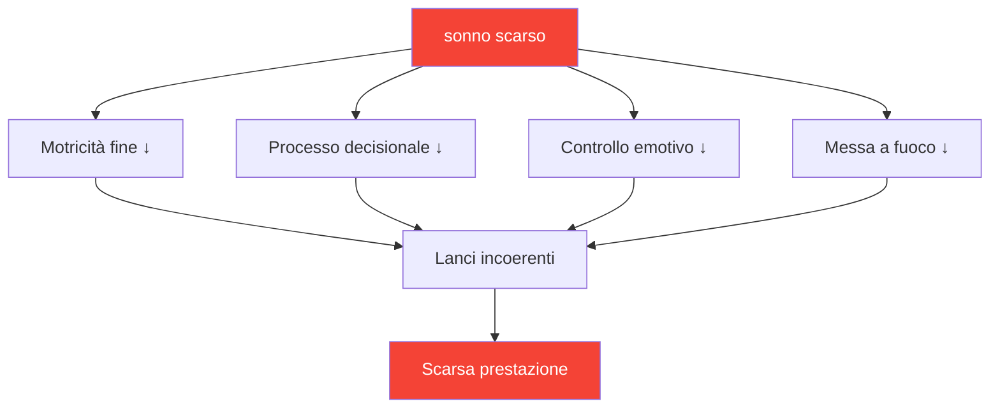

# Il sonno: il fattore di prestazione più sottovalutato

> &quot;Spesso vince il giocatore che ha dormito meglio.&quot;

La maggior parte dei giocatori si concentra sulla tecnica e sull&#39;allenamento mentale. Pochi ottimizzano il sonno. Questo è un errore: il sonno potrebbe essere il miglioramento con il ROI più elevato disponibile per la maggior parte dei giocatori agonisti.

::: tip Miglioramento ad alto ROI
**L&#39;ottimizzazione del sonno non richiede alcun talento e produce enormi risultati.** È la cosa più vicina a un potenziatore delle prestazioni legali.
:::

---

## La ricerca

La scienza del sonno rivela effetti sorprendenti sulle prestazioni sportive di precisione:

### Tempo di reazione
- **24 ore senza dormire** = tempo di reazione equivalente allo 0,1% di alcol nel sangue
- **6 ore/notte per 2 settimane** = equivalente a rimanere svegli 48 ore
- Gli atleti d&#39;élite in media **8,5+ ore** contro le 7 ore della popolazione generale

### Il processo decisionale
- La privazione del sonno danneggia prima la corteccia prefrontale
- Le decisioni tattiche peggiorano prima che si manifesti la stanchezza evidente
- Non ti accorgi del tuo deficit (anche la metacognizione fallisce)

### Controllo motore
- Le capacità motorie fini (presa, rilascio) richiedono una memoria consolidata
- Il consolidamento della memoria avviene durante il sonno profondo
- Apprendimento delle competenze senza un sonno adeguato = pratica sprecata

## La connessione di precisione

La boccia richiede esattamente ciò che la privazione del sonno distrugge:

| Abilità richiesta | Effetto della privazione del sonno |
|----------------|--------------------------|
| Controllo motorio fine | La pressione della presa diventa incoerente |
| Elaborazione visiva | Giudizio a distanza compromesso |
| Il processo decisionale | Gli errori tattici aumentano |
| Regolazione emotiva | La frustrazione dopo gli errori aumenta |
| Attenzione sostenuta | L&#39;attenzione si sposta nelle partite più lunghe |

## Segnali che stai dormendo poco

Ti sei adattato alla privazione cronica del sonno se:

- Hai bisogno di una sveglia per svegliarti
- Sei assonnato nel primo pomeriggio
- Ti addormenti entro 5 minuti dal momento in cui ti sei sdraiato
- &quot;Recuperi&quot; nei fine settimana
- Il caffè è essenziale, non facoltativo

**Realtà:** Se hai bisogno di caffeina per funzionare normalmente, sei privato del sonno.

## Il protocollo della settimana della competizione

### 7 giorni prima
- Inizia a dormire 30 minuti in più a notte
- Stabilizzare l&#39;orario di veglia (stessa ora ogni giorno)

### 3 giorni prima
- Niente alcol (disturba l&#39;architettura del sonno)
- Niente pasti pesanti dopo le 19:00
- Ridurre il tempo trascorso davanti allo schermo dopo il tramonto

### La notte prima
- Ora normale per andare a letto (non andare a letto presto, altrimenti rimarrai sveglio)
- Ambiente familiare, se possibile
- Routine di rilassamento

### Mattina di gara
- Svegliarsi all&#39;ora normale
- Esposizione alla luce immediata
- Normale routine della colazione

## Ottimizzare la qualità del sonno

Non è solo questione di durata: la qualità è ciò che conta di più.

### Ambiente per dormire
- **Temperatura:** 18-20°C (65-68°F) è ottimale
- **Oscurità:** Oscurità completa o mascherina per dormire
- **Suono:** Consistente (rumore bianco) o silenzioso
- **Biancheria da letto:** Comoda, non troppo calda

### Routine pre-sonno
- Senza schermo per più di 60 minuti prima di andare a letto
- Luci soffuse la sera
- Attività di chiusura coerenti
- Una doccia fredda può innescare l&#39;addormentamento

### Tempistica
- Orario di veglia costante (più importante dell&#39;ora di andare a letto)
- Evitare di dormire più di 30 minuti durante il fine settimana
- Pisolini: prima delle 15:00, meno di 20 minuti

## La strategia del pisolino

Riposino strategico per i giorni di gara:

### Il pisolino ristoratore (10-20 min)
- Riduce la stanchezza senza stordimento
- Ideale per le sessioni tra la mattina e il pomeriggio
- Imposta la sveglia: non dormire troppo

### Il ciclo completo (90 min)
- Ciclo completo del sonno
- Solo se hai più di 2 ore prima della gara
- Rischio di stordimento se interrotto

### Non fare mai un pisolino se:
- Soffri di insonnia ad esordio del sonno
- La competizione dura 90 minuti
- Sono passate le 15:00 e quella notte devi dormire

## Considerazioni di viaggio

Per le gare in trasferta:

### Prima del viaggio
- Porta con te oggetti familiari per dormire (cuscino, mascherina per dormire)
- Ricerca camera d&#39;albergo (richiedi camera silenziosa)
- Modificare l&#39;orario se si attraversano i fusi orari

### A destinazione
- Se possibile, attenersi al programma di sonno di casa
- L&#39;esposizione alla luce controlla il ritmo circadiano
- Evitare pasti pesanti poco prima di andare a letto

### Attraversamento del fuso orario
- 1 giorno all&#39;ora per adattarsi completamente
- L&#39;esposizione alla luce mattutina accelera l&#39;adeguamento verso est
- L&#39;esposizione alla luce serale accelera l&#39;adeguamento verso ovest

## Monitoraggio del sonno

Ciò che viene misurato viene gestito:

### Monitoraggio semplice
- Ora di svegliarsi e ora di andare a letto
- Qualità soggettiva (1-10)
- Note sulla correlazione delle prestazioni

### Monitoraggio avanzato
- Tracker del sonno o indossabile
- Tendenze HRV (variabilità della frequenza cardiaca)
- Dati sulle fasi del sonno

### Cosa cercare
- Correlazione tra sonno e prestazioni
- Modelli (recupero del fine settimana, insonnia pre-gara)
- Tendenze nel tempo

## Errori comuni

::: warning Evita questi
- **Alcol come coadiuvante del sonno** — Favorisce l&#39;insorgenza, ne distrugge la qualità
- **Recuperare il weekend** — Non riesco a &quot;ripagare&quot; il debito di sonno
- **Schermi a letto** — Allena il cervello a pensare che letto ≠ sonno
- **Programma incoerente** — Il ritmo circadiano ha bisogno di coerenza
- **Ignorare il sonno per l&#39;allenamento** — Scambiare la qualità con la quantità
:::

## Passaggi d&#39;azione

1. **Questa settimana:** Tieni traccia del tuo sonno effettivo (durata + qualità)
2. **Prossima settimana:** Stabilisci un orario di sveglia costante
3. **Settimane successive:** Ottimizzare l&#39;ambiente e la routine
4. **Pre-gara:** Implementare il protocollo della settimana di gara

---

## Contenuti correlati

- [Modulo Sonno e Recupero](/it/education/sleep/) — Educazione completa sul sonno
- [Abitudini del sonno](/it/educazione/sonno/abitudini) — Creare routine sostenibili
- [Sonno da competizione](/it/educazione/sonno/competizione) — Protocolli specifici per evento

