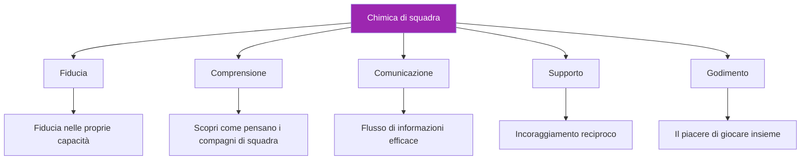

# Costruire la chimica di squadra

> &quot;L&#39;avete visto: squadre in cui il totale supera la somma delle parti.&quot;

Giocatori che si aspettano l&#39;un l&#39;altro, si sostengono a vicenda e rendono meglio insieme che da soli. Questa è la chimica di squadra, e non è casuale.

::: tip La chimica si costruisce, non si trova
**I grandi team non si formano, si sviluppano.** La chimica richiede uno sforzo intenzionale nel tempo.
:::

---

## Cos&#39;è la chimica di squadra?

---

## Perché la chimica è importante

| Con la chimica ✅ | Senza chimica ❌ |
|-------------------|----------------------|
| Prendere decisioni collettive migliori | Darsi la colpa a vicenda per i fallimenti |
| Recuperare più velocemente dalle battute d&#39;arresto | Comunicare male sotto stress |
| Agire costantemente sotto pressione | Prestazioni inferiori rispetto al talento |
| Goditi di più la competizione | Sperimentare conflitti e frustrazioni |
| Rimanere insieme più a lungo | La squadra si scioglie |

## I mattoni

### 1. Obiettivi condivisi

La chimica inizia con l&#39;allineamento:
- Cosa stiamo cercando di ottenere?
- Che aspetto ha il successo?
- Cosa siamo disposti a sacrificare?

I team con obiettivi contrastanti (uno vuole divertirsi, l&#39;altro vuole vincere a tutti i costi) fanno fatica a creare alchimia.

### 2. Chiarezza del ruolo

Ogni giocatore deve sapere:
- Cosa ci si aspetta da loro
- Come contribuiscono al successo del team
- Quando guidare e quando seguire

I ruoli poco chiari creano attriti e risentimento.

### 3. Rispetto reciproco

Rispetto significa:
- Valorizzare il contributo di ogni compagno di squadra
- Accettare stili e approcci diversi
- Trattarsi a vicenda con dignità, soprattutto sotto pressione

### 4. Sicurezza psicologica

I giocatori devono sentirsi sicuri di:
- Commettere errori senza giudicare severamente
- Esprimere opinioni e preoccupazioni
- Essere se stessi senza pretese

## Chimica degli edifici: passaggi pratici

### Tempo insieme

La chimica richiede investimenti:
- Esercitatevi insieme regolarmente
- Trascorrete del tempo insieme fuori dal terreno
- Condividi esperienze oltre la bocce

### Team Building strutturato

Le attività intenzionali aiutano:
- Sessioni di definizione degli obiettivi di squadra
- Debriefing post-partita (costruttivi)
- Discussioni su stili di gioco e preferenze

### Risoluzione dei conflitti

Affrontare i problemi prima che si aggravino:
- Creare spazio per una conversazione onesta
- Concentrati sui comportamenti, non sulle personalità
- Cerca soluzioni, non colpevolizzazioni

### Festeggiamo insieme

La gioia condivisa crea legami:
- Riconoscere le buone prestazioni
- Celebrare i risultati del team
- Segnare insieme le tappe fondamentali

## Assassini della chimica

### Colpa della cultura

Quando gli errori portano a critiche anziché a sostegno, la fiducia si erode rapidamente.

### Impegno diseguale

Se alcuni giocatori investono più di altri, il risentimento aumenta.

### scarsa comunicazione

Incomprensioni e supposizioni creano distanza.

### Conflitti dell&#39;ego

Quando il riconoscimento individuale conta più del successo di squadra, la sintonia ne risente.

### Conflitto irrisolto

I problemi che non vengono affrontati non scompaiono, ma aumentano.

## Chimica in competizione

### Prima delle partite

- Arrivare insieme, riscaldarsi insieme
- Breve discussione di gruppo sull&#39;approccio
- Energia positiva e incoraggiamento reciproco

### Durante le partite

- Supporto visibile reciproco
- Solo comunicazione costruttiva
- Celebrazione condivisa di belle opere teatrali
- Risposta collettiva alle battute d&#39;arresto

### Dopo le partite

- Che si vinca o si perda, restate insieme
- Breve debriefing (cosa ha funzionato, cosa migliorare)
- Mantenere relazioni positive indipendentemente dal risultato

## Diverse personalità

I team forti spesso includono diversi tipi di personalità:

- **Il costante**: calmo sotto pressione, coerente
- **The Energizer**: Porta entusiasmo e motivazione
- **Lo stratega**: pensa al futuro, vede gli schemi
- **Il concorrente**: Guida la volontà di vincere

La chimica non riguarda il fatto che tutti siano uguali, ma le differenze che lavorano insieme.

## Quando manca la chimica

### Segni di scarsa chimica

- Frustrazione visibile con i compagni di squadra
- Colpa dopo gli errori
- Mancanza di comunicazione
- Giocare come individui, non come squadra
- Temere piuttosto che godersi le partite

### Ricostruire la chimica

1. **Riconosci il problema**: Nominalo apertamente
2. **Identificare le cause**: Cosa crea l&#39;attrito?
3. **Impegnarsi al cambiamento**: tutte le parti devono investire
4. **Agisci**: Passaggi specifici per migliorare
5. **Sii paziente**: la chimica impiega tempo per ricostruirsi

### Quando andare avanti

A volte la chimica non può essere riparata:
- Differenze di valore fondamentali
- Ripetuta rottura della fiducia
- Riluttanza al cambiamento

È giusto riconoscere quando un team non funziona.

## Il ruolo del capitano

Se sei il caposquadra:
- Modella il comportamento che vuoi vedere
- Affrontare i problemi in modo tempestivo e diretto
- Creare opportunità di connessione
- Proteggere la cultura del team
- Bilanciare le esigenze individuali con quelle del team

## Chimica a lungo termine

La chimica non è statica, richiede manutenzione:

### Check-in regolari

- Come stiamo funzionando come squadra?
- Cosa funziona? Cosa non funziona?
- Ci sono problemi da risolvere?

### Investimento continuo

- Continuate a trascorrere del tempo insieme
- Continua a comunicare apertamente
- Continuate a sostenerci a vicenda

### Adattamento

- Man mano che i giocatori crescono e cambiano, anche la squadra deve farlo
- Essere disposti a far evolvere ruoli e dinamiche
- Rimanete curiosi l&#39;uno dell&#39;altro

---

| *Correlato: [Dinamiche di squadra](/it/istruzione/dinamiche-di-squadra/) | [Comunicazione](/it/istruzione/dinamiche-di-squadra/comunicazione) | [Leadership nel gioco delle bocce](/it/articoli/team-leadership)* |

