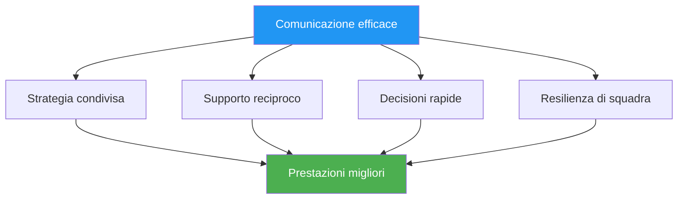

# Comunicazione sotto pressione

> &quot;Le parole giuste al momento giusto creano fiducia. Le parole sbagliate possono mandare in tilt anche i team più abili.&quot;

::: tip La verità della comunicazione
**Sotto pressione, meno è meglio.** Una comunicazione chiara e concisa è sempre meglio di lunghe discussioni.
:::

---

## Perché la comunicazione è importante

Le squadre di bocce affrontano sfide uniche:
- Le decisioni devono essere prese rapidamente
- La pressione influenza il modo in cui parliamo e ascoltiamo
- I segnali non verbali sono visibili agli avversari
- Le prestazioni individuali influenzano le dinamiche di squadra

---

## I principi della comunicazione

### 1. Chiarezza sulla quantità

| ❌ Non dire | ✅ Dì invece |
|-------------|---------------|
| &quot;Penso che forse dovremmo provare a indicare qui, ma non ne sono sicuro...&quot; | &quot;Indico il lato sinistro. Lì il terreno è migliore.&quot; |

### 2. Inquadramento positivo

| ❌ Negativo | ✅ Positivo |
|------------|------------|
| &quot;Non perdetevi questo&quot; | &quot;Ce la puoi fare, fidati del tuo tiro&quot; |
| &quot;È stato terribile&quot; | &quot;Scuotilo di dosso, il prossimo&quot; |

### 3. Focus sul presente

::: warning Passato vs Presente
**Invece di:** &quot;Perché l&#39;hai lanciato lì?&quot;
**Di&#39;:** &quot;Ok, qual è la nostra opzione migliore adesso?&quot;
:::

### 4. Linguaggio di proprietà

Usa le affermazioni in prima persona per le tue azioni, in seconda persona per le situazioni di squadra:

- &quot;Farò questo scatto&quot;
- &quot;Dobbiamo proteggere il punto&quot;
- &quot;Penso che dovremmo...&quot;

## Cosa comunicare

### Prima di ogni fine

- **Discussione sulla strategia**: breve allineamento sull&#39;approccio
- **Chiarezza del ruolo**: chi fa cosa
- **Osservazioni del terreno**: Condizioni rilevanti

### Durante il gioco

- **Decisioni**: Dichiarazione chiara dell&#39;azione prevista
- **Supporto**: Incoraggiamento prima dei lanci
- **Informazioni**: Osservazioni rilevanti sul terreno o sugli avversari

### Dopo i lanci

- **Riconoscimento**: Breve riconoscimento (positivo o negativo)
- **Adeguamento**: Eventuali modifiche strategiche necessarie
- **Reimposta**: aiuta il compagno di squadra a riconcentrarsi

## Cosa NON comunicare

### Evitare durante i momenti di pressione

- Istruzioni tecniche (&quot;Tieni il gomito dentro&quot;)
- Critica dei lanci passati
- Espressioni di frustrazione
- Dubbi sulle capacità del compagno di squadra
- Analisi eccessiva

### Evitare in generale

- Linguaggio della colpa
- Sarcasmo o aggressività passiva
- Confronti con altri giocatori
- Previsioni di fallimento

## Comunicazione non verbale

Il tuo linguaggio del corpo parla ad alta voce:

### Segnali positivi
- Contatto visivo con i compagni di squadra
- Postura aperta e rilassata
- Annuendo e riconoscendo
- Movimenti calmi e costanti

### Segnali negativi (da evitare)
- Roteare gli occhi o sospirare
- Allontanarsi dai compagni di squadra
- Braccia incrociate o postura chiusa
- Frustrazione visibile

### Compagni di squadra di lettura

Impara a riconoscere quando i tuoi compagni di squadra hanno bisogno di:
- **Spazio**: Stanno elaborando, non interromperli
- **Supporto**: Stanno lottando, offri incoraggiamento
- **Informazioni**: Sono incerti, fornire chiarezza
- **Energia**: Sono piatti, portano entusiasmo

## Ruoli di comunicazione

### Il puntatore
- Comunica la tua lettura del terreno
- Indica chiaramente il posizionamento previsto
- Chiedi un contributo quando sei incerto

### Il tiratore
- Conferma la selezione del target
- Comunicare il livello di fiducia
- Richiedi informazioni sugli angoli

### Il Milieu/Capitano
- Facilitare le discussioni di gruppo
- Prendi decisioni definitive quando necessario
- Gestire l&#39;energia e la concentrazione del team

## Situazioni di pressione

### Quando dietro

- Concentrarsi sulla soluzione
- Mantenere l&#39;energia positiva
- Evitare la colpa o la frustrazione
- Festeggia le piccole vittorie

### Quando avanti

- Rimani concentrato, evita l&#39;autocompiacimento
- Mantenere la comunicazione coerente
- Non cambiare ciò che funziona

### Match Point (loro)

- Riconoscere brevemente la pressione
- Concentrarsi sul processo
- Sostenetevi a vicenda visibilmente

### Match Point (il nostro)

- Mantieni la calma e la concentrazione
- Evitare festeggiamenti prematuri
- Eseguire normalmente

## Sviluppo delle capacità comunicative

### In pratica

- Esercitati a comunicare durante l&#39;allenamento
- Dare e ricevere feedback sulla comunicazione
- Sperimentare approcci diversi

### Accordi di squadra

Stabilire le norme del team:
- Come gestiamo i disaccordi
- Come si presenta il supporto
- Quando parlare e quando stare zitti

### Revisione post-partita

Discutere la comunicazione:
- Cosa ha funzionato bene?
- Cosa si potrebbe migliorare?
- Ci sono malintesi da chiarire?

## Quando la comunicazione si interrompe

### Nel momento

1. Fai un respiro
2. Ripartiamo con una semplice affermazione: &quot;Concentriamoci su questo lancio&quot;
3. Ritorno alle basi: chiaro, positivo, presente

### Dopo la partita

- Affrontare i problemi con calma
- Concentrati sui comportamenti, non sulle personalità
- Concordare i miglioramenti
- Andiamo avanti insieme

## Il supporto silenzioso

A volte la migliore comunicazione è la presenza:
- In piedi con un compagno di squadra in difficoltà
- Una mano sulla spalla
- Un cenno di fiducia
- Semplicemente esserci

Le parole non sono sempre necessarie. La connessione sì.

---

| *Correlato: [Dinamiche di squadra](/it/istruzione/dinamiche-di-squadra/) | [Comunicazione](/it/istruzione/dinamiche-di-squadra/comunicazione) | [Gestire la pressione](/it/educazione/gioco-mentale/forza-mentale/gestire-la-pressione)* |

