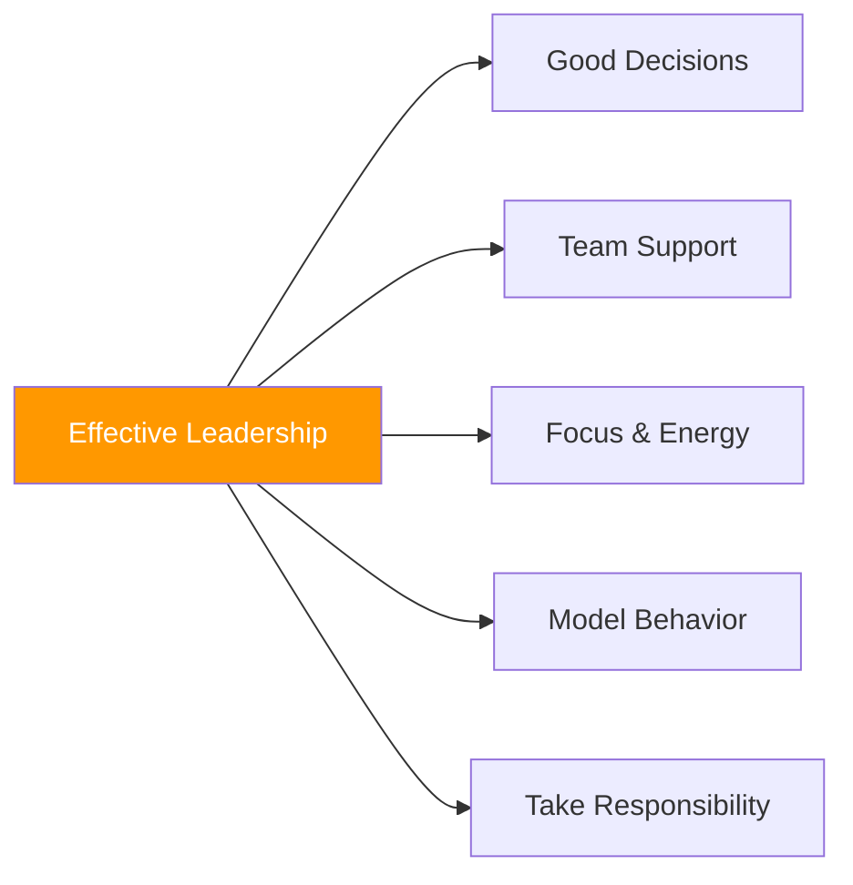

# Leadership in Pétanque

> "Leadership isn't just about being the captain — it's about bringing out the best in your team."

Every player can lead in different ways. It's about influence, support, and modeling excellence.

::: tip Everyone Can Lead
**You don't need a title to be a leader.** Leadership is behavior, not position.
:::

---

## What Is Pétanque Leadership?

---

## Types of Leadership

| Type | Focus | How It Looks |
|------|-------|--------------|
| **Positional** | Authority | Captain makes final decisions, sets culture |
| **Performance** | Excellence | Consistent skill, handling pressure well |
| **Emotional** | Energy | Staying positive, supporting others |
| **Tactical** | Strategy | Reading the game, offering insights |

### Positional Leadership

The designated captain or team leader:
- Makes final strategic decisions
- Represents the team officially
- Manages team dynamics
- Sets the tone and culture

### Performance Leadership

Leading through excellence:
- Demonstrating skill and consistency
- Showing how to handle pressure
- Setting standards through action
- Inspiring through performance

### Emotional Leadership

::: info Often Undervalued
**Emotional leadership is critical** — the player who stays positive when down 2-10 can turn the entire match around.
:::

Managing team energy and morale:
- Staying positive under pressure
- Supporting struggling teammates
- Celebrating successes
- Maintaining perspective

### Tactical Leadership

Contributing strategic thinking:
- Reading the game well
- Offering valuable insights
- Seeing patterns others miss
- Thinking ahead

## The Effective Leader

### In Practice

- Arrives prepared and focused
- Works hard and encourages others
- Provides constructive feedback
- Creates a positive training environment

### Before Competition

- Ensures team is prepared
- Sets clear expectations
- Manages pre-match nerves
- Creates focus and confidence

### During Competition

- Makes clear, timely decisions
- Supports teammates visibly
- Stays calm under pressure
- Adapts strategy as needed

### After Competition

- Handles wins with grace
- Handles losses with perspective
- Leads constructive debriefs
- Maintains team relationships

## Leadership Challenges

### Making Tough Decisions

Sometimes you must:
- Choose between options with no clear answer
- Disagree with teammates
- Take responsibility for outcomes
- Act decisively despite uncertainty

**Approach:**
- Gather input quickly
- Make the decision
- Commit fully
- Learn from results

### Managing Conflict

Team friction is inevitable:
- Different opinions on strategy
- Frustration after mistakes
- Personality clashes
- Unequal commitment

**Approach:**
- Address issues early
- Listen to all perspectives
- Focus on solutions
- Maintain respect

### Supporting Struggling Players

When a teammate is underperforming:
- Don't add pressure
- Offer specific, positive support
- Adjust strategy if needed
- Maintain confidence in them

### Handling Your Own Struggles

Leaders struggle too:
- Acknowledge it (to yourself)
- Don't let it affect your leadership
- Lean on teammates
- Model resilience

## Leadership Styles

### The Commander

- Direct and decisive
- Clear expectations
- Takes charge in crisis
- Risk: Can be overbearing

### The Coach

- Develops others
- Asks questions
- Builds capability
- Risk: Can be slow in crisis

### The Collaborator

- Seeks input
- Builds consensus
- Values all voices
- Risk: Can be indecisive

### The Supporter

- Focuses on relationships
- Creates safety
- Encourages and affirms
- Risk: Can avoid hard truths

**Best leaders adapt their style to the situation.**

## Developing Leadership Skills

### Self-Awareness

Know your:
- Natural leadership style
- Strengths and weaknesses
- Impact on others
- Triggers and reactions

### Emotional Intelligence

Develop ability to:
- Recognize emotions (yours and others')
- Manage your responses
- Empathize with teammates
- Navigate social dynamics

### Communication Skills

Practice:
- Clear, concise messaging
- Active listening
- Giving constructive feedback
- Difficult conversations

### Decision-Making

Improve through:
- Analyzing past decisions
- Seeking feedback
- Learning from mistakes
- Practicing under pressure

## Leading Without the Title

You don't need to be captain to lead:

### Lead by Example
- Show up prepared
- Give full effort
- Handle adversity well
- Support teammates

### Lead Through Support
- Encourage others
- Offer help
- Celebrate teammates' success
- Be reliable

### Lead Through Contribution
- Share observations
- Offer ideas respectfully
- Take initiative
- Fill gaps

## The Leadership Mindset

### Responsibility Over Blame

Leaders take responsibility:
- "We didn't execute well" not "They missed"
- "I should have communicated better" not "They didn't listen"

### Team Over Self

Leaders prioritize team success:
- Celebrate team achievements
- Share credit generously
- Take blame personally
- Put team needs first

### Growth Over Comfort

Leaders embrace challenge:
- Seek difficult situations
- Learn from failures
- Push for improvement
- Model continuous growth

## When Leadership Fails

Even good leaders fail sometimes:
- Wrong decisions happen
- Teams lose despite good leadership
- Relationships strain

**Recovery:**
1. Acknowledge what happened
2. Take appropriate responsibility
3. Learn the lessons
4. Move forward with humility

---

*Related: [Team Dynamics](/it/education/team-dynamics/) | [Communication](/it/education/team-dynamics/communication) | [Building Team Chemistry](/it/articles/team-chemistry)*

