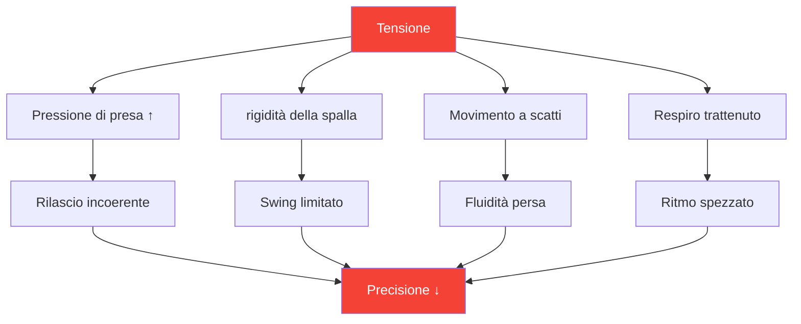

# Tensione e precisione: la connessione nascosta

> &quot;Non puoi essere teso e preciso allo stesso tempo. È fisicamente impossibile.&quot;

L&#39;hai sentito: il lancio decisivo in cui il tuo corpo si irrigidisce, la tua presa aumenta e la palla finisce esattamente dove non volevi. La tensione è il killer silenzioso della precisione.

::: danger Il nemico nascosto
**La maggior parte della tensione è invisibile al giocatore che la prova.** Non ti accorgi di essere teso finché non è troppo tardi.
:::

---

## La biomeccanica della tensione

---

## Dove si nasconde la tensione

La maggior parte dei giocatori è consapevole della tensione superficiale (spalle contratte prima di un lancio importante). Pochi notano la tensione sottile che peggiora costantemente la prestazione:

| Posizione | Effetto sul lancio | Come notare |
|----------|-----------------|---------------|
| **Presa** | Tempi di rilascio incoerenti | Segni di palla sul palmo |
| **Avambraccio** | Fluidità del polso ridotta | Sensazione di bruciore |
| **Spalla** | Arco di oscillazione limitato | Il lancio sembra &quot;corto&quot; |
| **Collo** | Posizione alterata della testa | Rigidità dopo le partite |
| **Mascella** | Cascata di tensione su tutto il corpo | denti serrati |
| **Respiro** | Ritmo interrotto | Trattenere il respiro |

---

## La spirale pressione-tensione

Sotto pressione, inizia un ciclo distruttivo:

::: tip Rompere il ciclo
**Interrompere al punto 2** — prima che la tensione influisca sulla prestazione. Ecco perché le routine pre-tiro con controlli della tensione sono essenziali.
:::

## Rilevare i tuoi modelli di tensione

### Il metodo Body Scan

Prima di esercitarti, chiudi gli occhi e scansiona:

1. Inizia dai piedi: le dita dei piedi si stringono?
2. Passa alle gambe: hai le ginocchia bloccate?
3. Nota fianchi e core: c&#39;è qualche rinforzo?
4. Controllare le spalle: ci sono delle elevazioni?
5. Esamina braccia e mani: c&#39;è una presa prematura?
6. Nota collo e viso: stringi i muscoli?

Valuta la tensione da 0 a 10 in ogni posizione. **Il valore di base dovrebbe essere 2 o inferiore.**

### Il metodo video

Registrati mentre inserisci:
- Pratica a basso rischio
- Pratica a rischio moderato
- Competizione ad alto rischio

Confronta il tuo linguaggio del corpo. Dove ti irrigidisci quando la posta in gioco aumenta?

### Il metodo Partner

Chiedi a un compagno di squadra di osservare:
- Il tuo viso prima dei lanci importanti
- La tua posizione cambia sotto pressione
- I tuoi schemi respiratori
- Il tuo comportamento di presa

Gli osservatori esterni vedono ciò che noi non possiamo sentire.

## Tecniche di rilascio

### Sganci rapidi (da utilizzare durante le competizioni)

**La riorganizzazione**
- Breve e vigoroso movimento delle mani e delle braccia
- Rilascia schemi di attesa
- Ci vogliono 2-3 secondi

**La goccia di espirazione**
- Fai un respiro profondo
- Durante l&#39;espirazione, abbassa consapevolmente le spalle
- Rilasciare contemporaneamente la tensione della mascella

**Il ripristino della presa**
- Aprire completamente la mano
- Allargare le dita
- Riafferrare con la minima forza necessaria

### Rilasci profondi (uso in pratica/pre-gara)

**Rilassamento muscolare progressivo**
- Contrai deliberatamente ogni gruppo muscolare (5 secondi)
- Rilasciare completamente (15 secondi)
- Nota la differenza
- Lavora su tutto il corpo

**Connessione Respiro-Corpo**
- Respirazione lenta (4 conteggi dentro, 6 conteggi fuori)
- Ad ogni espirazione, rilascia una zona del corpo
- Continuare fino a raggiungere il rilassamento di tutto il corpo

## L&#39;integrazione pre-scatto

Incorpora la consapevolezza della tensione nella tua routine pre-tiro:

### Prima di entrare nel cerchio
- Scansione rapida del corpo (2 secondi)
- Un&#39;espirazione liberatoria
- Confermare la presa rilassata

### Nel cerchio
- Ultimo respiro per sistemarsi
- Messa a fuoco morbida sul bersaglio
- Iniziare il lancio dallo stato rilassato

### Dopo il lancio
- Nota dove si è accumulata la tensione
- Scuotere se necessario
- Ripristina per il prossimo lancio

## Allenamento alla consapevolezza della tensione

### Esercizio 1: La presa minima

Trova la pressione minima di presa che mantiene il controllo:
- Inizia con una presa salda: lancia 5 palline
- Ridurre la presa del 20% — lanciare 5 palline
- Continuare a ridurre fino a perdere il controllo
- Torna indietro di un livello: questa è la tua presa ottimale

La maggior parte dei giocatori impugna la mano con una forza dal 40 al 60% superiore a quella necessaria.

### Esercizio 2: Simulazione della pressione

Esercitati sotto pressione artificiale monitorando la tensione:
- Creare conseguenze per i lanci di pratica
- Nota dove appare la tensione
- Esercitati a rilasciare mantenendo la concentrazione
- Aumentare gradualmente la tolleranza alla pressione

### Esercizio 3: Il puntatore rilassato

Valuta te stesso su due dimensioni:
- Risultato tecnico (dove è atterrata la palla?)
- Livello di tensione (quanto eri rilassato?)

**Obiettivo:** Massimizzare entrambi gli obiettivi contemporaneamente. Molti giocatori devono accettare inizialmente risultati leggermente peggiori, man mano che imparano a lanciare in modo rilassato.

## Protocollo del giorno della gara

### Pre-partita
- Rilassamento progressivo di 10 minuti
- Scansione corporea per identificare schemi di attesa
- Routine di scuotimento

### Tra le estremità
- Breve scossone
- Un respiro liberatorio
- Controllo della tensione prima dei lanci critici

### Durante il lancio
- Fidati della tua routine pre-tiro
- La tecnica di rilascio è pre-programmata
- Non controllare coscientemente durante l&#39;esecuzione

## Errori comuni

::: warning Evita questi
- **Rilassamento eccessivo** — È necessaria una certa attivazione
- **Controllo cosciente durante il lancio** — Interrompe il flusso
- **Rilassarsi solo per i lanci più grandi** — Dovrebbe essere coerente
- **Ignorare il respiro** — Respiro e tensione sono collegati
- **Affrettare la routine** — Il rilascio della tensione richiede tempo
:::

## Il beneficio a lungo termine

Giocatori che padroneggiano la gestione della tensione:
- Ottenere prestazioni più costanti sotto pressione
- Sperimentare meno affaticamento fisico
- Recuperare più velocemente dagli errori
- Goditi di più la competizione

---

## Contenuti correlati

- [Modulo di gestione della tensione](/it/istruzione/tensione/) — Formazione completa
- [Preparazione fisica](/it/educazione/tensione/fisica) — Preparazione fisica
- [Gestione della pressione](/it/articoli/gestione-della-pressione) — Aspetti mentali

