# Perché i giocatori d&#39;élite hanno bisogno di un allenamento mentale più di uno tecnico

<AdBanner />

*Tempo di lettura: 8 minuti*

Se giochi a bocce da anni e hai una tecnica solida, questo articolo metterà in discussione tutto ciò che pensi di sapere sull&#39;allenamento. La scomoda verità è: **una maggiore pratica tecnica potrebbe frenarti.**

## Il paradosso dello sviluppo delle élite

Ecco qualcosa che sorprende la maggior parte dei giocatori:

::: warning Il principio di inversione
Man mano che le tue capacità tecniche aumentano, il rapporto tra allenamento tecnico e mentale dovrebbe **invertirsi**.

- **Principianti:** 90% tecnico, 10% mentale
- **Intermedio:** 70% tecnico, 30% mentale
- **Avanzato:** 50% tecnico, 50% mentale
- **Elite:** 20% tecnico, 80% mentale
:::

Questo non è intuitivo. La maggior parte dei giocatori dà per scontato che per migliorare sia necessario allenare di più la tecnica. Ma a livello d&#39;élite, questo approccio in realtà causa problemi.

## Perché la formazione tecnica può danneggiare le prestazioni d&#39;élite

### Il problema del pensare troppo

Quando si pratica la tecnica in modo intensivo, si rafforza la **consapevolezza cosciente** dei propri movimenti. Questo è perfetto per i principianti che stanno costruendo percorsi neurali. Ma per i giocatori d&#39;élite, crea un&#39;abitudine pericolosa: pensare alla tecnica durante l&#39;esecuzione.

<AdInArticle />

**Esempio dal terreno:**

*Principiante:* Per eseguire correttamente il movimento, è necessario pensare &quot;piegare le ginocchia, rilasciare delicatamente, completare&quot;.

*Giocatore d&#39;élite:* Ha già più di 10.000 ore di pratica. Il movimento è automatico. Pensare di &quot;piegare le ginocchia&quot; in realtà interrompe lo schema allenato.

### La barriera dello stato di flusso

Gli stati di flusso (essere &quot;nella zona&quot;) richiedono **ipofrontalità transitoria**, ovvero una riduzione temporanea dell&#39;attività nella corteccia prefrontale (la parte analitica del cervello).

```mermaid
graph LR
    A[Pratica tecnica] -->|Reinforces| B[Consapevolezza cosciente]
    B -->|Prevents| C[Stato di flusso]
    C -->|Required for| D[Prestazioni d&#39;élite]
    
    style A fill:#ffebee
    style C fill:#e8f5e9
    style D fill:#e3f2fd
```

Quanto più si pratica la tecnica in modo consapevole, tanto più diventa difficile &quot;staccare la spina&quot; durante la competizione.

## Di cosa hanno realmente bisogno i giocatori d&#39;élite

### 1. La possibilità di cambiare modalità

Per ottenere prestazioni eccellenti è necessario padroneggiare la transizione tra due modalità cerebrali:

**Modalità di pianificazione (fuori dal cerchio)**
- Pensiero analitico
- Valutazione della strategia
- Il processo decisionale
- Valutazione del rischio

**Modalità di esecuzione (all&#39;interno del cerchio)**
- movimento automatico
- Solo messa a fuoco mirata
- Fiducia nella formazione
- Accesso allo stato del flusso

La maggior parte dei giocatori d&#39;élite rimane bloccata nella modalità pianificazione durante l&#39;esecuzione. Devono allenare il **cambio**, non la tecnica.

### 2. Gestione della pressione

La pratica tecnica in condizioni confortevoli non prepara alla pressione psicologica della competizione.

**Cosa succede sotto pressione:**
- La frequenza cardiaca aumenta
- La respirazione diventa superficiale
- Muscoli tesi
- L&#39;attenzione si restringe
- Il critico interiore si attiva

Si può avere una tecnica perfetta in allenamento e perderla completamente sotto pressione. Questo non è un problema tecnico, ma mentale.

### 3. Recupero degli errori

I giocatori d&#39;élite non commettono meno errori dei giocatori più bravi. **Recuperano più velocemente**.

**Un buon giocatore dopo un brutto tiro:**
- Si sofferma sull&#39;errore
- Analizza cosa è andato storto
- Preoccupazioni per il prossimo lancio
- Le prestazioni peggiorano

**Giocatore d&#39;élite dopo un brutto tiro:**
- Osservazione neutrale
- Apprendimento rapido
- Ripristino immediato
- Prestazioni mantenute

Si tratta di un&#39;abilità acquisita con l&#39;allenamento, non di un tratto della personalità.

## La scienza: perché l&#39;allenamento mentale funziona

### Neuroscienze dell&#39;Esperienza

Le ricerche sulle prestazioni degli esperti dimostrano che gli atleti d&#39;élite hanno:

1. **Schemi motori automatizzati** - I movimenti avvengono senza controllo cosciente
2. **Riconoscimento di modelli superiore** - Vedi le situazioni più velocemente
3. **Migliore regolazione emotiva** - Gestire la pressione in modo efficace
4. **Recupero più rapido** - Ripristina rapidamente dopo gli errori

Nota: solo il punto n. 1 è tecnico. Gli altri tre sono mentali.

### La soglia delle 10.000 ore

Una volta investite circa 10.000 ore in pratica consapevole (circa 8-10 anni di gioco serio), i tuoi schemi tecnici sono ampiamente consolidati. Ulteriori miglioramenti tecnici mostrano rendimenti decrescenti.

Ma nello sviluppo del mental game? È lì che si possono ancora ottenere grandi risultati.

## Come ristrutturare il tuo allenamento

### Per giocatori d&#39;élite (oltre 8 anni di esperienza)

**Suddivisione tipica attuale:**
- 80% pratica tecnica
- 20% gioco/competizione

**Suddivisione consigliata:**
- 20% manutenzione tecnica
- 40% di allenamento del gioco mentale
- 40% situazioni di competizione/pressione

### Come si presenta l&#39;allenamento del gioco mentale

**Non questo:**
- &quot;Rilassati e basta&quot;
- &quot;Non pensarci&quot;
- &quot;Sii sicuro di te&quot;

**Ma questo:**
- Pratica di consapevolezza strutturata (10 minuti al giorno)
- Sviluppo e pratica della routine pre-tiro
- Simulazione della pressione in allenamento
- Protocolli di recupero degli errori
- Identificazione del trigger dello stato del flusso
- Coach interiore vs lavoro di critico interiore

Per tecniche specifiche, consultare la nostra sezione [Istruzione](/it/education/).

## La scomoda verità

Se sei un giocatore d&#39;élite e dedichi ancora l&#39;80% del tuo tempo di allenamento ad esercizi tecnici, ti stai allenando come un principiante. La tua tecnica è già abbastanza buona. Il limite non è il tuo braccio, ma la tua mente.

::: tip La vera domanda
Non è &quot;Come posso migliorare la mia tecnica di puntamento?&quot;

La domanda è: &quot;Come posso utilizzare costantemente la mia tecnica migliore sotto pressione?&quot;
:::

## Prossimi passi pratici

### 1. Valuta il tuo rapporto attuale

Tieni traccia del tuo allenamento per una settimana:
- Ore di pratica tecnica
- Ore di lavoro sui giochi mentali
- Ore in situazioni di competizione/pressione

### 2. Inizia in piccolo

Non invertire il rapporto da un giorno all&#39;altro. Aggiungi:
- 10 minuti di consapevolezza al giorno
- Un focus sul gioco mentale per sessione di allenamento
- Esercizi di routine pre-tiro

### 3. Misurare le prestazioni mentali

Traccia:
- Tempo di recupero dopo gli errori
- Coerenza sotto pressione
- Frequenza dello stato di flusso
- Aderenza alla routine pre-iniezione

### 4. Utilizzare i moduli didattici

Inizia con:
1. [The Zone](/it/education/the-zone/) - Comprendere gli stati di flusso
2. [Forza mentale](/it/education/mental-strength/) - Sviluppa le capacità di resistenza alla pressione
3. [Mindfulness](/it/education/mindfulness/) - Sviluppa la concentrazione sul momento presente

## Conclusione

La strada per raggiungere prestazioni d&#39;élite non è una maggiore pratica tecnica, ma un allenamento mentale più intelligente. La tua tecnica è già abbastanza buona. La domanda è: riesci ad accedervi quando serve?

I giocatori che compiono questo cambiamento, ovvero che adottano l&#39;allenamento mentale come obiettivo primario del loro sviluppo, sono quelli che superano i periodi di stallo nelle prestazioni e raggiungono un&#39;eccellenza costante.

**La scelta è tua**: continuare ad allenarti come un principiante o iniziare ad allenarti come un giocatore d&#39;élite.

<AdBanner />

---

## Risorse correlate

- [La zona: comprendere lo stato di flusso](/it/education/the-zone/)
- [Casi di studio: giocatori d&#39;élite in azione](/it/case-studies)
- [Modello di obiettivo](/it/goal-template) - Pianifica lo sviluppo del tuo gioco mentale

**Domande o commenti?** Invia un&#39;e-mail a [patrik.wiik@gmail.com](mailto:patrik.wiik@gmail.com)

