# Definizione degli obiettivi per i giocatori di bocce

Gli obiettivi chiari sono la tua bussola. Ti danno una direzione per il tuo allenamento, ti motivano quando le cose si fanno difficili e ti permettono di misurare i progressi. Senza obiettivi, stai solo lanciando bocce. Con obiettivi, stai costruendo qualcosa.

::: tip Il principio fondamentale
**Un obiettivo senza un piano è solo un desiderio.** Stabilisci obiettivi chiari, suddividili, concentrati su ciò che puoi controllare e monitora i tuoi progressi.
:::

## Perché gli obiettivi sono importanti

Gli obiettivi hanno molteplici scopi:
- **Indicazione:** Sapere su cosa lavorare
- **Motivazione:** Avere qualcosa per cui impegnarsi
- **Misurazione:** Tieni traccia dei tuoi progressi
- **Focus:** Dai priorità al tuo tempo limitato

Per il giocatore autonomo, gli obiettivi sono particolarmente importanti. Senza un allenatore che ti spinge, sono i tuoi obiettivi a diventare la tua guida.

## I tre tipi di obiettivi

Non tutti gli obiettivi sono uguali. Comprendere le diverse tipologie ti aiuta a stabilire obiettivi migliori.

### 1. Obiettivi di risultato
**Cosa:** Il risultato finale che desideri
**Esempio:** &quot;Vinci il campionato regionale&quot;
**Livello di controllo:** Basso - dipende dagli avversari, dalle condizioni, dalla fortuna

### 2. Obiettivi di prestazione
**Cosa:** Standard di prestazione specifici
**Esempio:** &quot;Raggiungi l&#39;80% di precisione negli esercizi di tiro&quot;
**Livello di controllo:** Medio - dipende principalmente da te

### 3. Obiettivi del processo
**Cosa:** Azioni e comportamenti che controlli
**Esempio:** &quot;Completare la mia routine pre-tiro a ogni lancio&quot;
**Livello di controllo:** Alto - dipende interamente da te

### La gerarchia degli obiettivi

```mermaid
graph TD
    A[Obiettivo del risultato <br/> Il sogno] --> B[Obiettivi di prestazione <br/> Pietre miliari]
    B --> C[Obiettivi del processo <br/> Azioni quotidiane]

    A2[&quot;Vinci il campionato regionale&quot;] --> B2[&quot;Precisione di tiro dell&#39;80%&quot;]
    B2 --> C2[&quot;Routine completa pre-tiro <br/> ogni lancio&quot;]

    style A fill:#e1f5ff
    style B fill:#fff9c4
    style C fill:#c8e6c9
    style A2 fill:#e1f5ff
    style B2 fill:#fff9c4
    style C2 fill:#c8e6c9
```

::: warning Intuizione chiave
**Concentra la maggior parte della tua attenzione sugli obiettivi di processo.** Sono ciò che controlli e ti portano ai risultati che desideri.

- **Obiettivi di risultato:** Basso controllo, alta motivazione
- **Obiettivi di prestazione:** Controllo medio, progressi misurabili
- **Obiettivi del processo:** Alto controllo, attenzione quotidiana ← **Concentrati qui**
:::

## Il quadro SMART

::: info Lista di controllo degli obiettivi SMART
Ogni obiettivo dovrebbe essere:
- ✅ **S**pecifico - Chiaro e ben definito
- ✅ **Misurabile** - Puoi monitorare i progressi
- ✅ **Raggiungibile** - Sfidante ma possibile
- ✅ **R**levante - Allineato con il tuo quadro generale
- ✅ **Temporalmente vincolato - Ha una scadenza
:::

### S - Specific
❌ &quot;Migliora il tiro&quot;
✅ &quot;Migliora la precisione del mio tiro diretto da 8 metri&quot;

### M - Misurabile
❌ &quot;Spara con maggiore precisione&quot;
✅ &quot;Segna almeno 24/30 nell&#39;esercizio di tiro a segno&quot;

### A - Raggiungibile
❌ &quot;Non sbagliare mai un colpo&quot; (impossibile)
✅ &quot;Migliorare la precisione del 10% in 8 settimane&quot; (impegnativo ma realistico)

### R - Rilevante
❌ &quot;Correre una maratona&quot; (non direttamente correlato)
✅ &quot;Migliora l&#39;equilibrio e la stabilità per un lancio migliore&quot; (supporta il tuo gioco)

### T - Limitato nel tempo
❌ &quot;Un giorno starò meglio&quot;
✅ &quot;Entro il 15 marzo, raggiungerò...&quot;

## Esempi di obiettivi per la boccia

| Tipo | Obiettivo pessimo | Obiettivo SMART |
|------|-----------|------------|
| Risultato | &quot;Vinci di più&quot; | &quot;Raggiungere le semifinali del Torneo di Primavera&quot; |
| Prestazione | &quot;Punta meglio&quot; | &quot;Raggiungi il 70% dei punti entro 50 cm a 8 m di distanza&quot; |
| Processo | &quot;Esercitati di più&quot; | &quot;Completa 3 sessioni di allenamento mirate a settimana&quot; |

## Scomporre i grandi obiettivi

Gli obiettivi ambiziosi possono sembrare opprimenti. Suddividili in parti più piccole:

### Esempio: &quot;Vinci il campionato del club (tra 12 mesi)&quot;

**Obiettivo annuale:** Vincere il campionato di club

**Obiettivi trimestrali:**
- D1: Migliorare la precisione di tiro al 75%
- D2: Sviluppare una routine pre-tiro coerente
- D3: Gestire le situazioni di pressione
- D4: Prestazioni ottimali e preparazione alla competizione

**Obiettivi mensili (Q1):**
- Mese 1: stabilire la linea di base, identificare i punti deboli
- Mese 2: Concentrati sulla tecnica di tiro
- Mese 3: Aggiungi pressione alla pratica di tiro

**Obiettivi settimanali (mese 2):**
- Settimana 1: 3 sessioni di tiro, analisi video
- Settimana 2: Lavorare sul problema tecnico identificato
- Settimana 3: Aumentare gradualmente la distanza
- Settimana 4: verifica dei progressi, modifica del piano

## Collegare gli obiettivi al tuo &quot;perché&quot;

Gli obiettivi funzionano meglio se collegati a una motivazione più profonda.

Chiediti:
- Perché voglio raggiungere questo obiettivo?
- Cosa significherà per me?
- Come mi sentirò quando avrò successo?
- Cosa mi spinge a migliorare?

Scrivi le tue risposte. Riprendile quando la motivazione svanisce.

## In questa sezione

- **[Obiettivi SMART in dettaglio](/it/education/goals/smart-goals)** - Approfondimento sulla creazione di obiettivi efficaci
- **[Creare il tuo piano di allenamento](/it/educazione/obiettivi/pianificazione)** - Trasforma gli obiettivi in azioni

## Riepilogo: Regole per la definizione degli obiettivi

::: tip Regola n. 1: la regola del controllo
**Concentrati sugli obiettivi di processo (ciò che controlli) piuttosto che sugli obiettivi di risultato.**
Gli obiettivi di processo portano agli obiettivi di prestazione, che portano agli obiettivi di risultato.
:::

::: tip Regola n. 2: la regola SMART
**Gli obiettivi devono essere specifici, misurabili, raggiungibili, pertinenti e vincolati al tempo.**
Obiettivi vaghi producono risultati vaghi. Gli obiettivi SMART producono progresso.
:::

::: tip Regola n. 3: la regola della ripartizione
**Gli obiettivi più ambiziosi necessitano di traguardi trimestrali, mensili e settimanali.**
Suddividi i grandi obiettivi in piccoli passi concreti che puoi completare questa settimana.
:::

::: tip Regola n. 4: La regola della connessione
**Collega gli obiettivi al tuo &quot;perché&quot; più profondo.**
Quando la motivazione svanisce, il tuo &quot;perché&quot; ti fa andare avanti.
:::

## Conclusione chiave

> Un obiettivo senza un piano è solo un desiderio.

Stabilisci obiettivi chiari. Suddividili in più fasi. Concentrati su ciò che puoi controllare. Monitora i tuoi progressi.

