# Creare il tuo piano di allenamento

Gli obiettivi senza un piano sono solo desideri. Questa guida ti aiuta a trasformare i tuoi obiettivi in un piano di allenamento strutturato che funzioni davvero.

::: tip La grande idea
**Gli obiettivi senza un piano sono solo desideri.** Un piano di allenamento strutturato trasforma i tuoi obiettivi in azioni quotidiane che si traducono in progressi concreti.
:::

```mermaid
graph TD
    A[Obiettivo] --> B[Piano di allenamento]
    B --> C[Azioni quotidiane]
    C --> D[Pratica coerente]
    D --> E[Progresso misurabile]
    E --> F[Raggiungimento dell&#39;obiettivo]

    style A fill:#e3f2fd
    style B fill:#e8f5e9
    style C fill:#fff4e1
    style F fill:#fff4e1
```

## Le 8 fasi dello sviluppo autodiretto

### Fase 1: Imposta la tua bussola (obiettivi)
Hai già imparato a conoscere gli obiettivi SMART. Ora gerarchizzali:

1. **Obiettivo a lungo termine** (1-2 anni): il tuo sogno
2. **Obiettivo annuale**: Obiettivo di quest&#39;anno
3. **Obiettivi trimestrali**: traguardi trimestrali
4. **Obiettivi mensili**: Aree di interesse specifiche
5. **Obiettivi settimanali**: Obiettivi di allenamento

### Fase 2: Valuta le tue risorse

Prima di pianificare, valuta onestamente ciò che hai:

| Risorsa | Domande da porre |
|----------|-----------------|
| **Tempo** | Quante ore alla settimana puoi realisticamente allenarti? |
| **Posizione** | Hai accesso a una pista adatta? Qual è la qualità della superficie? |
| **Attrezzatura** | Hai le bocce adatte? Strumenti di misurazione? Capacità video? |
| **Conoscenza** | Quali sono i tuoi punti di forza e di debolezza tecnici? |
| **Condizioni fisiche** | Ci sono limitazioni? Aree che necessitano di lavori? |

Siate onesti. Un piano realistico è meglio di una fantasia ambiziosa.

### Fase 3: Scegli i tuoi esercizi

Seleziona gli esercizi che supportano direttamente i tuoi obiettivi:

**Per migliorare la puntatura:**
- Puntamento di precisione alle zone contrassegnate
- Esercizi di variazione della distanza
- Diverse pratiche di superficie

**Per migliorare le riprese:**
- Scala di tiro (distanze progressive)
- Tiro a ostacoli (arco alto forzato)
- Pratica di tiro al bersaglio mobile

**Per lo sviluppo mentale:**
- Esercizi di routine pre-tiro
- Sessioni di visualizzazione
- Simulazione della pressione

**Bilancia il tuo programma:**
- Lavoro tecnico (puntamento, tiro)
- Allenamento mentale (consapevolezza, visualizzazione)
- Condizionamento fisico (equilibrio, flessibilità)
- Match play (applicazione di abilità)

### Fase 4: Crea il tuo programma

Crea un programma settimanale realistico:

| Giorno | Mattina | Pomeriggio | Sera | Messa a fuoco |
|-----|---------|-----------|---------|-------|
| lun | - | Tecnico: Puntamento | Mobilità leggera | Precisione |
| Martedì | - | Tecnico: Riprese | - | Potenza/precisione |
| Mercoledì | - | Allenamento mentale | - | Consapevolezza |
| Giovedì | - | Misto: Scenari di gioco | Mobilità leggera | Applicazione |
| Ven | - | Tecnico: Debolezza | - | Miglioramento |
| Sab | Partita o competizione | - | - | Prestazione |
| Sole | Riposo | Rassegna settimanale | Pianificazione | Recupero |

**Principi chiave:**
- Dare priorità all&#39;allenamento mentale (spesso trascurato)
- Includere i giorni di riposo
- Bilanciare diverse abilità
- Lascia la flessibilità per tutta la vita

### Fase 5: Prepararsi agli ostacoli

Le cose andranno male. Preparati.

| Rischio | Probabilità | Impatto | Piano di backup |
|------|------------|--------|-------------|
| mancanza di tempo | Alto | Medio | Preparare una &quot;seduta minima&quot; (20 min) |
| Maltempo | Medio | Medio | Visualizzazione interna, studio video |
| Bassa motivazione | Alto | Medio | Torna al &quot;perché&quot;, obiettivi più piccoli, prenditi una pausa |
| Lesioni lievi | Medio | Alto | Concentrarsi sull&#39;allenamento mentale, sulle abilità non influenzate |
| Nessun partner di pratica | Medio | Basso | Esercizi in solitaria, autoanalisi video |

### Fase 6: monitora i tuoi progressi

Ciò che viene misurato viene gestito.

**Tieni un diario di allenamento:**
- Data e durata
- Esercizi completati
- Punteggi/risultati
- Come ti sentivi (energia, concentrazione, flusso)
- Note tecniche
- Meteo/condizioni

**Domande di ripasso settimanali:**
- Ho completato le sessioni pianificate?
- Quali punteggi ho ottenuto?
- Cosa ti ha fatto sentire bene? Cosa ti ha fatto sentire difficile?
- Avete esperienze di flow?
- Cosa dovrei modificare?

### Fase 7: Rimani motivato

La motivazione è fluttuante. Costruisci sistemi per mantenerla:

**Motivazione interna:**
- Connettiti al tuo &quot;perché&quot;
- Festeggia le piccole vittorie
- Notare il miglioramento nel tempo
- Trova gioia nel processo

**Supporto esterno:**
- Compagni di allenamento (anche occasionalmente)
- Condividi gli obiettivi con qualcuno
- Unisciti alle comunità online
- Tracciare le serie e la coerenza

**Quando la motivazione cala:**
- Fai una sessione minima (qualcosa è meglio di niente)
- Cambia il tuo ambiente
- Rivedi i tuoi progressi
- Ricorda i successi passati
- Prenditi una pausa pianificata se necessario

### Fase 8: Revisione e adattamento

Il tuo piano dovrebbe evolversi:

**Settimanale:** Revisione rapida, piccoli aggiustamenti
**Mensile:** Valuta i progressi verso gli obiettivi mensili, regola l&#39;attenzione
**Trimestrale:** Revisione importante, definizione degli obiettivi del prossimo trimestre
**Annualmente:** Valutazione completa, nuovo piano annuale

**Domande per la revisione:**
- Sto facendo progressi verso i miei obiettivi?
- Il mio allenamento è efficace?
- Ho bisogno di esercizi diversi?
- I miei obiettivi sono ancora rilevanti?
- Cosa ho imparato?

## Esempio di piano di 8 settimane

**Obiettivo:** Migliorare la precisione del tiro del 15%

| Settimana | Messa a fuoco | Sessioni chiave |
|------|-------|--------------|
| 1 | Linea di base | Test del livello attuale, analisi video |
| 2 | Tecnica | Identificare e lavorare sulle questioni chiave |
| 3 | Ripetizione | Pratica di tiro ad alto volume |
| 4 | Test | Valutazione intermedia, regolazione |
| 5 | Variazione | Diverse distanze e angoli |
| 6 | Pressione | Aggiungere conseguenze alle esercitazioni |
| 7 | Integrazione | Scenari simili a giochi |
| 8 | Prova finale | Misurare il miglioramento |

## Conclusione chiave

> Pianifica il tuo lavoro, poi elabora il piano. Ma sii pronto ad adattarti.

Il piano migliore è quello che seguirai davvero. Inizia in modo semplice, sii coerente e adattalo man mano che impari.

