# Obiettivi SMART per la boccia

Il framework SMART trasforma desideri vaghi in obiettivi realizzabili. Esaminiamo ogni elemento in dettaglio, con esempi specifici per la pétanque.

::: tip La grande idea
**Obiettivi vaghi portano a risultati vaghi.** Gli obiettivi SMART creano chiarezza, azione e progressi misurabili. Trasforma &quot;Voglio migliorare&quot; in obiettivi specifici che puoi effettivamente raggiungere.
:::

```mermaid
graph LR
    A[Obiettivo vago] --> B[Nessuna azione chiara]
    B --> C[Nessun progresso]

    D[Obiettivo SMART] --> E[Piano d&#39;azione chiaro]
    E --> F[Progresso misurabile]
    F --> G[Risultato]

    style A fill:#ffebee
    style C fill:#ffebee
    style D fill:#e8f5e9
    style G fill:#fff4e1
```

## S - Specific

Un obiettivo specifico risponde a queste domande:
- **Cosa** voglio ottenere esattamente?
- **Dove** accadrà?
- **Quali** aspetti sono coinvolti?

### Rendere specifici gli obiettivi

| Vago | Specifico |
|-------|----------|
| &quot;Migliora il mio puntamento&quot; | &quot;Migliorare la precisione del puntamento su superfici ghiaiose a distanze di 7-9 metri&quot; |
| &quot;Diventa mentalmente più forte&quot; | &quot;Sviluppo una routine pre-tiro coerente che utilizzo per ogni lancio&quot; |
| &quot;Vinci più partite&quot; | &quot;Vincere almeno il 60% delle mie partite competitive questa stagione&quot; |

### Lista di controllo della specificità
- [ ] Qualcun altro può capire esattamente cosa sto cercando di fare?
- [ ] Ho definito le condizioni (distanza, superficie, situazione)?
- [ ] Esiste una sola interpretazione di questo obiettivo?

## M - Misurabile

Se non puoi misurarlo, non puoi gestirlo. Gli obiettivi misurabili ti permettono di monitorare i progressi e sapere quando hai raggiunto il tuo obiettivo.

### Modi per misurare gli obiettivi di bocce

**Misure quantitative:**
- Punti segnati negli esercizi (ad esempio, 24/30)
- Percentuale di accuratezza (ad esempio, tasso di successo del 75%)
- Distanza dal bersaglio (ad esempio, in media 30 cm dal jack)
- Coerenza (ad esempio, 3 sessioni consecutive riuscite)

**Utilizzo di esercizi di allenamento come misure:**

| Trapano | Cosa misura | Esempio di destinazione |
|-------|-----------------|----------------|
| Scala di tiro | Precisione di tiro sotto pressione | Raggiungi i 10 metri entro 30 bocce |
| Precisione di puntamento | Precisione di puntamento alla zona | 24/30 punti |
| Variazione della distanza | Controllo della profondità | 80% entro 50 cm |

### Monitoraggio delle misurazioni
Tieni un registro semplice:
- Data
- Esercizio/esercitazione
- Punteggio/risultato
- Condizioni (superficie, meteo)
- Note

## A - Raggiungibile (ma impegnativo)

Gli obiettivi dovrebbero metterti alla prova senza essere impossibili.

### Trovare il livello giusto

**Troppo facile:** &quot;Esercitati una volta questo mese&quot;
- Nessuna crescita, nessuna motivazione

**Troppo difficile:** &quot;Non sbagliare mai un colpo&quot;
- Impossibile, porta alla frustrazione

**Perfetto:** &quot;Migliora la precisione di tiro del 15% in 8 settimane&quot;
- Sfidante ma realistico con impegno

### Domande per testare la realizzabilità
- Altri al mio livello sono riusciti a raggiungere questo obiettivo?
- Ho il tempo e le risorse necessarie?
- È tutto sotto il mio controllo (in gran parte)?
- Sono disposto a fare tutto il necessario?

### Obiettivi ambiziosi
Avere obiettivi ambiziosi a lungo termine è normale. Assicurati solo che i tuoi obiettivi a breve termine siano passi raggiungibili verso di essi.

## R - Rilevante

I tuoi obiettivi devono essere in linea con il tuo quadro generale.

### Domande di pertinenza
- Questo obiettivo supporta il mio sviluppo complessivo?
- È questa la giusta priorità in questo momento?
- Questo è compatibile con il tempo e le risorse a mia disposizione?
- Sono veramente motivato da questo obiettivo?

### Esempio: verifica della pertinenza

**Situazione:** Vuoi competere a livello nazionale

**Obiettivi rilevanti:**
- Migliora la precisione del tiro (ha un impatto diretto sui risultati)
- Sviluppare routine mentali (aiuta nelle situazioni di pressione)
- Aumentare la frequenza di allenamento (sviluppa le abilità più velocemente)

**Obiettivi meno rilevanti:**
- Impara i tiri acrobatici (divertimento ma non priorità competitiva)
- Acquista bocce nuove e costose (l&#39;attrezzatura non è il tuo fattore limitante)

## T - Limitato nel tempo

Le scadenze creano urgenza e consentono la pianificazione.

### Impostazione delle tempistiche

| Tipo di obiettivo | Intervallo di tempo tipico |
|-----------|------------------|
| A lungo termine | 1-3 anni |
| Annuale | 12 mesi |
| Trimestrale | 3 mesi |
| Mensile | 4 settimane |
| Settimanale | 7 giorni |
| Sessione | Pratica singola |

### Esempio di sequenza temporale

**A lungo termine (2 anni):** Qualificarsi per la selezione della squadra nazionale

**Annuale:** Arriva tra i primi 10 nella classifica regionale

**Trimestrale (Q1):**
- Stabilire una routine di allenamento coerente
- Migliora la precisione di tiro al 70%

**Mensile (gennaio):**
- Settimana 1: Valutare il livello attuale, definire le linee di base
- Settimana 2-3: Concentrati sulla tecnica di tiro
- Settimana 4: testare e misurare i progressi

**Settimanale:**
- Lunedì: sessione di tiro tecnico
- Mercoledì: Puntamento e situazioni di gioco
- Venerdì: Allenamento mentale e visualizzazione
- Fine settimana: allenamento di gara o partita

## Mettere tutto insieme

### Foglio di lavoro per la definizione degli obiettivi

**Il mio obiettivo (prima bozza):**
_________________________________

**Specifico - Cosa esattamente?**
_________________________________

**Misurabile - Come lo saprò?**
_________________________________

**Raggiungibile - È realistico?**
_________________________________

**Rilevante - Perché è importante?**
_________________________________

**Limitato nel tempo - Entro quando?**
_________________________________

**Il mio obiettivo SMART (versione finale):**
_________________________________

### Esempio completato

**Prima bozza:** &quot;Migliora il tiro&quot;

**Versione SMART:** &quot;Entro il 30 aprile, raggiungerò un punteggio di 24/30 o superiore nell&#39;esercizio Shooting Ladder (6-10 m con ostacoli) in tre sessioni di allenamento consecutive, misurate dal mio registro di allenamento.&quot;

## Conclusione chiave

> Gli obiettivi SMART trasformano i sogni in piani e i piani in risultati.

Prenditi il tempo necessario per definire correttamente i tuoi obiettivi. Un obiettivo ben definito è già metà del percorso.

