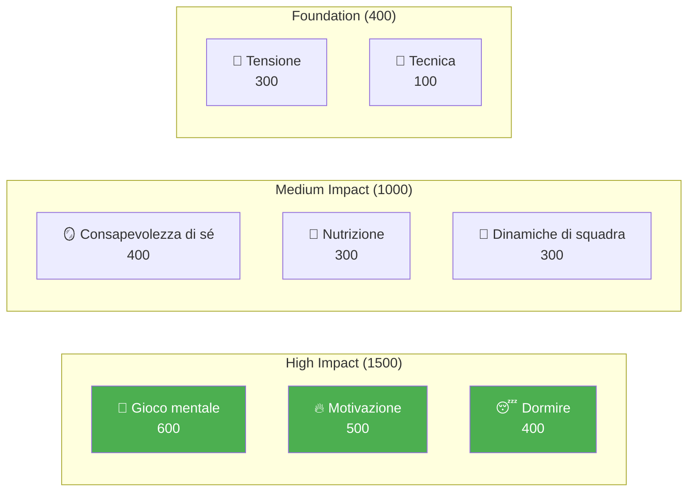

# Sviluppo dei giocatori d&#39;élite

Benvenuti al programma educativo della Pétanque Academy: il sistema completo di sviluppo dei giocatori basato su 8 fattori di prestazione.

::: tip Principio fondamentale
A livello d&#39;élite, l&#39;allenamento mentale diventa più importante dell&#39;allenamento tecnico. Si noti che la tecnica ha il peso minore, non perché non sia importante, ma perché a livello d&#39;élite tutti hanno una buona tecnica. I fattori differenzianti sono mentali.
:::

---

## Il modello di prestazione a 8 fattori

Il nostro programma è strutturato attorno a 8 fattori chiave, ponderati in base al loro impatto sulle prestazioni d&#39;élite:

| Fattore | Peso | Descrizione |
|--------|--------|-------------|
| 🧠 [**Gioco mentale**](/it/educazione/gioco-mentale/) | **600** | Modelli di pensiero, concentrazione, stati di flusso, dialogo interiore |
| 🔥 [**Motivazione**](/it/educazione/motivazione/) | **500** | Spinta, scopo, orientamento agli obiettivi, persistenza |
| 😴 [**Sonno e recupero**](/it/educazione/sonno/) | **400** | Qualità del sonno, recupero, riposo pre-gara |
| 🪞 [**Consapevolezza di sé**](/it/educazione/consapevolezza di sé/) | **400** | Percezione di sé accurata, riconoscimento dei punti ciechi |
| 🥗 [**Nutrizione**](/it/educazione/nutrizione/) | **300** | Stabilità della glicemia, idratazione, carburante per la competizione |
| 🤝 [**Dinamiche di squadra**](/it/istruzione/dinamiche-di-squadra/) | **300** | Comunicazione, fiducia, chiarezza del ruolo |
| 💆 [**Gestione della tensione**](/it/educazione/tensione/) | **300** | Tensione fisica, rilassamento, controllo del respiro |
| 🎯 [**Tecnica**](/it/educazione/tecnica/) | **100** | Meccanica fisica, repertorio di lancio |

**Totale: 2.900 punti**

---

## Perché questi pesi?

I pesi riflettono l&#39;**impatto a livello d&#39;élite**:

> &quot;Ai campionati regionali, la tecnica distingue il 50% dei migliori atleti. Ai campionati nazionali, tutti i partecipanti hanno una tecnica d&#39;élite. Ciò che li distingue è tutto il resto.&quot;

---

## Esplora ogni fattore

### 🧠 Gioco mentale (600 punti)

**Il fattore più influente per le prestazioni d&#39;élite.**

La tua capacità di gestire i pensieri, mantenere la concentrazione e accedere agli stati di flusso.

- [The Zone](/it/education/mental-game/the-zone/) — Comprendere e accedere agli stati di flusso
- [Forza mentale](/it/educazione/gioco-mentale/forza-mentale/) — Gestire la pressione, routine pre-tiro
- [Mindfulness](/it/educazione/gioco-mentale/mindfulness/) — Concentrazione sul momento presente, recupero dagli errori

### 🔥 Motivazione (500 punti)

**Cosa ti spinge a migliorare giorno dopo giorno, anno dopo anno.**

- [Definizione degli obiettivi](/it/educazione/motivazione/) — Obiettivi SMART, focalizzazione sul processo rispetto al risultato
- [Psicologia della motivazione](/it/educazione/motivazione/motivazione) — Intrinseco vs estrinseco, teoria dell&#39;autodeterminazione
- [Mantenere la motivazione](/it/educazione/motivazione/mantenere) — Prevenzione del burnout, navigazione del plateau

### 😴 Sonno e recupero (400 punti)

**Spesso trascurato, di enorme impatto.**

La qualità del sonno influisce direttamente sui tempi di reazione, sul processo decisionale e sulla regolazione emotiva.

- [La scienza del sonno per gli atleti](/it/educazione/sonno/) — Perché il sonno è importante per gli sport di precisione
- [Costruire abitudini del sonno](/it/educazione/sonno/abitudini) — Igiene pratica del sonno
- [Sonno e competizione](/it/educazione/sonno/competizione) — Protocolli pre-evento, gestione dei viaggi

### 🪞 Consapevolezza di sé (400 punti)

**Non puoi migliorare ciò che non vedi.**

Una percezione accurata di sé consente miglioramenti mirati.

- [Il vantaggio dell&#39;autoconsapevolezza](/it/educazione/autoconsapevolezza/) — Perché la conoscenza di sé è importante
- [Ricevere feedback](/it/educazione/consapevolezza di sé/feedback) — Prospettive esterne
- [Analisi video](/it/educazione/consapevolezza di sé/video) — Usare i video per l&#39;auto-scoperta

### 🥗 Nutrizione (300 punti)

**Energia stabile = prestazioni stabili.**

Il tuo cervello è uno strumento di precisione: alimentalo di conseguenza.

- [Alimentazione delle prestazioni](/it/educazione/nutrizione/) — Glicemia, idratazione, alimentazione per la competizione

### 🤝 Dinamiche di squadra (300 punti)

**Non sempre i team migliori sono quelli più abili.**

La comunicazione e la fiducia spesso superano il talento individuale.

- [Essere un ottimo compagno di squadra](/it/istruzione/dinamiche-di-squadra/) — Cultura e supporto di squadra
- [Comunicazione di squadra](/it/istruzione/dinamiche-di-squadra/comunicazione) — Comunicazione chiara e positiva

### 💆 Gestione della tensione (300 punti)

**La tensione è nemica della precisione.**

Non è possibile essere allo stesso tempo tesi e precisi.

- [Capire la tensione](/it/educazione/tensione/) — Tensione fisica vs. mentale
- [Tecniche di rilascio](/it/educazione/tensione/tecniche) — PMR, respirazione, ripristini rapidi
- [Gestione della competizione](/it/educazione/tensione/competizione) — Protocolli pre-partita e durante la partita

### 🎯 Tecnica (100 punti)

**Le fondamenta: necessarie ma non sufficienti.**

A livello d&#39;élite, la tecnica è un dato di fatto. I fattori differenzianti sono elencati sopra.

- [Panoramica della tecnica](/it/istruzione/tecnica/) — Meccanica fisica
- [Metodi di allenamento](/it/educazione/tecnica/allenamento/) — Pratica deliberata
- [Tattiche](/it/educazione/tecnica/tattiche/) — Decisioni strategiche

---

## Il percorso di sviluppo

Man mano che cresci come giocatore, il tuo rapporto di allenamento si inverte:

| Livello | Rapporto (Tecnologia:Mentale) | Messa a fuoco |
|-------|---------------------|-------|
| **Principiante** | 90:10 | Costruisci la macchina |
| **Intermedio** | 70:30 | Stabilizzare l&#39;abilità |
| **Avanzato** | 50:50 | Fidati della macchina |
| **Esperto** | 20:80 | Libertà di esecuzione |

Non puoi addestrare un principiante come un esperto (mancano i percorsi neurali) e non puoi addestrare un esperto come un principiante (un volume tecnico elevato porta a pensare troppo).

---

## Riferimento rapido: principi fondamentali

::: details Clicca per espandere: Elenco completo dei principi

### Regole del gioco mentale
1. **La regola dello scambio:** Analizza prima del cerchio, esegui nel cerchio, osserva dopo
2. **La regola della fiducia:** La tua mente cosciente pianifica, il tuo subconscio esegue
3. **La regola del presente:** Puoi controllare solo questo momento, questo lancio

### Regole di motivazione
1. **La regola del controllo:** Concentrarsi sugli obiettivi di processo piuttosto che sugli obiettivi di risultato
2. **La regola SMART:** Gli obiettivi devono essere specifici, misurabili, raggiungibili, pertinenti e vincolati al tempo
3. **La regola intrinseca:** La motivazione interna dura più a lungo delle ricompense esterne

### Regole del sonno
1. **La regola della coerenza:** Stesso orario di sveglia ogni giorno, anche nei fine settimana
2. **La regola del buffer:** Rilassati almeno 60 minuti prima di andare a letto
3. **La regola della competizione:** Dormire di più la settimana prima, non solo la notte prima

### Regole di autoconsapevolezza
1. **La regola del feedback:** Cerca attivamente prospettive esterne
2. **La regola del video:** Ciò che senti ≠ ciò che è reale: registra e rivedi
3. **La regola del punto cieco:** Una scarsa consapevolezza di sé influenza tutte le altre valutazioni

### Regole nutrizionali
1. **La regola della stabilità:** evitare picchi e crolli della glicemia
2. **La regola dell&#39;idratazione:** Anche una disidratazione del 2% compromette le prestazioni
3. **Regola del tempismo:** Mangiare 2-3 ore prima della gara

### Regole delle dinamiche di squadra
1. **La regola della comunicazione:** Una comunicazione chiara e positiva crea fiducia
2. **La regola del supporto:** Il modo in cui reagisci agli errori è più importante dell&#39;abilità
3. **La regola del ruolo:** Conosci il tuo ruolo ed eseguilo pienamente

### Regole di tensione
1. **La regola del rilascio:** Non puoi essere allo stesso tempo teso e preciso
2. **La regola di Yerkes-Dodson:** Trova la tua zona di eccitazione ottimale
3. **Regola del reset:** reset di 10 secondi prima di ogni lancio

### Regole tecniche
1. **La regola della specificità:** Allena ciò che vuoi migliorare
2. **La regola della variazione:** la pratica casuale batte la pratica bloccata
3. **La regola del recupero:** Il riposo è il momento in cui avviene l&#39;adattamento
:::

---

## Inizia il tuo viaggio

::: tip Punto di partenza consigliato
Inizia con [Mental Game](/it/education/mental-game/) per comprendere le basi delle prestazioni d&#39;élite. Poi esplora [Sonno](/it/education/sleep/) — spesso è il miglioramento con il ROI più elevato per i giocatori in crescita.
:::

