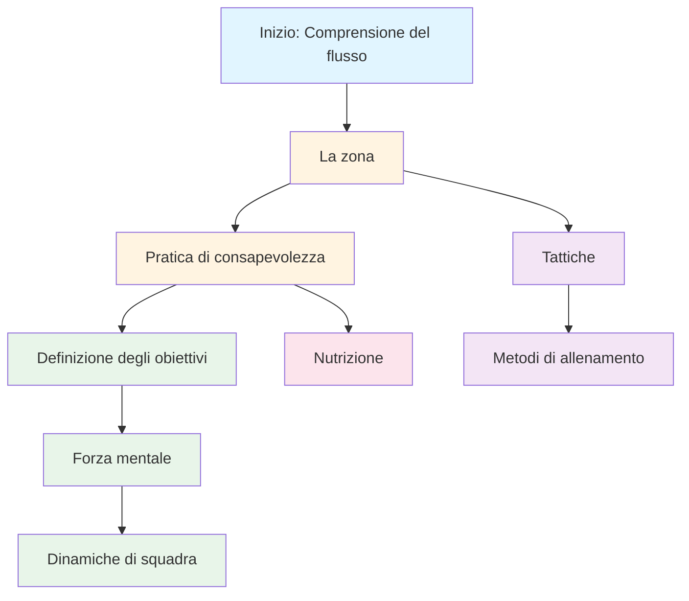

# Istruzione
<AdBanner />

Benvenuti al programma educativo della Pétanque Academy. È qui che i giocatori d&#39;élite imparano a padroneggiare il gioco mentale.

::: tip Principio fondamentale
A livello d&#39;élite, l&#39;allenamento mentale diventa più importante di quello tecnico. Il rapporto si inverte man mano che si progredisce: i principianti necessitano del 90% di lavoro tecnico, gli esperti dell&#39;80% di lavoro mentale.
:::

## Perché l&#39;allenamento mentale è importante

A livello d&#39;élite, l&#39;abilità tecnica è solo il punto di partenza. La ricerca dimostra che l&#39;atteggiamento mentale può essere importante quanto l&#39;abilità fisica negli sport di precisione come la pétanque. La differenza tra buoni giocatori e grandi giocatori risiede spesso nella loro mente.

> &quot;Lo sport è al 100% mentale. La mente è la forza trainante di tutte le capacità fisiche.&quot;

## Il tuo percorso di apprendimento

Ecco il percorso consigliato attraverso il nostro programma formativo:

**Sequenza consigliata:**
1. **Fondamenti:** Inizia con la Zona e la Mindfulness
2. **Struttura:** Aggiungi definizione degli obiettivi e metodi di formazione
3. **Competizione:** Sviluppa la forza mentale e le tattiche
4. **Gioco di squadra:** Padroneggia le dinamiche di squadra
5. **Ottimizzazione:** Ottimizza con la nutrizione

## I nostri percorsi di apprendimento

### 🎯 [La Zona (Stato di Flusso)](/it/educazione/la-zona/)
Scopri cos&#39;è veramente la &quot;zona&quot; e come accedervi. Comprendi la scienza alla base degli stati di flusso e scopri tecniche pratiche per dare il massimo quando serve di più.

### 🧘 [Mindfulness](/it/educazione/mindfulness/)
Padroneggia l&#39;arte di essere presente. Impara tecniche scientificamente provate per calmare la mente, migliorare la concentrazione e riprenderti rapidamente dagli errori.

### 📊 [Fissazione degli obiettivi](/it/istruzione/obiettivi/)
Crea una tabella di marcia per il tuo sviluppo. Impara il framework SMART adattato alla pétanque e costruisci un piano di allenamento che funzioni davvero.

### 💪 [Forza mentale](/it/educazione/forza-mentale/)
Sviluppa la forza mentale necessaria per la competizione. Impara a gestire la pressione, a superare l&#39;ansia e a sviluppare routine che favoriscano le massime prestazioni.

### 🤝 [Dinamiche di squadra](/it/education/team-player/)
Diventa il compagno di squadra con cui tutti vogliono giocare. Impara a comunicare, a fidarti e a contribuire a creare una cultura di squadra vincente.

### ♟️ [Tattiche](/it/educazione/tattiche/)
Pensa in modo strategico a ogni situazione. Impara a prendere decisioni basate sulle probabilità e a capire quando correre dei rischi.

### 🏋️ [Metodi di allenamento](/it/educazione/formazione/)
Allenati in modo più intelligente, non solo più duramente. Impara a strutturare la tua pratica per ottenere il massimo miglioramento.

### 🥗 [Nutrizione](/it/educazione/nutrizione/)
Alimenta il tuo cervello per prestazioni di precisione. Impara a mantenere energia e concentrazione stabili durante la gara.

## Il viaggio dalla tecnica al flusso

Man mano che cresci come giocatore, il tuo rapporto di allenamento si inverte: l&#39;allenamento mentale diventa più importante, non meno:

| Livello | Rapporto (Tecnologia:Mentale) | Obiettivo primario |
|-------|---------------------|-------------------|
| **Principiante** | 90:10 | Costruisci la macchina |
| **Intermedio** | 70:30 | Stabilizzare l&#39;abilità |
| **Avanzato** | 50:50 | Fidati della macchina |
| **Esperto** | 20:80 | Libertà di esecuzione |

Non puoi addestrare un principiante come un esperto (mancano i percorsi neurali) e non puoi addestrare un esperto come un principiante (un volume tecnico elevato porta a pensare troppo).

## Riferimento rapido: principi chiave di ogni sezione

| Sezione | Principio fondamentale | Conclusione chiave |
|---------|---------------|--------------|
| **La Zona** | Passa dalla modalità analitica a quella automatica | *&quot;Non esistono tecniche che producano sempre una boccia perfetta. Ma esiste uno stato mentale in cui le bocce perfette diventano naturali.&quot;* |
| **Consapevolezza** | Scegli dove porre la tua attenzione | *&quot;La consapevolezza non consiste nello svuotare la mente. Si tratta di scegliere dove concentrare la propria attenzione.&quot;* |
| **Definizione degli obiettivi** | Concentrati su ciò che controlli | *&quot;Un obiettivo senza un piano è solo un desiderio.&quot;* |
| **Forza mentale** | Renditi bene nonostante i nervi | *&quot;La forza mentale non consiste nell&#39;eliminare la tensione o nel non commettere mai errori. Si tratta di ottenere buoni risultati nonostante gli errori.&quot;* |
| **Dinamiche di squadra** | La fiducia e la comunicazione vincono le partite | *&quot;Le squadre migliori non sono sempre quelle più abili: sono quelle che giocano meglio insieme.&quot;* |
| **Tattiche** | Il processo decisionale supera la tecnica | *&quot;A livello d&#39;élite, la differenza raramente è nella tecnica, ma nel processo decisionale.&quot;* |
| **Formazione** | Qualità prima della quantità | *&quot;Allenati in modo più intelligente, non solo più duramente.&quot;* |
| **Nutrizione** | Energia stabile = prestazioni stabili | *&quot;Il tuo cervello è uno strumento di precisione. Alimentalo di conseguenza.&quot;* |

## Tutte le regole chiave e i punti chiave da ricordare

::: details Clicca per espandere: Elenco completo dei principi
Questa è la tua guida di riferimento rapido. Aggiungi questa sezione ai preferiti e consultala regolarmente.

### Le regole della zona
1. **La regola dello scambio:** Analizzare prima del cerchio, eseguire nel cerchio, osservare dopo
2. **La regola dell&#39;inversione:** Man mano che l&#39;abilità aumenta, l&#39;allenamento mentale diventa più importante dell&#39;allenamento tecnico
3. **La regola della fiducia:** La tua mente cosciente pianifica, il tuo subconscio esegue

### Regole di consapevolezza
1. **La regola della consapevolezza:** Osservare senza giudizio
2. **La regola SOAS:** Fermati, Osserva, Accetta, Scivola (lascia andare)
3. **La regola del presente:** Puoi controllare solo questo momento, questo lancio

### Regole per la definizione degli obiettivi
1. **La regola del controllo:** Concentrati sugli obiettivi di processo (ciò che controlli) piuttosto che sugli obiettivi di risultato
2. **La regola SMART:** Gli obiettivi devono essere specifici, misurabili, raggiungibili, pertinenti e vincolati al tempo
3. **La regola di ripartizione:** Gli obiettivi di grandi dimensioni necessitano di traguardi trimestrali, mensili e settimanali

### Regole di forza mentale
1. **La regola della routine:** Le routine pre-tiro coerenti innescano prestazioni di picco
2. **La regola del reset:** Sviluppa una routine di reset di 10 secondi dopo gli errori
3. **Il ciclo della fiducia:** Migliore preparazione → Più fiducia → Migliori prestazioni

### Regole tattiche
1. **La regola della probabilità:** Scegli i lanci in cui la probabilità di successo giustifica il rischio
2. **Regola del controllo del jack:** La squadra che controlla la posizione del jack ha il vantaggio
3. **La regola della distanza:** La distanza corta favorisce il tiro, la distanza lunga favorisce il puntamento
4. **La regola dello stile:** Forza il gioco nello stile più forte della tua squadra
5. **La regola della gestione delle bocce:** A volte concedere 1 punto è meglio che rischiarne 3

### Regole delle dinamiche di squadra
1. **La regola della comunicazione:** Una comunicazione chiara e positiva crea fiducia
2. **La regola del supporto:** Il modo in cui rispondi agli errori dei compagni di squadra è più importante della tua abilità
3. **La regola del ruolo:** Conosci il tuo ruolo ed eseguilo pienamente

### Regole di allenamento
1. **La regola della specificità:** Allena ciò che vuoi migliorare
2. **Regola della variazione:** La pratica casuale batte la pratica bloccata per il trasferimento della competizione
3. **La regola del recupero:** Il riposo è il momento in cui avviene l&#39;adattamento

### Regole nutrizionali
1. **La regola della stabilità:** evitare picchi e crolli della glicemia
2. **La regola dell&#39;idratazione:** Anche una disidratazione del 2% compromette le prestazioni
3. **Regola del tempismo:** Mangiare 2-3 ore prima della gara
:::

## Inizia il tuo viaggio

::: tip Punto di partenza consigliato
Inizia con [The Zone](/it/education/the-zone/) per comprendere le basi delle prestazioni d&#39;élite, quindi esplora [Mindfulness](/it/education/mindfulness/) per tecniche pratiche che puoi utilizzare immediatamente.
:::

<AdBanner />
:::

<AdBanner />
