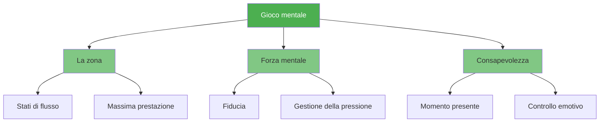

# Gioco mentale

::: tip Il fattore più importante
**Peso: 600 punti** — Il gioco mentale ha il massimo impatto sulle tue prestazioni. Padroneggia la tua mente e tutto il resto verrà da sé.
:::

Il gioco mentale comprende tutto ciò che accade tra le tue orecchie: i tuoi pensieri, la concentrazione, la sicurezza e il dialogo interiore. I giocatori d&#39;élite non hanno solo una tecnica migliore, ma hanno anche un maggiore controllo sul loro stato mentale.

## I tre pilastri

### 🎯 [La Zona](/it/educazione/gioco-mentale/la-zona/)
Accedi allo stato di flusso in cui le prestazioni risultano fluide e senza sforzo. Scopri cosa innesca il flusso e come entrarci in modo coerente.

- [Introduzione a The Zone](/it/educazione/gioco-mentale/the-zone/)
- [Allenamento tecnico vs. allenamento di flusso](/it/istruzione/gioco-mentale/la-zona/allenamento-tecnico-vs-allenamento-di-flusso)
- [Entrare nella zona](/it/educazione/gioco-mentale/la-zona/entrare-nella-zona)

### 💪 [Forza mentale](/it/educazione/gioco-mentale/forza-mentale/)
Sviluppa la resilienza psicologica necessaria per lavorare sotto pressione. Sviluppa la fiducia in te stesso, gestisci le battute d&#39;arresto e mantieni la calma.

- [Sviluppare la forza mentale](/it/educazione/gioco-mentale/forza-mentale/)
- [Gestire la pressione](/it/educazione/gioco-mentale/forza-mentale/gestire-la-pressione)
- [Routine pre-tiro](/it/educazione/gioco-mentale/forza-mentale/routine-pre-tiro)

### 🧘 [Mindfulness](/it/educazione/gioco-mentale/mindfulness/)
Sviluppa la consapevolezza del momento presente per rimanere concentrato e riprenderti rapidamente dagli errori.

- [Introduzione alla Mindfulness](/it/educazione/gioco-mentale/mindfulness/)
- [Tecniche di consapevolezza](/it/educazione/gioco-mentale/mindfulness/tecniche)
- [Pratica quotidiana](/it/educazione/gioco-mentale/mindfulness/pratica-quotidiana)

## Perché il gioco mentale è ciò che conta di più

| Aspetto | Formazione tecnica | Allenamento mentale |
|--------|-------------------|-----------------|
| **In pratica** | Puoi fare il tiro | Puoi fare il tiro |
| **In competizione** | La tecnica può fallire sotto pressione | Le capacità mentali mantengono le prestazioni |
| **La differenza** | È necessaria abilità fisica | L&#39;abilità mentale è il moltiplicatore |

::: warning L&#39;errore comune
La maggior parte dei giocatori dedica il 90% del proprio tempo alla tecnica e il 10% alle capacità mentali. I giocatori d&#39;élite spesso invertono questa proporzione una volta acquisiti solidi fondamentali.
:::

## Da dove cominciare?

**Sei nuovo all&#39;allenamento mentale?** Inizia con [The Zone](/it/education/mental-game/the-zone/) per capire cosa significa raggiungere le massime prestazioni.

**Hai difficoltà sotto pressione?** Vai a [Forza mentale](/it/educazione/gioco-mentale/forza-mentale/) per tecniche pratiche.

**La mente vaga durante le partite?** La [Mindfulness](/it/educazione/gioco-mentale/mindfulness/) ti aiuterà a rimanere presente.

## Risorse correlate

- [Consapevolezza di sé](/it/educazione/consapevolezza di sé/) — Conosci te stesso per migliorare più velocemente
- [Gestione della tensione](/it/educazione/tensione/) — Il rilassamento fisico consente la chiarezza mentale
- [Strumento di valutazione](/it/education/) — Valuta il tuo gioco mentale e ricevi consigli personalizzati

