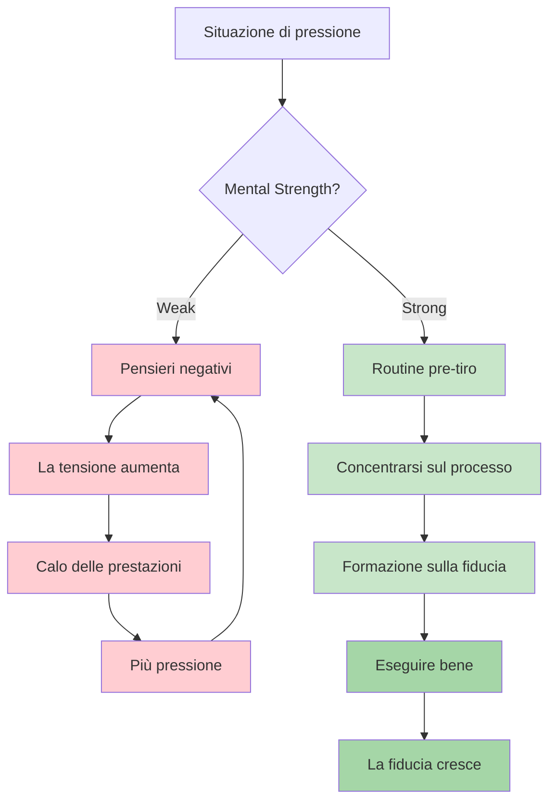

# Forza mentale

La forza mentale è ciò che distingue i giocatori che danno il massimo in allenamento da quelli che danno il massimo quando conta. È la capacità di gestire la pressione, riprendersi dalle battute d&#39;arresto e mantenere la concentrazione durante le lunghe competizioni.

::: tip Il principio fondamentale
**La forza mentale non consiste nell&#39;eliminare la tensione o nel non commettere mai errori. Si tratta di ottenere buoni risultati nonostante gli errori.** Non puoi controllare cosa succede. Puoi controllare come reagisci.
:::

## Cos&#39;è la forza mentale?

La forza mentale include:
- **Fiducia:** Credere nelle proprie capacità
- **Focus:** Mantenere l&#39;attenzione su ciò che conta
- **Resilienza:** Riprendersi dagli errori
- **Composizione:** Mantenere la calma sotto pressione
- **Motivazione:** Sforzo costante nel tempo

Non si tratta di caratteristiche fisse, ma di competenze che puoi sviluppare.

## Le esigenze mentali della boccia

La bocce presenta sfide mentali uniche:

| Sfida | Perché è difficile |
|-----------|--------------|
| Tempo tra i lanci | Opportunità per pensieri negativi |
| Risultati visibili | Tutti vedono i tuoi errori |
| Formato della squadra | Pressione per non deludere i partner |
| Competizioni lunghe | Stanchezza mentale per molte ore |
| Chiudi i giochi | Puntate alte sui lanci singoli |
| Oscillazioni di slancio | Montagne russe emozionali |

## Costruire la forza mentale

### 1. Sviluppare la fiducia in se stessi

La fiducia deriva da:
- **Preparazione:** Sapere di aver fatto il lavoro
- **Successi passati:** Ricordare i momenti in cui hai ottenuto buoni risultati
- **Dialogo interiore positivo:** come parli a te stesso
- **Linguaggio del corpo:** Stare dritti, muoversi con uno scopo

**Creatori di fiducia:**
- Tieni un diario dei successi
- Visualizza le performance di successo
- Preparati accuratamente per le competizioni
- Usa un linguaggio del corpo sicuro (influenza la tua mente)

### 2. Padroneggia il tuo dialogo interiore

La voce nella tua testa è estremamente importante.

**Discorso interiore distruttivo:**
- &quot;Mi mancano sempre queste cose&quot;
- &quot;Sto per soffocare&quot;
- &quot;I miei compagni di squadra contano su di me&quot; (pressione)
- &quot;È stato terribile&quot;

**Dialogo interiore costruttivo:**
- &quot;Ho già fatto questo lancio prima&quot;
- &quot;Fidati del mio allenamento&quot;
- &quot;Un lancio alla volta&quot;
- &quot;Prossimo lancio, nuovo inizio&quot;

**Cambiare il tuo dialogo interiore:**
1. Nota cosa dici a te stesso
2. Contesta le affermazioni negative
3. Sostituisci con alternative realistiche e utili
4. Esercitati finché non diventa automatico

### 3. Sviluppare la resilienza

La resilienza è la capacità di riprendersi dalle battute d&#39;arresto.

**La mentalità resiliente:**
- Gli errori sono informazioni, non fallimenti
- Un tiro sbagliato non ti definisce
- Gli insuccessi sono temporanei
- Puoi sempre rispondere bene a ciò che accade

**Costruire la resilienza:**
- Esercitati a recuperare dagli errori durante l&#39;allenamento
- Utilizzare il metodo SOAS (Stop, Observe, Accept, Slip)
- Concentrati sulla risposta, non sull&#39;evento
- Sviluppa una memoria breve per i lanci sbagliati

### 4. Gestisci la tua energia

La forza mentale richiede una buona gestione dell&#39;energia:

**Energia fisica:**
- Dormire bene prima delle gare
- Mangiare correttamente (glicemia stabile)
- Rimani idratato
- Spostarsi tra i giochi (non stare seduto troppo a lungo)

**Energia mentale:**
- Fai delle pause quando possibile
- Non analizzare troppo tra un lancio e l&#39;altro
- Riserva la concentrazione intensa per quando ne hai bisogno
- Avere delle routine di recupero

## Il ciclo fiducia-competenza

::: info Il ciclo positivo

**Costruiscilo attraverso:**
1. Pratica di qualità (costruisce competenza)
2. Monitoraggio dei progressi (aumenta la fiducia)
3. Prestazioni di successo (rafforza entrambi)
:::

## In questa sezione

- **[Gestire la pressione](/it/education/mental-game/mental-strength/gestire-la-pressione)** - Tecniche per situazioni ad alto rischio
- **[Routine pre-tiro](/it/education/mental-game/mental-strength/routine-pre-tiro)** - Costruisci il tuo trigger di prestazione

## Riepilogo: Regole della forza mentale

::: tip Regola n. 1: la regola della routine
**Routine pre-tiro coerenti garantiscono prestazioni ottimali.**
Stessa routine ogni volta = trigger affidabile per lo stato di flusso
:::

::: tip Regola n. 2: la regola del reset
**Sviluppa una routine di ripristino di 10 secondi dopo gli errori.**
Reset fisico (respiro profondo, rotazione delle spalle) + reset mentale (metodo SOAS)
:::

::: tip Regola n. 3: La regola del ciclo di fiducia
**Migliore preparazione → Più sicurezza → Migliori prestazioni.**
Il ciclo funziona in entrambi i sensi. Costruiscilo attraverso una pratica di qualità e monitorando i progressi.
:::

::: tip Regola n. 4: la regola del dialogo interiore
**Parla a te stesso come parleresti a un compagno di squadra.**
Supportivo, costruttivo, concentrato su cosa fare (non su cosa è andato storto)
:::

::: tip Regola n. 5: La regola di gestione dell&#39;energia
**Riserva la concentrazione intensa per quando ne hai bisogno.**
Non analizzare troppo tra un lancio e l&#39;altro. Conserva l&#39;energia mentale per l&#39;esecuzione.
:::

## Conclusione chiave

> La forza mentale non consiste nell&#39;ignorare la tensione o nel non commettere mai errori. Si tratta di ottenere buoni risultati nonostante gli errori.

Non puoi controllare cosa succede. Puoi controllare come reagisci.

