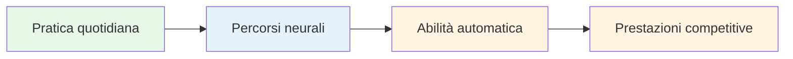

# Costruire una pratica quotidiana di consapevolezza

I benefici della mindfulness derivano dalla pratica costante. Ecco come integrarla nella tua vita.

::: tip La grande idea
**La costanza batte l&#39;intensità.** Cinque minuti al giorno sono meglio di un&#39;ora a settimana. Inizia in piccolo, sii costante e i benefici si accumuleranno nel tempo.
:::

## Perché la pratica quotidiana è importante

::: info La consapevolezza è come l&#39;attività fisica
- ❌ Non puoi metterti in forma con una sola sessione in palestra
- ✅ La pratica regolare crea un cambiamento duraturo
- ✅ Gli effetti si accumulano nel tempo
- ✅ Diventa più facile con la coerenza
:::

```mermaid
graph TD
    A[Pratica coerente] --> B[Settimana 1: Costruire un&#39;abitudine]
    B --> C[Mese 1: Avviso sui vantaggi]
    C --> D[Mese 3: Più naturale]
    D --> E[Anno 1+: Abilità fondamentale]

    style A fill:#e8f5e9
    style E fill:#fff4e1
```

::: tip Ricerca supportata
Le ricerche dimostrano che anche **3 minuti al giorno** producono benefici misurabili. Ma è necessario farlo regolarmente.
:::

## Creare la tua routine

### Fase 1: Scegli il tuo orario

Scegli un orario coerente che si adatti alla tua vita:

| Tempo | Vantaggi | Considerazioni |
|------|------------|----------------|
| **Mattina** | Dà il tono alla giornata, meno interruzioni | Bisogno di svegliarsi prima |
| **Mezzogiorno** | Spezza la giornata, ripristina la concentrazione | Potrebbe dimenticare, conflitti di programmazione |
| **Sera** | Rilassati, rifletti sulla giornata | Potrebbe essere stanco, meno vigile |
| **Prima dell&#39;allenamento** | Collegamento diretto a bocce | Dipende dal programma di allenamento |

**Approccio migliore:** Collegalo a un&#39;abitudine esistente (dopo il caffè, prima di pranzo, ecc.)

### Fase 2: Inizia in piccolo

Non puntare a 30 minuti il primo giorno.

**Progressione consigliata:**
- Settimana 1-2: 3-5 minuti
- Settimana 3-4: 5-10 minuti
- Mese 2: 10-15 minuti
- Mese 3+: 15-20 minuti

È meglio fare 5 minuti al giorno piuttosto che 30 minuti una volta alla settimana.

### Fase 3: Crea il tuo spazio

Non è necessario avere una stanza per la meditazione, ma avere un posto fisso aiuta:
- Un posto tranquillo (oppure usa le cuffie)
- Seduta comoda
- Distrazioni minime
- Se possibile, sempre nello stesso posto

### Fase 4: rimuovere le barriere

Rendi facile la pratica:
- Metti il telefono in modalità silenziosa
- Dite ai familiari/coinquilini di non interrompere
- Prepara tutto (cuscino, timer)
- Non aspettare le condizioni &quot;perfette&quot;

## Esempi di programmi giornalieri

### Pratica minima (5 minuti)
- Mattina: 3 minuti di respirazione consapevole
- Durante la giornata: 3 momenti di consapevolezza con la campana
- Sera: 2 minuti di consapevolezza corporea prima di dormire

### Pratica standard (15 minuti)
- Mattina: 10 minuti di meditazione seduta
- Mezzogiorno: 2 minuti di respirazione consapevole
- Sera: scansione corporea di 3 minuti

### Pratica intensiva (30 minuti)
- Mattina: 15 minuti di meditazione seduta
- Mezzogiorno: 5 minuti di meditazione camminata
- Sera: scansione corporea di 10 minuti
- In più: Mangiare consapevolmente in un pasto

## Integrazione con l&#39;allenamento di bocce

### Prima della pratica
- 5 minuti di meditazione seduta
- Stabilisci un&#39;intenzione per la sessione
- Scansione del corpo per rilevare eventuali tensioni

### Durante la pratica
- Utilizzare la routine pre-tiro come pratica di consapevolezza
- Applicare SOAS dopo gli errori
- Rimani presente tra un lancio e l&#39;altro

### Dopo l&#39;allenamento
- 3 minuti di riflessione (senza giudizio)
- Nota eventuali momenti di flusso
- Respirazione consapevole per la transizione

## Monitoraggio della tua pratica

Tenere traccia aiuta a mantenere la coerenza:

### Registro semplice
| Data | Durata | Tipo | Note |
|------|----------|------|-------|
| lun | 10 minuti | Seduto | Mente molto occupata |
| Martedì | 10 minuti | Seduto | Più calmo oggi |
| Mercoledì | 5 minuti | scansione corporea | Ho trovato tensione nelle spalle |

### Cosa monitorare
- Ti sei esercitato? (Sì/No)
- Per quanto?
- Che tipo?
- Breve nota sull&#39;esperienza (facoltativa)

### App che aiutano
- Spazio di testa
- Calma
- Timer di approfondimento
- Semplici tracker delle abitudini

## Superare gli ostacoli comuni

### &quot;Non ho tempo&quot;
- Hai 3 minuti
- Si tratta di priorità, non di tempo
- Prova a collegarti ad attività esistenti

### &quot;Continuo a dimenticare&quot;
- Imposta una sveglia giornaliera
- Collegamento all&#39;abitudine esistente
- Metti un promemoria visivo in un posto dove lo vedrai

### &quot;Non lo sto facendo bene&quot;
- Non esiste un modo &quot;giusto&quot;
- Se stai prestando attenzione, lo stai facendo
- La mente vagabonda è normale e prevista

### &quot;Non vedo risultati&quot;
- I benefici sono inizialmente sottili
- Tieni un diario per notare i cambiamenti nel tempo
- Fidati della ricerca: funziona

### &quot;È noioso&quot;
- La noia è solo un&#39;altra esperienza da osservare
- Prova tecniche diverse
- Ricorda perché lo stai facendo

## Segnali di progresso

Potresti non notare cambiamenti radicali, ma fai attenzione a:
- Cogliere te stesso quando la mente vaga (più velocemente)
- Recuperare più rapidamente dalla frustrazione
- Notare la tensione prima che si accumuli
- Sentirsi più presenti durante le partite
- Dormire meglio
- Meno reattivo ai lanci sbagliati

## Il gioco lungo

La consapevolezza è una pratica che dura tutta la vita. Gli atleti professionisti spesso affermano che è l&#39;abilità più preziosa che abbiano mai sviluppato.

**Mese 1:** Costruire l&#39;abitudine
**Mesi 2-3:** Inizio a notare i benefici
**Mesi 4-6:** Diventare più naturali
**Anno 1+:** Parte fondamentale di ciò che sei

## Conclusione chiave

> La costanza è meglio dell&#39;intensità. Cinque minuti al giorno sono meglio di un&#39;ora a settimana.

Inizia oggi. Inizia in piccolo. Continua.

