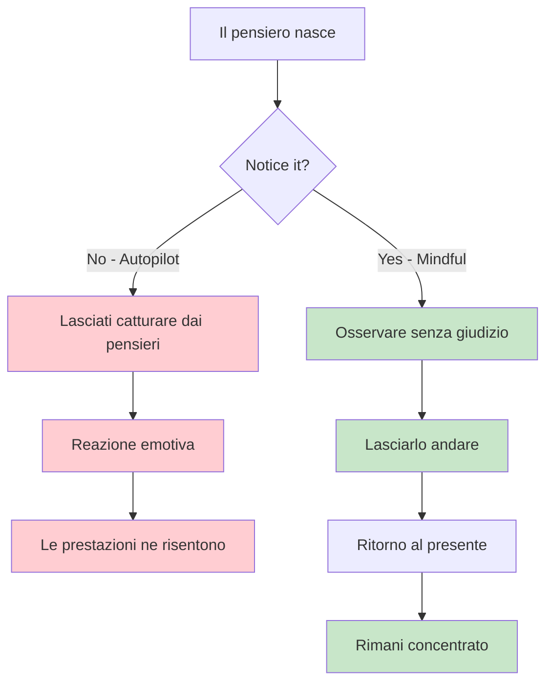
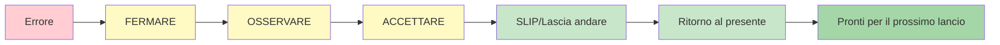

# Mindfulness per i giocatori di bocce

La consapevolezza è uno degli strumenti più potenti a disposizione degli atleti. Non è mistica o complicata: è semplicemente la pratica di prestare attenzione al momento presente senza giudizio.

::: tip Il principio fondamentale
**La consapevolezza non consiste nello svuotare la mente. Si tratta di scegliere dove concentrare la propria attenzione.** Non puoi impedire ai pensieri di sorgere, ma puoi scegliere di non seguirli.
:::

## Cos&#39;è la Mindfulness?

Mindfulness significa essere pienamente presenti e consapevoli di:
- Dove sei
- Cosa stai facendo
- Come ti senti

...senza essere sopraffatti da ciò che accade intorno a te o reagire ad esso.

Per i giocatori di pétanque, questo si traduce in:
- Essere pienamente presenti per ogni lancio
- Notare i pensieri senza rimanerne intrappolati
- Recuperare rapidamente dagli errori
- Mantenere la calma sotto pressione

## La scienza dietro tutto questo

La consapevolezza non è solo filosofia: è supportata da solide ricerche:

### Effetti sul cervello
- **Riduce l&#39;attività nell&#39;amigdala** (il sistema di allarme del cervello)
- **Rafforza la corteccia prefrontale** (processo decisionale e concentrazione) - questo ti aiuta a pensare chiaramente durante la pianificazione
- **Migliora la tua capacità di calmare la mente** quando necessario - essenziale per accedere allo stato di flusso durante l&#39;esecuzione
- **Migliora le connessioni** tra le regioni del cervello
- **Crea cambiamenti strutturali duraturi** con la pratica regolare

### Effetti sulle prestazioni
| Beneficio | Come aiuta il tuo gioco |
|---------|----------------------|
| Riduzione dello stress | Cortisolo più basso, mani più ferme |
| Migliore messa a fuoco | Meno distrazioni, decisioni più chiare |
| Controllo emotivo | Non lasciare che i lanci sbagliati diventino una spirale |
| Recupero più rapido | Riprendersi rapidamente dagli errori |
| Sonno migliorato | Riposo migliore, prestazioni migliori |

## Perché i giocatori di bocce hanno bisogno di consapevolezza

La bocce presenta sfide mentali uniche:

1. **Tempo tra i lanci** - Molte opportunità per pensieri negativi
2. **Errori visibili** - Tutti vedono quando sbagli
3. **Pressione di squadra** - Il tuo lancio influenza i tuoi partner
4. **Gare lunghe** - Stanchezza mentale per molte ore
5. **Partite ravvicinate** - Alta pressione nei momenti decisivi

La consapevolezza ti aiuta a gestire tutto questo.

## L&#39;abilità fondamentale: consapevolezza non giudicante

La parola chiave è &quot;non giudicante&quot;.

::: danger Pensiero giudicante (aggiunge peso emotivo)
❌ &quot;È stato un lancio terribile&quot;
❌ &quot;Mi mancano sempre&quot;
❌ &quot;I miei compagni di squadra devono essere frustrati&quot;

**Risultato:** Spirale di emozioni negative, tensione, peggioramento delle prestazioni
:::

::: tip Consapevolezza non giudicante (si limita ad osservare)
✅ &quot;Il tiro è andato a sinistra del bersaglio&quot;
✅ &quot;Mi accorgo di sentirmi teso&quot;
✅ &quot;La mia mente vaga verso la partitura&quot;

**Risultato:** Osservazione chiara, recupero rapido, mantenimento della concentrazione
:::

**La differenza?** Il giudizio aggiunge peso emotivo e innesca reazioni. La consapevolezza si limita a osservare e ti permette di rispondere con abilità.

## Iniziare

Non hai bisogno di ore di meditazione. Inizia con queste semplici pratiche:

### 1. Respirazione consapevole (2 minuti)
- Siediti comodamente
- Concentrati sul tuo respiro
- Quando la tua mente vaga (lo farà), torna dolcemente al respiro
- Nessun giudizio sul vagabondaggio: basta tornare indietro

### 2. Scansione del corpo (5 minuti)
- Nota le sensazioni nei tuoi piedi
- Sposta lentamente l&#39;attenzione verso l&#39;alto attraverso il tuo corpo
- Osserva e basta, non cercare di cambiare nulla
- Nota le aree di tensione senza combatterle

### 3. Momenti di consapevolezza
- Scegli un&#39;attività quotidiana (bere caffè, camminare)
- Fallo con la massima attenzione
- Nota tutte le sensazioni coinvolte
- Quando la tua mente vaga, torna all&#39;attività

## Mindfulness nella competizione

### Prima della partita
- Prenditi 2-3 minuti per respirare consapevolmente
- Stabilisci un&#39;intenzione su come vuoi giocare (non il risultato, ma il processo)
- Nota qualsiasi nervosismo senza cercare di eliminarlo

### Durante il gioco
- Usa la tua routine pre-tiro come un&#39;ancora di consapevolezza
- Tra un lancio e l&#39;altro, riporta l&#39;attenzione al presente
- Prendi nota dei pensieri sul punteggio/risultato, poi lasciali andare

### Dopo gli errori

::: warning Il metodo SOAS (il tuo strumento di ripristino)
**S**top - Fai una pausa prima di reagire
**O**bserva - Cosa è successo? Cosa sto provando?
**A**ccetto - È successo. È fatta.
**S**lip (Lascia andare) - Rilascialo, torna al presente

**Tempo necessario:** 10 secondi
**Usalo:** Dopo ogni errore, brutto rimbalzo o momento frustrante
:::

## In questa sezione

- **[Tecniche](/it/educazione/gioco-mentale/mindfulness/tecniche)** - Esercizi pratici che puoi usare
- **[Pratica quotidiana](/it/educazione/gioco-mentale/mindfulness/pratica-quotidiana)** - Integrare la consapevolezza nella tua vita

## Riepilogo: Regole della consapevolezza

::: tip Regola n. 1: la regola della consapevolezza
**Osserva senza giudizio.**
Nota i pensieri e i sentimenti senza etichettarli come buoni o cattivi.
:::

::: tip Regola n. 2: la regola SOAS
**Fermati, osserva, accetta, scivola (lascia andare).**
Il tuo reset di 10 secondi dopo un errore. Usalo ogni volta.
:::

::: tip Regola n. 3: La regola attuale
**Puoi controllare solo questo momento, questo lancio.**
I lanci passati sono fatti. I lanci futuri non esistono ancora. Sii qui ora.
:::

::: tip Regola n. 4: la regola della pratica
**Inizia con poco: 2-5 minuti al giorno.**
La costanza è meglio della durata. La pratica quotidiana sviluppa l&#39;abilità.
:::

## Conclusione chiave

> La consapevolezza non consiste nello svuotare la mente. Si tratta di scegliere dove concentrare la propria attenzione.

Non puoi impedire ai pensieri di sorgere. Ma puoi scegliere di non seguirli nella tana del Bianconiglio.

