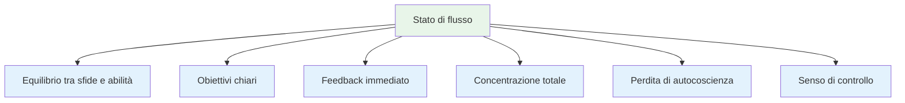
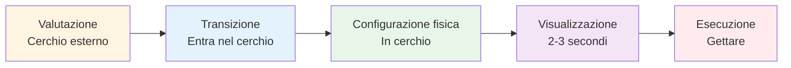
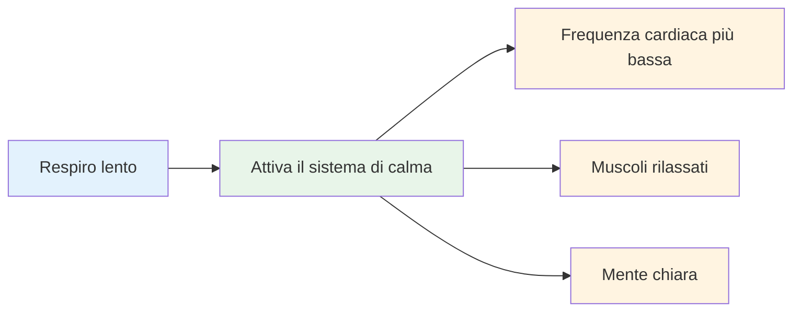
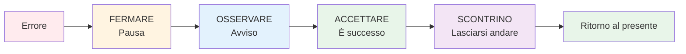

# Entrare nella zona: tecniche pratiche

La zona non è qualcosa che ti capita all&#39;improvviso. Con la pratica, puoi imparare ad accedervi in modo più costante. Ecco tecniche comprovate utilizzate dagli atleti d&#39;élite.

::: tip La grande idea
**Puoi allenarti a entrare negli stati di flusso in modo più affidabile.** La zona non è magica: è un&#39;abilità che si sviluppa attraverso tecniche specifiche e pratica costante.
:::

## Le sei condizioni per il flusso

La ricerca dimostra che gli stati di flusso richiedono determinate condizioni:

| Condizione | Cosa significa | A bocce |
|-----------|---------------|-------------|
| **Bilanciamento Sfida/Abilità** | Il compito ti mette alla prova ma è realizzabile | Competere al tuo livello, non troppo facile o impossibile |
| **Obiettivi chiari** | Sai esattamente cosa stai cercando di fare | Obiettivo specifico, intenzione chiara per ogni lancio |
| **Feedback immediato** | Vedi i risultati delle tue azioni | La palla atterra, sai se ha funzionato |
| **Focus totale** | Attenzione completa al compito | Nessuna distrazione, solo il momento presente |
| **Perdita di autocoscienza** | Non preoccuparti del tuo aspetto | Non importa chi sta guardando |
| **Senso di controllo** | Sentirsi in grado di gestirlo | Abbi fiducia nel tuo allenamento e nelle tue capacità |

::: info Intuizione chiave
Quando queste sei condizioni si allineano, il flusso diventa possibile. Il tuo compito è creare queste condizioni deliberatamente.
:::

## Tecnica 1: La routine pre-tiro

La routine pre-tiro è la porta d&#39;accesso alla zona. È una sequenza costante che segnala al cervello: &quot;È il momento di eseguire&quot;.

### Costruire la tua routine

Una buona routine presenta i seguenti elementi:

::: details 1. Valutazione visiva (fuori dal cerchio)
- Leggi il terreno
- Scegli il tuo bersaglio e il punto di atterraggio
- Decidi il tipo di lancio

**È qui che avviene il pensiero.** Prenditi il tuo tempo.
:::

::: details 2. Transizione (Entrare nel Cerchio)
- Fai un respiro
- Lascia andare l&#39;analisi
- Passa alla modalità di esecuzione

**Questo è il passaggio.** L&#39;analisi si ferma qui.
:::

::: details 3. Trigger fisico (nel cerchio)
- Una posizione coerente
- Un controllo specifico della presa
- Un piccolo movimento che ti sembra naturale

**Rendilo coerente.** Sempre lo stesso.
:::

::: details 4. Visualizzazione (breve, 2-3 secondi)
- Guarda il percorso della palla
- Senti il lancio riuscito
- Connettiti con il tuo target

**Sii breve.** Troppo lungo = pensare troppo.
:::

::: details 5. Esecuzione
- Concentrati solo sul bersaglio
- Fidati del tuo corpo
- Rilasciare senza esitazione

**Solo messa a fuoco esterna.** Obiettivo, non tecnica.
:::

### Perché le routine funzionano

La tua routine diventa una &quot;campana della consapevolezza&quot;, un segnale che cambia il tuo stato cerebrale. Con una certa frequenza, il semplice avvio della tua routine innesca il cambiamento mentale che ti porta a fluire.

::: tip Suggerimento pratico
Usa la tua routine in OGNI lancio in allenamento, non solo in gara. La routine deve diventare automatica.
:::

## Tecnica 2: Messa a fuoco esterna

Il punto in cui concentriamo la nostra attenzione è estremamente importante.

| Tipo di messa a fuoco | Cosa ne pensi | Esempi di pensieri |
|------------|---------------------|------------------|
| **Interno** ❌ | La meccanica del tuo corpo | &quot;Tieni il gomito dritto&quot;  &quot;Seguire correttamente&quot;  &quot;Non stringere troppo forte&quot; |
| **Esterno** ✅ | Obiettivo e risultato | &quot;Atterralo proprio lì&quot;  &quot;Vedi il percorso&quot;  &quot;Colpisci il bersaglio&quot; |

::: tip Risultati della ricerca
Gli studi dimostrano costantemente che **l&#39;attenzione esterna produce risultati migliori** per i giocatori esperti. Il tuo corpo sa cosa fare: lascialo lavorare.
:::

### Pratica la focalizzazione esterna
- Scegli un punto specifico sul terreno (non solo &quot;vicino al cric&quot;)
- Visualizza l&#39;intero percorso della palla
- Tieni gli occhi sul bersaglio, non sulla mano

::: warning Errore comune
Sotto pressione, i giocatori spesso ricorrono alla concentrazione interiore (&quot;Non rovinare la mia tecnica&quot;). Ed è proprio in questi momenti che è più necessaria la concentrazione esterna.
:::

## Tecnica 3: La stretta della mano sinistra

Questa insolita tecnica ha fondamento scientifico.

::: info La scienza
Stringere la mano sinistra (se si è destrorsi) per 10-15 secondi prima di lanciare:
- ✅ Attiva l&#39;emisfero destro del cervello (spaziale, intuitivo)
- ✅ Calma l&#39;emisfero sinistro (verbale, analitico)
- ✅ Riduce il pensiero eccessivo
:::

**Come usarlo:**
1. Fai un pugno con la mano che non lanci
2. Premere con forza per 10-15 secondi
3. Rilascia e inizia la tua routine
4. Gettare

::: tip Quando usare
Funziona meglio quando ti accorgi di pensare troppo o di sentirti sotto pressione. È come un &quot;pulsante di reset&quot; per il tuo cervello.
:::

## Tecnica 4: Controllo del respiro

Il respiro influenza direttamente il tuo stato mentale.

**Prima di entrare nel cerchio:**
- Fai un respiro lento e profondo
- Espira completamente
- Senti le tue spalle cadere

**Nel cerchio:**
- Respirare naturalmente
- Non trattenere il respiro durante il lancio
- Lascia che l&#39;espirazione accompagni il tuo rilascio

::: details La tecnica 4-7-8 (per alta pressione)
1. Inspira per 4 conteggi
2. Mantieni la posizione per 7 conteggi
3. Espira per 8 conteggi
4. Ripetere una o due volte

**Perché funziona:** Attiva il sistema nervoso parasimpatico (il sistema della &quot;calma&quot;).
:::

## Tecnica 5: Parole chiave

Una parola o una frase scatenante può cambiare all&#39;istante il tuo stato mentale.

::: tip Parole chiave popolari
- &quot;Liscio&quot;
- &quot;Fiducia&quot;
- &quot;Vedilo, siilo&quot;
- &quot;Lasciarsi andare&quot;
- &quot;Fluire&quot;
- &quot;Facile&quot;
:::

**Come sviluppare il tuo:**
1. Pensa a una volta in cui hai avuto una performance perfetta
2. Quale parola cattura questa sensazione?
3. Usa quella parola nella tua routine
4. Dillo silenziosamente mentre ti prepari a lanciare

::: info Perché funziona
Ripetendo, la parola si collega al tuo stato di prestazione migliore. È una scorciatoia mentale per fluire.
:::

## Tecnica 6: Ripristinare dopo gli errori

Gli errori capitano. La chiave è non lasciare che un lancio sbagliato si trasformi in due.

**Il metodo SOAS:**

| Fare un passo | Azione | Cosa significa |
|------|--------|---------------|
| **Fermare | Fai una pausa, non reagire immediatamente | Non alzare le mani, non imprecare |
| **Osservare | Nota cosa è successo senza giudizio | &quot;La palla è andata a sinistra&quot; non &quot;Sono terribile&quot; |
| **Accettare | È successo, è fatto | Non puoi cambiare il passato |
| **Scontrino | Lascia andare, liberalo | Ritorno al momento presente |

::: warning Abilità critica
Richiede pratica, ma previene la spirale di frustrazione che uccide il flusso. Praticate il SOAS nella vita quotidiana, in modo che diventi automatico in gara.
:::

## Costruisci il tuo Flow Toolkit

Non tutte le tecniche funzionano per tutti. Sperimenta e trova quella che fa al caso tuo:

| Situazione | Prova questo |
|-----------|----------|
| Troppi pensieri | Compressione della mano sinistra, messa a fuoco esterna |
| Nervoso/teso | Controllo del respiro, parola chiave |
| Dopo un errore | Metodo SOAS |
| Lancio importante | Routine completa pre-tiro |
| Perdere la concentrazione | Ritorno alle basi della routine |

## La pratica rende permanenti

Queste tecniche funzionano solo se le metti in pratica:

1. **Usa la tua routine in ogni tiro di prova** - non solo nelle competizioni
2. **Simula la pressione** - crea conseguenze nella pratica
3. **Nota quando sei nel flusso**: cosa lo ha innescato?
4. **Revisione dopo le sessioni**: cosa ti è stato utile e cosa no?

## Conclusione chiave

::: tip Ricordare
**La zona non è una questione di fortuna. È un&#39;abilità che puoi sviluppare.**

Inizia con la tua routine pre-tiro. Rendila costante. Fidati. La zona seguirà.
:::

