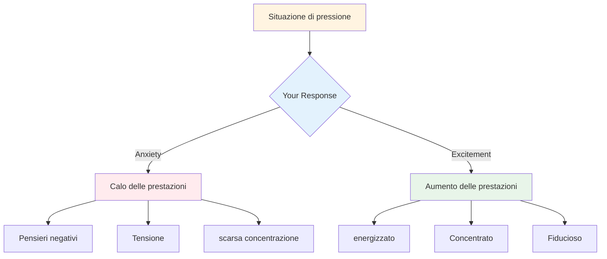

# Gestione della pressione

La pressione fa parte della competizione. L&#39;obiettivo non è eliminarla, è impossibile. L&#39;obiettivo è ottenere buoni risultati nonostante la pressione, e persino sfruttarla a proprio vantaggio.

::: tip La grande idea
**La pressione non scompare con l&#39;esperienza: con essa si diventa più bravi a giocare.** I giocatori migliori non sono calmi; sono abili nell&#39;usare la loro eccitazione in modo produttivo.
:::

## Capire la pressione

### Cosa crea pressione?
- Alta posta in gioco (partita importante, tiro decisivo)
- Essere osservati (pubblico, compagni di squadra)
- Aspettative (tue e degli altri)
- Incertezza (punteggio ravvicinato, avversari sconosciuti)
- Tempo (che sta per scadere, che sta aspettando troppo a lungo)

### Cosa fa la pressione al tuo corpo
Quando senti pressione, il tuo corpo reagisce:
- La frequenza cardiaca aumenta
- La respirazione diventa superficiale
- Muscoli tesi
- Le mani possono tremare
- La messa a fuoco si restringe (a volte troppo)

Questo è il tuo corpo che si prepara all&#39;azione. Non è male: è energia che puoi usare.

## Pressione di riformulazione

### Pressione come eccitazione

Le sensazioni fisiche di ansia ed eccitazione sono pressoché identiche. La differenza sta nel modo in cui le interpretiamo.

**Interpretazione dell&#39;ansia:** &quot;Sono nervoso, potrebbe succedere qualcosa di brutto&quot;
**Interpretazione dell&#39;eccitazione:** &quot;Sono energico, questo è importante per me&quot;

**Prova questo:** Quando ti senti sotto pressione, di&#39; a te stesso: &quot;Sono emozionato&quot; invece di &quot;Sono nervoso&quot;.

### La pressione come privilegio

Solo i momenti importanti creano pressione. Se la senti, sei in una situazione che conta.

> &quot;La pressione è un privilegio: capita solo a chi se la merita.&quot; - Billie Jean King

## Tecniche per momenti di alta pressione

### 1. Controllo del respiro

Il respiro è il modo più veloce per cambiare il tuo stato.

**La tecnica 4-7-8:**
1. Inspira per 4 conteggi
2. Mantieni la posizione per 7 conteggi
3. Espira per 8 conteggi
4. Ripetere 2-3 volte

**Ripristino rapido (nel cerchio):**
- Un respiro lento e profondo
- Senti i tuoi piedi per terra
- Abbassa le spalle durante l&#39;espirazione

### 2. Radicamento fisico

Connettiti con le sensazioni fisiche per uscire dalla tua testa:
- Senti il peso della boccia
- Nota i tuoi piedi a terra
- Stringi e rilascia la mano che non lancia
- Ruota le spalle indietro

### 3. Restringimento della messa a fuoco

Nei momenti di pressione, concentrati solo su ciò che conta:
- Non il punteggio
- Non il pubblico
- Non quello che potrebbe succedere
- Solo questo lancio, questo bersaglio, questo momento

**Parole chiave:** &quot;Qui. Ora. Questo.&quot;

### 4. Focus sul processo

Passare dal risultato al processo:

**Focalizzazione sul risultato (crea pressione):**
- &quot;Devo farlo&quot;
- &quot;Se sbaglio, perdiamo&quot;
- &quot;Tutti stanno guardando&quot;

**Focus sul processo (riduce la pressione):**
- &quot;Segui la mia routine&quot;
- &quot;Vedi il bersaglio&quot;
- &quot;Fidati del mio allenamento&quot;

### 5. La stretta della mano sinistra

Per i giocatori destrimani, stringere la mano sinistra per 10-15 secondi:
- Attiva l&#39;emisfero destro del cervello
- Calma il pensiero analitico eccessivo
- Aiuta ad accedere all&#39;esecuzione automatica

Usalo quando ti accorgi di pensare troppo.

## Preparazione alla pressione

### Simulare la pressione nella pratica

Non puoi gestire la pressione della competizione se non la provi mai durante l&#39;allenamento.

**Modi per creare pressione durante la pratica:**
- Stabilisci delle conseguenze (flessioni per chi sbaglia, offri un caffè al partner)
- Creare scenari &quot;da non perdere&quot;
- Esercitati con un pubblico
- Pressione del tempo (timer)
- Stanchezza (esercitare quando si è stanchi)

### Visualizzazione

Prova mentalmente le situazioni di forte pressione:
1. Chiudi gli occhi
2. Immagina uno scenario di pressione in dettaglio
3. Senti le sensazioni di pressione
4. Immaginati mentre lo gestisci bene
5. Esegui con successo nella tua mente

Fatelo regolarmente, non solo prima delle gare.

### Costruisci una cronologia della pressione

Tieni traccia delle volte in cui hai gestito bene la pressione:
- Qual era la situazione?
- Come ti sei sentito?
- Che cosa hai fatto?
- Qual è stato il risultato?

Rileggi questo prima delle gare per ricordarti: &quot;L&#39;ho già fatto prima&quot;.

## Durante la competizione

### Prima del lancio di pressione
1. Fai un passo indietro, prendi fiato
2. Ricordati la tua routine
3. Concentrarsi sul processo, non sul risultato
4. Usa la tua parola chiave o il tuo segnale

### Nel cerchio
1. Completa la tua routine esattamente come praticata
2. Concentrarsi esternamente (bersaglio, non corpo)
3. Fidati del tuo allenamento
4. Rilasciare senza esitazione

### Dopo il lancio
- Accetta il risultato senza giudizio
- Se va bene: breve riconoscimento, andare avanti
- Se non valido: metodo SOAS, reimposta per il lancio successivo

## Errori comuni di pressione

| Errore | Approccio migliore |
|---------|----------------|
| correre | Rallenta, usa la routine completa |
| Troppi pensieri | Focus esterno, formazione sulla fiducia |
| Cambiare tecnica | Attieniti a ciò che conosci |
| Concentrarsi sul risultato | Concentrarsi sul processo |
| Combattere i nervi | Accetta e usa l&#39;energia |

## Conclusione chiave

> La pressione non scompare con l&#39;esperienza. Con essa si diventa più bravi a ottenere risultati migliori.

I giocatori migliori non sono calmi: sono abili nell&#39;usare la loro eccitazione in modo produttivo.

