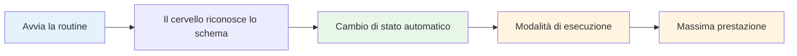

# Costruire la tua routine pre-tiro
<AdBanner />

La routine pre-tiro è uno degli strumenti più potenti per la tua performance mentale. È una sequenza coerente di azioni che ti prepara a ogni tiro e innesca il tuo stato di prestazione migliore.

::: tip La grande idea
**La tua routine è la porta d&#39;accesso alla zona.** Una routine pre-tiro coerente invia al cervello un segnale: &quot;È il momento di eseguire&quot;. Ripetendola, diventa un innesco automatico per prestazioni ottimali.
:::

## Perché le routine funzionano

### La coerenza crea fiducia
Quando fai sempre la stessa cosa, elimini le variabili. Il tuo corpo sa cosa sta per succedere. Questo crea un senso di controllo e familiarità, anche in situazioni insolite.

### Stati di attivazione delle routine
Con la ripetizione, la routine diventa legata al tuo stato di prestazione. Avviare la routine innesca automaticamente il passaggio mentale alla modalità di esecuzione.

### Le routine bloccano le distrazioni
Una routine ti dà qualcosa su cui concentrarti. Non c&#39;è spazio per preoccuparti del punteggio, del pubblico o di cosa potrebbe succedere.

### Le routine gestiscono l&#39;eccitazione
Una routine ben strutturata aiuta a regolare il tuo livello di energia, calmandoti se sei troppo eccitato e concentrandoti se sei a terra.

## Elementi di una routine efficace

### Fase 1: Valutazione (fuori dal cerchio)

Prima di entrare, raccogli informazioni:
- Leggere il terreno (pendenze, ostacoli, superficie)
- Valutare la situazione (punteggio, posizione delle bocce)
- Scegli il tuo bersaglio e il punto di atterraggio
- Decidi il tipo di lancio (punta, tira, pallonetto, rotola)

**È qui che avviene il pensiero.** Prenditi il tuo tempo.

### Fase 2: Transizione (Entrare nel Cerchio)

Il passaggio dal pensare all&#39;agire:
- Azione fisica (mettersi in cerchio in modo coerente)
- Segnale mentale (una parola o una frase che segnala la &quot;modalità di esecuzione&quot;)
- Respiro (un respiro consapevole per centrarti)

**Questo è il passaggio.** L&#39;analisi si ferma qui.

### Fase 3: Preparazione (nel cerchio)

Prepara il tuo corpo:
- Posizione coerente (la stessa ogni volta)
- Controllo della presa (sentire la boccia)
- Allineamento al bersaglio
- Innesco fisico (un piccolo movimento che è tuo)

### Fase 4: Visualizzazione (Breve)

Guarda il lancio prima di realizzarlo:
- Immagina il percorso della palla (2-3 secondi al massimo)
- Senti il lancio riuscito
- Connettiti visivamente con il tuo target

### Fase 5: Esecuzione

Effettua il lancio:
- Messa a fuoco esterna (solo bersaglio)
- Fidati del tuo corpo
- Rilasciare senza esitazione
- Seguire con naturalezza

<AdInArticle />

## Costruire la tua routine personale

### Fase 1: osserva ciò che fai già

Probabilmente hai già una certa routine. Nota:
- Cosa fai prima di un buon lancio?
- Cosa ti sembra naturale?
- Cosa ti aiuta a concentrarti?

### Fase 2: Progetta la tua routine

Crea una sequenza che includa:
- [ ] Fase di valutazione
- [ ] Momento di transizione chiaro
- [ ] Configurazione fisica coerente
- [ ] Breve visualizzazione
- [ ] Trigger di esecuzione

### Passaggio 3: scrivilo

Sii specifico. Esempio:

1. **Valutazione:** Leggi il terreno, scegli il punto di atterraggio
2. **Transizione:** Entra in cerchio con il piede sinistro per primo, pronuncia &quot;fiducia&quot;
3. **Preparazione:** Piedi alla larghezza delle spalle, controllo della presa, allineamento delle spalle
4. **Visualizza:** Guarda il percorso, senti la liberazione
5. **Esegui:** Occhi sul bersaglio, lancia

### Fase 4: Pratica religiosamente

Utilizza la tua routine per OGNI lancio in allenamento:
- Lanci facili
- Lanci difficili
- Quando sei stanco
- Quando sei fresco

La routine deve diventare automatica.

### Fase 5: perfezionare nel tempo

La tua routine evolverà. Nota cosa funziona e adattala. Ma non modificarla durante la gara, solo tra un evento e l&#39;altro.

## Tempistica di routine

La tua routine dovrebbe durare un periodo di tempo costante:
- Troppo veloce: stai correndo, non sei adeguatamente preparato
- Troppo lento: stai pensando troppo e perdi il flusso
- Giusto: abbastanza tempo per prepararsi, non così tanto da pensare troppo

**Tempistica tipica:**
- Valutazione: 5-10 secondi
- Transizione + Impostazione: 3-5 secondi
- Visualizzazione + Esecuzione: 3-5 secondi
- **Totale: 10-20 secondi**

## Errori comuni di routine

| Errore | Problema | Soluzione |
|---------|---------|----------|
| Saltare in pratica | La routine non è automatica | Usalo ad ogni singolo lancio |
| Troppo complicato | Difficile da ricordare sotto pressione | Semplificare all&#39;essenziale |
| Pensare durante l&#39;esecuzione | Interrompe le prestazioni automatiche | Chiaro punto di transizione |
| Tempi incoerenti | Crea incertezza | Esercitati con un ritmo costante |
| Cambiare a metà competizione | Introduce il dubbio | Attieniti a ciò che conosci |

## Risoluzione dei problemi di routine

**Se hai fretta:**
- Aggiungi un respiro alla transizione
- Rallenta i movimenti di installazione
- Pausa prima della visualizzazione

**Se stai pensando troppo:**
- Abbreviare la routine
- Utilizzare un segnale di transizione più forte
- Concentrarsi maggiormente sull&#39;esterno

**Se sei incoerente:**
- Registrati in un video per controllare
- Pratica la routine senza lanciare
- Ricevi feedback da un partner

## Esempi di routine

### Routine semplice
1. Scegli il bersaglio
2. Entra, respira
3. Afferrare, allineare
4. Guardalo, lancialo

### Routine dettagliata
1. Leggi il terreno, scegli il punto di atterraggio
2. Entrare prima con il piede sinistro
3. Dire &quot;liscio&quot; interiormente
4. Un respiro, le spalle si abbassano
5. Piedi posizionati, controllo della presa
6. Allinea le spalle al bersaglio
7. Guarda il percorso (2 secondi)
8. Gli occhi si fissano sul bersaglio
9. Gettare

## Conclusione chiave

> La routine è la tua ancora. Nel caos, è la tua costante.

Costruiscilo con cura. Esercitati sempre. Fidati completamente.

<AdBanner />
